**_AOP_ :**

      ---> Aspect Oriented Programming is a programing solution for seperating cross cutting concerns from business logics
      ---> AOP works using proxies and method interception.
      ---> cross cutting concerns are a peice of code which are basically reused like logging, security, exception handling, transactions etc
      ---> Cross-cutting concerns are functionalities that:

                    Are not core business logic
                    Are needed in multiple modules/layers
                    “Cut across” many parts of the application
                    They are scattered everywhere if not separated properly.


Why is AOP needed :?

Problems without AOP : 

Imagine you have 50 services like this

```java
public void transferMoney() {
    log.info("Started");   // logging
    checkSecurity();       // security
    // business logic
    log.info("Completed"); // logging
}

```

For each methods we need to duplictae logging, security, transaction etc


        ---> This causes code duplication
        ---> It wil be hard to maintain
        ---> Pollutes business logic(Business logic becomes tightly coupled with infrastructure logic)
        ---> SingleResponsibility rule will be violated


With AOP :

        ---> We write security, logging, transaction codes seperately only once and we use that in all code usiing aop


1. Transactional 

Without AOP in every method we need to write code for opening transaction, committing and rollback

```java
        public void transferMoney() {
            try {
                connection.setAutoCommit(false);
        
                debit();
                credit();
        
                connection.commit();
            } catch(Exception e) {
                connection.rollback();
            }
        }

```
This code should be written in every method which needs transactions


With AOP :

```java
        @Transactional
        public void transferMoney() {
            debit();
            credit();
        }
```

Internally Spring uses only one method to open transaction, commit and rollback
It uses Around advice --->open transaction -> execute business logic --> commit/rollback

---> Logging with AOP

```java
        @Around("execution(* com.app.service.*.*(..))")
        public Object logExecution(ProceedingJoinPoint jp) {
            System.out.println("Started: " + jp.getSignature());
            Object result = jp.proceed();
            System.out.println("Ended");
            return result;
        }

```

Spring internally uses AOP for:

        @Transactional
        @Async
        @Cacheable
        @PreAuthorize


DISADVANTAGES : 


        Harder to debug
        Proxy-based limitations (self-invocation problem)
        Only public methods intercepted (in Spring proxy AOP)
        Slight runtime overhead


| Call Type                                                | Transaction Applied? |
| -------------------------------------------------------- | -------------------- |
| External call to @Transactional method                   | ✅ Yes                |
| Internal self-invocation                                 | ❌ No                 |
| Non-annotated method calling annotated method internally | ❌ No                 |


---> Self invocation problem means when a transaction method is invoked within the same class AOP wont be applied
---> Means AOP is applied only on external calls
--->In Spring’s proxy-based AOP, only external method calls that go through the proxy are intercepted. Internal self-invocations bypass the proxy and therefore the advice is not applied.

-------------------------------------------------------------------------------------------------------------------------------------


Dependencies to Add

```pom

<dependency>
    <groupId>org.springframework.boot</groupId>
    <artifactId>spring-boot-starter-aop</artifactId>
</dependency>

```

Example:

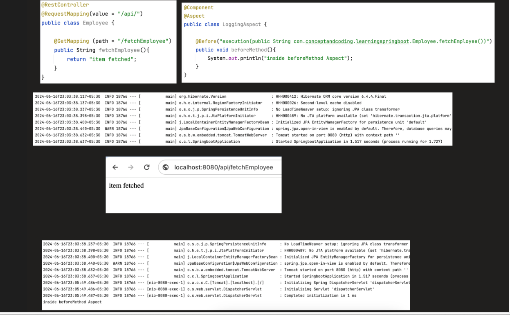


---------------------------------------------------------------------------------------------------------------------------------


Components of AOP : 

1. **_@Aspect_** 

        ----> Aspect is the class that handles th cross cutting concerns
        ----> It is a module for cross cutting concerns

```java
@Aspect
@Component
public class LoggingAspect {
}


```

---> We need to have @Component so that during start up this class would be detected


2. **_@Pointcut_**

        ---> PointCut is an expression which tells where the advice should be applied
        ---> A point cut expression matches certain methods, annotations, classes, packages where the advice can be applied

Example:

```java
        @Pointcut("execution(* com.app.service.*.*(..))")
        public void serviceLayer() {}
        
        @Before("serviceLayer()")
        public void log() {}

```

here execution is Point cut designator
execution(* com.app.service.*.*(..)) is pointcut expression


SYNTAX:

```

      execution(modifiers-pattern? 
                return-type-pattern 
                declaring-type-pattern? 
                method-name-pattern(param-pattern) 
                throws-pattern?)


```
EXAMPLE : 

```

         execution(
             ACCESS_MODIFIERS
             RETURN_TYPE
             PACKAGE.CLASS
             METHOD_NAME
             (PARAMETERS)
         )


```

Types of PointCut


        execution()
        within()
        this()
        target()
        args()
        @annotation
        @within
        @args
        @target


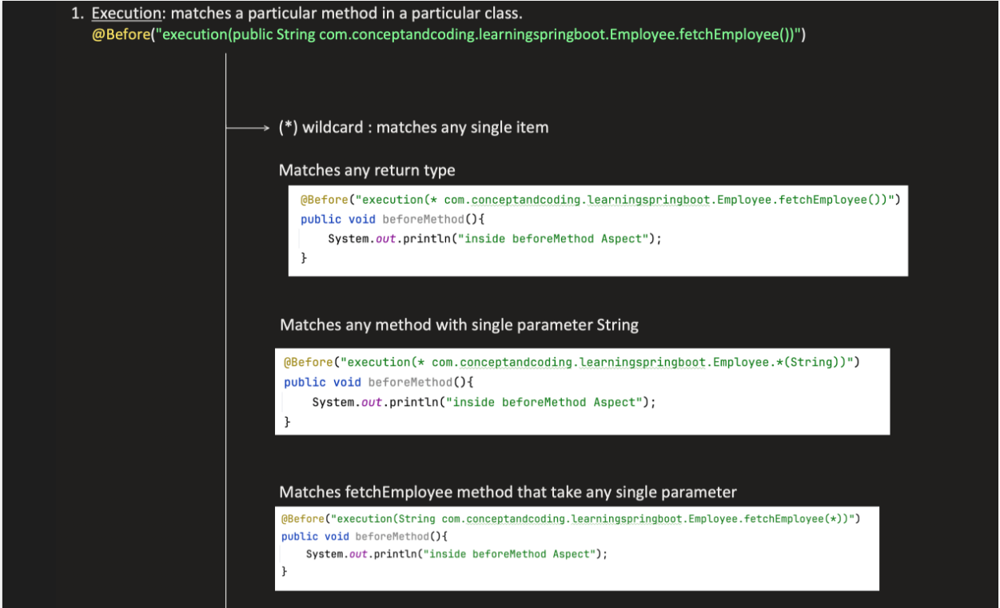


WildCard :

* ---> Single level Wild card
.. ---> Multi Level Wild Card

| Symbol | Meaning      | Depth    |
| ------ | ------------ | -------- |
| `*`    | Exactly one  | Single   |
| `..`   | Zero or more | Multiple |


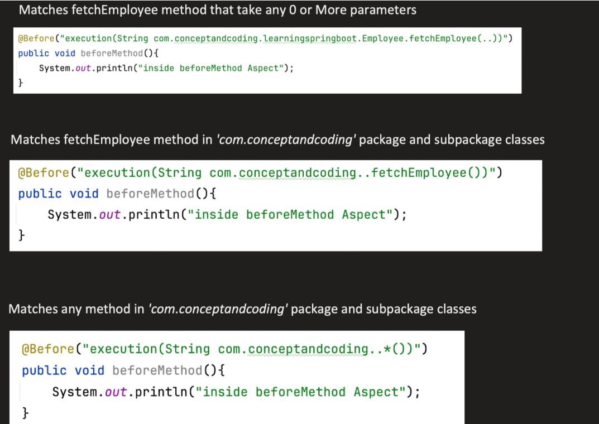


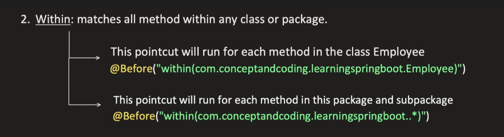


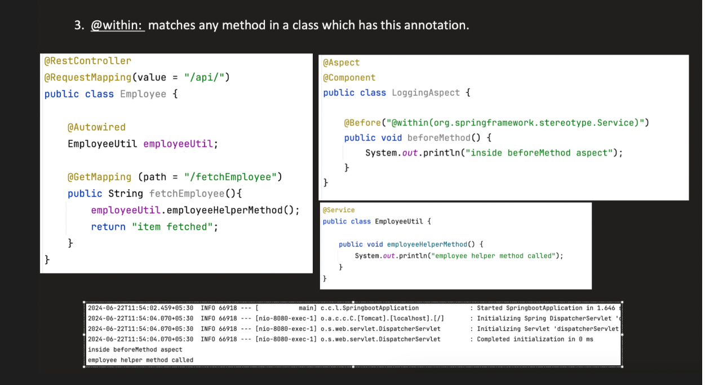


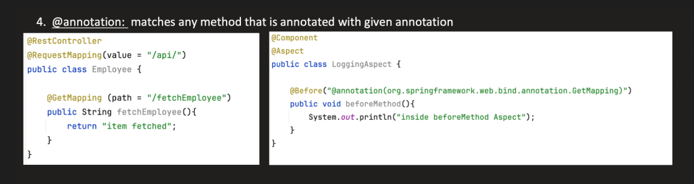


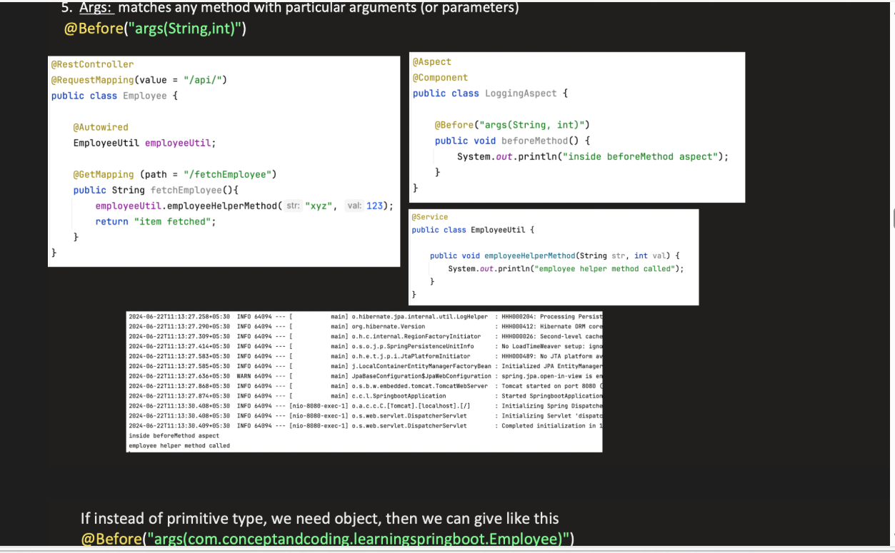


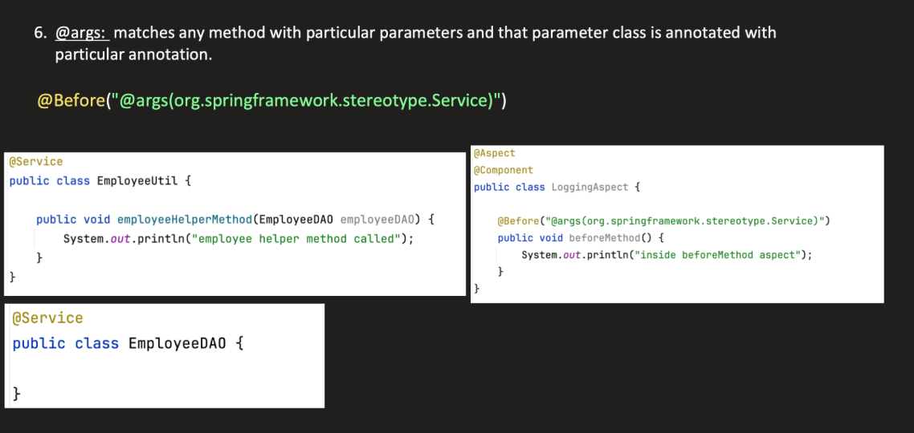


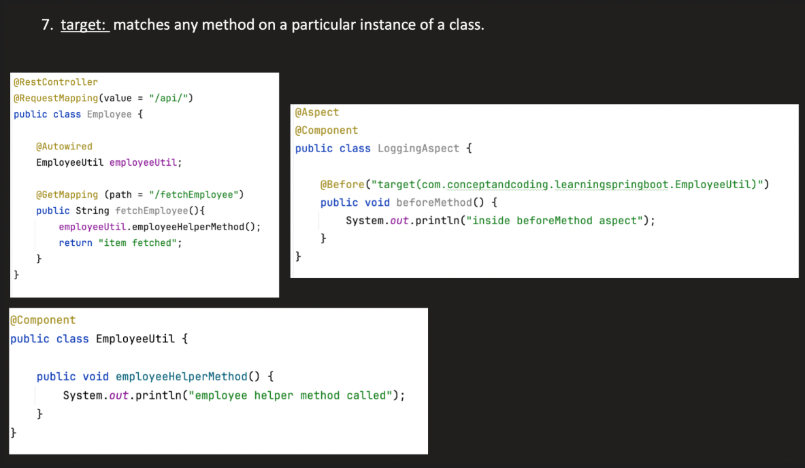


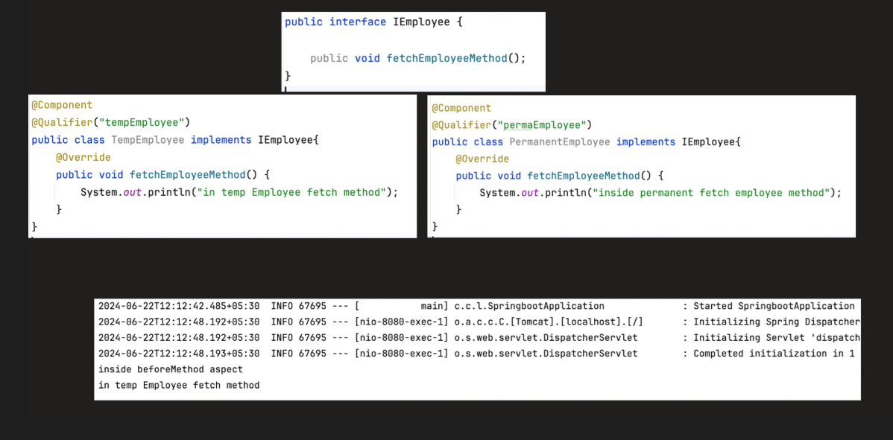


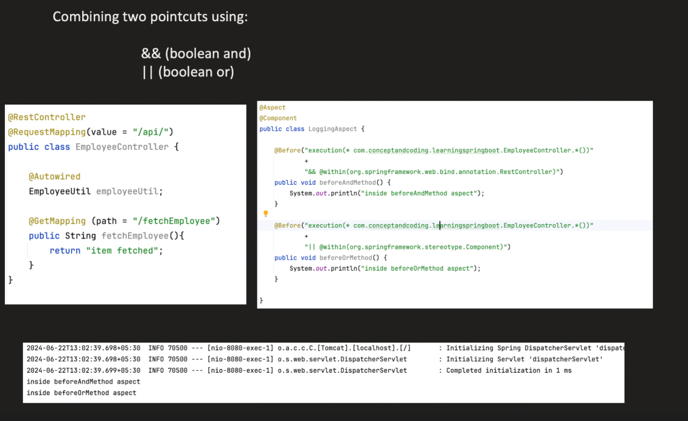


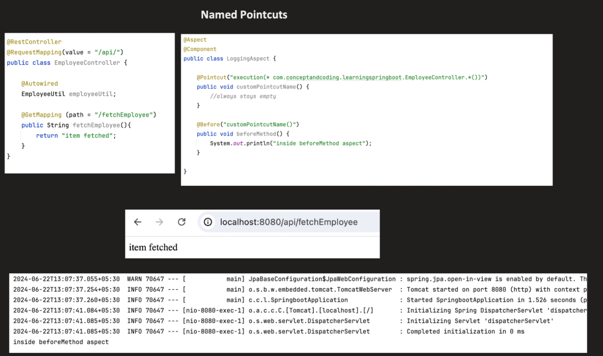


3. **_ADVICE_**

---> Advice is an action that runs when pointcut equals jointpoint

```java

@Aspect
@Component
public class LoggingAspect {

    @Before("execution(* com.example.service.*.*(..))")
    public void log() {
        System.out.println("Logging before method");
    }
}


```

      execution(...) → pointcut
      log() → advice
      @Before → type of advice


Types Of Advice :


      @Before  ---> Runs before method execution.
      @After   ---> Runs after method execution.
      @Around  ---> Runs before and after a method execution
      @AfterReturning ---> 
      @AfterThrowing ---> Runs only if the method throws an exception.


afterReturning

```java

@AfterReturning(
    pointcut = "execution(* com.example.service.*.*(..))",
    returning = "result"
)
public void afterSuccess(Object result) {
    System.out.println("Method returned: " + result);
}


public String getName() {
   return "Bharath";
}


```
It does NOT run if exception occurs.
You can access the return value using returning = "result".


After Throwing

```java
@AfterThrowing(
    pointcut = "execution(* com.example.service.*.*(..))",
    throwing = "ex"
)
public void afterException(Exception ex) {
    System.out.println("Exception occurred: " + ex.getMessage());
}


public void pay() {
   throw new RuntimeException("Payment failed");
}


```

It does NOT run if method completes normally.
You can capture the exception object.
It does NOT suppress the exception (unless you use Around advice).


Both cannot change return value


Around

```java
@Around("execution(* *(..))")
public Object around(ProceedingJoinPoint pjp) throws Throwable {
    System.out.println("Before");
    Object result = pjp.proceed();  // calls actual method
    System.out.println("After");
    return result;
}


```


4. **_JOIN POINT :_**

         --->A join point is a specific point in program execution where an aspect can be applied. In Spring AOP, join points are method executions.
         ---> 👉 The execution of the method at runtime is the join point.
         ---> A JoinPoint object is created when a proxied method is invoked at runtime.
JoinPoint Object contains
 
-> 🔹 1. Method Arguments

      joinPoint.getArgs()

Returns:

      Object[]

🔹 2. Target Object (real object behind proxy)

      joinPoint.getTarget()

Returns the actual bean instance.

🔹 3. Proxy Object

      joinPoint.getThis()

Returns proxy object.

🔹 4. Method Signature

      joinPoint.getSignature()

Returns:

      org.aspectj.lang.Signature
Usually cast to:

MethodSignature


Example:
```java
MethodSignature signature = (MethodSignature) joinPoint.getSignature();
Method method = signature.getMethod();

```

🔹 5. Source Location

      joinPoint.getSourceLocation()

🔥 For Around Advice

If using: @Around

You get:

      ProceedingJoinPoint
Which adds:

      proceed()


This method:

👉 Actually executes the target method.


-------------------------------------------------------------------------------------------------------------------------------------


When Spring Boot starts:

      1. Spring creates ApplicationContext
      2. When Application COntextStarts (i.e hits refresh()) 2 things happen
                  --- Register BeanPostProcessors
                  --- Instantiate beans

      2. Component scanning starts ---> Our @Aspect class should also be annotated with @Component

Beans are detected (@Component, @Service, etc.)

@Aspect classes are also detected

Example:

@Aspect
@Component
public class LoggingAspect {

    @Before("execution(* com.example.service.*.*(..))")
    public void log() {
        System.out.println("Before method");
    }
}

🚀 Step 2 — AOP Auto Configuration

Spring Boot automatically enables AOP if:

spring-boot-starter-aop


is present.

Internally:

@EnableAspectJAutoProxy

Registers AnnotationAwareAspectJAutoProxyCreator

This class is VERY IMPORTANT.

It is a BeanPostProcessor.

🚀 Step 3 — Bean Creation Phase

When Spring creates a bean (example: OrderService):

Normal Flow:
Create object → Inject dependencies → Return bean

With AOP:

After bean is created:

BeanPostProcessor checks:
Does this bean match any pointcut?


This is done by:

AnnotationAwareAspectJAutoProxyCreator

🚀 Step 4 — Pointcut Matching

Spring checks:

Does this bean have methods matching any @Before/@After/@Around expression?


If YES:

👉 Spring does NOT return original bean
👉 It creates a Proxy

🚀 Step 5 — Proxy Creation

Two types of proxies:

Condition	Proxy Type
Bean implements interface	JDK Dynamic Proxy
No interface	CGLIB Proxy (subclass)
🔹 Case 1 — JDK Dynamic Proxy

If:

public class OrderService implements OrderServiceInterface


Spring creates:

Proxy implements OrderServiceInterface


Internally uses:

java.lang.reflect.Proxy

🔹 Case 2 — CGLIB Proxy

If no interface:

Spring creates:

class OrderService$$EnhancerBySpring


It extends your class.

Uses bytecode generation.

🚀 Step 6 — What Proxy Contains?

Proxy contains:

Target object (original bean)
+
List of Advisors (advices + pointcuts)

🚀 Step 7 — Method Call Flow

Now suppose you call:

orderService.placeOrder();


Actual flow is:

Caller
↓
Proxy
↓
Interceptor Chain
↓
Actual Method

🔥 Detailed Execution Flow
Suppose you have:
@Before
@After
@Around


Execution order:

1. Around (before part)
2. Before
3. Actual Method
4. After
5. Around (after part)


Internally Spring builds:

MethodInvocation


Which contains:

target

method

arguments

list of interceptors

Then it calls:

proceed()


Each interceptor calls next interceptor.

🧩 Internally Important Classes

These are core classes:

AnnotationAwareAspectJAutoProxyCreator

AdvisedSupport

MethodInterceptor

ReflectiveMethodInvocation

JdkDynamicAopProxy

CglibAopProxy

🎯 Full Internal Flow Diagram
App Start
↓
Scan Beans
↓
Detect @Aspect
↓
Register AutoProxyCreator
↓
Create Bean
↓
Check Pointcut Match
↓
Create Proxy
↓
Return Proxy instead of original bean
↓
Method Call
↓
Interceptor Chain
↓
Actual Method Execution


----------------------------------------------------------------------------------------------------------------------------------


During startup because of component scan and autoconfig ---> bean definitions of all bean postprocessors, bean everything is created

Then first bean post processors are initialized and stored in

            List<BeanPostProcessor> beanPostProcessors

In that one of the bean post Processor is **_AnnotationAwareAspectJAutoProxyCreator_**

After this bean instansiation takes place and each bean is proceesed through all bean post processor's
postProcessBeforeInitialization() method.


After this dependency injection and post construct happens throwugh their specific bpp's postProcessBeforeInitialization()

after all bean postprocessors postProcessBeforeInitialization() is executed now
postProcessAfterInitialization() runs for each bean post processor


This is where AnnotationAwareAspectJAutoProxyCreator's  postProcessAfterInitialization() creates proxies for each and every @Aspect refered method class
(It checks if this bean is eligible for aop based proxy (by using advice object cretaed before) and creates proxy object for this)

AnnotationAwareAspectJAutoProxyCreator scans for all bean definitions during proxy creation having @Aspect
for each advice method in @Aspect bean:

         parse pointcut expression
         create AspectJPointcutAdvisor(advice, pointcut)
         store in advisors list (inside BPP)

Each Advisor object now knows:

      Which advice method to call
      Which pointcut to match against

         
         - target
           - List<Advisor>
           - AopProxy (JdkDynamicAopProxy or CglibAopProxy)


If the class is a interface it creates JDK Dynamic proxy else if it is a normal classs creates CGLIB proxy
The proxy implements the same interface (JDK proxy) or extends the target class (CGLIB).

THese proxy classes have 

      Reference to target bean (the real object)
      List of advisors (advice + pointcut)
      Invocation mechanism (intercepts method calls)


First these proxies have code to run before method() the target class methods and after methods
---> Say we hit a method which uses aop ---> the methos call goes to proxy obj 
---> Duirng method call the proxy will convert each advice as a interceptor 
---> For each advice (whether @Before, @After, or @Around), Spring creates one interceptor instance.
         Loop through advisors
         For each advisor: check method matcher
         
         If matches: Convert Advice → MethodInterceptor
         
         Add to interceptor chain


🟢 6️⃣ Execution Engine
Spring creates:

      ReflectiveMethodInvocation
And calls:

         proceed()
Execution looks like:

         Around (before part)
         Before
         Target Method
         AfterReturning
         After
         Around (after part)


1️⃣ Spring starts

Configuration parsing happens.

@EnableAspectJAutoProxy registers:

AnnotationAwareAspectJAutoProxyCreator

This is a special BeanPostProcessor.

2️⃣ Spring creates beans

When Spring starts creating beans:

Bean instantiation
↓
BeanPostProcessors run

Now:

AnnotationAwareAspectJAutoProxyCreator intercepts each bean.

3️⃣ It finds @Aspect

It checks:

@Aspect
@Component
public class LoggingAspect { }

It uses:

AspectJAnnotationParser

to detect advice annotations.

4️⃣ It Creates Advisors

For each advice method:

@Before("execution(* service.*.*(..))")

Spring creates:

Advisor
↓
Pointcut
↓
Advice (MethodInterceptor)
5️⃣ It Creates Proxy

If a bean matches pointcut:

Spring wraps it with:

JDK Dynamic Proxy
OR

CGLIB proxy

Then advice executes around method call.

📦 Important Classes Involved
Class	Role
AnnotationAwareAspectJAutoProxyCreator	Main AOP processor
AspectJExpressionPointcut	Parses pointcut
Advisor	Connects advice + pointcut
MethodInterceptor	Executes advice logic
ProxyFactory	Creates proxy


-------------------------------------------------------------------------------------------------------------------------------


Why Private / Final Methods Not Intercepted

Because:

JDK proxy works via interfaces

CGLIB works via subclassing

Private methods cannot be overridden

Final methods cannot be overridden

Therefore cannot be proxied.


----------------------------------------------------------------------------------------------------------------------------------


🔹 1. Core Difference (this is what interviewers want)
@Aspect → General-purpose AOP (Spring AOP)
@PreAuthorize → Security AOP (Spring Security)

Yes, both use proxies—but who creates the proxy and why is completely different.

🔹 2. @Aspect (Spring AOP)

This is your custom cross-cutting logic.

✔ Used for:
Logging
Transactions (internally used by Spring)
Metrics
Auditing
✔ Example:
@Aspect
@Component
public class LoggingAspect {

    @Before("execution(* com.app.service.*.*(..))")
    public void log() {
        System.out.println("Method called");
    }
}
✔ Key points:
You define pointcuts (where to intercept)
You define advice (what to do)
Fully customizable
Works at Spring AOP level
🔹 3. @PreAuthorize (Spring Security)

This is authorization logic, not general AOP.

✔ Used for:
Role-based access
Permission checks
Expression-based security
✔ Example:
@PreAuthorize("hasRole('ADMIN')")
public void deleteUser() { }
✔ What actually happens:
Spring Security adds its own method interceptor
It evaluates the expression (hasRole)
If fails → throws AccessDeniedException
🔹 4. Internals (important difference)
@Aspect
Uses Spring AOP
Based on:
@EnableAspectJAutoProxy
AspectJExpressionPointcut
Your defined advices
@PreAuthorize
Uses Spring Security method security
Based on:
MethodSecurityInterceptor
AccessDecisionManager
ExpressionHandler

👉 It is not implemented using your @Aspect class

🔹 5. Are both AOP?

✔ Yes—but different kinds

Feature	@Aspect	@PreAuthorize
Type	General AOP	Security AOP
Who defines logic	You	Spring Security
Purpose	Cross-cutting concerns	Authorization
Customizable	Fully	Limited (expressions)
Interceptor	AspectJ advice	Security interceptor
🔹 6. Key Interview Insight (this is gold)

Even though both:

Use proxies
Intercept method calls

👉 They are part of different frameworks and pipelines

@Aspect → Runs in Spring AOP chain
@PreAuthorize → Runs in Security filter/interceptor chain

Also:

Security usually executes before your business logic
Your @Aspect may run before or after depending on order
🔹 7. Tricky follow-up they may ask
❓ Can we replace @PreAuthorize with @Aspect?

👉 Technically yes, but bad idea

Why?

You’d have to manually:
Get user from SecurityContext
Write role checks
Handle exceptions

👉 You’d basically be rebuilding Spring Security

🔹 8. One-line summary

@Aspect is for custom cross-cutting behavior,
@PreAuthorize is for declarative security enforced by Spring Security internals.


------------------------------------------------------------------------------------------------------------------


🔹 What happens with @Aspect internally

When you enable AOP (@EnableAspectJAutoProxy), Spring:

Creates a proxy for your bean
JDK dynamic proxy (if interface exists) OR
CGLIB proxy (if no interface)
Attaches advisors (built from your @Aspect)
These advisors contain:
Pointcut → where to apply
Advice → what to do
At runtime:
Method call → goes to proxy
Proxy → triggers MethodInterceptor chain
Your advice runs (@Before, @Around, etc.)
Then actual method executes