@Transactional :

In Spring Framework, @Transactional is an annotation used to manage database transactions declaratively.

A transaction is a unit of work that must follow ACID:
      
      Atomicity
      Consistency
      Isolation
      Durability

     --->A transaction is a group of operations treated as a single logical unit of work.
             Either all operations succeed or none of them are applied.

        During startup first all post bean processor are created first
        One of the post bean processor is InfrastructureAdvisorAutoProxyCreator
        
        After this while beans are being created and goes through each postbeanprocessors before() method and 
        and then bean creation takes place and it gos to postbeanprocessors after() method
        
        When each bean hits this InfrastructureAdvisorAutoProxyCreator after() method
        
        ---> InfrastructureAdvisorAutoProxyCreator scan sfor @Transactional annotation and creates a proxy object for this
        ---> So whenever we hit the method it goes to this proxy method and proxy method calls transactional interceptor
             which contains the entire logic for begin transaction, commit, roll back etc

Proxy-based mode (default):

        No @within pointcut used
        Uses BeanPostProcessor + runtime annotation detection

AspectJ mode:

        Yes, @within or @annotation pointcuts are used
        Method calls are woven directly (no proxy needed)

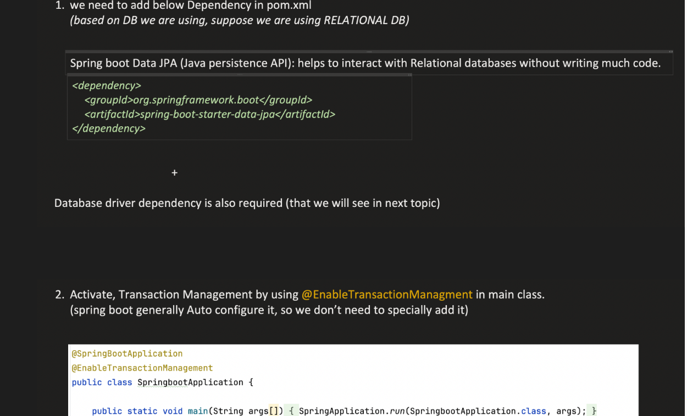

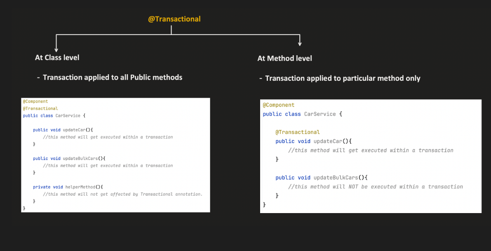

Below is transactional interceptor code

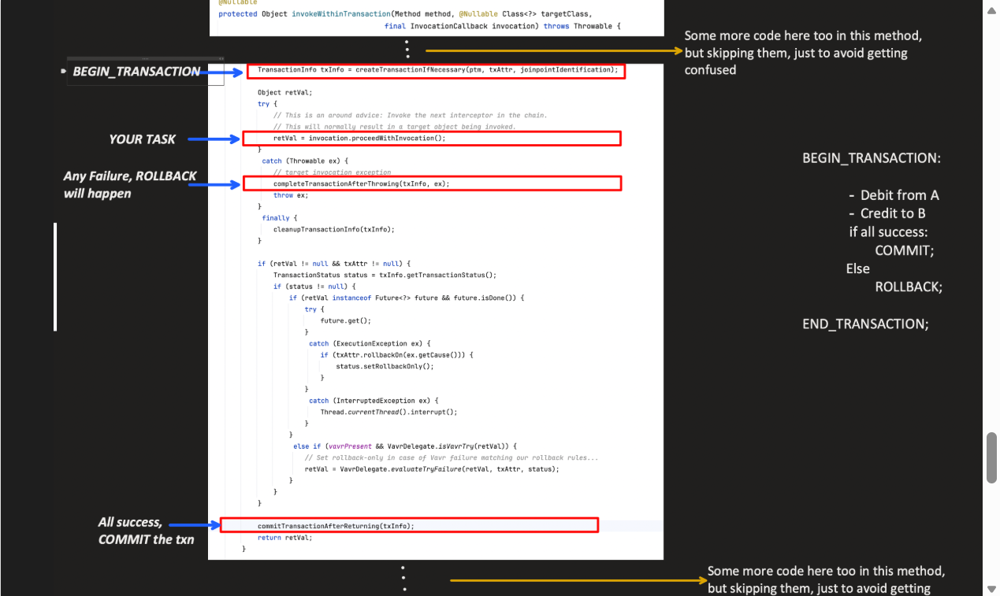

This Transactional Intercetor internally will call Transaction Manager to commit, rollback and begin transaction

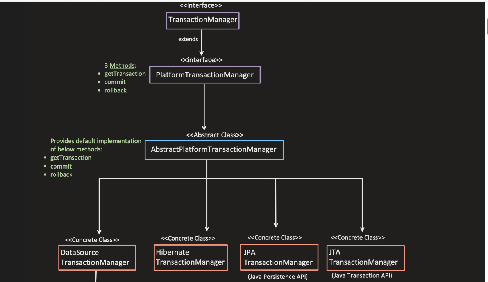
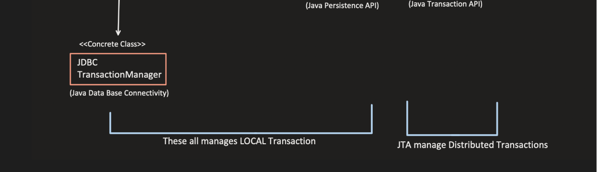

What “Programmatic Transaction” Means

        Instead of using @Transactional on a method, you explicitly start, commit, and rollback transactions in code using PlatformTransactionManager.
        Gives you fine-grained control over transaction boundaries.

2️⃣ When You Might Need It
Scenario 1: Partial Transaction / Conditional Commit

        You want different parts of a method to be in different transactions.
        With @Transactional, the whole method is one transaction.

Example:

            TransactionStatus status = txManager.getTransaction(new DefaultTransactionDefinition());
            try {
                repoA.save(entityA);
                if (someCondition) {
                    txManager.commit(status); // commit early
                    status = txManager.getTransaction(new DefaultTransactionDefinition()); // start new txn
                }
                repoB.save(entityB);
                txManager.commit(status);
            } 
            catch (Exception e) {
                txManager.rollback(status);
            }

Scenario 2: Non-public methods or self-invocation

@Transactional does not work if:

        The method is private or protected
        The method calls another method in the same class (self-invocation)

Programmatic transaction can bypass this limitation.

![img_2.png](Images/TransProg.png

**_PROPOGATION :**_

        ---> How transaction propogates between method calls
        --->Propagation determines whether a method should run in the existing transaction or start a new one when another trans method is called.

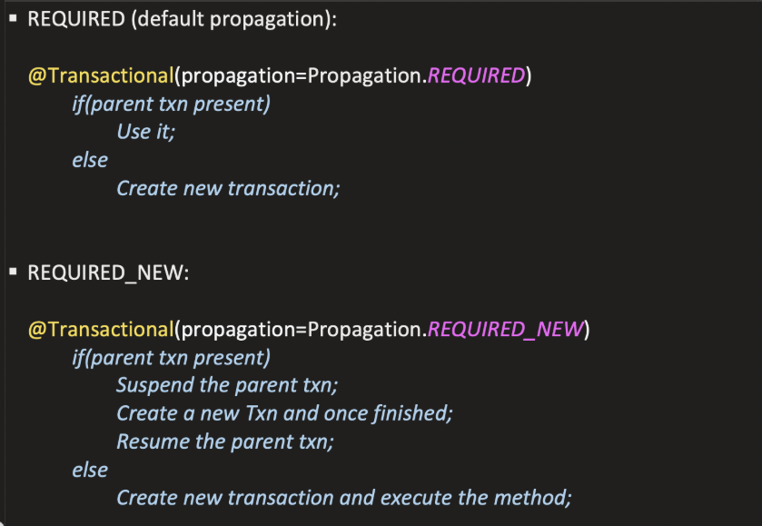

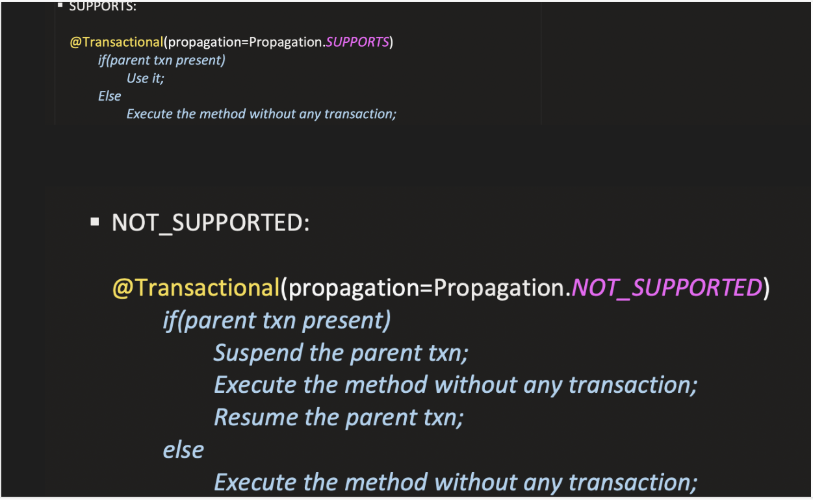

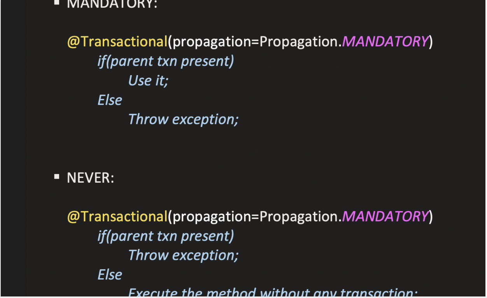

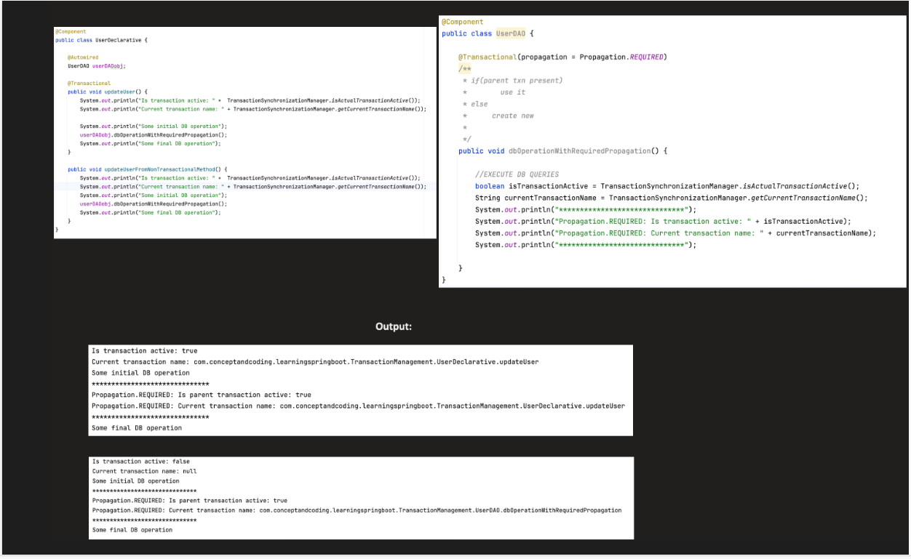

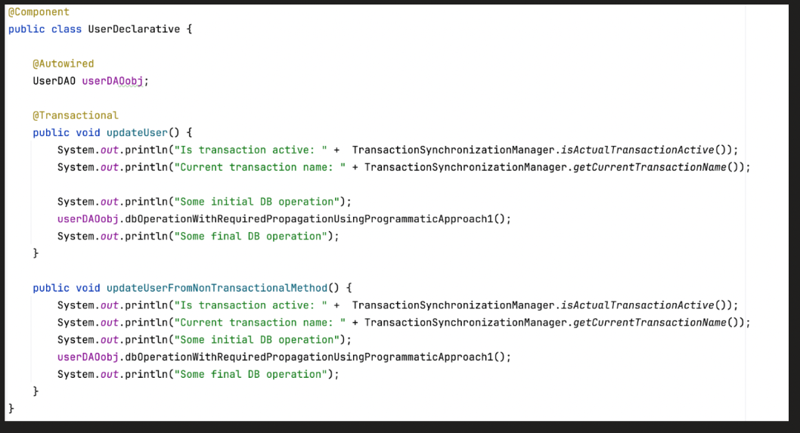

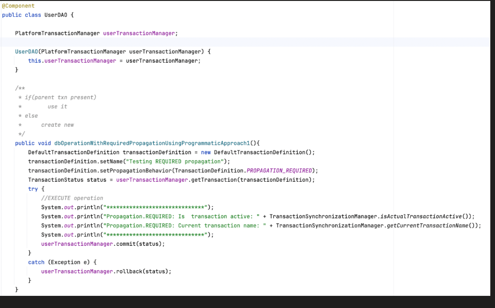

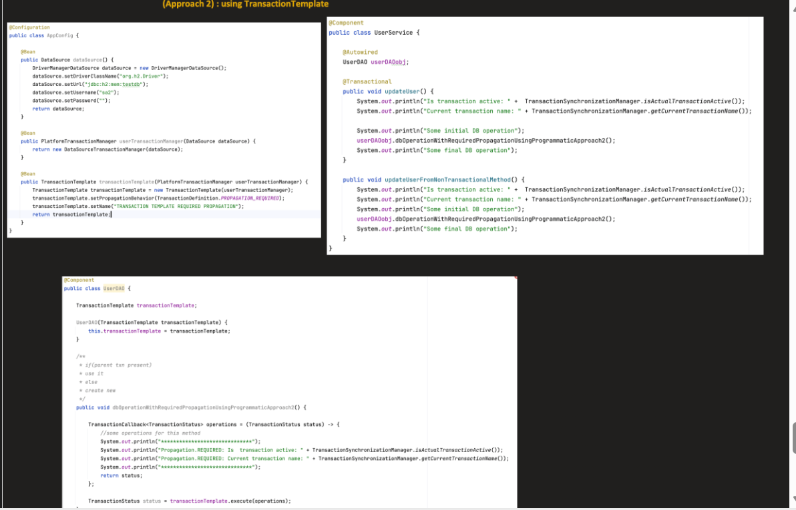

**_ISOLATION :**_ 

        Isolation in ACID means each transaction should behave as if it’s running alone in the system.
        Even if multiple transactions execute concurrently, the effect should be the same as if they were executed sequentially.
        This prevents one transaction from seeing intermediate states of another transaction.

PROBLEMS WITHOUT ISOLATION :

            1. Dirty Read : A transaction-A reads a row which is changed by transaction-B but still uncmmitted and it rolls back

            For ex : We have a seat which is booked by transaction-B but still not commited its value is changed only in buffer,
                     at this time when transaction-A reads the seat row it will read as BOOKED
                     Afterwards transaction-B rolls back then Transaction-A has done a dirty read
    
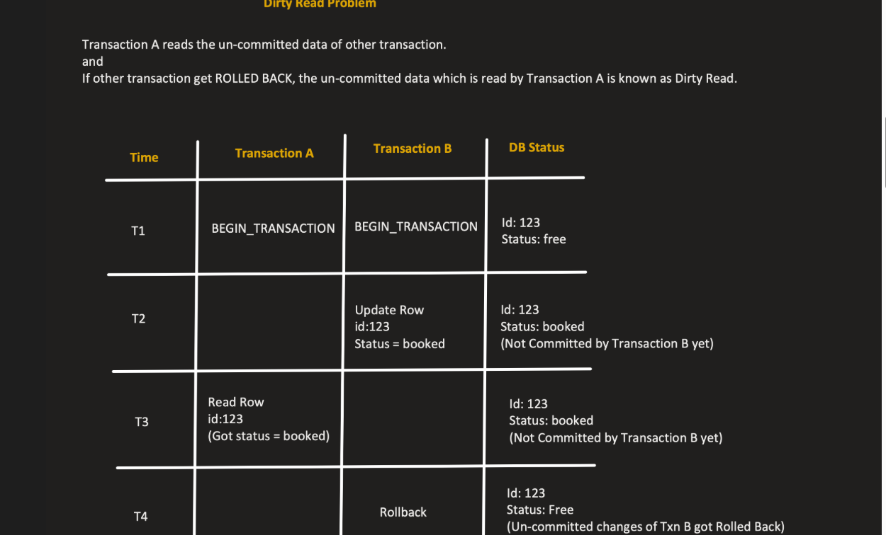

            2. NonRepetableRead : A transaction-A reads a row multiple time , there is a change in value form the first read to the last read

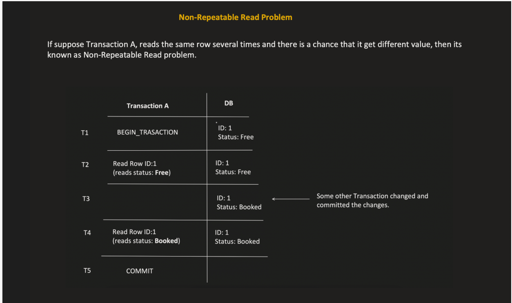

            3. PhantomRead : Same as repeatable read but in ranges say transaction-A reads seat rows between 1 and 3 say there are 2 records 1 and 3
                             If transaction-B inserts a new row with 2 , then the next read of transaction-A will have 3 rows returned which mismatches with the first read

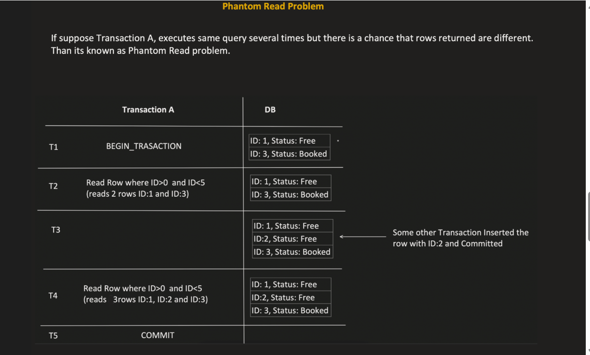

SOLUTION : LOCKS

        SHARED LOCK ---> READ LOCK
        EXCLUSIVE LOCK ---> WRITE LOCK
        
        A shared lock can be acquired if no transaction has exclusive locks
        An exclusive lock cn be acquired if no transaction has either shared or exclusive lock

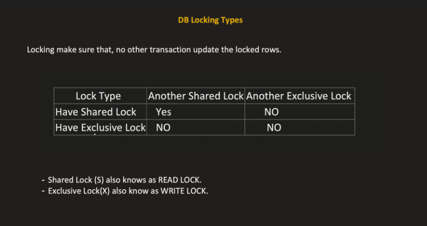

TYPES : 

        READ_UNCOMMITED
        READ_COMMITTED
        REPEATABLE_COMMITED
        SERIALIZABLE

1. Read Uncommited : Solves nothing all 3 problrms exist
2. Read COmmited : 

        ---> It puts an shared lock while reading and releses
              and exclusive lock while writing for the entire transaction itelf
        
        ---> So if transaction A is reading, other transaction can also read 
            but it cant write since it cant acquire exclusive lock while a transaction has shared lock
        
        ---> Also if a transaction is writing it puts exclusive lock for the transaction itself , so no read can happen during that time
        
        
        ===> This solves onlythe dirty read problem
        
        ---> Still non repetable read problem exists
        
        ----> Since after first read it releases the shared lock and if some other transaction writes and our transaction reads for the next tme the data change will be there

3. REPETABLE_COMMITED: 

        
        ---->It puts an shared lock while for the entire transaction
        ---->and exclusive lock while writing for the entire transaction 

    ---> Here since while reading it puts lock for the entire transaction itself till the transaction completes no writes can happen
    ===> SO it solves dirty read and unrepetable read problems

4. SERIALIZABLE:

         ----> same as repetable_commited but puts locks on range of rows
         ===> SO it solves dirty read , unrepetable read and phantom read problems

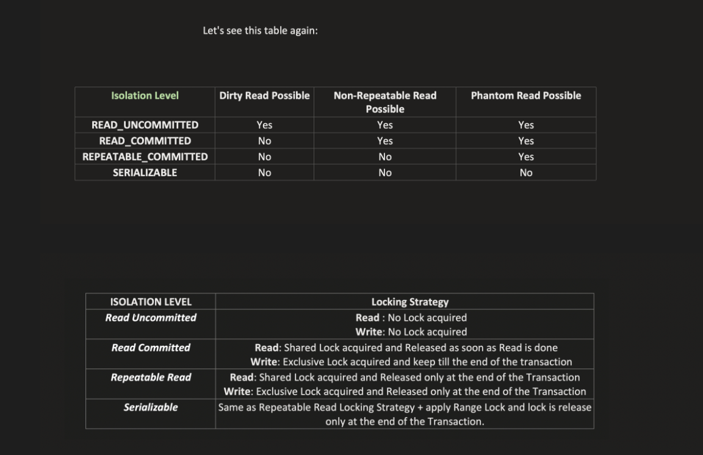

🔥 1️⃣ High-Level Architecture

When you enable:

@EnableTransactionManagement

Spring registers:

TransactionInterceptor
TransactionAttributeSource
BeanFactoryTransactionAttributeSourceAdvisor

The core class that executes transaction logic is:

TransactionInterceptor
🧠 2️⃣ What Happens When You Call a Transactional Method?

Suppose:

@Service
public class PaymentService {

    @Transactional
    public void pay() {
        repository.save();
    }
}

Flow:

Caller
↓
Proxy
↓
TransactionInterceptor
↓
Target Method
🏗 3️⃣ Core Class: TransactionInterceptor

It implements:

MethodInterceptor

So it is a normal AOP interceptor.

Main method:

public Object invoke(MethodInvocation invocation) throws Throwable {
return invokeWithinTransaction(invocation.getMethod(),
invocation.getThis().getClass(),
invocation::proceed);
}
🧩 4️⃣ invokeWithinTransaction() Internal Flow

Inside this method:

Step 1️⃣ Get Transaction Attributes

It uses:

TransactionAttributeSource

To read:

Propagation

Isolation

Rollback rules

Timeout

ReadOnly

This information comes from @Transactional.

Step 2️⃣ Get TransactionManager

Spring finds appropriate:

PlatformTransactionManager

Example:

DataSourceTransactionManager (JDBC)

JpaTransactionManager (JPA)

HibernateTransactionManager

Step 3️⃣ Create or Join Transaction
TransactionStatus status =
transactionManager.getTransaction(transactionDefinition);

This handles propagation logic:

REQUIRED

REQUIRES_NEW

etc.

Step 4️⃣ Execute Target Method
Object result = invocation.proceed();

This calls your actual method.

Step 5️⃣ Commit or Rollback

If success:

transactionManager.commit(status);

If exception:

transactionManager.rollback(status);

Rollback rules are checked here.

🔬 5️⃣ What Does TransactionManager Actually Do?

Example: DataSourceTransactionManager

When transaction starts:

1. Get connection from DataSource
2. Set autoCommit = false
3. Bind connection to current thread

Spring uses:

TransactionSynchronizationManager

This stores connection in ThreadLocal.

So all repository calls in same thread use same connection.

📦 6️⃣ ThreadLocal Magic

Spring binds transaction resources to thread:

Thread
↓
TransactionSynchronizationManager
↓
ConnectionHolder

That’s why transaction is thread-bound.

⚡ 7️⃣ Exception Handling Logic

Default rule:

RuntimeException → rollback
Checked Exception → commit

But if you define:

@Transactional(rollbackFor = Exception.class)

Spring adjusts rollback rules.

🧠 8️⃣ Propagation Internals

Example: REQUIRED

If transaction exists → join
If not → create new

Example: REQUIRES_NEW

Suspend current transaction
Create new transaction
After completion → resume old transaction

Spring manages this using:

SuspendedResourcesHolder
🏁 9️⃣ Final Simplified Flow
Proxy intercepts method
↓
Read @Transactional metadata
↓
Get TransactionManager
↓
Start / Join transaction
↓
Execute method
↓
Commit or Rollback