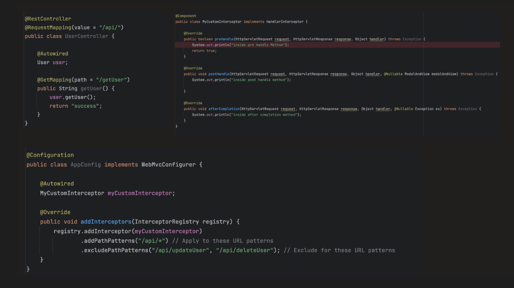
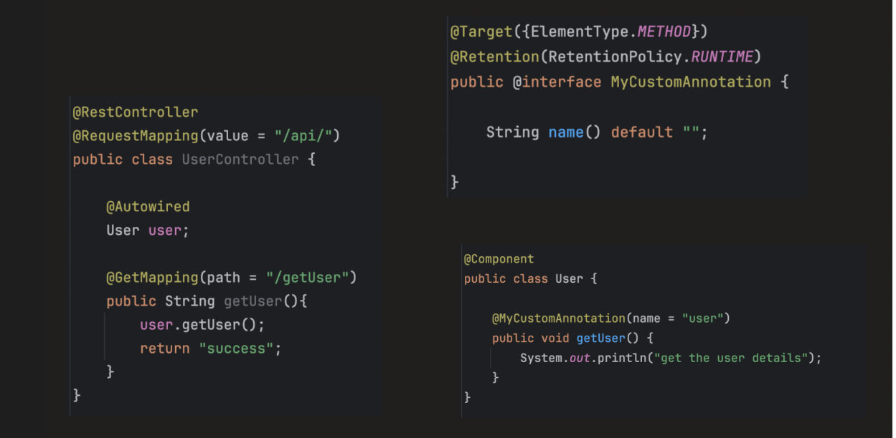
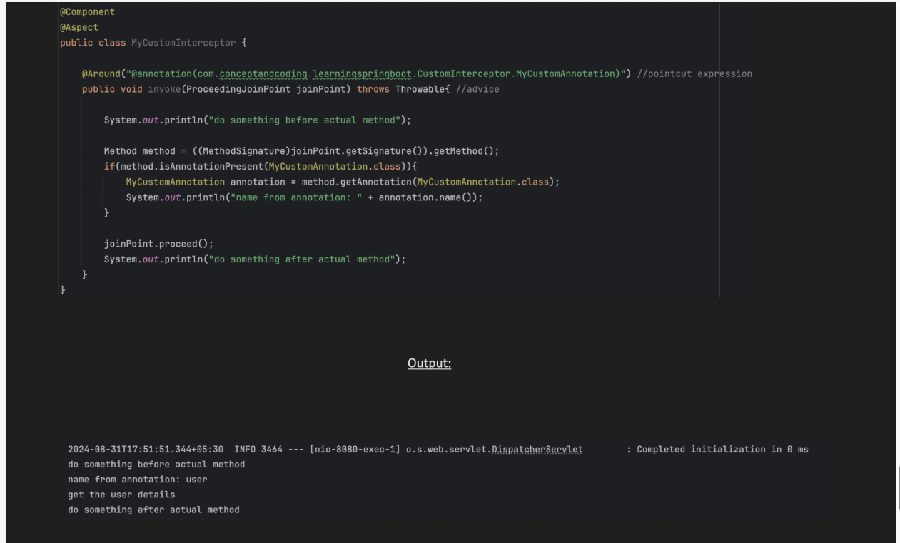
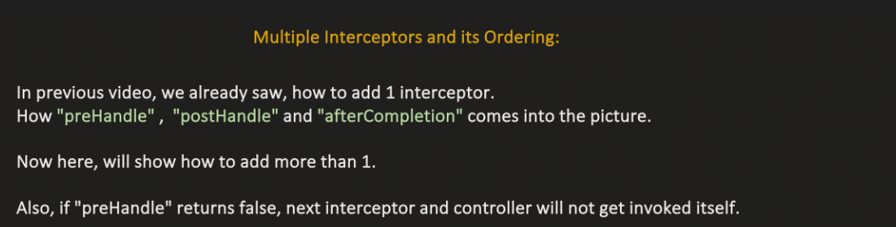
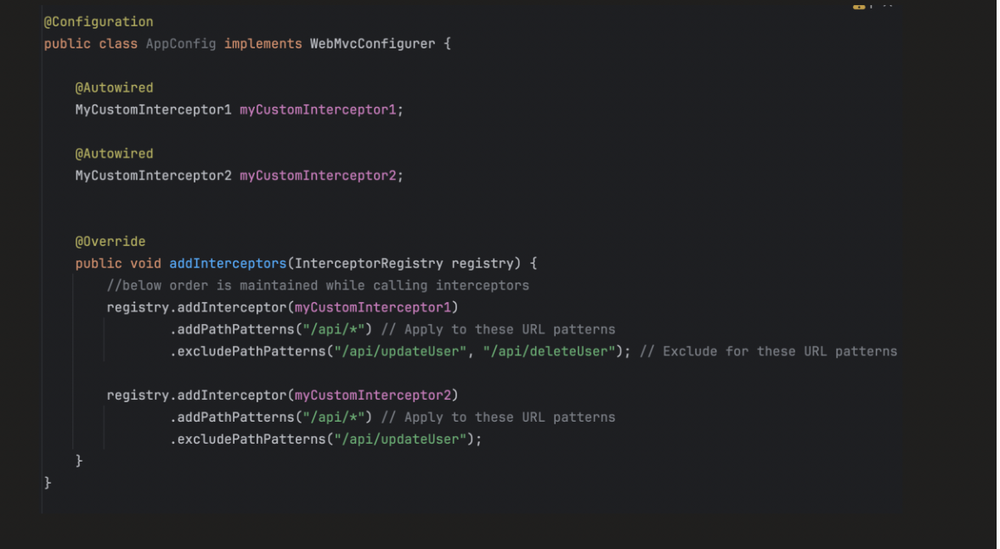

**_INTERCEPTORS:_**


        --->Interceptors are pieces of code that intercept requests or method executions, allowing you to inspect, modify, or add behavior before, after, or around the target execution.
        --->They are commonly used for logging, authentication, performance monitoring, transactions, and auditing.

1. HTTP / Web Interceptors(MVC inerceptors)

        Works at the request/response level (Spring MVC).
        Interface: HandlerInterceptor

Key methods:

        preHandle() → called before the controller method executes
        postHandle() → called after controller execution but before the view is rendered
        afterCompletion() → called after the view is rendered

Use case: Authentication, logging HTTP requests, modifying model attributes, adding headers.

2. AOP / Method-Level Interceptors

        Works at the method execution level.
        Interface: MethodInterceptor (from org.aopalliance.intercept)

Key points:

    Wraps method calls for @Before, @After, @Around, @Transactional, @Cachable 
    Executes logic before, after, or around a method.
    Used for cross-cutting concerns like transactions, logging, caching, security.

Example:

    @Around advice for measuring execution time
    @Before advice for logging method entry
    @After advice for cleanup or auditing


How to created HTTP interceptors: 


First: What Is WebMvcConfigurer?

      WebMvcConfigurer is an extension hook provided by Spring MVC.
      It allows you to customize MVC configuration without replacing the entire MVC setup.
      
      Think of it as:
      
      👉 “Tell Spring MVC how you want to customize it.”

How to create method interceptors



🔥








``` 
         Client
           ↓
         Filter
           ↓
         DispatcherServlet
           ↓
         HandlerMapping
           ↓
         HandlerExecutionChain
              ├── Interceptor 1 (preHandle)
              ├── Interceptor 2 (preHandle)
           ↓
         Controller
           ↓
         Interceptors (postHandle)
           ↓
         View Rendering
           ↓
         Interceptors (afterCompletion)

```


-----------------------------------------------------------------------------------------------------------


🏗 Now — Where Does Spring Use Them Internally?
1️⃣ LocaleChangeInterceptor (Internationalization)

Spring provides built-in:

      LocaleChangeInterceptor

Used when you enable i18n support.

Example:

      ?lang=fr

It intercepts request and changes Locale before controller runs.

This is internal MVC infrastructure support.

2️⃣ ThemeChangeInterceptor

      Used in traditional MVC applications with themes (older JSP/Thymeleaf setups).

Rare today, but part of MVC internals.

3️⃣ ConversionServiceExposingInterceptor

        This exposes Spring’s ConversionService to the request so views can use it.

It runs before view rendering.

      You usually don’t configure this manually — Spring does.

4️⃣ ResourceUrlProviderExposingInterceptor

Used for static resource versioning support.

Example:

<script src="/js/app.js?v=12345">

Spring internally exposes this support via interceptor.

