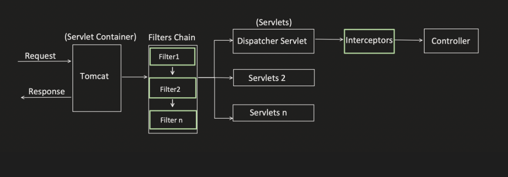
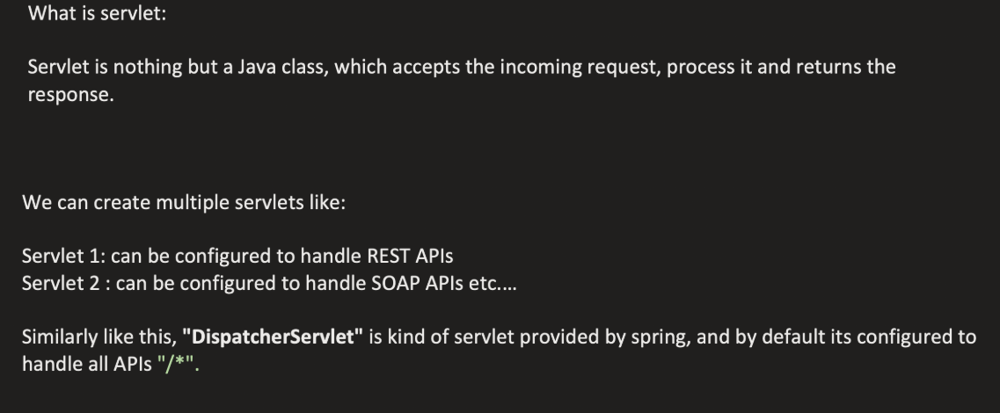
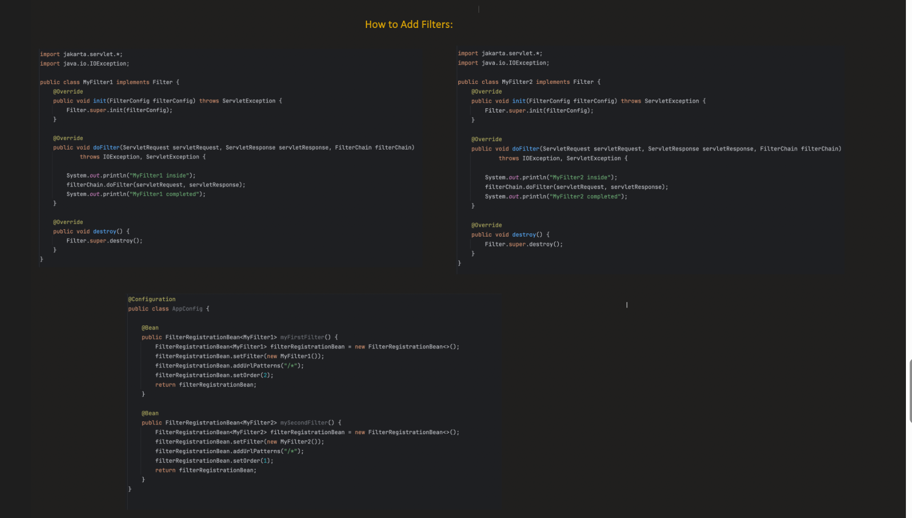

_**Filter :**_

    ---> Filter is a java component that intercepts HTTP request and response and servlet container level
         before they reach Spring MVC

    --->It is part of:👉 Jakarta Servlet (formerly Java Servlet API)

    ---> They are used for handling crosscutting concerns at the servlet container level

| Feature                      | Filter            | MVC Interceptor         |
| ---------------------------- | ----------------- | ----------------------- |
| Level                        | Servlet Container | Spring MVC              |
| Runs Before Spring?          | ✅ Yes             | ❌ No                    |
| Works on                     | All requests      | Only mapped controllers |
| Can modify request/response? | ✅ Yes             | Limited                 |
| Part of                      | Servlet API       | Spring                  |


Example : 

```java

@Component
public class MyFilter implements Filter {

    public void doFilter(ServletRequest request,
                         ServletResponse response,
                         FilterChain chain)
            throws IOException, ServletException {

        System.out.println("Before request");

        chain.doFilter(request, response); // continue

        System.out.println("After response");
    }
}

```










1. Jwt Authentication : 

WHy use Filter for this :

        ---> 1️⃣ It Runs Before Spring MVC , if say MVC interceptors are handling authentication already most of the works like 
        handler mapper selction which method to call etc will be processed which will be waste if authentication failed


       ----> Also say if we have both REST and SOAP we will have seperate first controllers for rest(dispatcher servlet) and for soap differet
       ----> So we need to duplicate the authentication logic in all servlets(first controllers)

✅ 2️⃣ CORS Handling

✅ 3️⃣ Request/Response Wrapping

Example:

        GZIP compression
        Modify request body
        Add global headers

Why Filter is BEST:

Filters can wrap:

        HttpServletRequestWrapper
        HttpServletResponseWrapper

Interceptors cannot replace raw request/response objects.


🎯 WHEN INTERCEPTORS ARE BEST

Interceptors belong to Spring MVC layer.

        Part of:
        Spring Framework

    They are Spring-aware.

✅ 1️⃣ Check Custom Annotation on Controller

Example:

@AdminOnly
@GetMapping("/dashboard")

Interceptor can:

        Inspect handler method
        Read annotation
        Apply logic

❌ Why NOT Filter?

Filter does not know:

        Which controller method is called
        What annotations are present

✅ 2️⃣ Add Common Model Attributes

    Example:
    Add logged-in user to every view.
    model.addAttribute("user", user);
    
    Interceptor postHandle() can modify ModelAndView.

❌ Why NOT Filter?

Filter does not even know about Model or View.

✅ 3️⃣ Handler-Specific Logging

Example:
Log only REST controllers.

        Interceptor receives:
        Object handler

You can check:

if (handler instanceof HandlerMethod)

    Filter cannot see handler metadata.

✅ 4️⃣ Locale Switching (MVC-level logic)

    Change language based on request parameter and update view.
    Interceptor integrates with Spring MVC infrastructure.


