JDBC : (Java DataBase Connectivity)

    **JDBC** is a **Java API** (Application Programming Interface) that allows Java programs to **connect to a database**, **execute SQL queries**, and **retrieve results** in a **database-independent** way.
    It acts as a **bridge between Java code and the database**.

        ┌───────────────────────────────┐
        │        Java Application       │
        │  (your program using JDBC API)│
        └──────────────┬────────────────┘
                       │
                       ▼
        ┌───────────────────────────────┐
        │         JDBC API              │
        │ (java.sql, javax.sql packages)│
        │  → Interfaces & classes       │
        └──────────────┬────────────────┘
                       │
                       ▼
        ┌───────────────────────────────┐
        │        JDBC Driver            │
        │ (Vendor implementation layer) │
        │  → Converts JDBC calls into   │
        │     DB-specific protocol      │
        └──────────────┬────────────────┘
                       │
                       ▼
        ┌───────────────────────────────┐
        │         Database              │
        │ (MySQL, Oracle, PostgreSQL...)│
        └───────────────────────────────┘

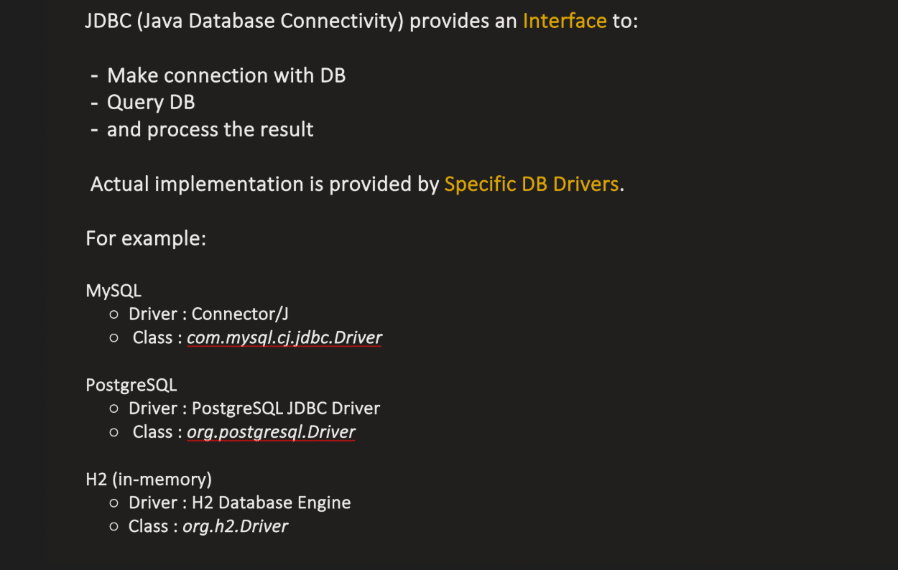

## 🧩 **1️⃣ JDBC API Layer (Java Side)**

        This layer is part of **JDK** (in `java.sql` and `javax.sql` packages).  
        It defines **interfaces**, **classes**, and **exceptions** used by Java applications to communicate with any database.

| **Component**         | **Description**                                                                               |
| --------------------- | --------------------------------------------------------------------------------------------- |
| **DriverManager**     | Manages database drivers and selects the appropriate driver based on the JDBC URL.            |
| **Driver**            | Interface implemented by each database vendor. Registers itself with `DriverManager`.         |
| **Connection**        | Represents an active connection between the Java application and the database.                |
| **Statement**         | Used to execute static SQL queries.                                                           |
| **PreparedStatement** | Used to execute parameterized and precompiled SQL queries. Improves performance and security. |
| **CallableStatement** | Used to execute stored procedures in the database.                                            |
| **ResultSet**         | Represents the data returned from executing a SQL query.                                      |
| **SQLException**      | Handles exceptions related to database access and SQL errors.                                 |

JDBC Packages

    - `java.sql` → Core interfaces (`Connection`, `Statement`, `ResultSet`, `DriverManager`, etc.)
      - `javax.sql` → Advanced (Connection pooling, DataSource, RowSet)

## 🧩 **2️⃣ JDBC Driver Layer (Vendor Side)**

        This layer is provided by the **database vendor** (e.g., Oracle, MySQL, PostgreSQL).  
        It **implements the JDBC API interfaces**.

        ➡️ It **translates Java JDBC calls** into **database-specific network calls or protocol commands**.

| JDBC Interface | MySQL Implementation                     |
| -------------- | ---------------------------------------- |
| `Connection`   | `com.mysql.cj.jdbc.ConnectionImpl`       |
| `Statement`    | `com.mysql.cj.jdbc.StatementImpl`        |
| `ResultSet`    | `com.mysql.cj.jdbc.result.ResultSetImpl` |

### 🪜 Step 1: Load Driver

        `Class.forName("com.mysql.cj.jdbc.Driver");`

- Loads the vendor driver class.
  - Registers itself automatically with **DriverManager** using a static block:

        `static {     DriverManager.registerDriver(new com.mysql.cj.jdbc.Driver()); }`
  In modern java this is not needed

### 🪜 Step 2: Establish Connection

        `Connection con = DriverManager.getConnection(     "jdbc:mysql://localhost:3306/testdb", "root", "password");`

DriverManager checks all **registered drivers**.
- Matches prefix (`jdbc:mysql`) with MySQL driver.
- Calls driver’s `connect()` method.
- Driver establishes a **TCP/IP socket connection** to the database.
- Returns a `Connection` object (vendor-implemented).

Think of Connection in JDBC like a phone call between your Java program and the database. 📞
Your Java application cannot directly talk to the database.
It must first open a communication channel. That channel is called a Connection.

What happens internally:

1️⃣ Your Java program contacts the database server
2️⃣ Authentication happens (username/password)
3️⃣ Database allocates a session
4️⃣ A Connection object is returned

So internally the DB maintains something like:

    Session ID
    User
    Transaction state
    Temporary tables
    Locks
    Variables

They represent the same communication channel, but from different sides.

        Side	        Object
        Java side	    Connection
        Database side	Session

### 🪜 Step 3: Create Statement Object

`Statement stmt = con.createStatement();`

- Used to send SQL queries to the database.

### 🪜 Step 4: Execute Query

`ResultSet rs = stmt.executeQuery("SELECT * FROM employee");`

- Driver converts this SQL string into the DB’s **native protocol**.
- Sends it over the **socket** connection.
- Database executes the SQL and returns results.

---

### 🪜 Step 5: Process Results

`while (rs.next()) {     System.out.println(rs.getString("name")); }`

- Reads rows one by one from the `ResultSet` cursor.

---

### 🪜 Step 6: Close Connection

`con.close();`

- Closes ResultSet → Statement → Connection.
- Releases all database and network resources.

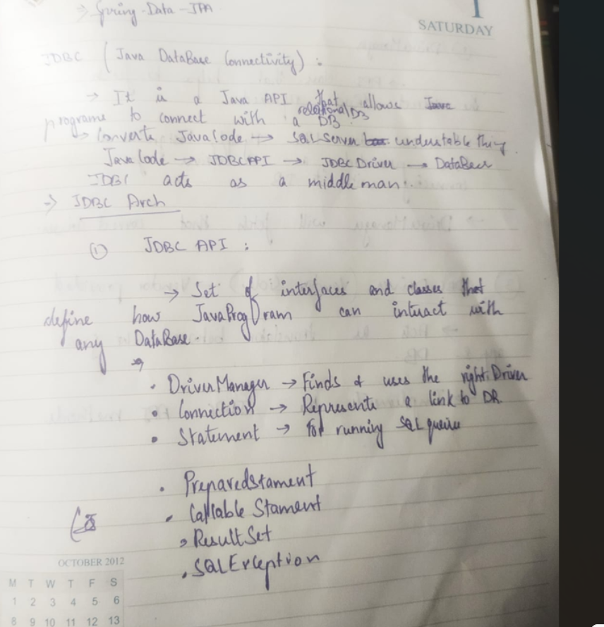

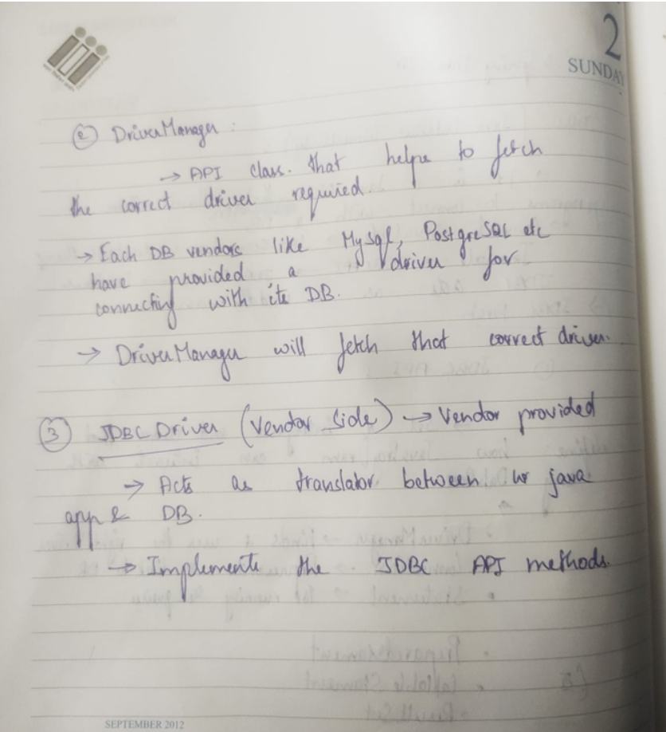

## **1️⃣ DriverManager**

- **Purpose:** Manages database drivers and creates database connections.
- **Key method:** `getConnection(url, user, password)`

- **Example:**

`Connection con = DriverManager.getConnection(     "jdbc:mysql://localhost:3306/mydb", "root", "password");`

- **What it does:** Finds a suitable driver and opens a connection to the DB.

---

## **2️⃣ Connection**

Represents a **session with the database**.

- **Common methods:**

  1. `createStatement()` → Used to create a `Statement` object for executing SQL queries.
  2. `prepareStatement(String sql)` → Creates a `PreparedStatement` for parameterized queries (safer & faster).
  3. `setAutoCommit(boolean)` → Enables/disables auto-commit mode for transactions.
  4. `commit()` → Commits the current transaction.
  5. `rollback()` → Rolls back the current transaction.
  6. `close()` → Closes the connection.

- **Example:**
`Connection con = DriverManager.getConnection(url, user, pass); con.setAutoCommit(false); PreparedStatement ps = con.prepareStatement("INSERT INTO users VALUES (?, ?)"); ps.setInt(1, 1); ps.setString(2, "Alice"); ps.executeUpdate(); con.commit(); con.close();`

---

## **3️⃣ Statement**

Used to execute **static SQL queries** (no parameters).

- **Common methods:**

  1. `executeQuery(String sql)` → Executes SELECT queries and returns a `ResultSet`.
  2. `executeUpdate(String sql)` → Executes INSERT, UPDATE, DELETE; returns affected row count.
  3. `execute(String sql)` → Executes any SQL; returns boolean if result is a ResultSet.

- **Example:**
`Statement stmt = con.createStatement(); ResultSet rs = stmt.executeQuery("SELECT * FROM users"); while(rs.next()) {     System.out.println(rs.getString("name")); }`

---

## **4️⃣ PreparedStatement**

Used for **parameterized SQL queries** (prevents SQL injection).

- **Common methods:**

  1. `setInt(int index, int value)`
  2. `setString(int index, String value)`
  3. `setDate(int index, Date value)`
  4. `executeUpdate()` → Runs INSERT/UPDATE/DELETE
  5. `executeQuery()` → Runs SELECT

- **Example:**

`PreparedStatement ps = con.prepareStatement("SELECT * FROM users WHERE id = ?"); ps.setInt(1, 1); ResultSet rs = ps.executeQuery();`

---

## **5️⃣ ResultSet**

Represents the **result of a SELECT query**.

- **Common methods:**

  1. `next()` → Moves cursor to next row; returns false if no more rows.
  2. `getInt(String columnLabel)`
  3. `getString(String columnLabel)`
  4. `getDate(String columnLabel)`
  5. `close()` → Closes the ResultSet

- **Example:**

`while(rs.next()) {     System.out.println(rs.getInt("id") + " " + rs.getString("name")); } rs.close();`

---

## **6️⃣ CallableStatement**

Used to **call stored procedures** in the database.

- **Common methods:**

  1. `registerOutParameter(int index, int sqlType)` → For OUT parameters
  2. `setInt`, `setString` → For IN parameters
  3. `execute()` → Executes the procedure
  4. `getInt`, `getString` → Get OUT parameter values

- **Example:**

`CallableStatement cs = con.prepareCall("{call getUser(?, ?)}"); cs.setInt(1, 1);            // IN param cs.registerOutParameter(2, Types.VARCHAR); // OUT param cs.execute(); String name = cs.getString(2);`

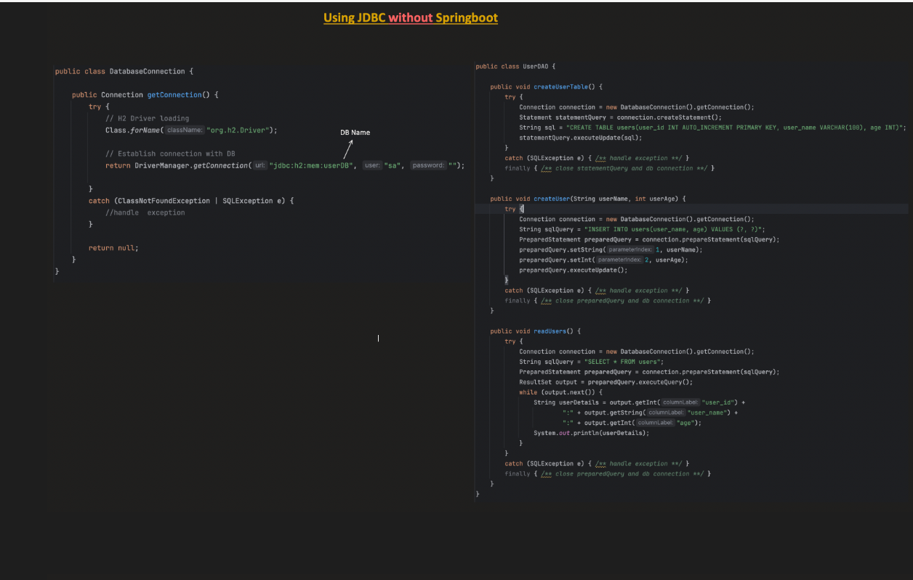

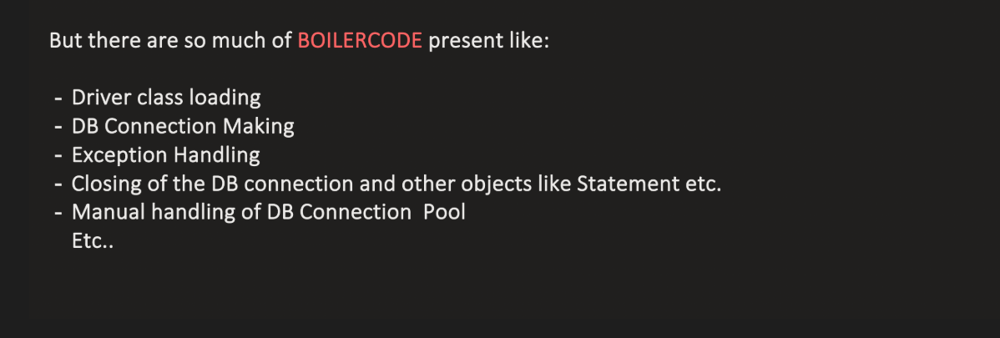

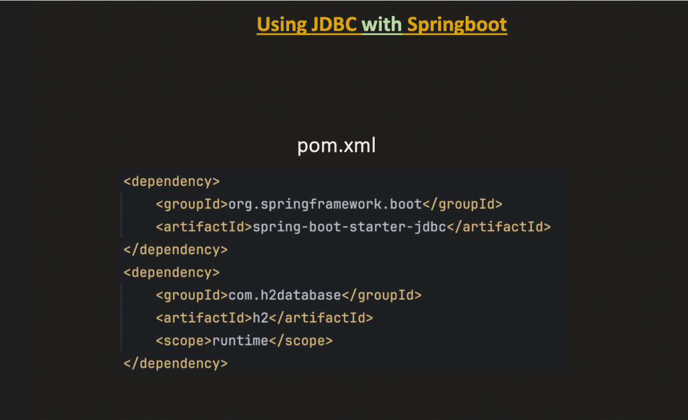

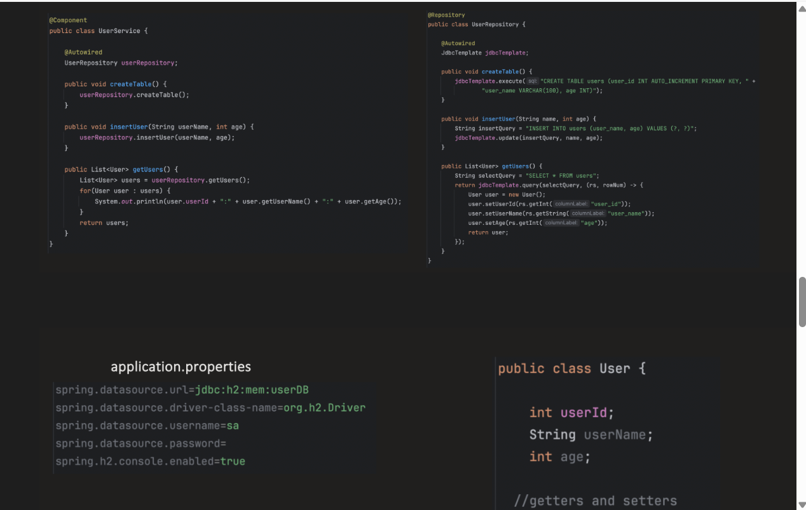

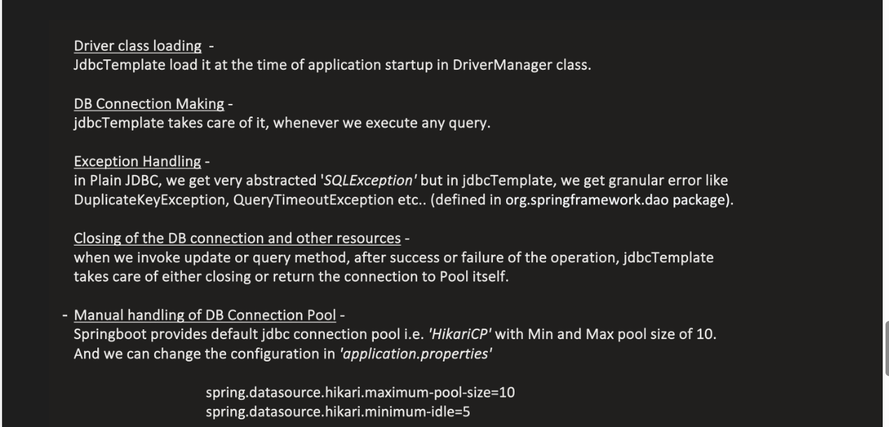

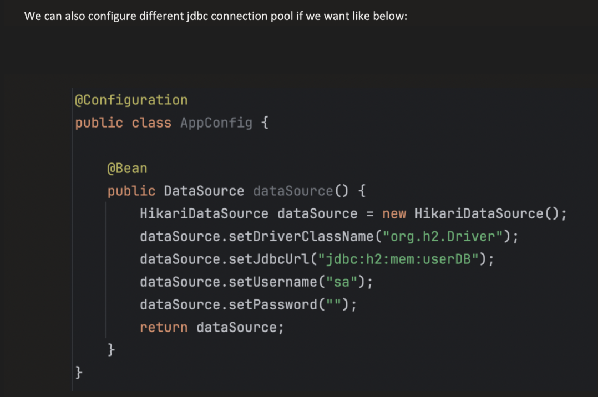

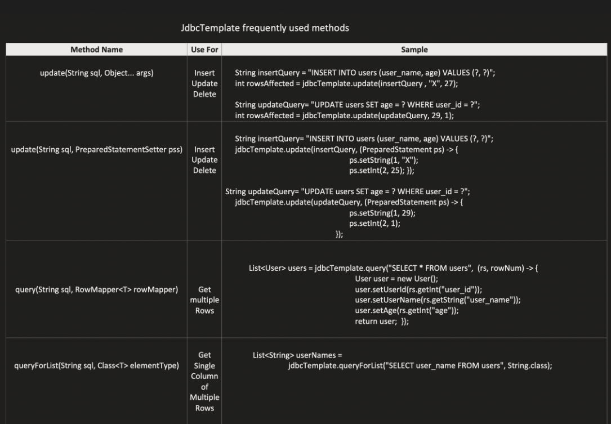

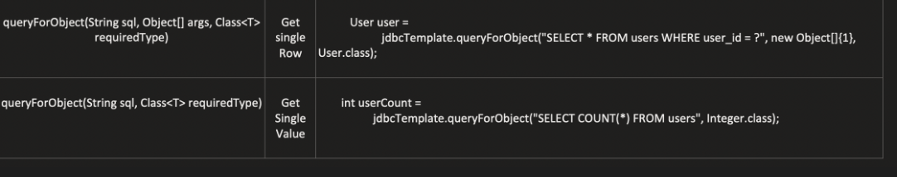

to enable h2 

spring.h2.console.enabled=true
spring.h2.console.path=/h2-console

http://localhost:8080/h2-console

JDBC URL: jdbc:h2:mem:testdb
User Name: sa
Password:

What is a DataSource?

    A DataSource is an object that provides database connections to your application.
    Instead of manually creating connections using DriverManager, your application asks the DataSource for a connection.
    
    In Spring Boot applications, a DataSource is automatically configured when you add a database dependency (like H2 Database or MySQL).

1️⃣ Connection Pooling

Opening DB connections is expensive.
DataSource uses a pool of reusable connections.

Spring Boot uses HikariCP by default.

Example:

      Connection Pool
      ├── Connection1
      ├── Connection2
      ├── Connection3

Instead of creating new ones each time.