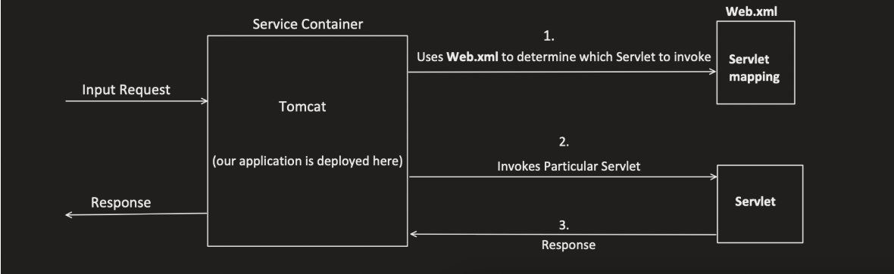
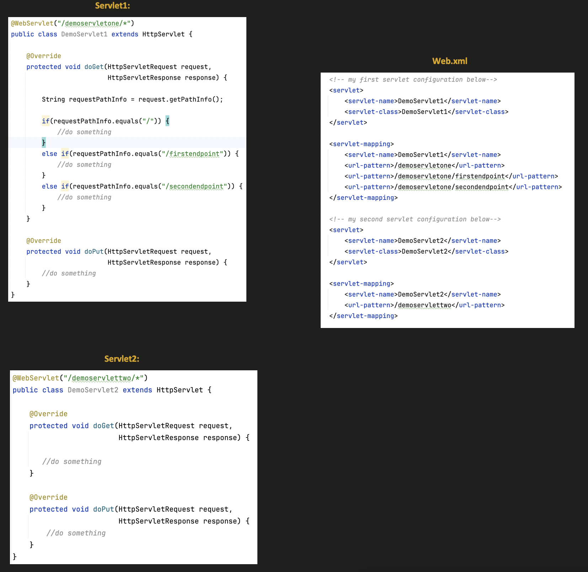
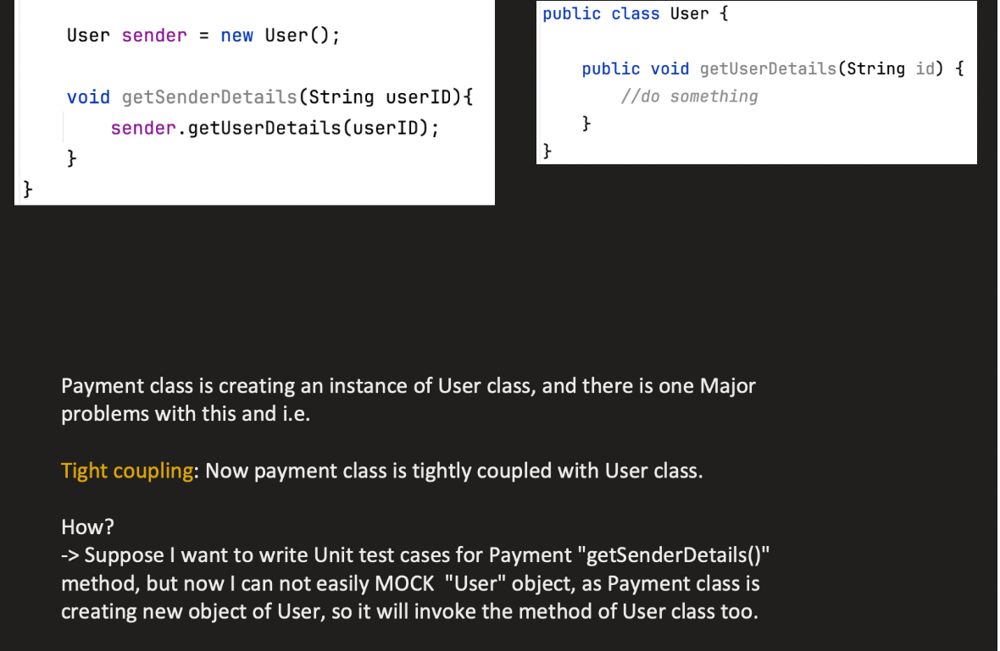
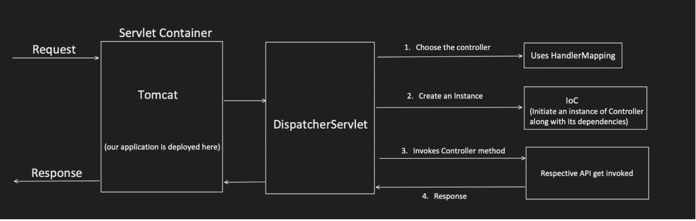
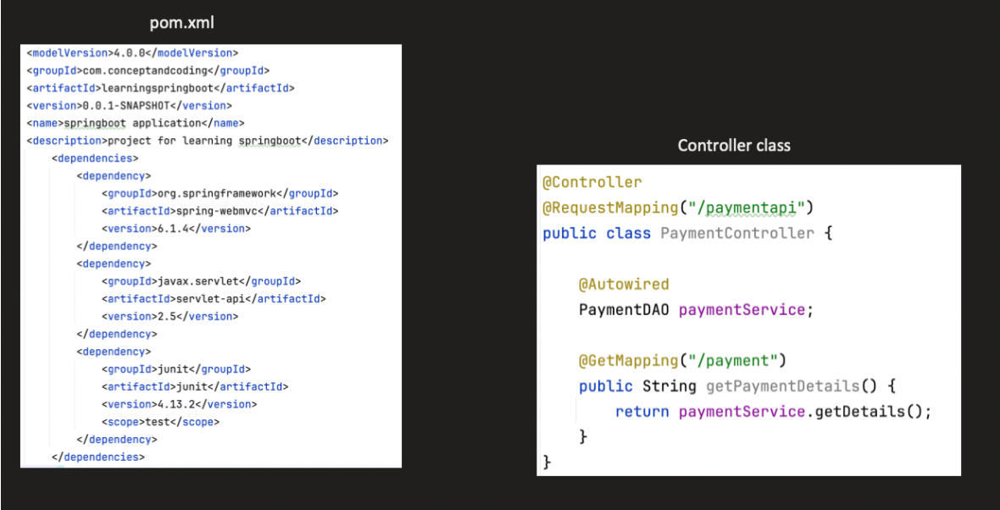
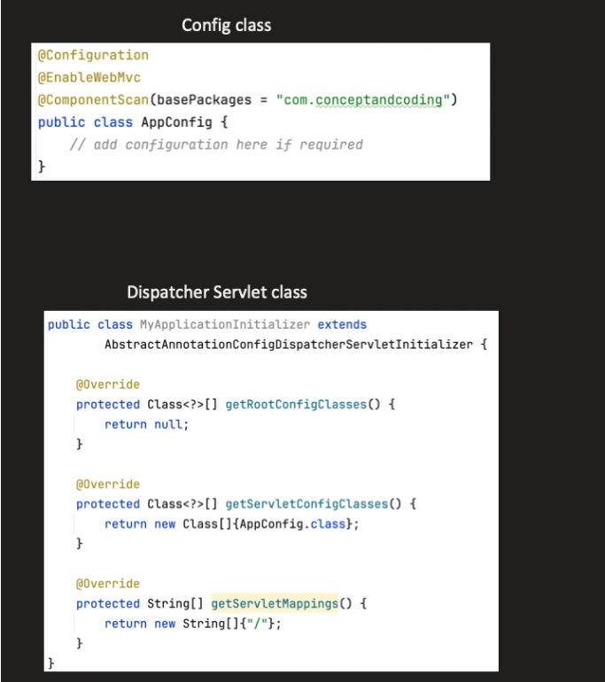

SERVLETS

      -- Servlets are Java Classes which handles client requests, process them and sends response back.
      -- Servlet Container(Tomcat) manages all Servlets
      -- A servlet has one doGet(), doPost() method, but must handle multiple URLs or actions inside them, usually using if/else or request parameters.





    Here Whenever a clientRequest comes it first reaches the Tomcat Server First
    Tomcat will use web.xml to find the servlet class and inside that class whether get or post or any endpoint
    and forwards the request




CHALLENGES OF USING SERVLETS


1. Web.xml will become too large to manage and understand
   
       -- Web.xml will increase if endpoints increase  and also web.xml contains instructions of which filters to execute sequentially

2.  Servlets are tightly coupled to Servlet Container

       --Servlets are container-managed, which makes dependency injection and lifecycle control difficult without a framework.
         
```java
    
       public class LoginServlet extends HttpServlet {
    
           private AuthService authService = new AuthService();
    
           protected void doPost(HttpServletRequest req, HttpServletResponse res) {
               authService.login(req.getParameter("user"));
           }
       }
 ```
    
    
    Here Authservice is tightly coupled , say in future we need Oauth Impl we need to change the servlet code
    We cant use ocnstruction injection like this
    
    ```java
    
    public class LoginServlet extends HttpServlet {
        private AuthService authService;
        public LoginServlet(AuthService authService) {
            this.authService = authService;
        }
    }
    ```
    
    
    Because Tomcat should create a servlet even before the request comes in


3. Unit Testing becomes very hard

    -- If object creation is done manually while unit testing say if we are mocking a method , we need to use the same object which we used for mocking which is impossible
   


    -- “Because dependencies are created inside the servlet, we cannot inject mocks, making isolated unit testing difficult.”


4. Difficult to manage REST Api's  

        -- In servlets each class contains only 1 GET, POST, DELETE method, so you need to write numerous if else inside same method
   which will also cause tight coupling


---------------------------------------------------------------------------------------------------------------------------------------------------

SPRING : 


    --> Spring is a open source framework which provides infrastructure support like dependency injection, lifecycle management,
        various integrations so that developers can focus on business logics rather than boiler palte codes

    ---> The Spring Framework is a lightweight Java framework used to build scalable, maintainable enterprise applications.


Issues Solved By Spring: 

    1. Before Spring we has web.xml which is very difficult to handle and maintain

          ---> Instead of web.xml Spring framework introduced annotation based configuration
          Ex : @GetMapping, @ PostMapping

    2. Inversion Of Control : 
    
        ---> Here the entire control is given to Spring Framework itself rather than maintaing manually
    
        Without IOC , the code becomes tightly coupled as well as it is hard to test
        With IOC , the object creation is managed by Spring framework itself , so it becomes lossely coupled
        and easier to mock durig unit tests
    
    
    3. Easy to manage RestApi's:
    
        ---> With servlets each servlet can only have on doPost() method so if we need different post endpoints, we need to use multile if conditions.
        ---> Whereas spring MVC provides much easier and simpler ways to create endpoints.


    4. Spring also helps in easier integrations with other frameworks such as 
         ---> Integration with JUnit , Mockito for unitTests
         ---> Integration with Hibernate ,JPA for data access
         ---> “Spring provides modules or integration support for async processing, caching, logging, and security.”


    5. Spring also supports AOP which are used to handle cross cutting concrens
    6. Also supports MVC, Security, DataJPA etc
    
--------------------------------------------------------------------------------------------------------------------------------------------------------

SPRING MVC : 


      ---> Spring MVC is a framework which is used to build web application and rest applications
           using Model, View , Controller Pattern

    1️⃣ Model
    
        Holds data & business logic
        Usually POJOs, DTOs, Entities

    2️⃣ View
    
        What the client sees
        JSP, Thymeleaf, HTML, or JSON (for REST APIs)
    
    3️⃣ Controller
    
        Handles incoming requests
        Calls services
        Sends response to view









🧩 Core Architecture Components
    1️⃣ DispatcherServlet (Front Controller) 🔥
    
        Heart of Spring MVC
        Every HTTP request first comes here
        Defined automatically in Spring Boot
    
    Responsibilities
    
        Receive requests
        Find correct controller
        Invoke controller
        Return response


    2️⃣ HandlerMapping
    
        Maps URL → Controller method
    
    
    3️⃣ Controller
    
        Handles the request
        Delegates business logic to services
    
    Returns:
    
        View name (MVC app)
        OR JSON (REST API)


    4️⃣ Service Layer
    
        Contains business logic
        Called by controllers
        Annotated with @Service


    5️⃣ Model
    
        Holds data to be sent to view
        Used in traditional MVC
        model.addAttribute("fare", 250);

    6️⃣ ViewResolver
    
    Resolves logical view name → actual view
    Example:
    
        "home" → home.jsp
        "cab" → cab.html
    
    Common resolvers:
    
        InternalResourceViewResolver (JSP)
        ThymeleafViewResolver

    7️⃣ View
    
        UI Layer
        JSP / Thymeleaf / HTML
        Renders model data

    8️⃣ HttpMessageConverter (REST APIs) ⭐
    
        Converts Java objects ↔ JSON / XML
        Uses Jackson internally
        return new Cab(); // → JSON automatically


🧩 Step-by-Step Detailed Flow
1️⃣ Client Sends HTTP Request
GET /login


    Request reaches Tomcat.

2️⃣ DispatcherServlet (Front Controller) 🔥

    Single entry point for all MVC requests
    Delegates request handling
    
        DispatcherServlet.doDispatch()

3️⃣ HandlerMapping Finds Controller

    Uses RequestMappingHandlerMapping
    Maps URL to controller method
    
        /login → LoginController.login()

4️⃣ HandlerAdapter Invokes Controller

RequestMappingHandlerAdapter

    Handles:
        Parameter binding
        Type conversion
        Validation

5️⃣ Controller Executes Logic

    Calls service layer
    Prepares Model data

        model.addAttribute("msg", "Welcome");

6️⃣ Controller Returns Logical View Name
    return "login";
    
    
    ⚠️ This is NOT a file name, just a logical name.

7️⃣ DispatcherServlet Receives Model + View

    Model = data
    View = "login"

8️⃣ ViewResolver Resolves Actual View

    Example:
    
    prefix=/WEB-INF/views/
    suffix=.jsp
    
    
    Resolved as:
    
    /WEB-INF/views/login.jsp

9️⃣ View Renders Model Data

    JSP / Thymeleaf executes
    Model data injected into UI
    <h1>${msg}</h1>

🔟 Response Sent to Client

    Rendered HTML
    Sent via HTTP response


------------------------------------------------------------------------------------------------------------------------------------

_**Important Flow of a HttpRequest**_

🌍 0️⃣ Client Sends HTTP Request

Example:

POST /users/10?role=admin HTTP/1.1
Host: localhost:8080
Content-Type: application/json
Content-Length: 35

{
"name": "Bharath",
"age": 25
}


This entire HTTP message is sent as raw TCP bytes.

🧠 1️⃣ OS + TCP Layer

Server OS listens on port 8080

TCP connection established (3-way handshake)

Data arrives as packets

Passed to Tomcat process

Spring is NOT involved yet.

🧠 2️⃣ Tomcat (Servlet Container) Layer

Tomcat does:

✅ Accept connection

Using Connector (e.g., NIO)

✅ Parse HTTP

Tomcat HTTP parser separates:

Method → POST

URI → /users/10

Query → role=admin

Headers

Body

✅ Create Objects

Tomcat creates:

org.apache.catalina.connector.Request
org.apache.catalina.connector.Response


These implement:

HttpServletRequest
HttpServletResponse


Body is stored as InputStream inside request.

🧠 3️⃣ Filter Chain Begins (Very Important Step)

Before Spring sees request:

Tomcat builds a FilterChain

This may include:

Security filters

Logging filters

CORS filter

Spring Security filter

Custom filters

Each filter:

doFilter(request, response, chain)


Eventually calls:

chain.doFilter()


If any filter blocks request → controller never executes.

🧠 4️⃣ Request Reaches DispatcherServlet

Tomcat calls:

dispatcherServlet.service(request, response)


Now Spring MVC starts.

🧠 5️⃣ DispatcherServlet.doDispatch()

Core Spring method:

doDispatch(request, response)


Inside this method:

🔹 Step 5.1: HandlerMapping

Spring checks all registered HandlerMapping beans.

Usually:

RequestMappingHandlerMapping


It matches:

HTTP method

URL

Path variables

Produces/Consumes conditions

It finds:

@PostMapping("/users/{id}")


Returns:

HandlerExecutionChain


Which contains:

Controller method

Interceptors (if any)

🧠 6️⃣ Interceptors (PreHandle Phase)

If interceptors exist:

preHandle(request, response)


Examples:

Logging

Auth check

Metrics

If preHandle() returns false → request stops.

🧠 7️⃣ HandlerAdapter

Spring selects:

RequestMappingHandlerAdapter


This adapter:

Resolves arguments

Invokes controller

Handles return value

🧠 8️⃣ Argument Resolution (Critical Step)

Spring inspects method parameters:

public User save(
@PathVariable Long id,
@RequestParam String role,
@RequestBody User user)


For each parameter, it finds a matching:

HandlerMethodArgumentResolver

🔹 8.1 @PathVariable

Uses:

PathVariableMethodArgumentResolver


Gets value from URI template
Uses ConversionService
Converts String → Long

🔹 8.2 @RequestParam

Uses:

RequestParamMethodArgumentResolver


Reads from:

request.getParameter("role")


Converts String → target type

🔹 8.3 @RequestBody

Uses:

RequestResponseBodyMethodProcessor


Steps:

Reads request.getInputStream()

Checks Content-Type

Chooses HttpMessageConverter

For JSON → MappingJackson2HttpMessageConverter

Calls:

objectMapper.readValue(...)


JSON → User object

Now all parameters are resolved.

🧠 9️⃣ Controller Method Execution

Spring invokes method using reflection:

method.invoke(controller, arguments)


Controller logic runs.

Returns something:

Object

String

ResponseEntity

void

🧠 🔟 Return Value Handling

Spring checks return type.

Uses:

HandlerMethodReturnValueHandler


Cases:

🔹 If @ResponseBody / @RestController

Uses:

RequestResponseBodyMethodProcessor


Steps:

Takes return object

Chooses HttpMessageConverter

Converts Object → JSON

Writes to:

response.getOutputStream()

🔹 If View Name (MVC)

Uses:

ViewResolver


Finds template (Thymeleaf/JSP)
Renders HTML
Writes to response.

🧠 1️⃣1️⃣ Interceptors (PostHandle + AfterCompletion)

If interceptors exist:

postHandle()
afterCompletion()

🧠 1️⃣2️⃣ Exception Handling (If Error Happens)

If exception occurs:

Spring checks:

@ExceptionHandler

@ControllerAdvice

ResponseStatusExceptionResolver

DefaultHandlerExceptionResolver

If not handled → 500 response.

🧠 1️⃣3️⃣ DispatcherServlet Finishes

Control returns to Tomcat.

🧠 1️⃣4️⃣ Response Commit

Tomcat:

Flushes response buffer

Writes bytes to socket

Sends back to client

Connection may close or stay alive (keep-alive).

🔥 Full Visual Flow
Client
↓
TCP Layer
↓
Tomcat Connector
↓
HTTP Parser
↓
Create HttpServletRequest/Response
↓
Filter Chain
↓
DispatcherServlet
↓
HandlerMapping
↓
Interceptors (preHandle)
↓
HandlerAdapter
↓
ArgumentResolvers
↓
Controller
↓
ReturnValueHandler
↓
HttpMessageConverter
↓
Write to HttpServletResponse
↓
Interceptors (postHandle)
↓
Tomcat flushes response
↓
Client receives response


