**_JPA_**

     1. **What is JPA?**
    
    **JPA (Java Persistence API)** is a **Java specification** for **ORM (Object-Relational Mapping)**.  
    It defines **standard interfaces and annotations** to map Java objects to database tables and manage persistence.

Important:
        
        JPA is **just a specification**, not an implementation.  
        You need a **provider** like **Hibernate, EclipseLink, or OpenJPA** to actually perform the database operations.

| Issue with JDBC                   | How JPA Solves It                                                                                                       |
| --------------------------------- | ----------------------------------------------------------------------------------------------------------------------- |
| **Manual mapping**                | JPA maps Java objects to DB tables automatically using `@Entity`, `@Id`, `@Column` etc.                                 |
| **Manual SQL**                    | You can write JPQL/HQL (object-oriented query language) instead of raw SQL; for simple CRUD you may not need any query. |
| **Manual transaction management** | JPA allows container-managed or programmatic transactions (e.g., `EntityTransaction`)                                   |
| **ResultSet conversion**          | JPA converts DB rows into Java objects automatically                                                                    |
| **Database portability**          | JPA queries are database-agnostic; the provider generates vendor-specific SQL                                           |
| **Boilerplate resource handling** | Connections, statements, and result sets are handled internally by the provider                                         |

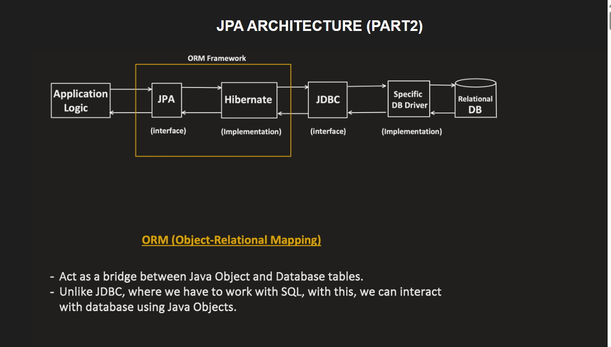

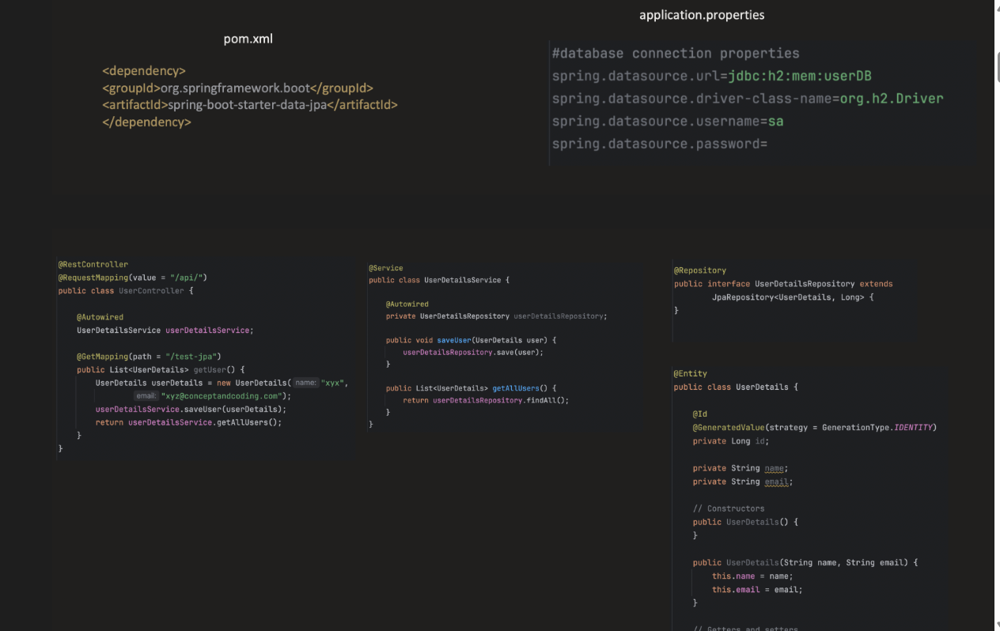

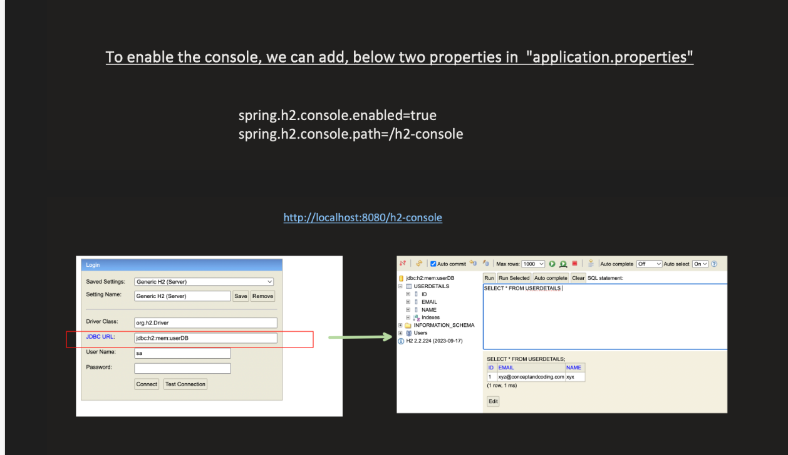

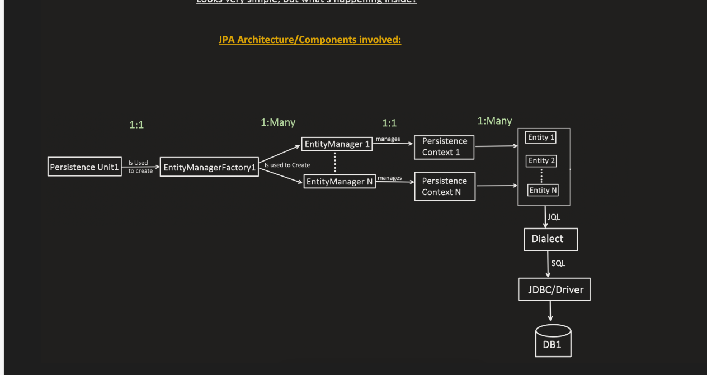

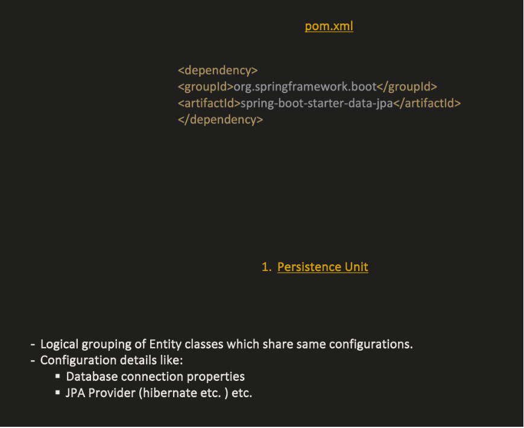

PERSISTANCE UNIT :

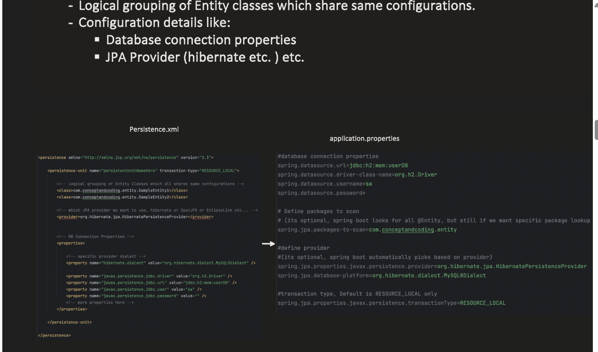

## 🧩 1️⃣ What is `EntityManagerFactory`?

👉 `EntityManagerFactory` is a **JPA interface** that acts as a **factory** (creator) for `EntityManager` instances.
    It is **thread-safe**, **heavyweight**, and typically **created once per application** (per persistence unit).

### 🧠 Main Purpose:

    To **create and manage multiple `EntityManager` instances efficiently** using a single, pre-configured setup.

Because:

- Building all metadata and DB connections from scratch every time is **expensive**.
- `EntityManager` is **not thread-safe** — each request needs its own instance.
- But `EntityManagerFactory` **is thread-safe** and can create many `EntityManager` objects quickly.

After EntityManagerFactory is created , Transactional Manger is also created for each entity Manager Factory if we are using JPATransactional Manger or only 1 
TransactionalManager is cretaex for all EntityMangerFactory f w eare using JTATransactional Manager

These transactional Manager comes into picture when we use @Transactional alone
Internaly al delete, insert , update method are annotated with @Transactional by default

Instead of using dataJPA's save if u use enityManger.persist() without @Transactional it will throw an error

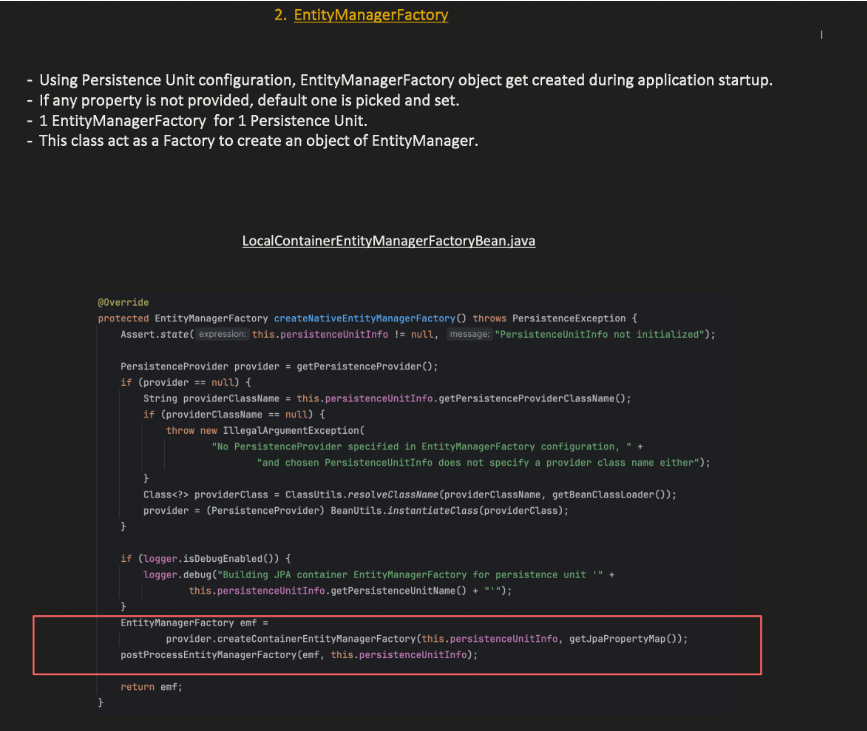

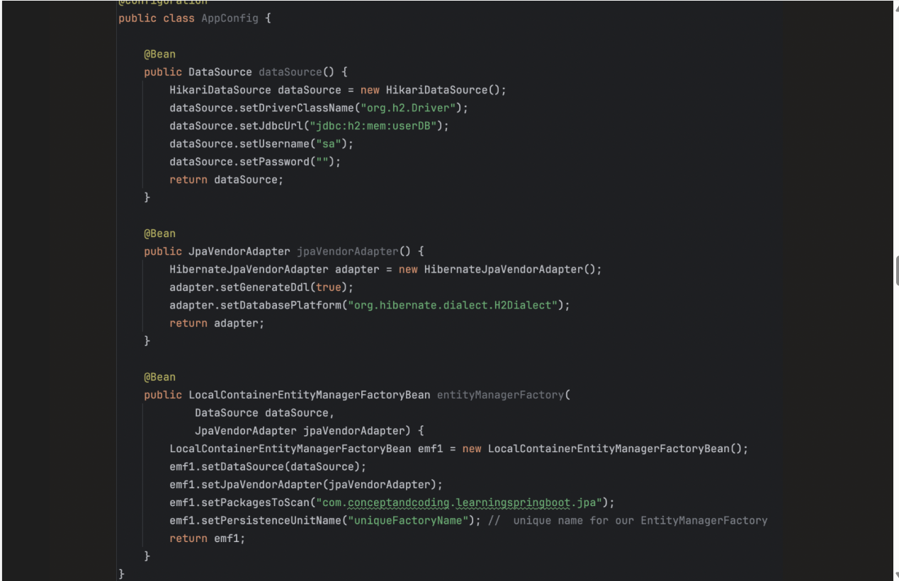

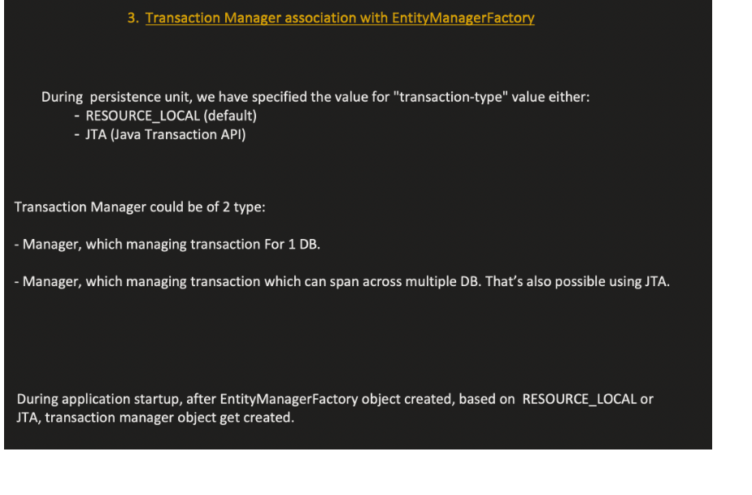

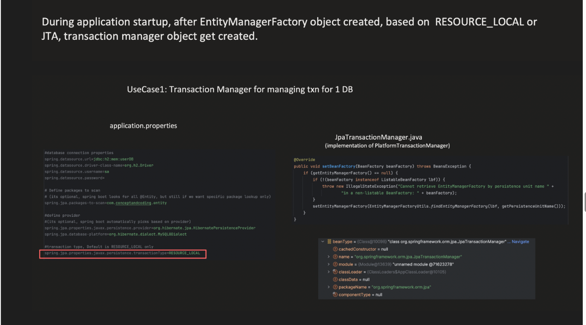

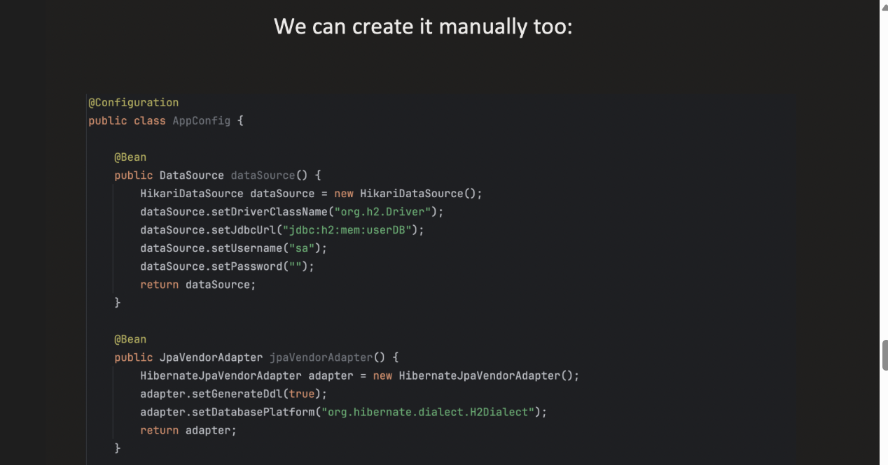

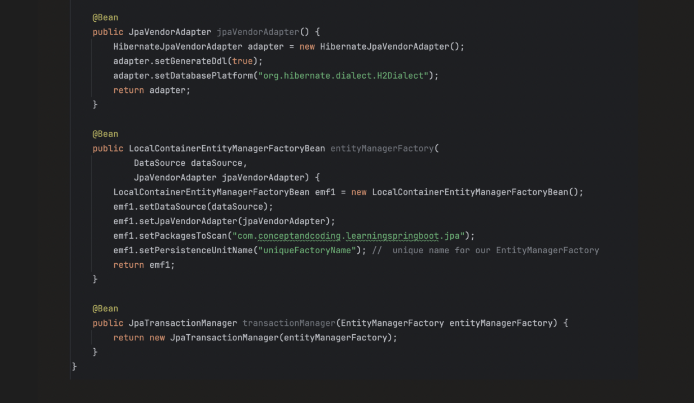

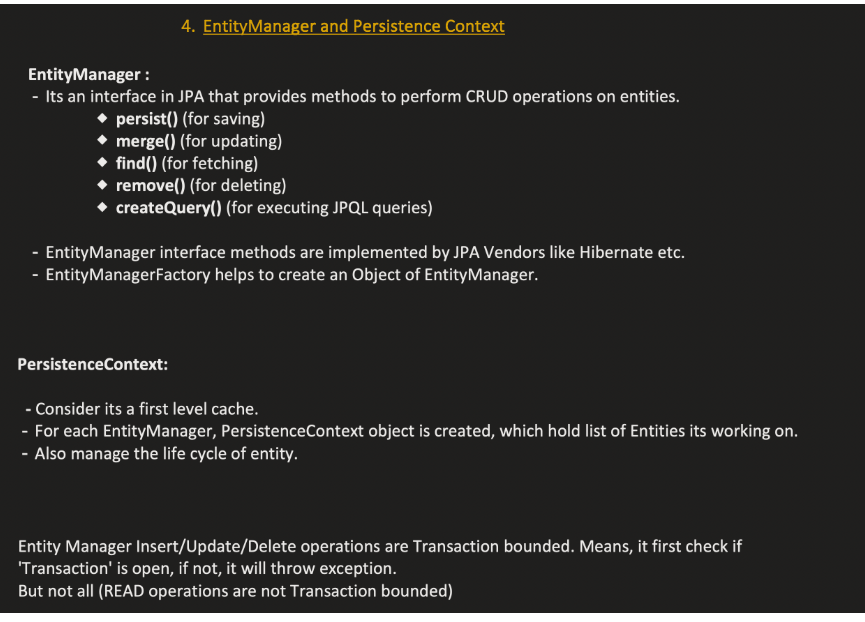

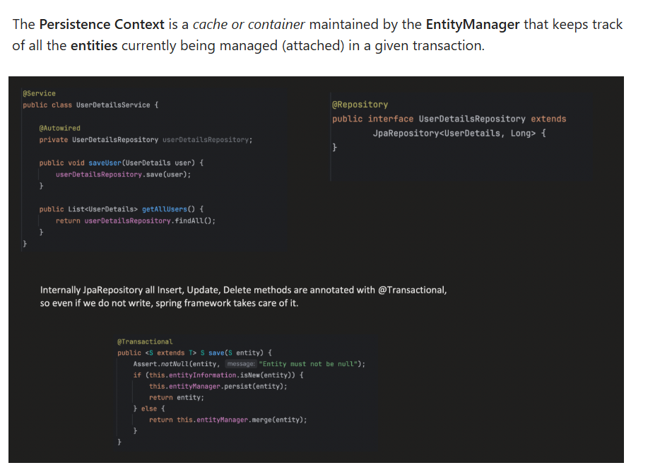

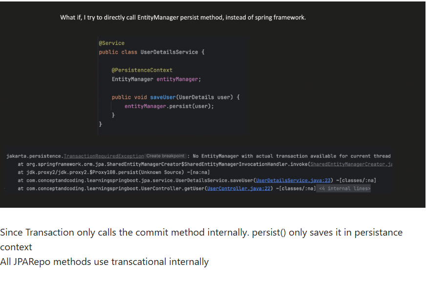

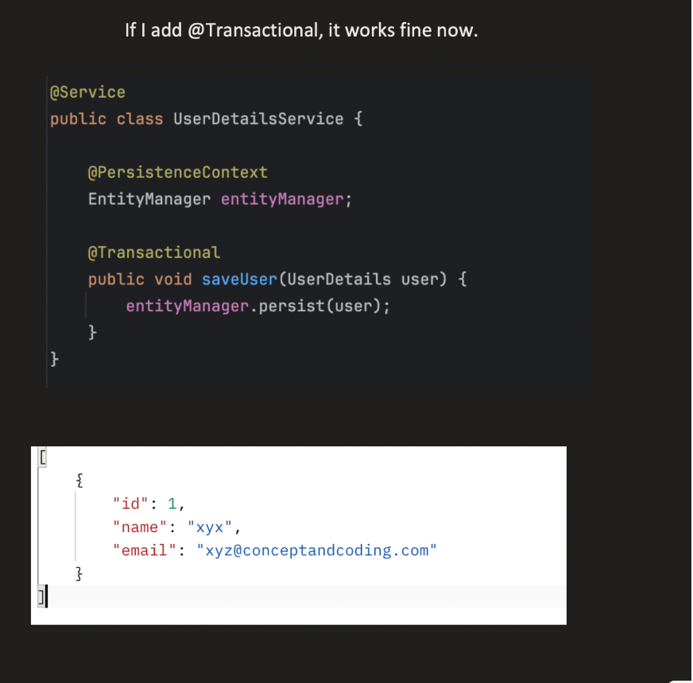

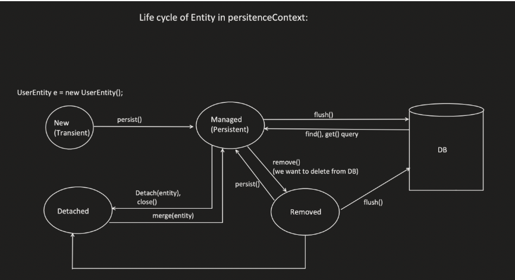

Step 1: **Creation (Open Persistence Context)**

- Happens when an **EntityManager** is created.

- Example:

  `EntityManager em = emf.createEntityManager();`

- A new persistence context starts.

- No DB connection is used yet — only when needed (lazy).

---

### 🔹 Step 2: **Entity Becomes Managed**

When you perform operations like:

`em.persist(entity);      // new entity -> becomes managed em.find(User.class, 1);  // fetched entity -> becomes managed`

→ The entity is **attached** to the persistence context.

✅ The entity is now “managed” — meaning:

- Changes you make to it are tracked automatically.

- On transaction commit, JPA will flush changes to the DB.

---

### 🔹 Step 3: **Dirty Checking (Tracking Changes)**

While the entity is managed:

- JPA automatically detects changes to fields (like a diff tracker).

- No manual SQL needed.

Example:

`User user = em.find(User.class, 1); user.setName("Bharath Updated");`

You didn’t call `update()`, but JPA will auto-generate an SQL `UPDATE` during `flush()` or `commit()`.

---

### 🔹 Step 4: **Flushing**

- Synchronizes the persistence context with the database.

- Writes pending changes (INSERT/UPDATE/DELETE) to the DB.

Happens when:

- You call `em.flush()`, or

- Transaction commits.

---

### 🔹 Step 5: **Detaching**

You can **detach** an entity manually:

`em.detach(entity);`

or all entities:

`em.clear();`

➡ The entity becomes **detached** — no longer tracked.  
Changes won’t be auto-saved.

---

### 🔹 Step 6: **Merging**

If you want to reattach a detached entity:

`em.merge(entity);`

    This copies its state into a **managed** instance inside the persistence context.

---

### 🔹 Step 7: **Removal**

`em.remove(entity);`

Marks the entity for deletion — actual delete happens at flush/commit.

## 🧩 1. **Recap: The Persistence Context**

The **Persistence Context** (managed by the `EntityManager`) keeps a list of:

    - All _managed entities_,
      - Their _original state_ (for dirty checking),
      - And their _lifecycle status_ (new, managed, removed, detached).

So when you call operations like `persist()`, `merge()`, or `remove()`,  
the persistence context **marks** entities internally with those states —  
and then performs the corresponding SQL at **flush/commit** time.

So when you call operations like `persist()`, `merge()`, or `remove()`,  
the persistence context **marks** entities internally with those states —  
and then performs the corresponding SQL at **flush/commit** time.

| Step           | What Happens                       | Persistence Context Action                 |
| -------------- | ---------------------------------- | ------------------------------------------ |
| `find()`       | Loads `User` entity (id=1)         | Adds it as a **Managed entity**            |
| `remove(user)` | Marks entity as “to be deleted”    | Changes its state → **Removed**            |
| `commit()`     | Transaction commits → flush occurs | Executes SQL `DELETE FROM user WHERE id=1` |
| After commit   | Entity becomes **Detached**        | No longer tracked                          |

---

## ⚙️ 2. **How `remove()` Works Internally**

### Example:

`em.getTransaction().begin();  User user = em.find(User.class, 1); em.remove(user);  em.getTransaction().commit();`

Here’s what happens internally:
---

### 🔹 Step 8: **Closing (End of Lifecycle)**

`em.close();`

- Persistence context is destroyed.

- All managed entities become **detached**.

- The first-level cache is cleared.

## 1️⃣ What is a DataSource?

A **DataSource** is an **interface** in the **JDBC API** (in `javax.sql.DataSource`) that represents a **source of database connections**.

➡️ In simple words:

> A `DataSource` is an object that knows **how to create and manage database connections** — instead of you manually using `DriverManager`.

> most **connection pool DataSource implementations** (like HikariCP, Apache DBCP, C3P0) **create a few default connections at startup** and **keep them ready** for use.

| Problem                                      | Explanation                                                                                                          | How DataSource Fixes It                                                                    |
| -------------------------------------------- | -------------------------------------------------------------------------------------------------------------------- | ------------------------------------------------------------------------------------------ |
| **1️⃣ Expensive connection creation**        | Every `DriverManager.getConnection()` call opens a new physical connection → costly in CPU & time (~100–500ms each). | ✅ Uses **connection pooling** — keeps a pool of ready connections to reuse instantly.      |
| **2️⃣ No connection reuse**                  | Each time you query DB, a new connection is created and destroyed.                                                   | ✅ Connections are **borrowed and returned** to the pool instead of recreated.              |
| **3️⃣ Resource leaks**                       | If developer forgets to `close()` the connection → memory leak + DB exhaustion.                                      | ✅ Pool automatically monitors and **reclaims leaked or idle connections**.                 |
| **4️⃣ No centralized configuration**         | You hardcode DB URL, username, and password in code → not configurable for multiple environments.                    | ✅ Configured **once** (XML, Spring config, or JNDI), easily reused across app.             |
| **5️⃣ Hard to scale in multi-threaded apps** | Each thread opening its own connections causes bottlenecks and DB overload.                                          | ✅ Pool efficiently manages concurrent requests using **max pool size limits**.             |
| **6️⃣ No monitoring or tuning**              | `DriverManager` gives no control or metrics about DB usage.                                                          | ✅ Modern pools (HikariCP, DBCP) provide **metrics** (active, idle, waiting connections).   |
| **7️⃣ Hard to manage in containers**         | In enterprise (JEE) servers, apps needed DB sharing between apps (multi-tenant).                                     | ✅ `DataSource` supports **JNDI lookup**, enabling app servers to share/manage connections. |

## 🧩 1️⃣ What is a "dialect" in JPA / Hibernate?

👉 **A dialect tells Hibernate how to speak the specific “SQL language” of your database.**

Each database (MySQL, PostgreSQL, Oracle, SQL Server, etc.) follows **standard SQL**,  
but each has **its own flavor** — different syntax, data types, and functions.

So Hibernate needs to know:

> “Which SQL flavor should I generate for this database?”

That’s what the **Dialect** class tells it.

---

## ⚙️ 2️⃣ Why Dialect Is Needed

When you write code like:

`Query query = entityManager.createQuery("SELECT e FROM Employee e WHERE e.name = :name");`

Hibernate converts that **JPQL** into **SQL**.

For example, the SQL it generates depends on the dialect:

> `JpaVendorAdapter` is a **Spring-provided interface** that helps Spring interact correctly with a specific **JPA provider (vendor)** such as **Hibernate**, **EclipseLink**, or **OpenJPA**.

Spring’s JPA support is **generic** — it only knows JPA _interfaces_ like:

- `EntityManager`

- `EntityTransaction`

- `EntityManagerFactory`

But every JPA provider (like Hibernate) has:

- Its own **way of creating EntityManagerFactory**

- Its own **way of generating SQL**

- Its own **dialect and logging settings**

So —  
👉 **`JpaVendorAdapter` acts as the translator between Spring and that provider.**

`JpaVendorAdapter` allows Spring to:

- Configure **vendor-specific settings** (dialect, show SQL, DDL generation).

- Adapt **transaction management** between Spring and JPA provider.

- Integrate **exception translation** (convert Hibernate exceptions into Spring’s `DataAccessException`).

- Hide all vendor-specific setup behind a common abstraction.

So Spring can stay generic and still “speak Hibernate”.

**_SPRING DATA JPA :**_

    Spring Data JPA is a Spring module built on top of JPA that simplifies database access by automatically implementing repository classes and CRUD operations.
    It still uses JPA internally, typically implemented by Hibernate ORM in Spring Boot.
    Instead of writing DAO classes manually, you just define interfaces, and Spring generates the implementation at runtime.

@Service
public class UserService {

    @PersistenceContext
    private EntityManager em;

    @Transactional
    public void saveUser(User user) {
        em.persist(user);
    }
}

| Feature                   | Plain JPA (EntityManager)                         | Spring Data JPA                                               | Benefit                     |
| ------------------------- | ------------------------------------------------- | ------------------------------------------------------------- | --------------------------- |
| Repository implementation | Must create DAO classes manually                  | Only define an interface                                      | Less boilerplate code       |
| CRUD operations           | Write `persist()`, `merge()`, `remove()` manually | `save()`, `findAll()`, `deleteById()` available automatically | Faster development          |
| Query writing             | Write JPQL or Criteria API manually               | Queries generated from method names                           | Less SQL/JPQL writing       |
| Pagination                | Must implement manually                           | Built-in `Pageable` support                                   | Easy large dataset handling |
| Sorting                   | Manual query modification                         | Built-in `Sort` support                                       | Cleaner code                |
| Transaction handling      | Must annotate service methods                     | Many repository methods already transactional                 | Less configuration          |
| Boilerplate code          | Large DAO layer                                   | Very minimal code                                             | Cleaner architecture        |
| Query abstraction         | Limited                                           | Derived queries + `@Query` annotation                         | Flexible query creation     |
| Dynamic queries           | Complex Criteria API                              | `Specification` API available                                 | Easier complex filters      |
| Integration with Spring   | Manual setup sometimes needed                     | Seamless integration                                          | Simpler configuration       |
| Auditing                  | Must implement manually                           | Built-in auditing (`@CreatedDate`, `@LastModifiedDate`)       | Automatic tracking          |
| Performance tuning        | Manual optimization                               | Supports custom queries and projections                       | More flexibility            |
| Code readability          | More infrastructure code                          | Focus on domain logic                                         | Easier maintenance          |
