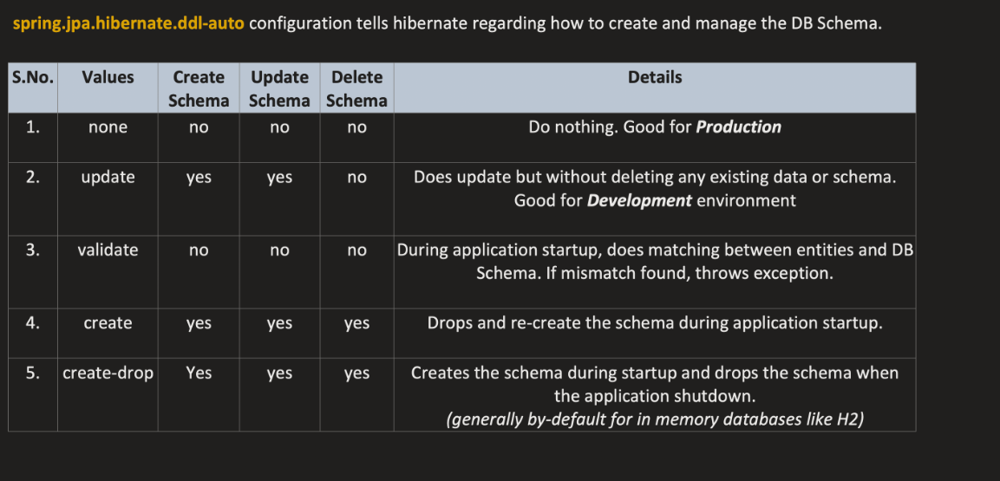

The above image is only a config on schemas and tables, we can update delete and insert a row in all

For Example : spring.hibernate.ddl.auto = none

    It says that we cannot create/ delete/ alter a table, schema but we can insert, delete and update a row

✅ Embedded DB (H2, HSQL, Derby)

    👉 Default = create-drop
        Creates tables on startup
Drops them on shutdown

✅ Real DB (MySQL, PostgreSQL, Oracle, etc.)

    👉 Default = none
    Assumes schema already exists

Does not create/update anything

**_@Table :_**

    @Table is a JPA annotation used to specify which database table your entity maps to.
    It is optional, if not provided it will try to map the class name to your table

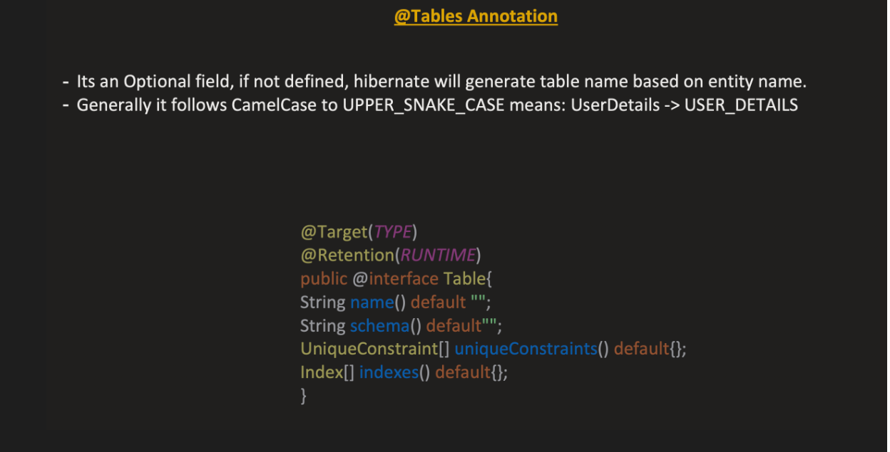

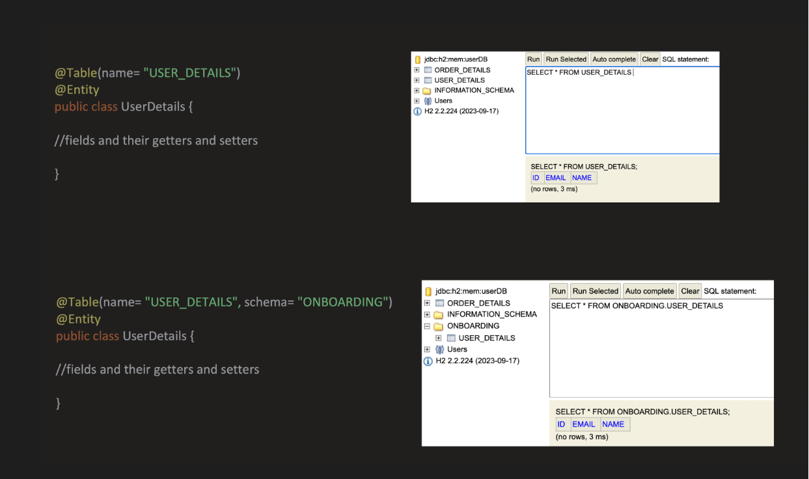

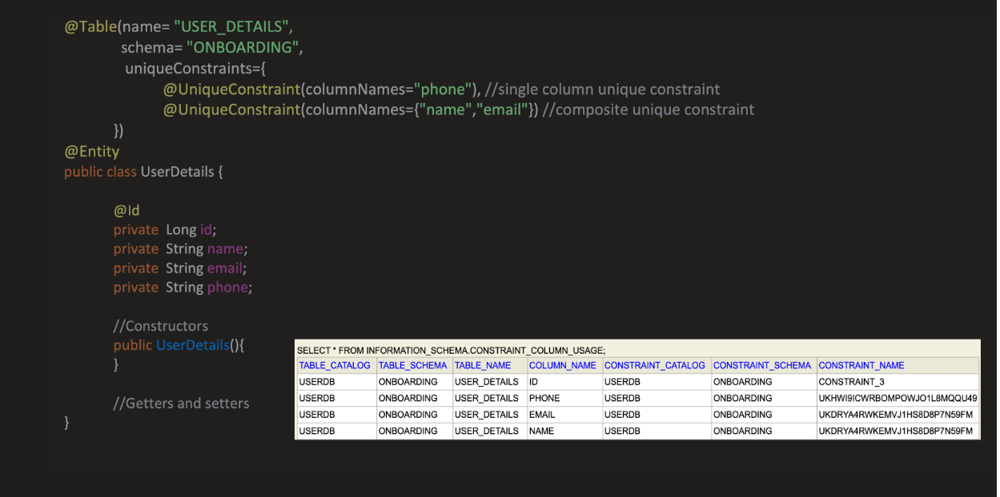

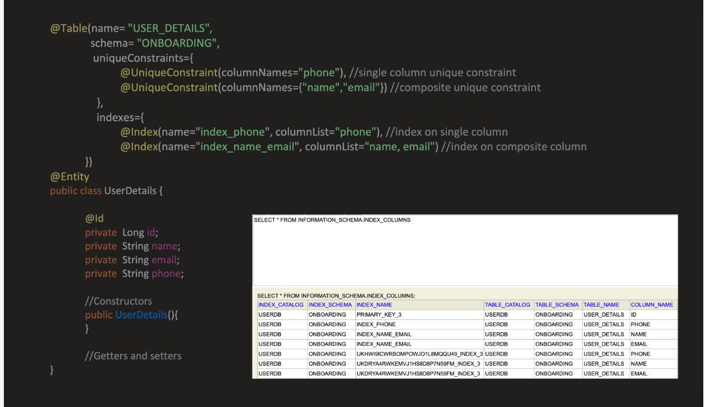

🔹 What happens internally when you create an index?

    Most databases (MySQL, PostgreSQL, Oracle, etc.) use a B-Tree (Balanced Tree) structure for indexes.

🔹 Step 1: Index data structure is created

When you define: @Table(indexes = @Index(name = "idx_email", columnList = "email"))

👉 The database (via Hibernate ORM) creates a separate data structure: Index (B-Tree)

          [m@gmail.com]
         /             \
[a@gmail.com]     [z@gmail.com]

👉 Each node stores:

        Indexed column value (e.g., email)
        Pointer to actual row (row ID)

🔹 Step 2: Data is stored in sorted order

    Unlike a table (which is unordered), index stores values:
    
    a@gmail.com → row 3
    b@gmail.com → row 7
    c@gmail.com → row 1

👉 Always sorted

        🔹 Step 3: Query execution (this is the key part)
        Without index ❌
        SELECT * FROM users WHERE email = 'c@gmail.com';

👉 DB does:

        Check row 1 → no
        Check row 2 → no
        Check row 3 → yes

➡️ Full table scan (O(n))

With index ✅

👉 DB does:

    Go to B-Tree root
    Compare values
    Traverse left/right
    Find match quickly

➡️ O(log n) time

🔹 Step 4: Fetch actual row

Index only stores:

        value
        pointer (row id)

👉 After finding match:

DB goes to actual table

Fetches full row

    🔹 What happens during INSERT?
    INSERT INTO users (email) VALUES ('d@gmail.com');

👉 DB must:

    Insert into table
    Insert into index (B-Tree)

Rebalance tree if needed

        ➡️ This is why:
        ❌ Writes become slower
🔹 What happens during UPDATE?

If indexed column changes: UPDATE users SET email = 'x@gmail.com' WHERE id = 1;

👉 DB does:

    Remove old index entry
    Insert new entry
    Rebalance tree

🔹 What happens during DELETE?
DELETE FROM users WHERE email = 'a@gmail.com';

👉 DB:

    Removes row
    Removes index entry
    Rebalances tree

HOW BTree looks 

        [10 | 20 | 30]
       /      |      \
    <10     10-20    >30

A B-tree is a self-balancing tree data structure used by databases to store and retrieve data efficiently from disk.

Think of it like a sorted, multi-level index (like a book index, but smarter).

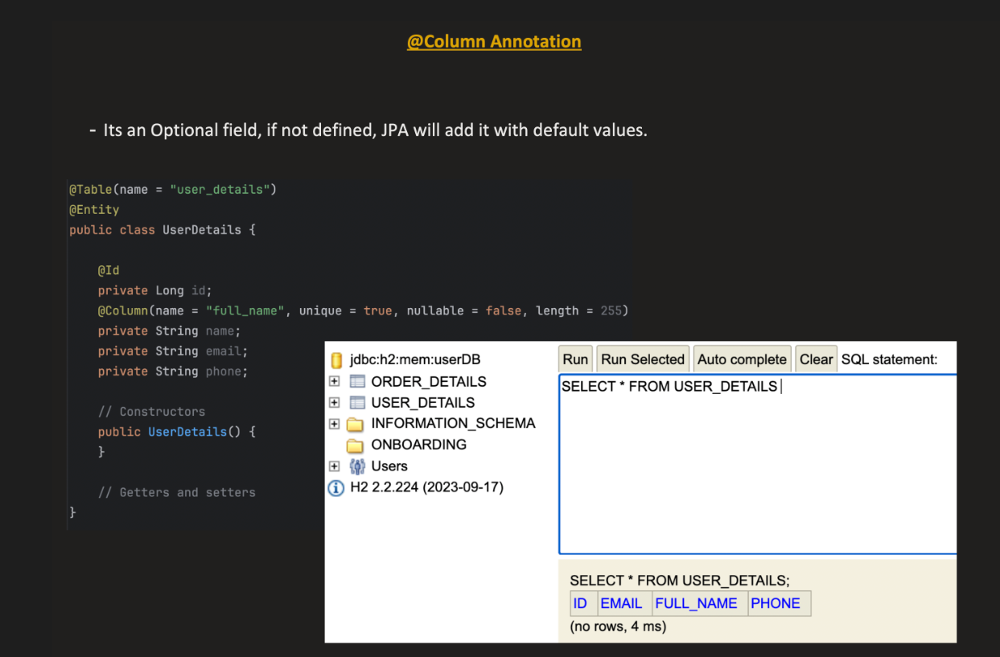

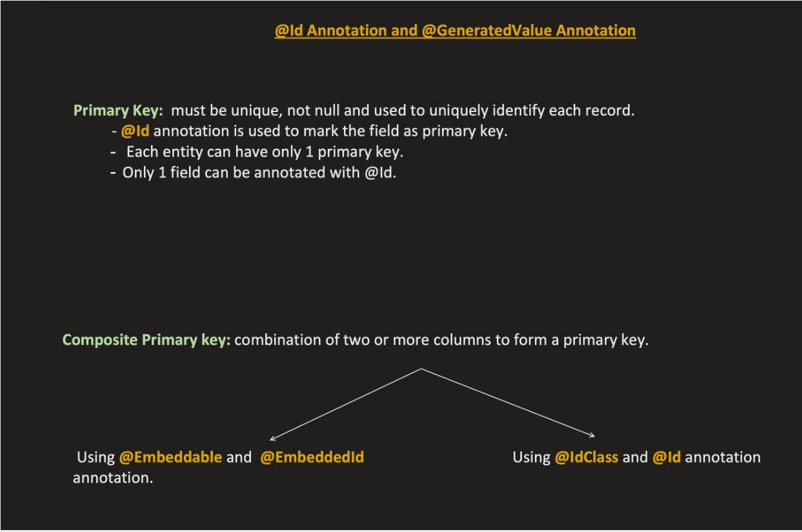

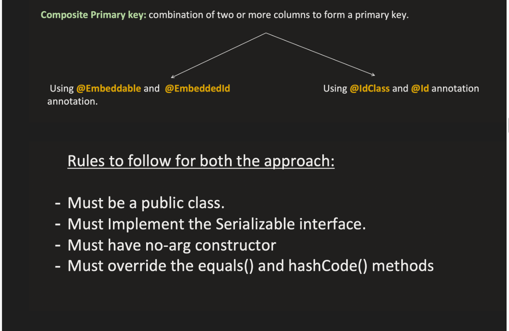

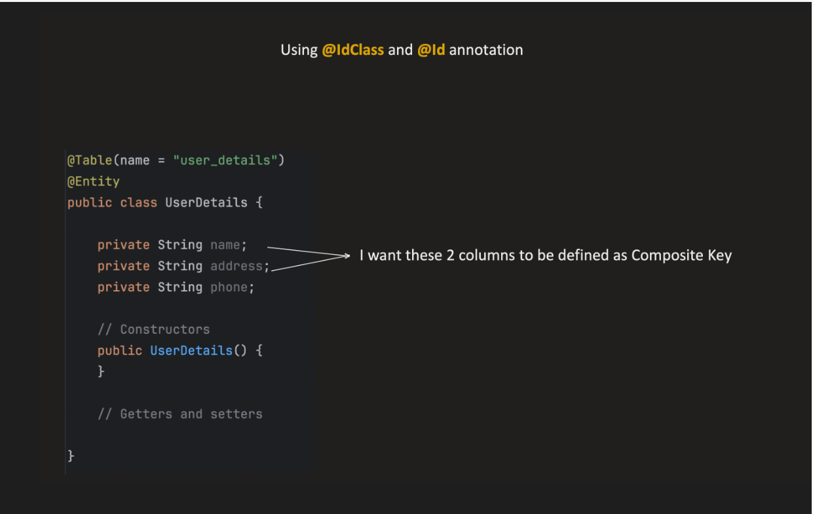

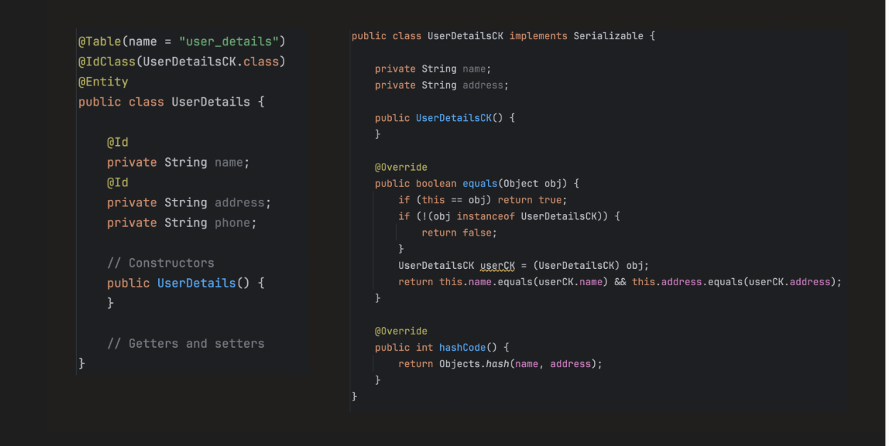

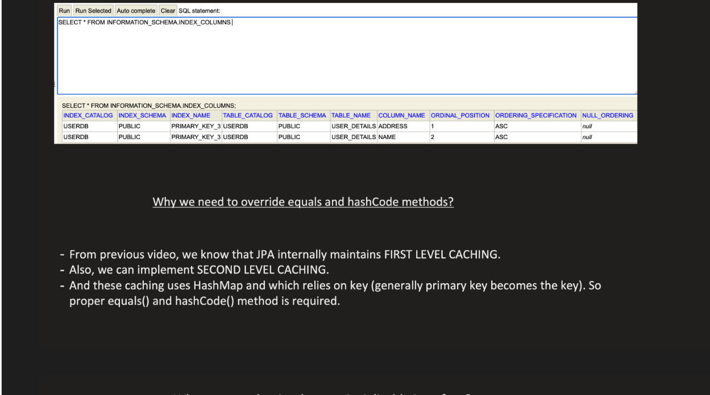

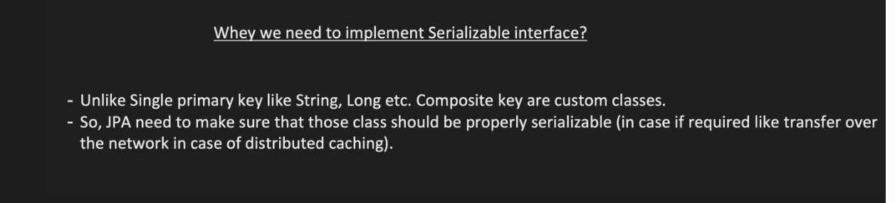

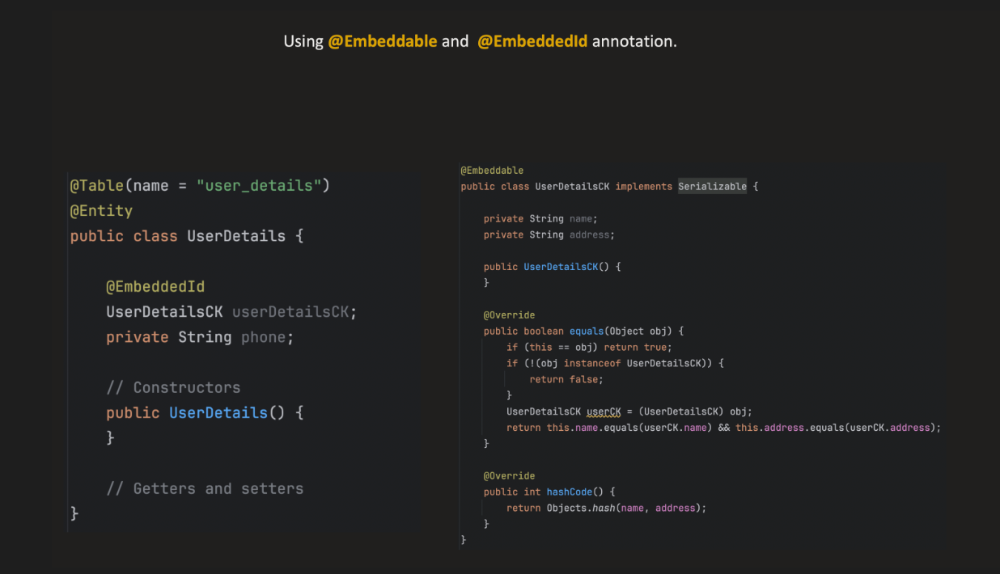

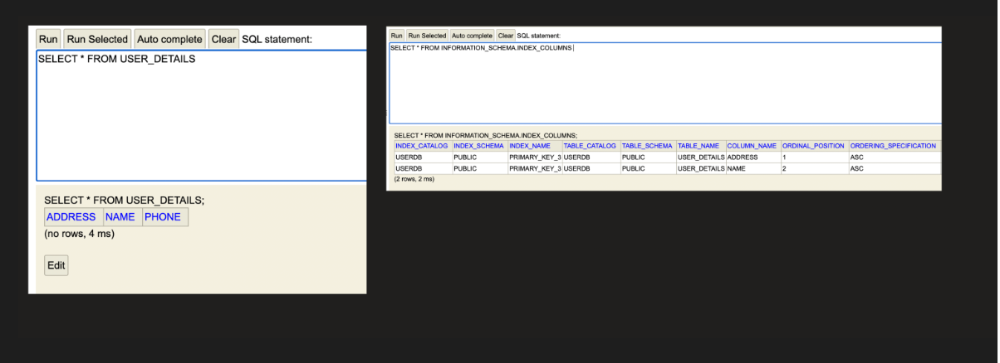

🔹 What is Serializable in Java?

        👉 Serializable is a marker interface in Java that tells the JVM:
        “This object can be converted into a byte stream and saved or transferred.”
        It comes from Java Standard Library.

This serialization in java is diff from HTTp json serialization

👉 Serialization =
Convert object → bytes

👉 Deserialization =
Convert bytes → object

Every obj like String, Integer implements Serializable

When do we need serialization?

👉 Use serialization when you want to:

Convert an object into a form that can be stored or transferred

🔹 1. 💾 Saving object to file

    ObjectOutputStream.writeObject(user);
    👉 Used for:
        Saving app state
        Backup
        Offline storage

🔹 2. 🌐 Sending object over network

    Example:
        RMI
        Socket communication
    Microservices (some protocols)

👉 Object → bytes → sent → reconstructed

🔹 3. ⚡ Caching (very important)

In Hibernate ORM or distributed caches:

    Redis
    EhCache

👉 Objects are:

    Serialized → stored
    Deserialized → retrieved

🔹 4. 🧠 HTTP Session storage

In Spring Boot:

    session.setAttribute("user", user);

👉 If:

    Server restarts OR
    Session replication happens

➡️ Object must be Serializable

🔹 5. 🔁 Distributed systems / clustering

Multiple servers:

    👉 Session/data shared across nodes

➡️ Needs serialization

🔹 6. 📨 Messaging systems

Kafka / RabbitMQ:

    👉 Object → serialized → sent in queue

----------------------------------------------------------------------------------------------

🔴 1. Why Serializable?

    👉 Because Hibernate may need to:

Cache the key
Send it across JVMs
Store it in session

In Hibernate ORM:

    Entity identity → used as key in cache

👉 So it must be: Convertible to bytes
     Portable

🔴 2. Why equals()? (Caches Internally uses hashMap)

    👉 To compare two keys logically

🔹 Problem without equals
OrderId id1 = new OrderId(1, 100);
OrderId id2 = new OrderId(1, 100);

👉 Without equals():

id1 != id2  ❌ (different objects)

👉 But logically:

(1,100) == (1,100) ✅

👉 Hibernate uses this to:

Find entity in persistence context

Match DB rows

🔴 3. Why hashCode()?

👉 Because keys are used in HashMap / HashSet

------------------------------------------------------------------------------------------------------------------------

| Feature             | `@IdClass`             | `@EmbeddedId`            |
| ------------------- | ---------------------- | ------------------------ |
| Field location      | Inside entity          | Inside embeddable class  |
| Object structure    | Flat                   | Nested                   |
| Code readability    | Simple                 | Cleaner for complex keys |
| Reusability         | ❌ Less                 | ✅ More reusable          |
| Mapping duplication | ✅ Yes (fields in both) | ❌ No                     |
| Access              | Direct fields          | Through object           |

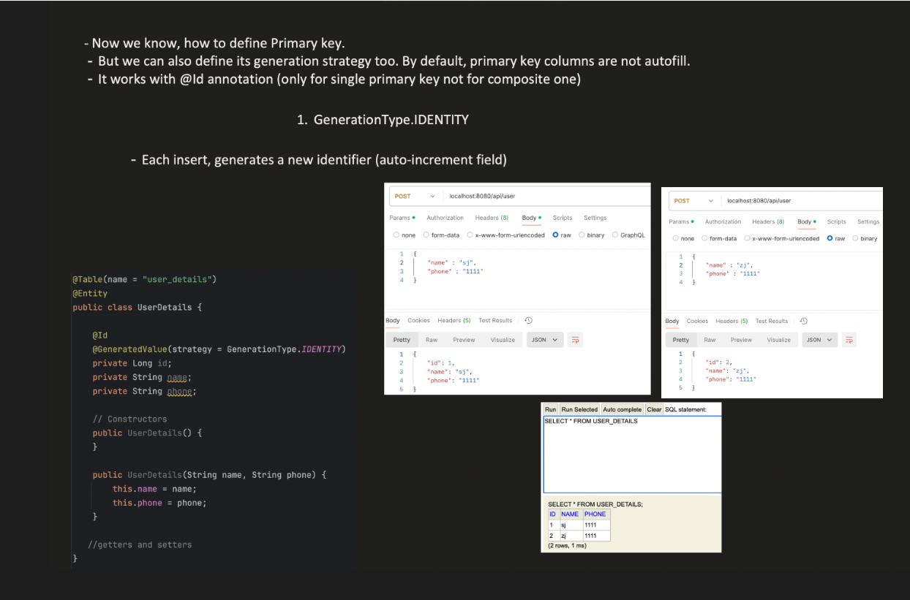

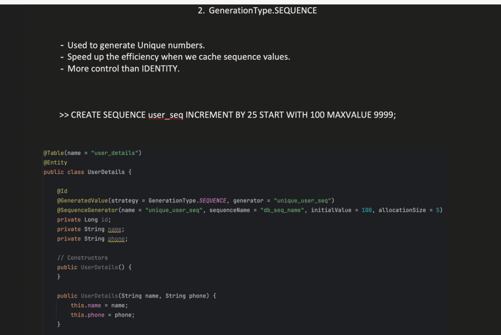

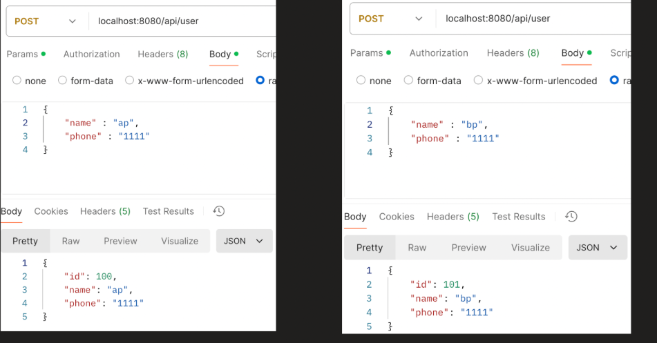

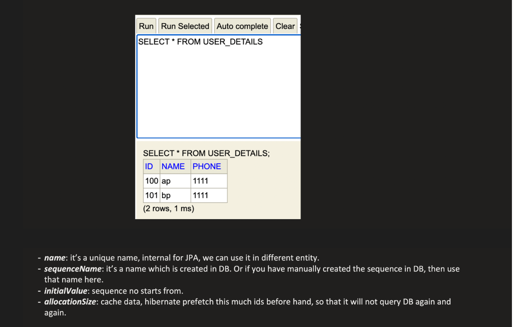

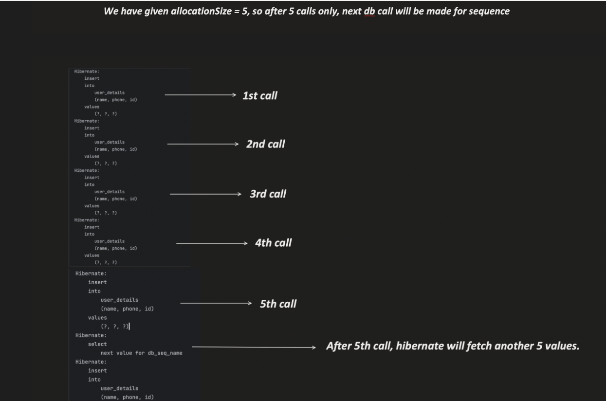

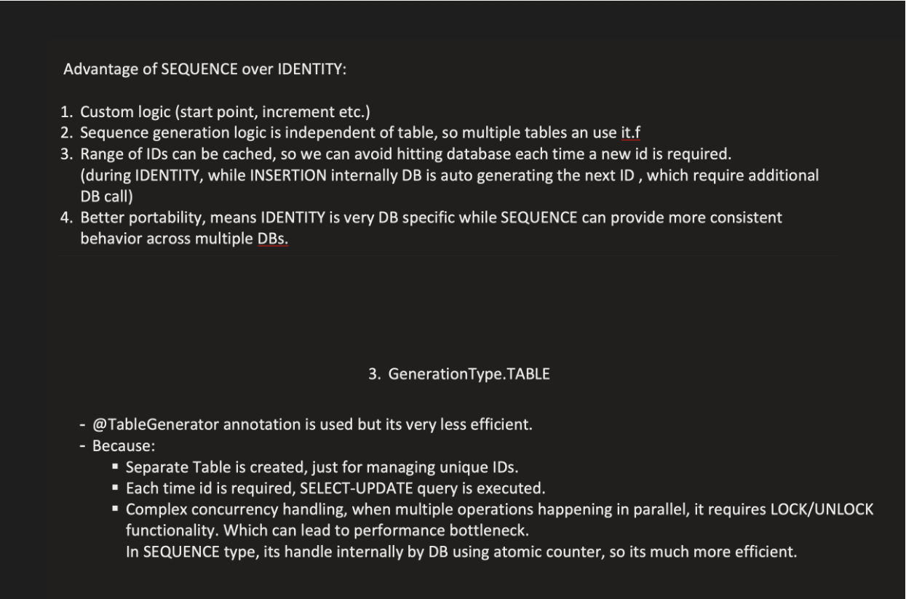

| Strategy                      | How it works                           | DB Support         | Performance            | Advantages                        | Disadvantages                           | When to use              |
| ----------------------------- | -------------------------------------- | ------------------ | ---------------------- | --------------------------------- | --------------------------------------- | ------------------------ |
| `AUTO`                        | Hibernate decides strategy based on DB | All                | Depends                | Easy, no config                   | Unpredictable behavior across DBs       | Quick start, prototypes  |
| `IDENTITY`                    | DB auto-increment column               | MySQL, SQL Server  | ❌ Slower (no batching) | Simple, DB handles ID             | No batch inserts, extra DB calls        | Simple apps, MySQL       |
| `SEQUENCE`                    | Uses DB sequence object                | Oracle, PostgreSQL | ✅ Fast (can batch)     | High performance, scalable        | Not supported in MySQL (older versions) | High-performance systems |
| `TABLE`                       | Uses a separate table to generate IDs  | All                | ❌ Slowest              | Works everywhere                  | Locking, contention, poor performance   | Rarely used              |
| `UUID` *(Hibernate specific)* | Generates UUID in app                  | All                | ✅ Good                 | No DB dependency, globally unique | Large size, index inefficiency          | Distributed systems      |

🔹 1. IDENTITY
@GeneratedValue(strategy = GenerationType.IDENTITY)

👉 Uses:

Auto-increment column inside the SAME table

Example:
CREATE TABLE users (
id INT AUTO_INCREMENT PRIMARY KEY,
name VARCHAR(50)
);

👉 So:

✅ No new table

✅ ID generated by DB automatically

🔹 2. SEQUENCE
@GeneratedValue(strategy = GenerationType.SEQUENCE)

👉 Uses:

Database sequence object (NOT a table)

Example:
CREATE SEQUENCE user_seq;

👉 Then:

SELECT nextval('user_seq');

🔹 Important

👉 Sequence is:

Not a table ❌

A DB object that generates numbers ✅

🔹 3. Only TABLE creates a new table
@GeneratedValue(strategy = GenerationType.TABLE)

👉 This is the ONLY one that creates:

id_generator
-------------
next_id

Table internally uses locks whereas sequence uses atomic counters(not CAS, CAS is jvm specific), identity also uses like sequence only for locks

Fot table and sequence db will generate and give us the next sequence hibernate has to set before inserting
whereas for identity we cant set db sets while inserting

