One To Many Unidirectional :

```java 
@Entity
public class Customer {

    @Id
    @GeneratedValue(strategy = GenerationType.IDENTITY)
    private Long Id;

    private String name;

    @OneToMany
    private List<Products>productsList;

}
```


```java

package com.example.jpa.OneToMany;

import jakarta.persistence.Entity;
import jakarta.persistence.GeneratedValue;
import jakarta.persistence.GenerationType;
import jakarta.persistence.Id;

@Entity
public class Products {

    @Id
    @GeneratedValue(strategy = GenerationType.IDENTITY)
    private Long Id;

    private String productItem;
}

```


In one to many unidirectional when join column is not provided it creates a new table having both foreign keys

in this scenario say 

Without cascade

SCENARIO 1 : 
1. without cascade when we try to save customer

```java
 @PostMapping("/saveCustomer")
    public Customer saveCustomer(@RequestBody Customer customer) {
        return customerRepo.save(customer);
    }

```

Customer customer = 

            {
                "name" : "Loosu",
                "productsList" : [
                {"productItem" : "Soap"},
                {"productItem" : "Shampoo"}
                ]
            }


Here customer has refernce to products but while saving customer though it doesnot have foreign key(new table is present for foreign key)  it checks if the child is persisted or not 
but the child is in transient state only

So it will throw Persistent instance of 'com.example.jpa.OneToMany.Customer' references an unsaved transient instance of 'com.example.jpa.OneToMany.Products' (persist the transient instance before flushing)


But when u save product  like this

                {"productItem" : "Soap"},

Product gets saved but foreign key table will not be updated


SCENARIO 2 : Without cascade , with referencing child objects , we first save chid and then parent

    @PostMapping("/saveCustomer2")
    public Customer saveCustomer2(@RequestBody Customer customer) {
        for(Products product : customer.getProductsList()) {
        productsRepo.save(product);
        }
        return customerRepo.save(customer);
    }


Works perfectly fine first saves products, then saves customer , then creates a relation ship entry in new table


SCENARIO 3:  Without cascade when you try to save customer alone without referencing Product

    {
        "name" : "Loosu"
    }

Customer alone gets saved and no relation ship table entry is created


NOw if we put joinColum in OneToMany instead of creating a new table for relation ship foreig key is created in the many side


```java 
@Entity
public class Customer {

    @Id
    @GeneratedValue(strategy = GenerationType.IDENTITY)
    private Long Id;

    private String name;

    @OneToMany
    @JoinColumn(name = "customer_id" , referencedColumnName = "Id")
    private List<Products>productsList;

}
```

In scenario 1 and 3 same things happen
In scenario 2 same result happens but since instead of table it uses foreign key in many side

1. Saves products first with foreign key as null  and then saves customer  then uses customerId and update it for Products foreign key


WITH CASCADE : 


It will save customer first, then products with foreign key as null then updates the product with customer foreign key
Hibernate sometimes optimizes and directly inserts with FK:

“In unidirectional OneToMany with JoinColumn, Hibernate may require an extra update because the child entity doesn’t own or know the relationship, so FK cannot always be set during insert.”

So this is slightly inefficient so always use bidirectional

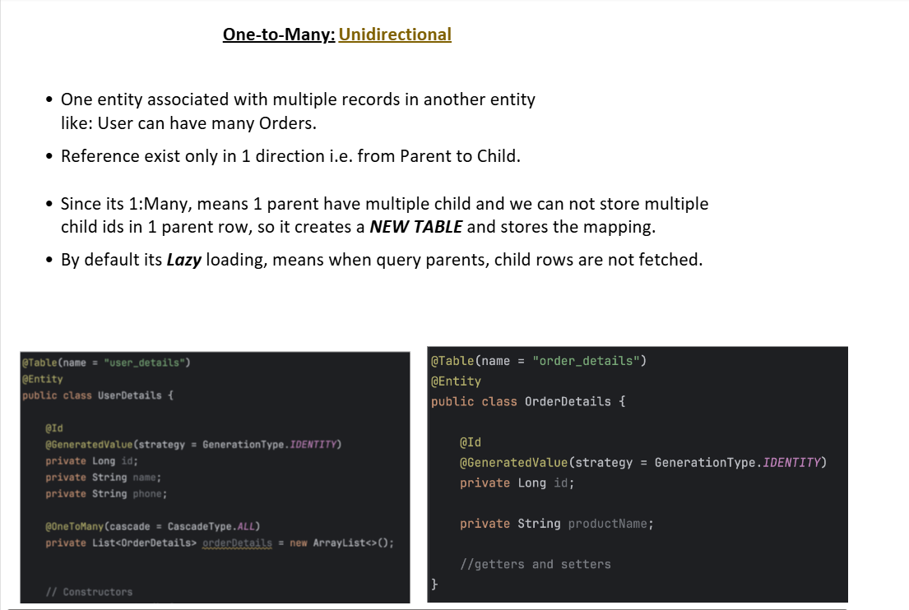

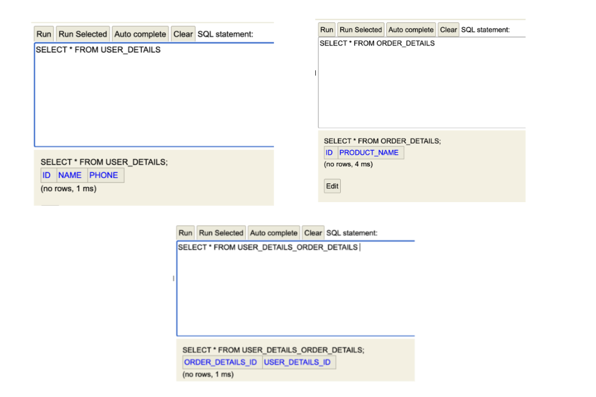

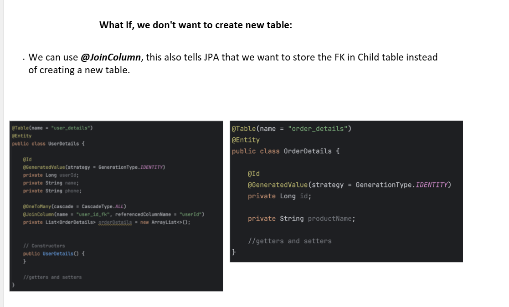

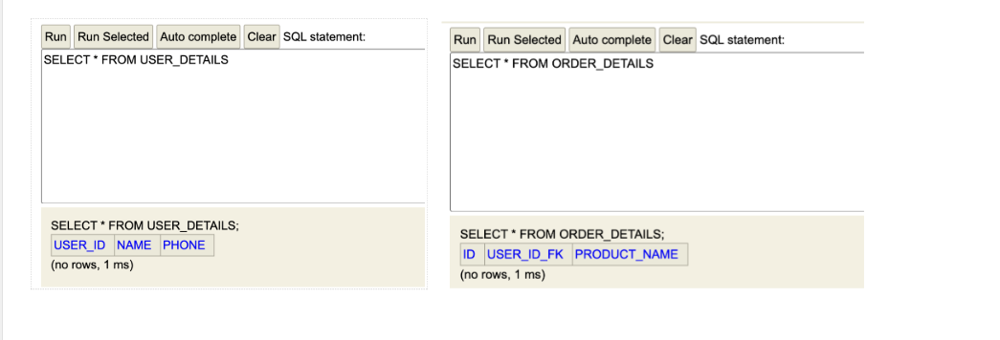

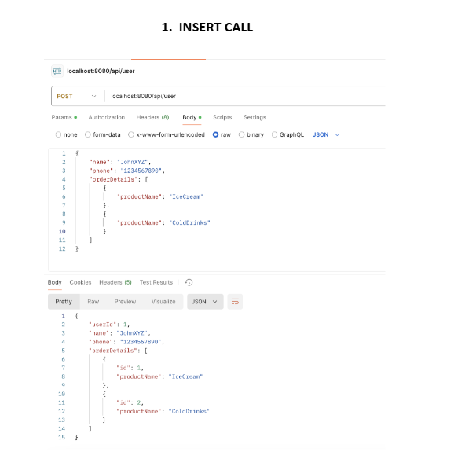

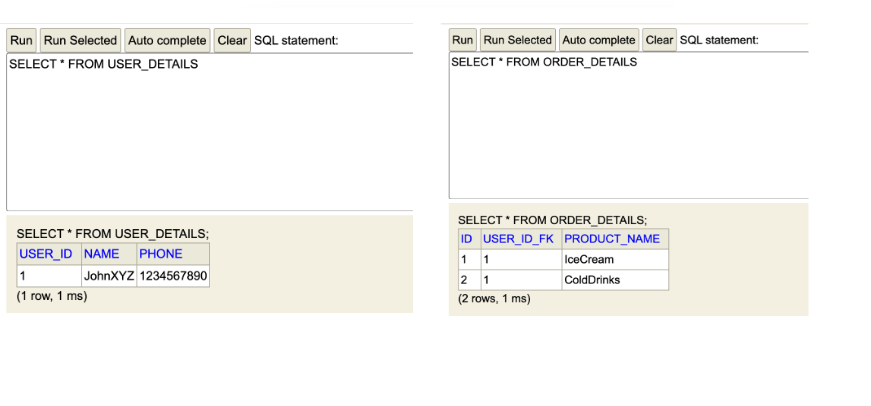

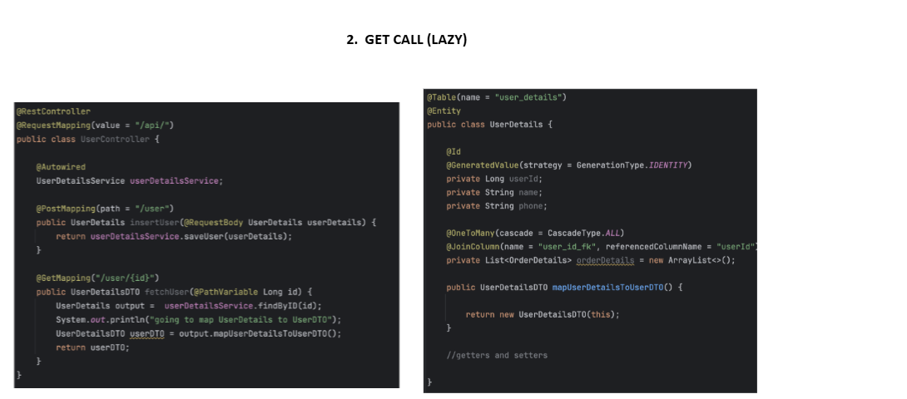

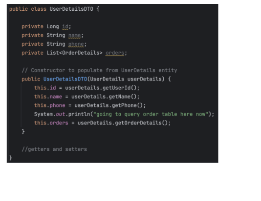

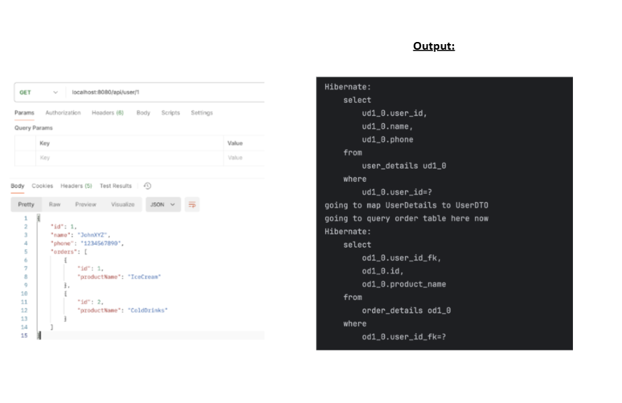

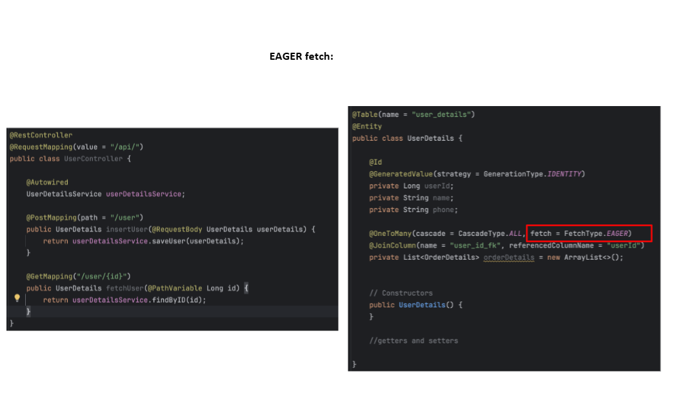

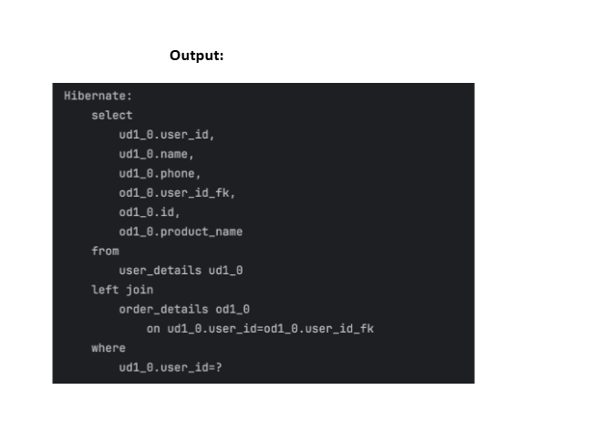

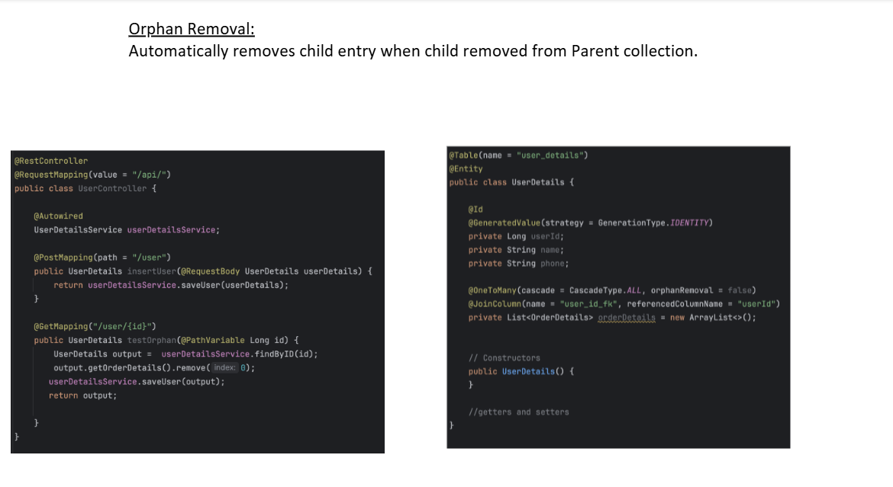

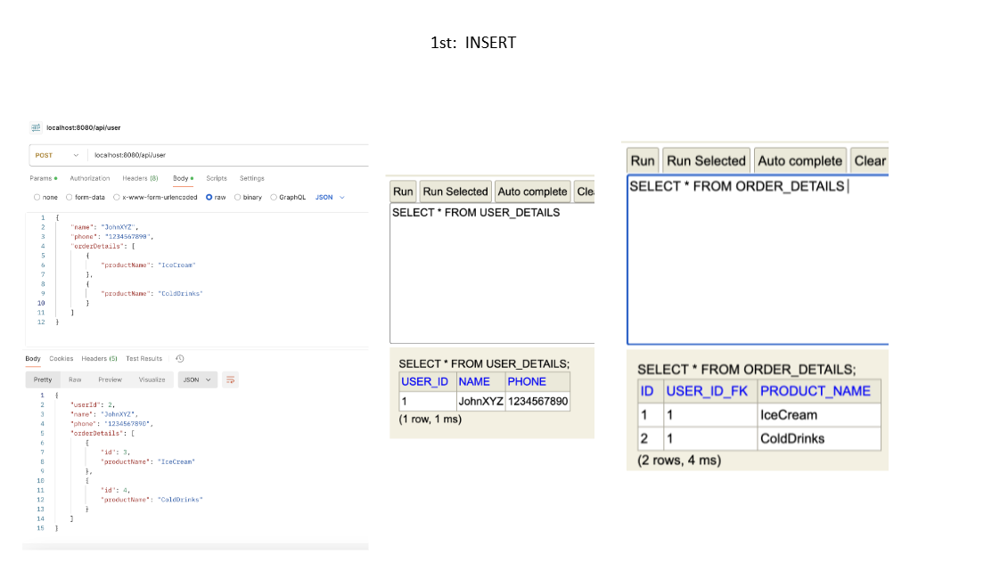

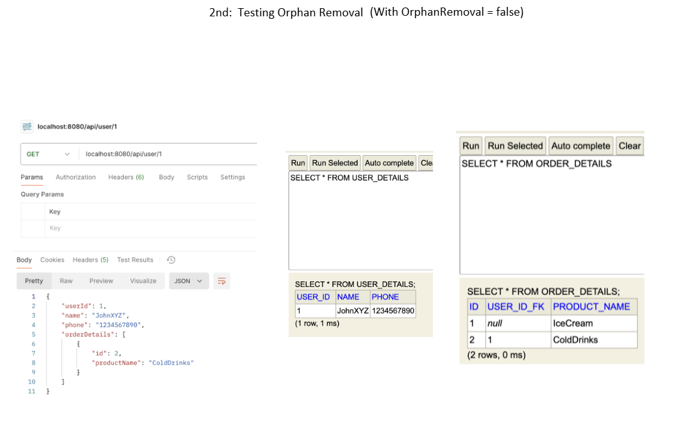

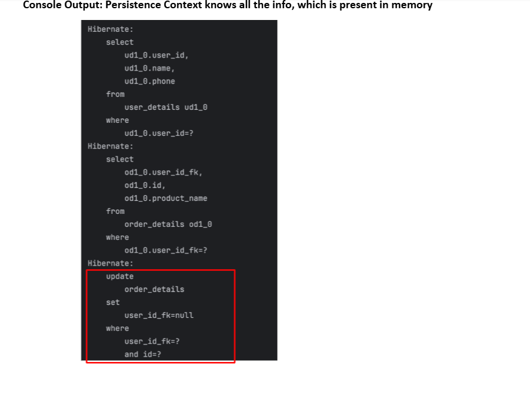

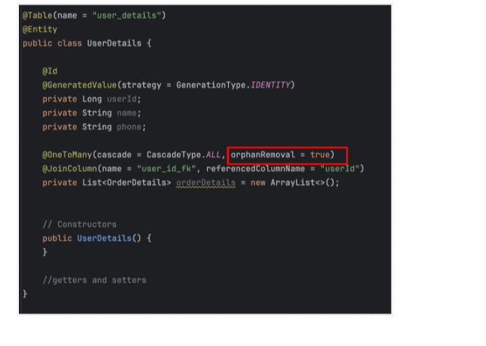

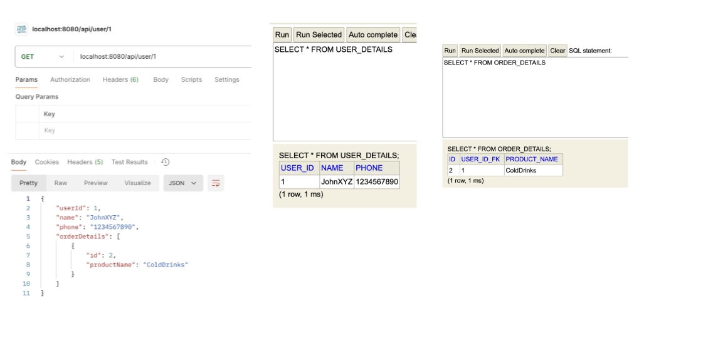

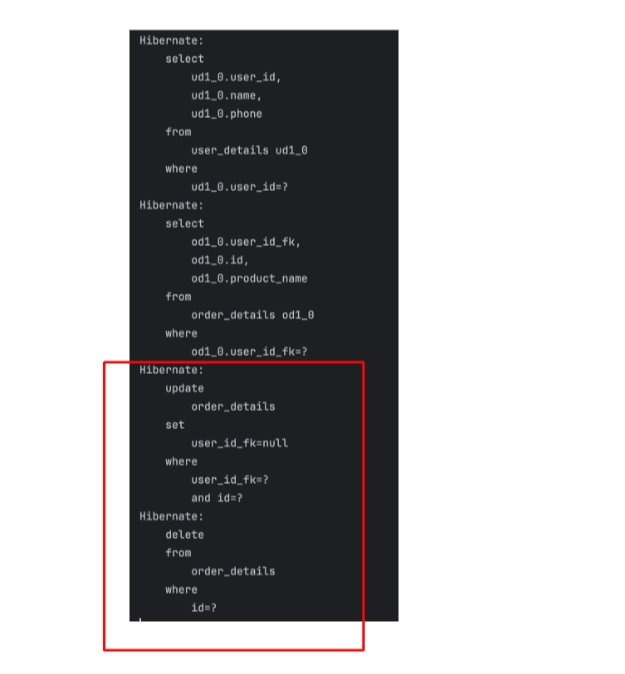

by default, orphanRemoval is false


FETCH TYPE :

@oneToMany is lazy by default
If u fetch customer it will not fetch products 


for Lazy :

When spring.jpa.open-in-view=false

SCENARIO 1 :

    @GetMapping("/findById1")
    public Customer findById1(@RequestParam Long id) {
        return customerRepo.findById(id).orElse(null);
    }

Here since it is lazy loading jpa will only fetch customer and whie serilaizing it will try to do another query to get products
but since spring.jpa.open-in-view=false the session is aready closed and we cant make a query 
so we get Could not write JSON: Cannot lazily initialize collection of role 'com.example.jpa.OneToMany.Customer.productsList' with key '1' (no session)]


SCENARIO 2 : 

    @GetMapping("/findById2")
    @Transactional
    public Customer findById2(@RequestParam Long id) {
        return customerRepo.findById(id).orElse(null);
    }

Same as scenrio 1 will get Cannot lazily initialize collection of role 'com.example.jpa.OneToMany.Customer.productsList' with key '1' (no session)]


SCENARIO 3 : 

    @GetMapping("/findById3")
    public Customer findById3(@RequestParam Long id) {
        Customer customer =  customerRepo.findById(id).orElse(null);
        customer.getProductsList().size();
        return customer;
    }
Same as scenrio 1 will get Cannot lazily initialize collection of role 'com.example.jpa.OneToMany.Customer.productsList' with key '1' (no session)]


SCENARIO 4 :

    @GetMapping("/findById4")
    @Transactional
    public Customer findById4(@RequestParam Long id) {
        Customer customer =  customerRepo.findById(id).orElse(null);
        customer.getProductsList().size();
        return customer;
    }

Since we put transactional session is not closed when we call customer.getProductsList().size(), so hibernate can make a sql query and fetch customer along with products


When spring.jpa.open-in-view=true all 4 scenarios will give correct output since session will be open till serialization happens


🔥 When do you NEED cascade for delete?
🔴 Case 1: FK exists in child (@JoinColumn)
@OneToMany
@JoinColumn(name = "customer_id")
List<Products> productsList;

👉 DB:

Products → customer_id (FK)
❌ If you delete customer WITHOUT cascade
customerRepo.delete(customer);

👉 DB state:

Products still reference customer_id ❌

💥 Result:

ForeignKeyConstraintViolationException
✅ Fix options
✔️ Option 1: Use cascade
@OneToMany(cascade = CascadeType.REMOVE)

👉 Hibernate:

Deletes products
Then deletes customer
✔️ Option 2: Manually delete children
productsRepo.deleteAll(customer.getProductsList());
customerRepo.delete(customer);
🔥 Case 2: Join Table (NO @JoinColumn)
@OneToMany
List<Products> productsList;

👉 DB:

Customer
Products
Customer_Products (join table)
❌ Delete without cascade
customerRepo.delete(customer);

👉 Hibernate:

Deletes join table rows
Deletes customer

✅ Products remain
✅ No exception


-------------------------------------------------------------------------------------------------------------------------------------------------


The N + 1 problem is one of the most common (and most asked) performance issues in Spring Data JPA / Hibernate ORM.

Let’s break it down in a way interviewers expect 👇

🔥 What is N + 1 Problem?

👉 It happens when:

You run 1 query to fetch parent data
Then N additional queries to fetch child data (one per row)
📌 Example

Entities:

class User {
@OneToMany(mappedBy = "user", fetch = FetchType.LAZY)
List<Order> orders;
}
❌ Code
List<User> users = userRepository.findAll();

for (User u : users) {
System.out.println(u.getOrders().size());
}
💥 What happens internally

1 query:

SELECT * FROM users;

Then for each user (N users):

SELECT * FROM orders WHERE user_id = ?;

👉 Total queries = 1 + N

🚨 Why this is BAD
Huge performance hit
Too many DB round trips
Can kill production systems under load
🔍 Why it happens

Because of:
👉 FetchType.LAZY

Orders are not loaded initially
Hibernate loads them on demand (one by one)
🔥 How to identify (interview tip)

Look for:

Loop + lazy field access
Too many SQL logs
✅ Solutions (VERY IMPORTANT)
✅ 1. Fetch Join (Best & most asked)
@Query("SELECT u FROM User u JOIN FETCH u.orders")
List<User> findAllWithOrders();

👉 Loads everything in single query

✅ 2. @EntityGraph
@EntityGraph(attributePaths = {"orders"})
List<User> findAll();

👉 Cleaner, Spring Data way

✅ 3. DTO Projection
SELECT new com.dto.UserDTO(u.name, o.name)
FROM User u JOIN u.orders o

👉 Fetch only required fields

✅ 4. Batch Fetching (Hibernate specific)
hibernate.default_batch_fetch_size=10

👉 Converts N queries into batches

⚠️ What NOT to do
❌ Don’t switch to EAGER blindly
@OneToMany(fetch = FetchType.EAGER)

👉 Causes:

Huge joins
Memory issues
Worse performance sometimes
💡 Interview-Level Explanation

If asked:

👉 “Explain N+1 problem”

You should say:

“It occurs when fetching a list of entities triggers one query for the parent and additional queries per entity for lazy-loaded associations, leading to 1 + N queries. It’s mainly caused by lazy loading and solved using fetch joins, entity graphs, or projections.”

🎯 Real-world example (what impresses interviewer)

“In a list API returning 100 users, accessing a lazy collection can cause 101 queries. Using JOIN FETCH reduces it to 1 query.”

⚠️ Advanced twist they may ask
👉 “Can N+1 happen with EAGER?”

✔ YES

If not using join properly
Hibernate may still fire multiple queries
🧠 One-line memory trick

👉 “Loop + Lazy = N+1 problem”


🔥 What does JOIN do in JPA?

When you write:

@Query("SELECT u FROM User u JOIN u.orders o")
List<User> users;

👉 JOIN means:

“Combine User and Orders tables for filtering/querying”

🧠 Important point

👉 JOIN does NOT load the orders into the User object

This is the part most people miss.

📌 What actually happens

Hibernate runs something like:

SELECT u.*
FROM users u
JOIN orders o ON u.id = o.user_id;

👉 But:

Only User is populated
orders is still LAZY (not loaded)
💥 So what if you access orders?
for (User u : users) {
u.getOrders();  // 💥 triggers extra queries
}

👉 N+1 problem still happens 😬

🔥 Then what is JOIN used for?
✅ 1. Filtering
@Query("SELECT u FROM User u JOIN u.orders o WHERE o.status = 'PAID'")

👉 Meaning:

“Give me users who have paid orders”
✅ 2. Conditions / WHERE clause

You use JOIN to:

filter
apply conditions
combine tables logically

👉 Not for fetching data into entity

🚨 Difference: JOIN vs JOIN FETCH

This is a VERY IMPORTANT interview question

❌ JOIN
SELECT u FROM User u JOIN u.orders o
Used for filtering
Does NOT load orders
Can still cause N+1
✅ JOIN FETCH
SELECT u FROM User u JOIN FETCH u.orders

👉 Meaning:

“Load users AND their orders together”

Orders are loaded immediately
No extra queries
Solves N+1


🔥 What @EntityGraph does (simple idea)

👉 @EntityGraph tells JPA:

“Even if this relation is LAZY, fetch it now in this query”
🔍 Internally what it does

Under the hood (via Hibernate ORM):

👉 It behaves similar to:

SELECT u FROM User u JOIN FETCH u.orders

| Relationship  | Default Fetch Type |
| ------------- | ------------------ |
| `@ManyToOne`  | EAGER              |
| `@OneToOne`   | EAGER              |
| `@OneToMany`  | LAZY               |
| `@ManyToMany` | LAZY               |
