DERIVED QUERY:

    ---> A derived query is a query which is automatically derived by JPA from method names in our JPARepo interface
    A derived query is created just by defining a method like:
    
    List<User> findByName(String name);
    
    👉 Spring Data JPA derives the query from the method name.
    
    Equivalent JPQL:
    
        SELECT u FROM User u WHERE u.name = :name


Example : findDistinctTop3ByNameOrderByAgeDesc()


1. PartTree (🔥 Most Important)

👉 Entry point for parsing method names

    new PartTree("findDistinctTop3ByNameOrderByAgeDesc", User.class);

PartTree splits it into Subject, Predica

✅ 1. SUBJECT
findDistinctTop3

PartTree extracts:

isDistinct = true
maxResults = 3
queryType = SELECT


| Prefix                | Meaning      |
| --------------------- | ------------ |
| `find`, `read`, `get` | SELECT       |
| `count`               | COUNT query  |
| `exists`              | EXISTS query |
| `delete`, `remove`    | DELETE query |


✅ 2. PREDICATE
Name

👉 Now predicate is further split into Parts

Creates:

Part(property="name", type=SIMPLE_PROPERTY)


| Keyword        | Enum            |
| -------------- | --------------- |
| `Is`, `Equals` | SIMPLE_PROPERTY |
| `Between`      | BETWEEN         |
| `LessThan`     | LESS_THAN       |
| `GreaterThan`  | GREATER_THAN    |
| `Like`         | LIKE            |
| `Containing`   | CONTAINING      |
| `StartingWith` | STARTING_WITH   |
| `EndingWith`   | ENDING_WITH     |
| `In`           | IN              |
| `True`         | TRUE            |
| `False`        | FALSE           |
| `IsNull`       | IS_NULL         |
| `IsNotNull`    | IS_NOT_NULL     |


✅ 3. ORDER BY
OrderByAgeDesc

Stored as:

Sort → age DESC

PartTree
Parses method name
Splits into subject + predicate
Part
Represents each condition (name, age, etc.)


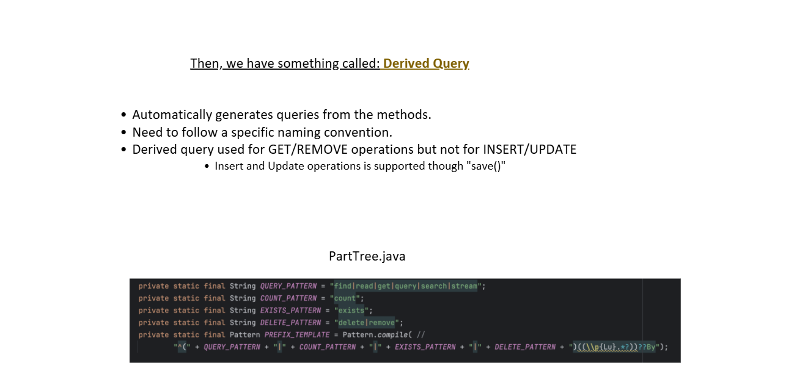

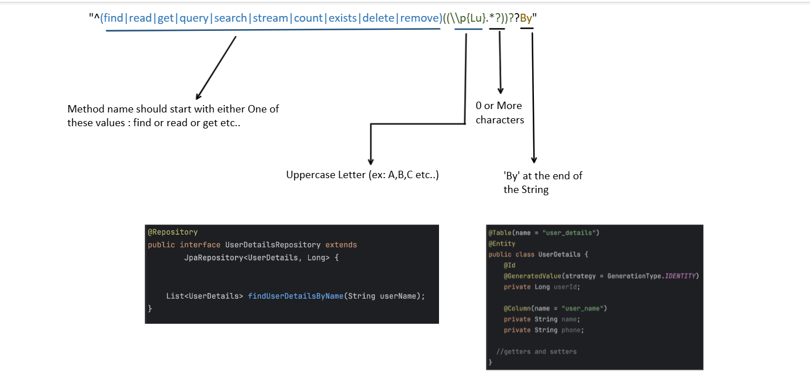

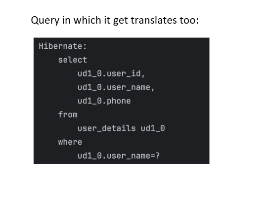

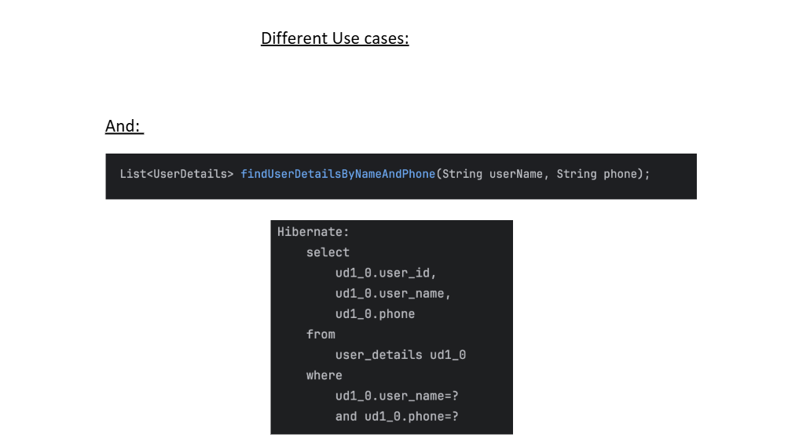

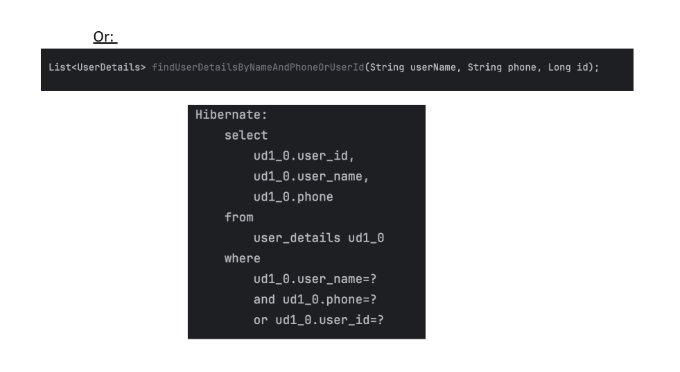


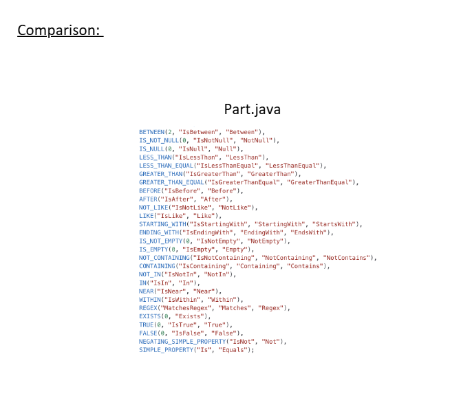

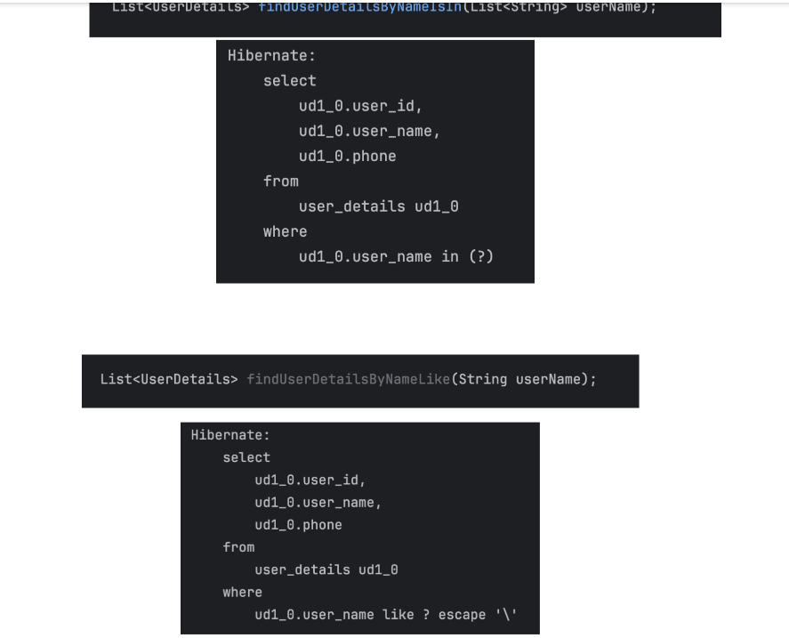

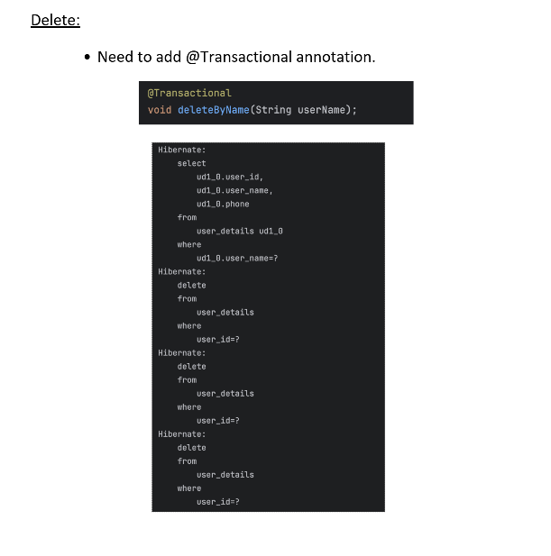


👉 Spring Data JPA generates JPQL (HQL), NOT SQL directly for derived queries
👉 Then Hibernate converts JPQL → SQL


PAGINATION AND SORTING: 


# 🧩 1️⃣ `Pageable` — The _input_ (what page you want)

`Pageable` is just an **interface** that defines:

    - Which page to fetch
      - How many records per page
      - How to sort them


It does **not** contain data — it’s just a _description_ of the page request.
**Methods in `Pageable`:**

`int getPageNumber();   // which page (0-based)
 int getPageSize();     // how many records per page 
 Sort getSort();        // sorting info`

---

# 🧩 2️⃣ `PageRequest` — The _implementation_ of `Pageable`

    `PageRequest` is a **class** that implements `Pageable`.
    You usually create it using its static factory methods:

### Example:

`Pageable pageable = PageRequest.of(0, 10);`

✅ Meaning:  
Fetch **page 0** (first page), with **10 elements per page**.

You can also add sorting:

`Pageable pageable = PageRequest.of(1, 5, Sort.by("name").descending());`

✅ Meaning:  
Fetch **page 1** (second page), 5 records per page, sorted by `name` descending.


# 🧩 5️⃣ `Page<T>` — The _output result_

`Page<T>` is a **container** for:

- The actual content (`List<T>`)

- Metadata about pagination


### Example usage:

```
Page<User> page = userRepository.findByStatus("ACTIVE", pageable);

List<User> users = page.getContent();          // actual results
int totalPages = page.getTotalPages();         // total number of pages
long totalElements = page.getTotalElements();  // total count
int pageNumber = page.getNumber();             // current page
boolean hasNext = page.hasNext();              // more pages?

```

When you pass:

    PageRequest.of(page, size)

It converts to:

    LIMIT size OFFSET (page * size)

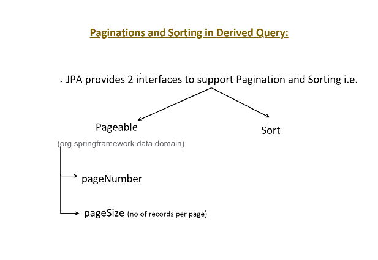

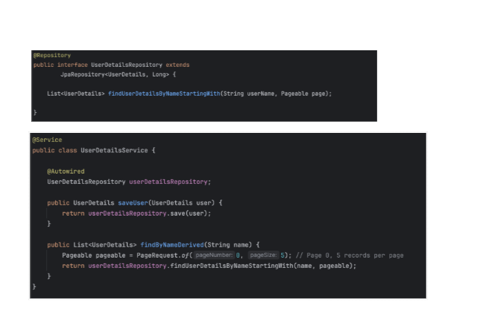

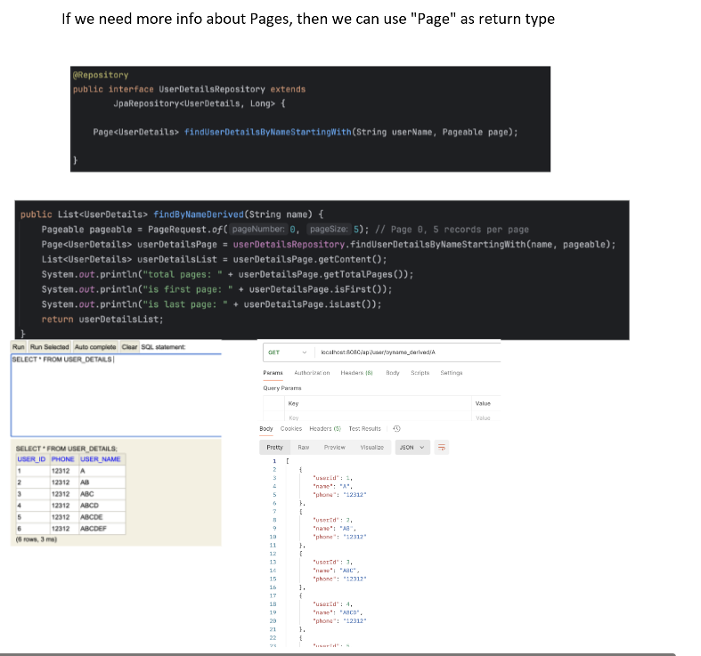

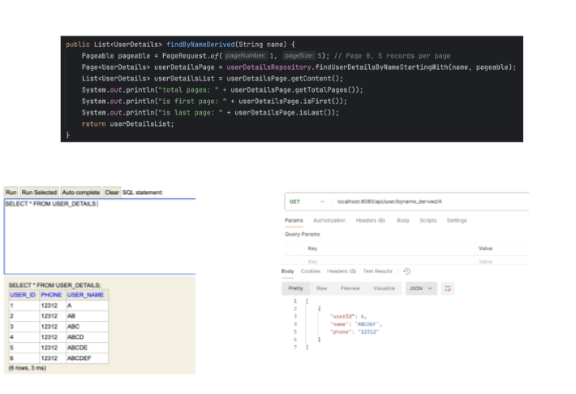

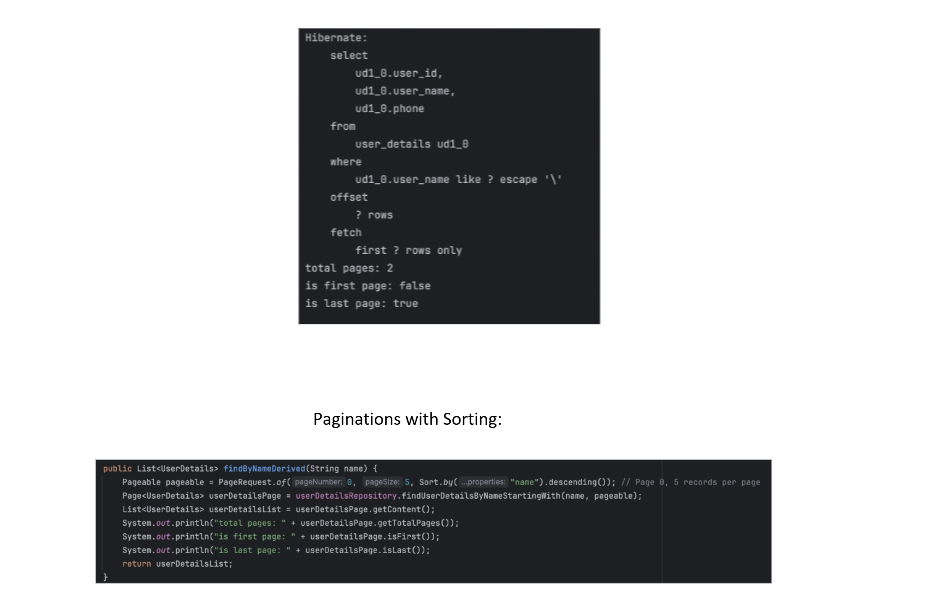

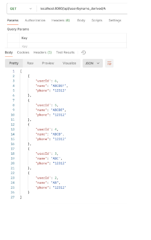

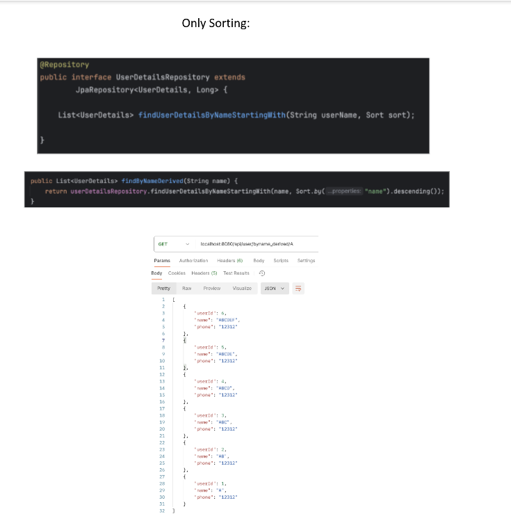

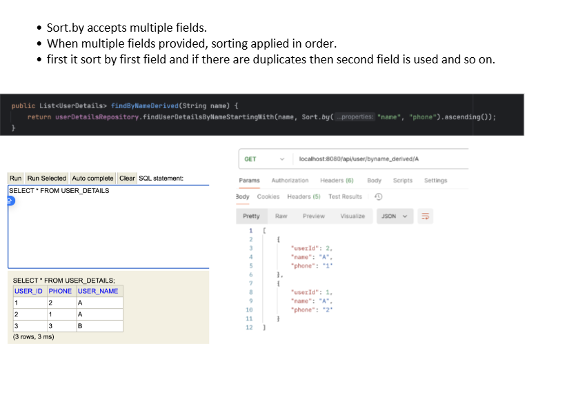

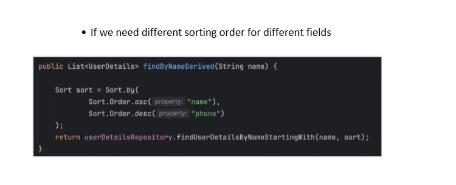


🧠 What is OFFSET?

👉 OFFSET tells the database how many rows to skip before starting to return results.

🔥 Simple Definition
OFFSET = number of records to SKIP
📊 Example
SELECT * FROM user
LIMIT 5 OFFSET 0;

👉 Means:

Skip 0 rows
Return next 5 rows
SELECT * FROM user
LIMIT 5 OFFSET 5;

👉 Means:

Skip first 5 rows
Return next 5 rows

| Return Type | Meaning                            |
| ----------- | ---------------------------------- |
| `Page<T>`   | full pagination (count + data)     |
| `Slice<T>`  | only next page info (faster)       |
| `List<T>`   | just data (no pagination metadata) |

Slice is a lightweight version of pagination
It gives you:

✔ Current page data
✔ Whether next page exists

❌ But NOT total count


JPQL :


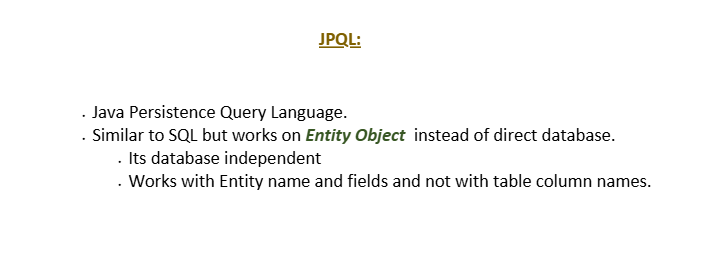

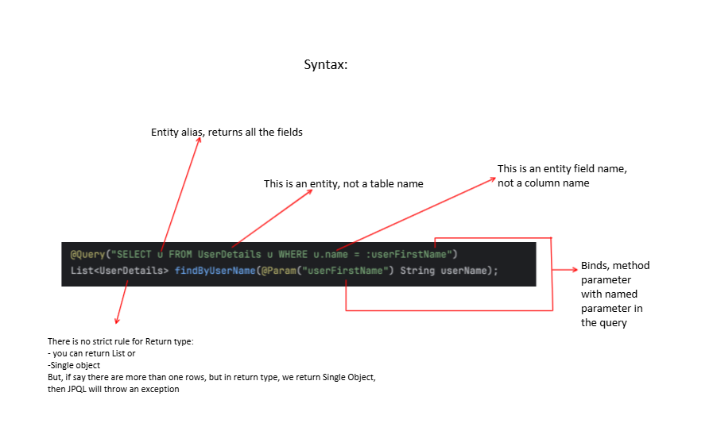

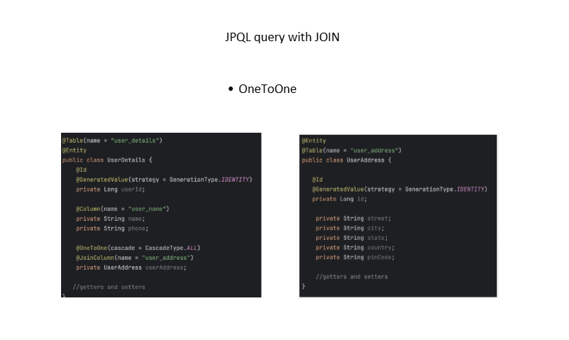

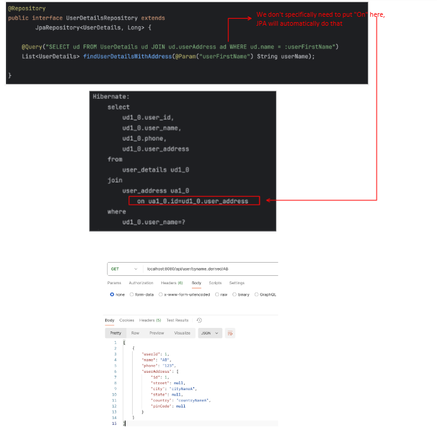

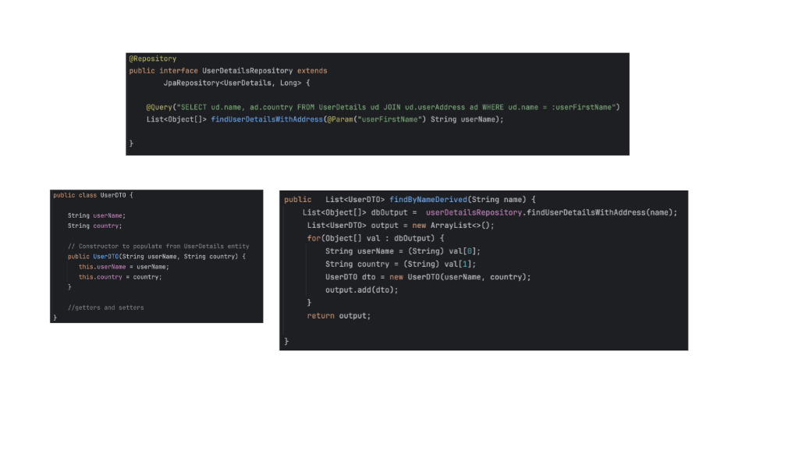

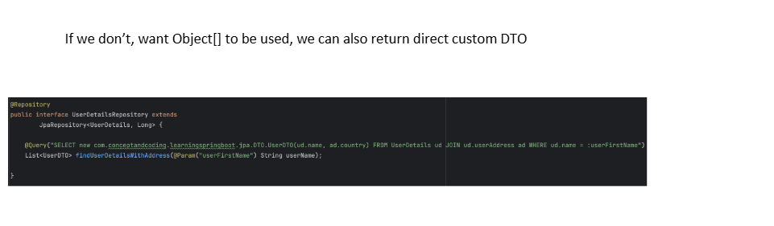

----------------------------------------------------------------------------------------------------------------------------------------------

For JPL queries also proxy directly calls enity manager.createquery("jpqlquery")


--------------------------------------------------------------------------------------------------------------------------------------


## ⚙️ How Do Derived Query They Work Internally?

Let’s break it down into **4 phases** to understand the internals clearly:

---

### **1️⃣ Repository Interface Parsing**

When the application starts (Spring context initialization), Spring scans your repository interfaces — like `UserRepository`.

Spring Data detects all methods that:

- Aren’t standard CRUD ones (`save`, `findAll`, etc.), and

- Don’t have an explicit `@Query` annotation.


These methods are assumed to be **query derivation methods**.

---

### **2️⃣ Query Name Parsing**

Spring uses a class called **`PartTree`** (from `org.springframework.data.repository.query.parser`) to **parse the method name**.

For example:

`findByEmailAndAgeGreaterThan`

gets broken into parts:

| Segment | Keyword | Property | Operator |  
|----------|----------|-----------|  
| `Email` | `By` | `email` | `=` |  
| `AndAgeGreaterThan` | `And` | `age` | `>` |

The `PartTree` parser builds an **abstract syntax tree (AST)** representing these parts.

---

### **3️⃣ Query Creation**

Once parsed, Spring creates a `QueryMethod` object (from `org.springframework.data.repository.query`).

Then, depending on the repository type (JPA, Mongo, etc.), it delegates to a **query builder** — for JPA, that’s handled by:

- `JpaQueryLookupStrategy`

- `PartTreeJpaQuery`


These internally use **JPA Criteria API** to dynamically construct a `javax.persistence.criteria.CriteriaQuery` matching your derived conditions.

So for example:

`findByEmailAndAgeGreaterThan(String email, int age)`

turns into something equivalent to:

```
CriteriaBuilder cb = entityManager.getCriteriaBuilder();
CriteriaQuery<User> query = cb.createQuery(User.class);
Root<User> root = query.from(User.class);

Predicate emailPredicate = cb.equal(root.get("email"), email);
Predicate agePredicate = cb.greaterThan(root.get("age"), age);
query.where(cb.and(emailPredicate, agePredicate));

return entityManager.createQuery(query).getResultList();

```

That’s what **Spring JPA builds for you internally**.

---

### **4️⃣ Query Execution**

When you call the method, e.g.:

`userRepository.findByEmailAndAgeGreaterThan("a@b.com", 25);`

Spring executes the dynamically created query through the **EntityManager**:

- It binds the parameters in order,

- Executes it on the database,

- Maps the result set back into your entity class.


---

## 🧠 Bonus: Derived Query Keywords

Spring supports a huge set of keywords to derive conditions. Examples:

|Keyword|Operator|
|---|---|
|`Is`, `Equals`|`=`|
|`Between`|`BETWEEN ? AND ?`|
|`LessThan`, `GreaterThan`|`<`, `>`|
|`Like`, `Containing`|`LIKE %?%`|
|`StartingWith`, `EndingWith`|`LIKE ?%`, `LIKE %?`|
|`IsNull`, `IsNotNull`|`IS NULL`, `IS NOT NULL`|
|`In`, `NotIn`|`IN (...)`, `NOT IN (...)`|
|`OrderBy`|Sort results|
|`IgnoreCase`|`LOWER(column)` used for comparison|

---

## 🧩 Summary

|Step|Internal Component|Purpose|
|---|---|---|
|1️⃣|`RepositoryFactoryBean`|Scans and instantiates repositories|
|2️⃣|`PartTree`|Parses method names into parts|
|3️⃣|`PartTreeJpaQuery`|Builds JPQL dynamically|
|4️⃣|`EntityManager`|Executes the query on the DB|

---

## 🪄 Example Flow (Visualization)

Method:

`findByFirstNameAndAgeLessThan("John", 30)`

1. Spring detects repository method.

2. `PartTree` parses → `firstName = ? AND age < ?`

3. `PartTreeJpaQuery` builds Criteria query.

4. `EntityManager` executes:

   `SELECT * FROM user WHERE first_name = 'John' AND age < 30;`

1. Results mapped back to `User`.

------------------------------------------------------------------------------------------


## ⚙️ 2️⃣ What happens at **startup** (Repository creation phase)

When the app starts and Spring scans your repo:

`interface UserRepository extends JpaRepository<User, Long> {     User findByEmail(String email); }`

👉 Spring’s `JpaRepositoryFactory` detects `findByEmail`  
and uses a component called `QueryLookupStrategy`.

---

### 🧠 Step-by-step startup flow:

1. **Spring scans** the interface.

2. It finds methods not implemented in `SimpleJpaRepository` (like `findByEmail`).

3. For each such method, it uses `QueryLookupStrategy` to build a `RepositoryQuery` object.


Depending on your configuration (`create`, `use-declared-query`, or `create-if-not-found`):

- It **tries to find a `@Query` annotation**.

- If not found, it **derives a JPQL query** from the method name.


Example:

`findByEmail(String email) ↓ "select u from User u where u.email = ?1"`

4. This JPQL is wrapped inside a `PartTreeJpaQuery` or `SimpleJpaQuery` instance.

5. These `RepositoryQuery` objects are stored in a **map** inside the proxy’s metadata.


So yes — the query is **parsed and prepared once at startup**, not on every call.

---

## ⚡ 3️⃣ What happens at **runtime** (When you call the derived method)

Now, when you actually do:

`userRepository.findByEmail("john@gmail.com");`

Here’s the exact flow 👇

---

### 🔹 Step 1: Proxy intercepts the method

Spring’s JDK proxy or CGLIB intercepts the call.

It checks:

- “Is this a CRUD method implemented by `SimpleJpaRepository`?”  
  → Then delegate to the target object.

- “Is this a derived query method?”  
  → Then execute using the stored `RepositoryQuery`.


Since `findByEmail` is derived, the **proxy handles it itself**.

---

### 🔹 Step 2: Proxy fetches the prebuilt query metadata

The proxy finds the corresponding `RepositoryQuery` object built during startup (for `findByEmail`).

---

### 🔹 Step 3: Query execution (via `EntityManager`)

The `RepositoryQuery` object executes the query like this:

`Query query = entityManager.createQuery("select u from User u where u.email = ?1"); query.setParameter(1, "john@gmail.com"); return query.getSingleResult();`

That’s it. ✅  
So the **proxy directly uses the `EntityManager`** for execution — it does **not** go through `SimpleJpaRepository`.

---

### 🔹 Step 4: Result is returned to caller

The result (a `User` entity) is returned to the proxy, which passes it back to your code.

---

## 🧠 4️⃣ Key Difference from `save()`

|Aspect|`save()`|`findByEmail()`|
|---|---|---|
|Implemented in|`SimpleJpaRepository`|Not implemented|
|Who executes it|Proxy → SimpleJpaRepository|Proxy only|
|At startup|Just registers CRUD|Builds a `RepositoryQuery` via parsing|
|At runtime|Delegates to `SimpleJpaRepository.save()`|Uses prebuilt JPQL & executes via `EntityManager.createQuery()`|
|Query creation|None (fixed logic)|Derived dynamically from method name|
