CIRCUIT BREAKER : 

A Circuit Breaker is a design pattern used in microservices (and distributed systems) to prevent cascading failures when one service is failing or slow.
that is a failure in service B doesnot propogate to ServiceA

⚙️ In Microservices

Imagine:

Service A → calls → Service B

Now if Service B is down or slow, and Service A keeps calling:

    Threads get blocked ⛔
    CPU/memory usage increases 📈
    Eventually Service A also crashes 💥

This is called cascading failure

# 1️⃣ **Avoiding Cascading Failures**

Imagine:

`Service A → Service B → Database`

If **Service B becomes slow** (latency spike), but not fully down:
    
    - Service A keeps sending requests
      - Requests wait and hang
      - Threads get blocked
      - Thread pool fills
      - Service A also becomes slow
      - Soon Service A crashes

- System-wide outage ❌

🛑 Circuit breaker prevents this.

When B is failing, A **immediately stops calling B** instead of waiting for timeouts.

---

# 2️⃣ **Preventing Thread/Resource Exhaustion**

If a service keeps calling a slow or down dependency:
    
    - Worker threads hang on I/O
      - Memory increases
      - CPU increases
      - Request queue builds
      - Too many timeout retries
      - Your service becomes **unresponsive**

Circuit breaker stops calling the failing dependency and frees threads quickly.

---

# 3️⃣ **Fail Fast → Faster Recovery**

If a dependency is down:

Without CB:

`client calls → 5 sec timeout → thread stuck → retries → meltdown`

With CB:

`CB OPEN → reject call instantly → threads free → system stable`

Fail-fast behavior helps your system serve other traffic normally.

---

# 4️⃣ **Reducing Load on a Dying or Recovering Service**

If a service is:

    - Restarting
      - Under heavy load
      - In GC pause
      - Cold starting
      - Just got deployed

It may fail a lot of requests temporarily.

Circuit breaker stops hammering it.

This **gives it time to recover**.

---

# 5️⃣ **Controlled Recovery (Half Open State)**

When a dependency is coming back:
    
    - Circuit breaker **allows only limited test calls**
      - If those succeed → closes
      - If fail → stays open

This prevents immediate overload after recovery.

---

# 6️⃣ **Better User Experience with Fallbacks**

Instead of showing crashes like:

`500: service unavailable`

You can show:
    
    - Cached data
      - Default values
      - “Please try again later”
      - Predefined response

This improves user experience drastically.

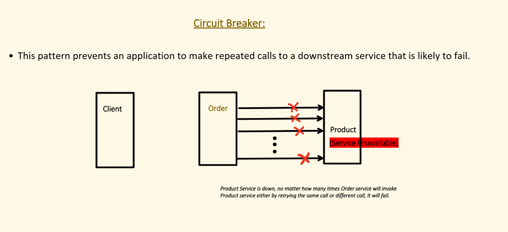

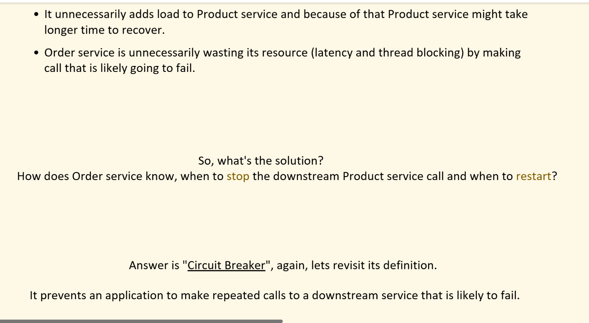

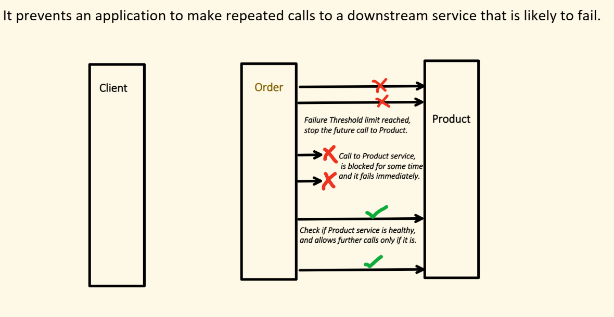

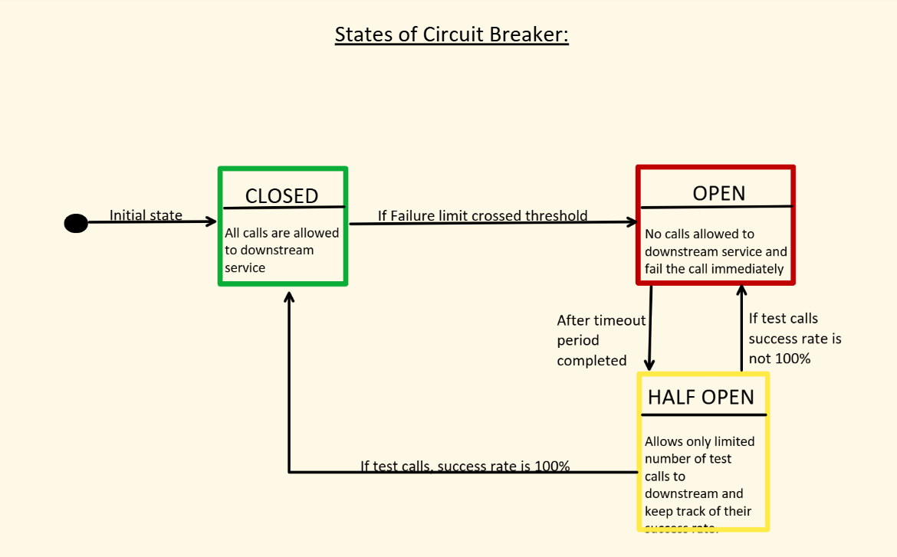

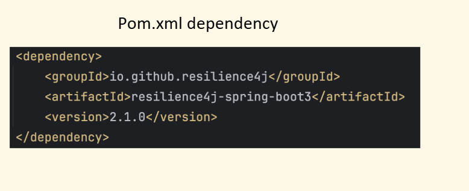

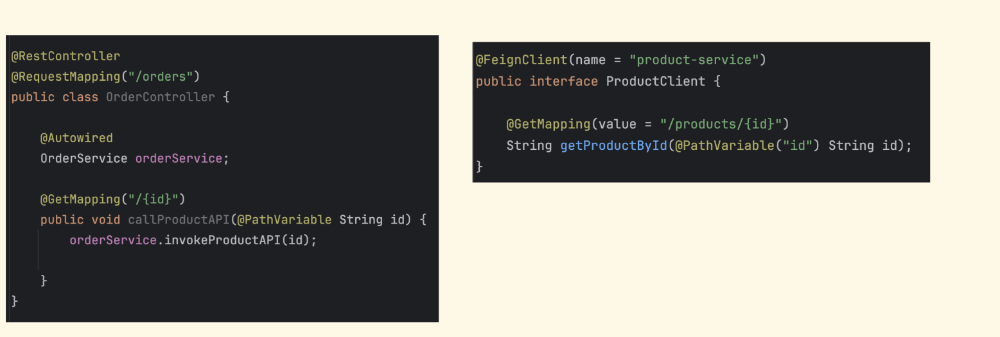

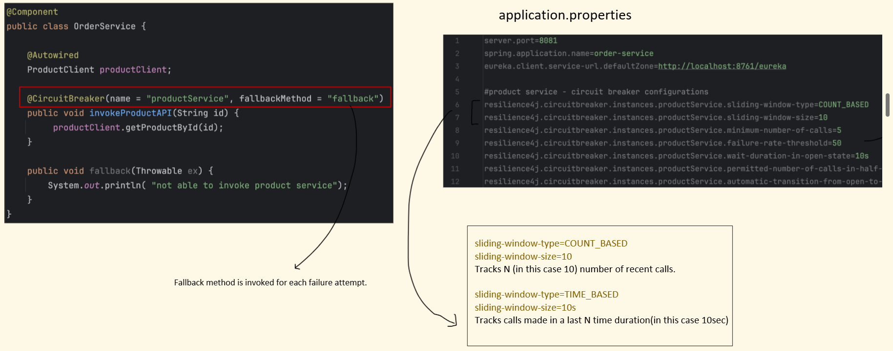

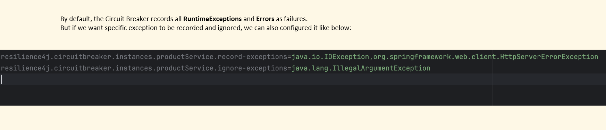

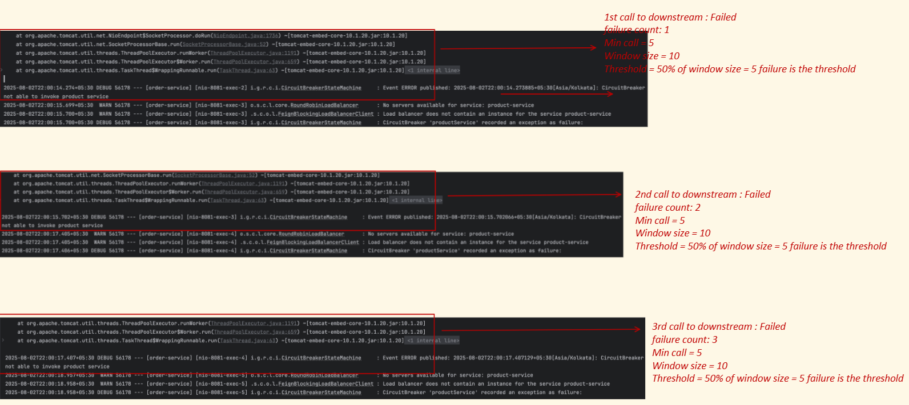

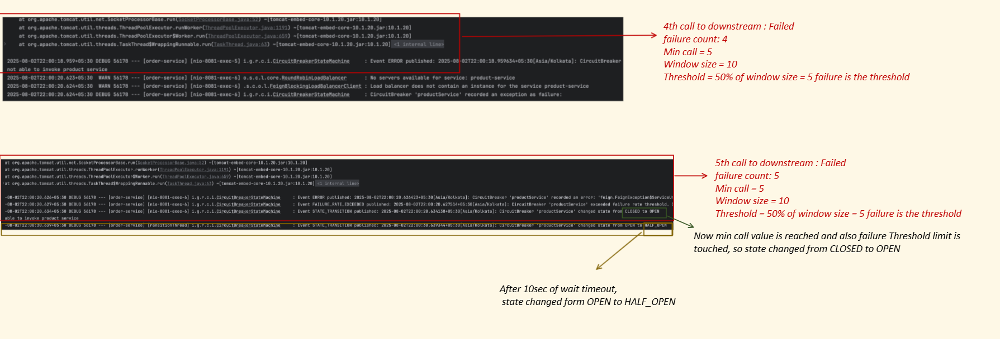

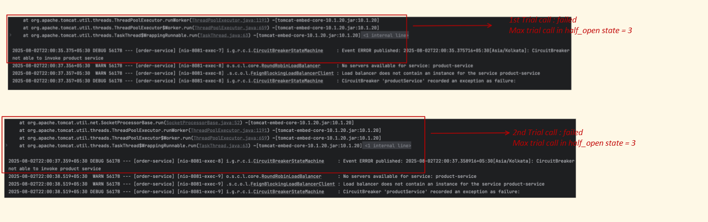

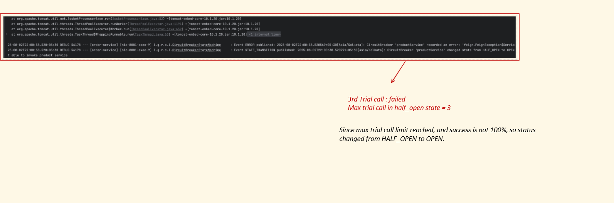

| Property                    | Description                                   | Why it is used                      |
| --------------------------- | --------------------------------------------- | ----------------------------------- |
| `slidingWindowType`         | Type of window: `COUNT_BASED` or `TIME_BASED` | Defines how failures are calculated |
| `slidingWindowSize`         | Number of calls (or seconds for time-based)   | Controls evaluation window size     |
| `minimumNumberOfCalls`      | Minimum calls before calculating failure rate | Avoids premature tripping           |
| `failureRateThreshold`      | % of failures to open circuit (e.g. 50)       | Main trigger condition              |
| `slowCallRateThreshold`     | % of slow calls to trigger open               | Detects performance degradation     |
| `slowCallDurationThreshold` | Time limit to consider call slow              | Defines "slow"                      |

| Property                                       | Description                              | Why it is used                  |
| ---------------------------------------------- | ---------------------------------------- | ------------------------------- |
| `waitDurationInOpenState`                      | Time circuit stays OPEN before HALF-OPEN | Controls retry timing           |
| `permittedNumberOfCallsInHalfOpenState`        | Allowed test calls in HALF-OPEN          | Decides recovery behavior       |
| `automaticTransitionFromOpenToHalfOpenEnabled` | Auto move to HALF-OPEN after wait time   | Removes need for manual trigger |

| Property           | Description                        | Why it is used               |
| ------------------ | ---------------------------------- | ---------------------------- |
| `recordExceptions` | Exceptions counted as failures     | Customize failure conditions |
| `ignoreExceptions` | Exceptions NOT counted as failures | Prevents false failures      |

Circuit Breaker has 3 states : Closed, Half-Open, Open

Initially circuit breaker will be in closed status 
Say serviceA---> ServiceB happens
and serviceB is down/ having some issue

Now say sliding window size = 10 an type is count and failureRateThreshold = 50% , it checks for the 10 sized window
if the failure is more than 50% that is >5 , then the circuit breaker will move from closed to open

Now for a certain amount of time(witDurationInOpenState) any call to ServiceB wont go to ServiceB instead a callback method will be called
After witDurationInOpenState amount of time circuit breaker will move from open to halfopen

In this state only (permittedNumberOfCallsInHalfOpenState = 4) no of calls is allowed to go to serviceB
In this if no of calls which fails if it is >50% that is >2 then circuit breaker goes to open state again 
and same tihng happens
else it goes to closed state and all calls are allowed to reach Service B

Even in CLOSED:

Circuit breaker won’t evaluate failure rate until:
minimumNumberOfCalls

Example:

slidingWindowSize = 10
minimumNumberOfCalls = 5

👉 If only 3 calls happen → CB will NOT open, even if all fail

Even in closed state if call to ServiceB fails it goes to fallBack method

# ✅ **1. What exactly happens when you use @CircuitBreaker?**

Example:

`@CircuitBreaker(name = "myApi", fallbackMethod = "fallback") public String callApi() {     return restTemplate.getForObject(url, String.class); }`

You think you're calling **your method**, but you’re actually calling a **proxy object created by Spring AOP**.

---

# ⭐ INTERNAL FLOW (VERY IMPORTANT)

### **Step 1 — Spring sees @CircuitBreaker**

During component scanning, Spring finds:

`@CircuitBreaker(name="myApi")`

Resilience4j provides a **BeanPostProcessor** called:

`CircuitBreakerAnnotationBeanPostProcessor`

This scans all beans and all methods for Resilience4j annotations.

---

### **Step 2 — Spring replaces your bean with a PROXY**

Your bean:

`ExternalService`

is wrapped by a **JDK proxy or CGLIB proxy** depending on method visibility.

So instead of:

`ExternalService originalBean`

Spring gives you:

`ExternalService$$Proxy`

---

### **Step 3 — When you call the method, you do NOT call your code first**

You call:

`Proxy.callApi()`

Proxy intercepts the call → this is AOP.

This interceptor is built by:

`CircuitBreakerMethodInterceptor`

---

### **Step 4 — The interceptor executes circuit breaker logic BEFORE your method**

Pseudocode:

`interceptor.invoke() {     get circuit breaker instance     run method inside circuit breaker }`

Real logic:

- Check circuit breaker state:

    - CLOSED → allow method

    - OPEN → call fallback immediately

    - HALF-OPEN → allow limited calls

- Wrap your method in:

`cb.run(supplier, fallback)`

---

### **Step 5 — Your method is called only if allowed**

If method executes:

- Success → metrics updated

- Failure → failure count increases

If failure threshold reached:  
→ Circuit goes OPEN  
→ Next calls skip your method  
→ Fallback directly

🧠 What is a “Slow Call Failure”?

A slow call failure means:

A call did NOT throw an exception ❌
BUT it took too long to respond ⏱️

⚠️ Why is this treated as failure?

Because in real systems:

Slow response = bad user experience 😡
Threads stay blocked ⛔
System throughput drops 📉

👉 So even if it “works”, it’s still harmful

⚙️ How it works in Resilience4j

Two properties control this:

1️⃣ slowCallDurationThreshold

👉 Time limit

Example:

slowCallDurationThreshold = 2s
If call takes > 2 seconds → marked as slow
2️⃣ slowCallRateThreshold

👉 % of slow calls allowed

Example:

slowCallRateThreshold = 50
If more than 50% calls are slow → circuit opens
🔄 Example (Very Important)
slidingWindowSize = 10
slowCallDurationThreshold = 2s
slowCallRateThreshold = 50%
Calls:
Call	Time	Result
1	3s	Slow
2	2.5s	Slow
3	3s	Slow
4	2.2s	Slow
5	2.1s	Slow
6	1s	Fast
7	1s	Fast
8	1s	Fast
9	1s	Fast
10	1s	Fast

👉 Slow calls = 5 / 10 = 50%

➡ Circuit OPENS (even though NO exception happened)

“Why is Circuit Breaker not working?”

You should say:

Method not called via proxy (self-invocation)
Exception not recorded
Not enough calls (minimumNumberOfCalls)
Wrong config

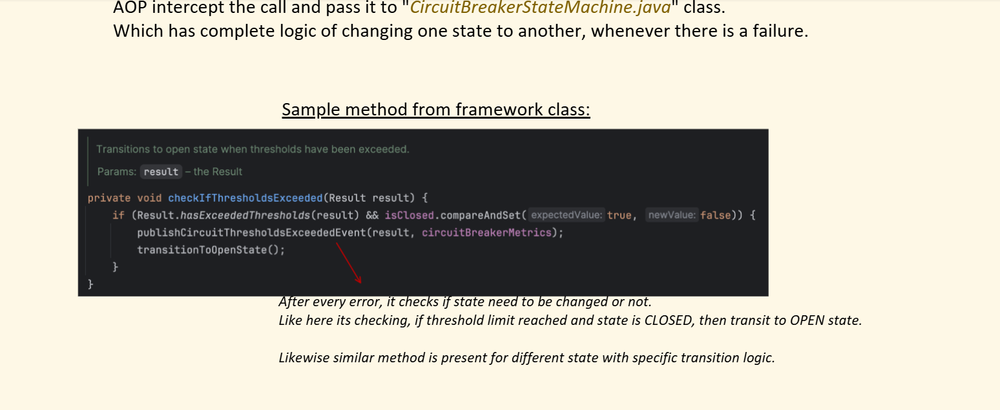

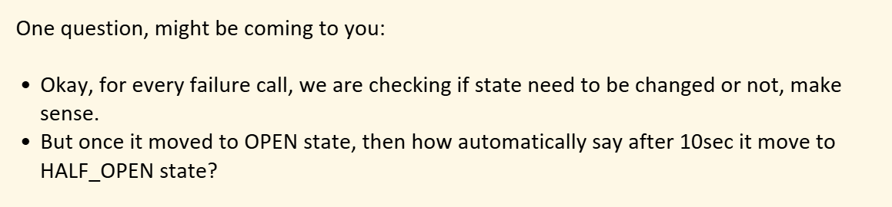

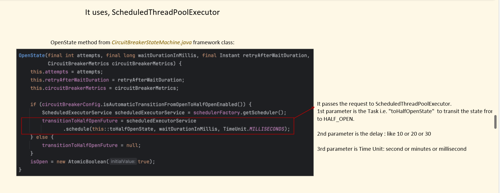

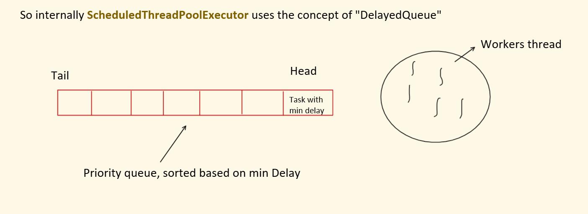

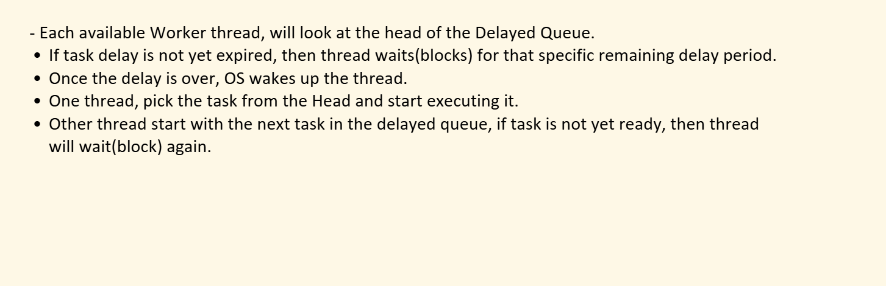