# ✅ **Bulkhead (Definition)**

**Bulkhead is a resilience pattern that isolates resources (like thread pools or semaphores) so that a failure or slowdown in one part of the system does NOT affect the rest of the system.**

---

# 🧠 **Simple Meaning**

Bulkhead = **divide your system into compartments**  
(Just like a ship is divided into watertight sections.)

If one compartment floods → the ship still floats.
If one component fails → your system still works.


# 🚢 **Why Bulkhead Exists (The Real Reason)**

In a microservice/monolithic system, multiple features share the **same resources**:

    - same thread pool
      - same DB connection pool
      - same HTTP client pool
      - same CPU time


If **one feature becomes slow**, it can **steal all resources**, making the entire system unresponsive.
**Bulkhead prevents this resource starvation.**

---

# 🔥 **Example Without Bulkhead (Disaster Scenario)**

You have:

- Order API
- Payment API
- Email API


All using the **same thread pool**.
Suddenly, Payment service becomes slow (maybe network issue).

### What happens?

    - Payment requests take 5 seconds each
      - All threads get stuck calling Payment
      - Order API → no threads left → hangs
      - Email API → no threads → hangs
      - Entire application → freezes


➡️ **A single slow dependency destroys your whole system.**

---

# 🧱 **Bulkhead Fix**

You isolate resources:

    - Payment → 10 threads
      - Order → 20 threads
      - Email → 5 threads


Now, if Payment becomes slow:

    - Only the 10 Payment threads get blocked
      - Order & Email continue working
      - Users can still place orders
      - Only Payment functionality is degraded


➡️ **Failure is contained. System stays alive.**

---

# 🧠 **The Main Purpose of Bulkhead**

> **Failure isolation + resource isolation = system resilience**

Bulkhead ensures:

        - One part fails → the rest survive
          - No cascading failures
          - No thread starvation
          - No connection pool exhaustion
          - No global freeze


It ENFORCES this rule:

**“Every feature gets its own small resource bucket.”**

---

# 🛠 Why not just rely on a circuit breaker?

Circuit breakers _only avoid repeated failures_.  
But before they open, your threads may already be blocked.

Bulkhead prevents the hang **at the resource level**, not the call level.

Bulkhead protects:

        - Threads
          - CPU
          - Memory
          - Connections


Circuit breaker only protects:

- Remote call logic


---

# 🎯 **So why is Bulkhead needed first?**

        Because **no matter how good your API design or circuit breakers are**,  
        if you share resources and one service slows down → **you crash**.
        
        Bulkhead is the **first line of defense** in resilience.
        Circuit breaker is the **second line**.
        Rate limiter is the **third**.


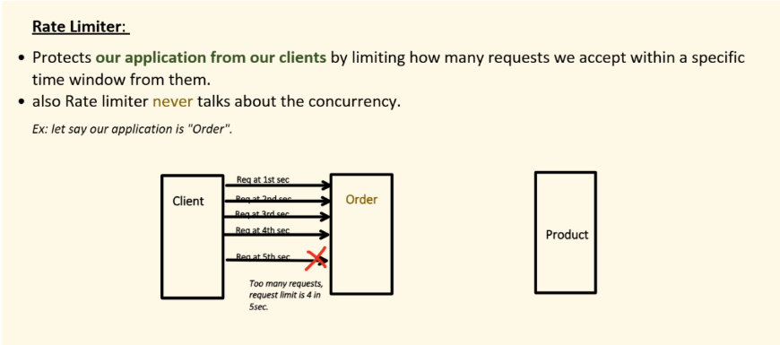

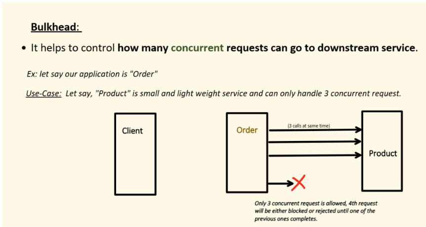

🔍 **Bulkhead is about CONCURRENCY isolation**

Bulkhead focuses on **how many threads** each component can use.

Example:

    - Payment → max 10 concurrent calls
      - Inventory → max 20 concurrent calls
      - Email → max 5 concurrent calls


Even if there are 1000 incoming requests, Payment will never use more than 10 threads.

Bulkhead solves:

    - thread starvation
      - cascading failures
      - slow services blocking everything


It uses:

    - **Thread pools**
      - OR **Semaphores** (limit parallel calls)

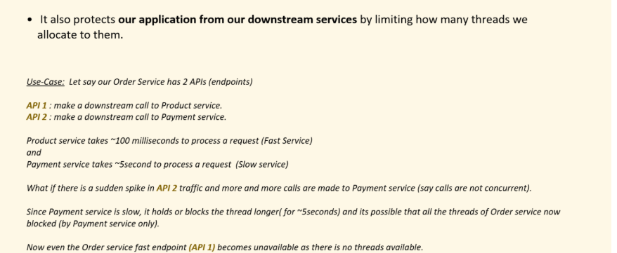

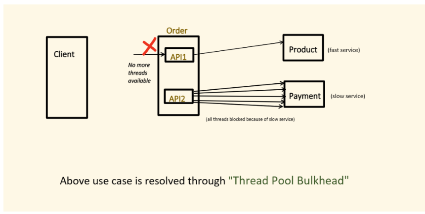

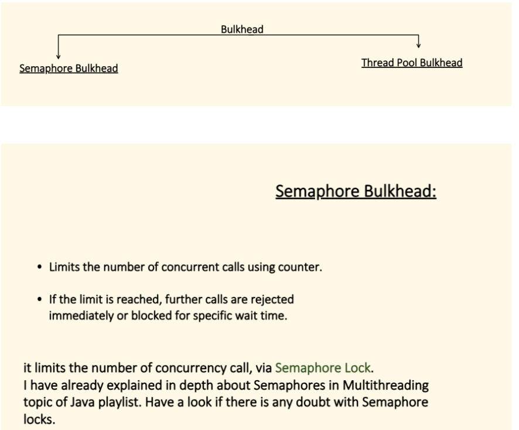

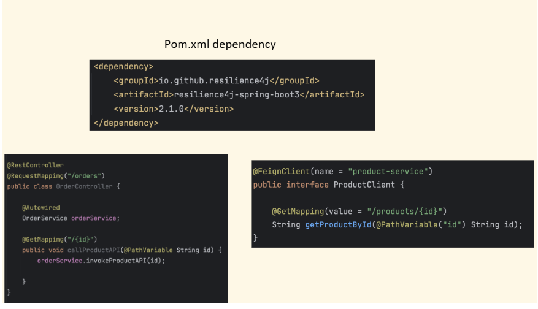

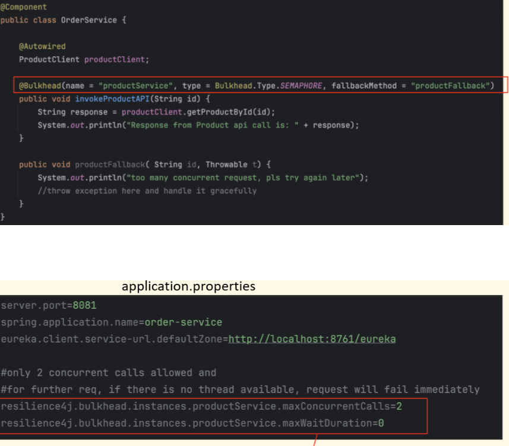

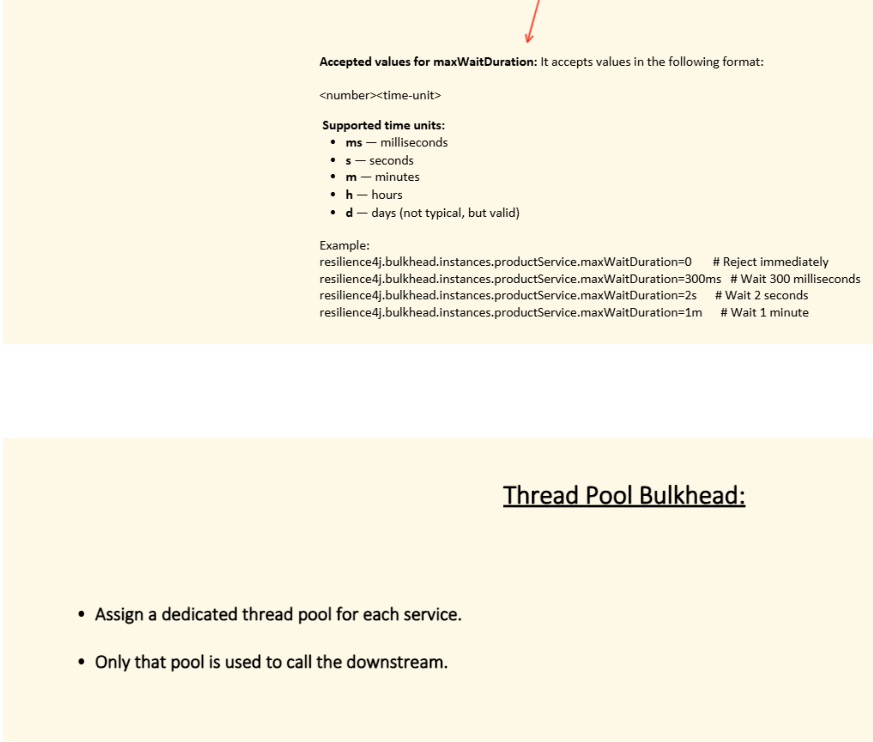

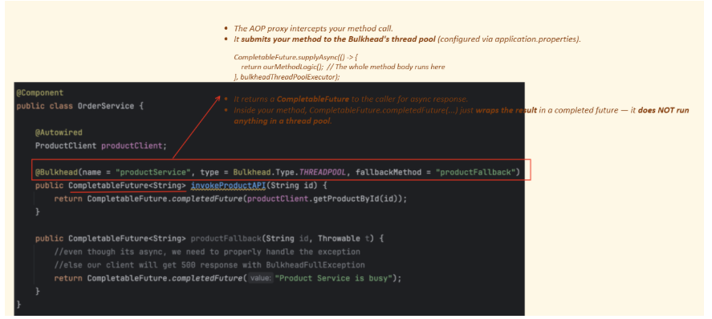

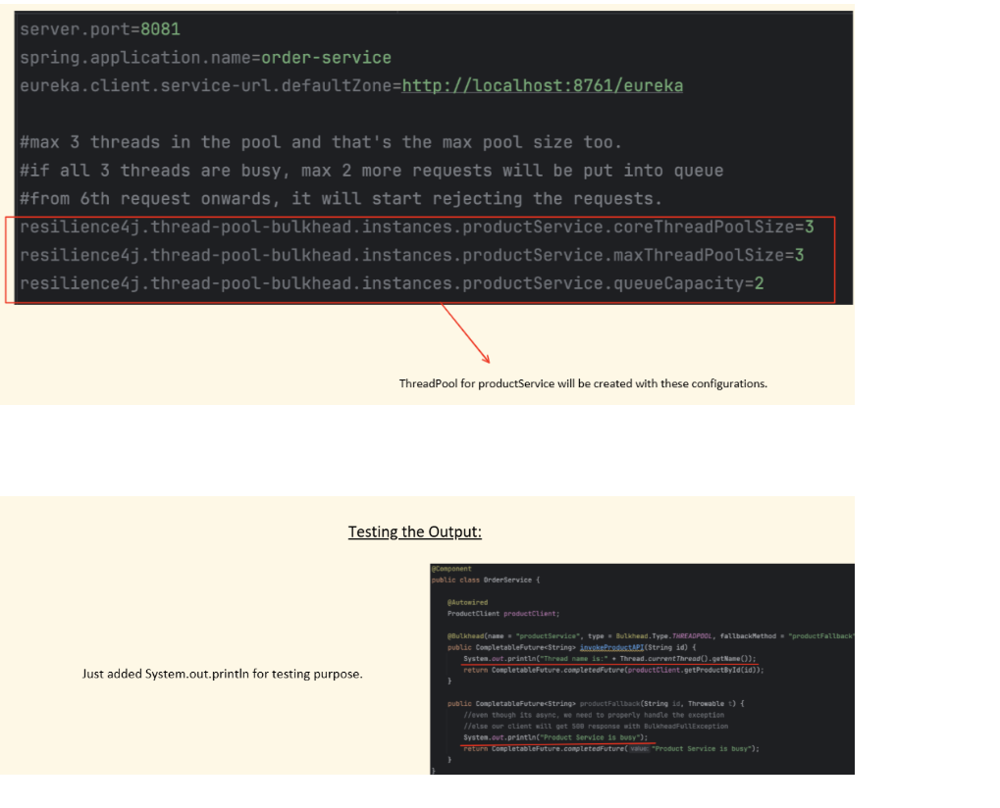

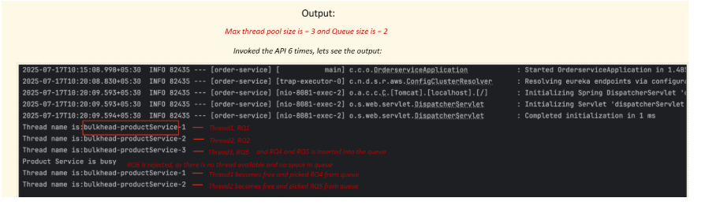


🔥 TWO TYPES OF BULKHEADS

There are **only two types** you need to understand:

        1️⃣ **Semaphore Bulkhead**  
        2️⃣ **Thread-Pool Bulkhead**

Let’s explain from scratch.

---

# 1️⃣ **SEMAPHORE BULKHEAD (simple, lightweight)**
`At most N requests can enter this component at a time. If more come → reject immediately OR wait.`

### ✔ What it controls?
**Concurrency** = number of simultaneous executions.

### ✔ What it uses?
A **semaphore counter**, NO separate threads.

### ❌ What it does NOT do?

        It does not isolate threads.  
        It uses **the same shared thread pool** for the whole app.

---

# 🟦 Example — Semaphore Bulkhead

Assume:

`Semaphore limit = 5`

### Scenario:

6 requests come at same time.

    - Request 1–5 enter immediately
      - Request 6 is **rejected** or waits (depending on config)


### Code Example (Pseudocode)

```
Semaphore sem = new Semaphore(5);

public void callPaymentService() {
    if (!sem.tryAcquire()) {
        throw new RuntimeException("Too Many Concurrent Calls");
    }

    try {
        // your code
        processPayment();
    } finally {
        sem.release();
    }
}

```

### 🚫 But the threads executing this method are from:

    - Tomcat thread pool
      - Reactor thread pool
      - Global Java executor


They are **shared** with the entire application.

---

# 🟦 Key Properties of Semaphore Bulkhead

| Feature                            | Semaphore Bulkhead            |
|------------------------------------|-------------------------------|
| Limits concurrency                 | ✔ Yes                         |
| Creates new threads                | ❌ No                          |
| Isolates thread usage              | ❌ No                          |
| Protects against slow/hanging code | ❌ No                          |
| Lightweight                        | ✔ Extremely                   |
| Best for                           | Fast, non-blocking operations |

---

# 2️⃣ **THREAD-POOL BULKHEAD (strong, isolated)**

`This component gets its OWN thread pool. Only N threads can be used by this component. Other components can’t steal these threads.`

### ✔ What it controls?

        **Threads + queue + concurrency.**

### ✔ What it uses?

A **dedicated thread pool** for each component.

### ✔ What it DOES do?

Provides **complete isolation**.

---

# 🟩 Example — Thread-Pool Bulkhead

Assume:

`Thread-pool size = 5 Queue size = 10`

        Only 5 threads can run at once.  
        If all are busy, new tasks go to queue (up to 10).  
        After that → reject.

### Pseudocode:

```
ExecutorService pool = Executors.newFixedThreadPool(5);

public CompletableFuture<String> callInventoryService() {
    return CompletableFuture.supplyAsync(() -> {
        return getInventoryData();
    }, pool);
}

```

### 🟩 What happens if callInventoryService() hangs?

    - Only this pool gets stuck
      - Other components keep running
      - Main app thread pool is SAFE


| Feature                     | Semaphore Bulkhead | Thread-Pool Bulkhead |
|-----------------------------|--------------------|----------------------|
| Limit concurrency           | ✔                  | ✔                    |
| Dedicated threads           | ❌                  | ✔                    |
| Thread isolation            | ❌                  | ✔                    |
| Queue support               | ❌                  | ✔                    |
| Protects global thread pool | ❌                  | ✔                    |
| Low memory usage            | ✔                  | ❌                    |
| Good for                    | Fast code          | Slow/blocking IO     |

# 🧠 **Can Thread-Pool Bulkhead do everything Semaphore does?**

        ✔ YES  
        Thread-pool bulkhead is more powerful.  
        It always enforces concurrency limit AND thread isolation.

❌ But semaphore cannot isolate threads.


👉 Bulkhead protects your system from overload
👉 Circuit breaker protects your system from failure


🔥 Combined Scenario (This is KEY)
Step 1: Service becomes slow
Bulkhead → limits to 10
CB → still closed

👉 System protected from overload ✅

Step 2: Service keeps failing
CB → opens
No more calls

👉 No resource waste ✅