✅ **What is a Rate Limiter?**

A **rate limiter** ensures that a client (user, IP, service, or application) is allowed to make **only a certain number of requests per second/minute/hour**.

Example:

|Limit|Meaning|
|---|---|
|100 requests / minute|max 100 requests from a client in 60 seconds|
|10 requests / second|max 10 requests in one second|

If the client exceeds the limit → requests get **blocked, delayed, or retried**.

---

# ✅ **Why is a Rate Limiter Needed?**

Rate limiters solve **multiple real-world problems**:

---

## **1️⃣ Prevent server overload (protect your backend)**

Without rate limiting, one user or bot can spam the backend with thousands of requests and crash the server.

💥 **Problem**:  
A spike in traffic overwhelms CPU, DB, threads.

🛡️ **Solution**:  
Rate limiter smoothens traffic so server handles load safely.

---

## **2️⃣ Prevent abuse (API misuse, DDoS attacks)**

APIs are often attacked with high-volume requests.

✔️ Rate limiting helps block:

- DDoS attacks

- brute-force login attempts

- bot scrapers

- spam requests


---

## **3️⃣ Ensure fair usage among all users**

Imagine 100 users using your API.  
If 1 user sends 90% of the traffic → others suffer.

Rate limiter ensures **each user/IP gets equal chance**.

---

## **4️⃣ Control costs (especially cloud APIs)**

Cloud services charge based on usage.  
Rate limiting prevents unexpected huge bills.

---

## **5️⃣ Maintain predictable system performance**

Rate limiting makes requests smoother → system becomes stable and predictable.

---

## **6️⃣ Prevent cascading failures in microservice architecture**

One overloaded service can cause failures across entire system.

Rate limiting + service degradation prevents:

- timeout chains

- retry storms

- total system crash

---------------------------------------------------------------------------------


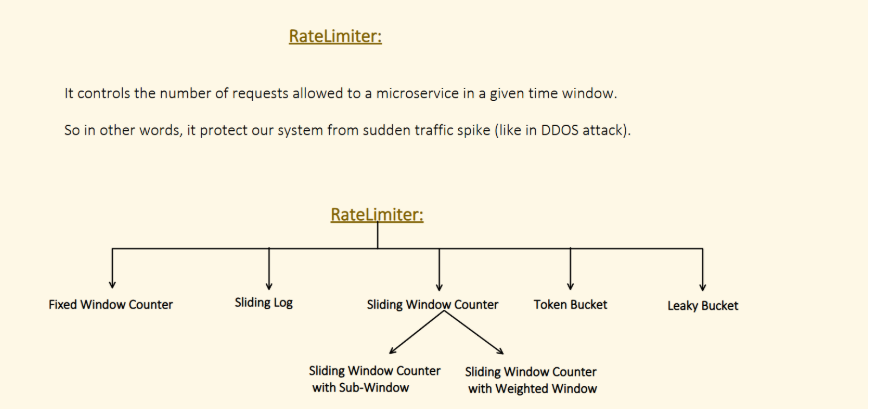

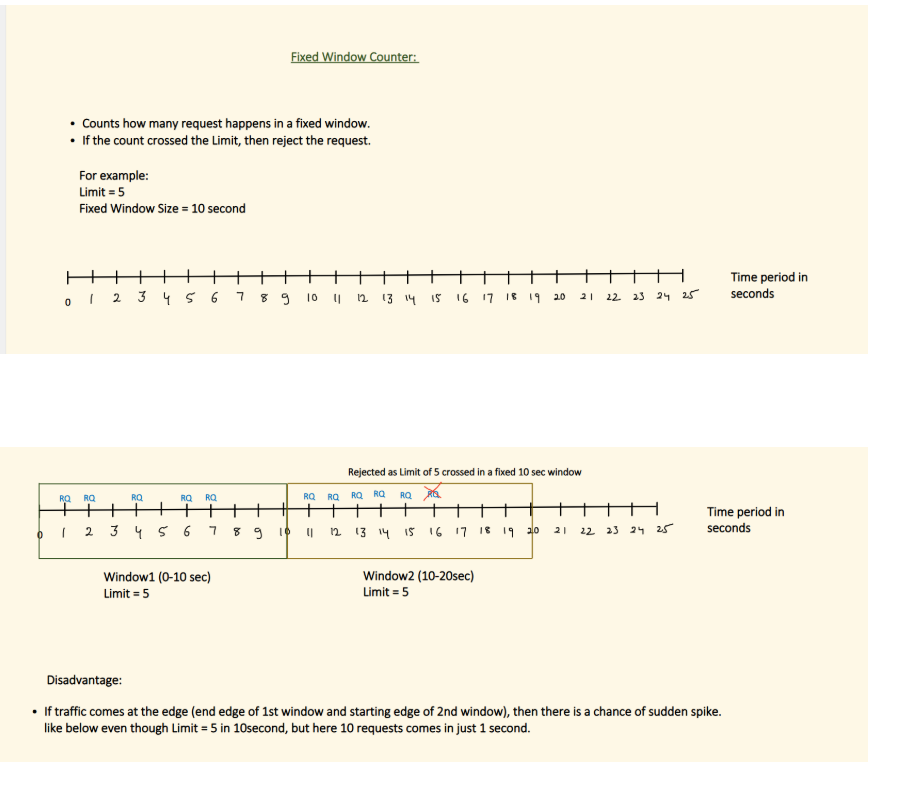

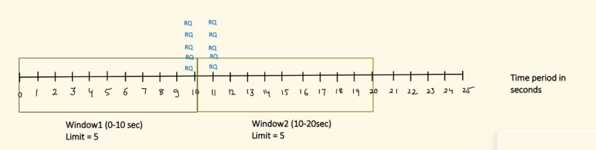

⭐ **Fixed Window Rate Limiter (Advantages & Disadvantages)**

👉 **Definition (quick recap):**  
Counts how many requests happened in the _current fixed time window_ (like 10 sec, 1 min).  
If count > limit → block.

Example:  
Limit = **100 requests/minute**  
Window = **12:00:00 to 12:00:59**

---

# ✅ **Advantages of Fixed Window**

### **1️⃣ Very simple to implement**

Only need:

- a counter

- a timestamp that resets on window boundary


No complex data structures.

### **2️⃣ Very fast and low memory**

Stores only **one counter per client**.  
No log, no timestamps for each request.

Perfect for:

- high traffic systems

- embedded systems

- caching layers (Redis)


### **3️⃣ Works well for large windows**

Good for:

- per-minute

- per-hour

- per-day limits


Where small burst errors don’t matter.

### **4️⃣ Easy to scale in distributed systems**

Counter can be kept in Redis or Memcached easily.

---

# ❌ **Disadvantages of Fixed Window**

### **1️⃣ Problem: Window boundary attack (burst issue)**

The biggest drawback.

A user can send requests at the **end of one window** + **start of next window** and effectively double the allowed rate.

Example:  
Limit = **10 requests / 1 minute**

`At 00:59 → send 10 requests   At 01:00 → window resets → send 10 more`

→ **20 requests within 2 seconds**  
But limit is _10 per minute_.

This is called **boundary problem** or **burst attack**.

---

### **2️⃣ Not smooth traffic – causes spikes**

Traffic is not evenly distributed.  
Works in chunks → **sudden spikes** can overload servers.

Unlike **Token Bucket** or **Leaky Bucket**, which smooth traffic.

---

### **3️⃣ Inaccurate for short windows**

For small windows like **1 second**, spikes become more dangerous.

Example:  
Limit = 5 requests/sec  
User sends:

`0.9 second → 5 requests   1.1 second → 5 requests`

→ 10 requests in only 200ms

---

### **4️⃣ Reset happens at fixed intervals, not based on usage**

Even if user was idle for long time, they don't "accumulate" any extra allowance.

Unlike **Token Bucket** (which stores unused capacity as tokens).

---

### **5️⃣ Time synchronization issues**

If using distributed Redis cluster, clock drift between nodes may cause inaccurate limits.


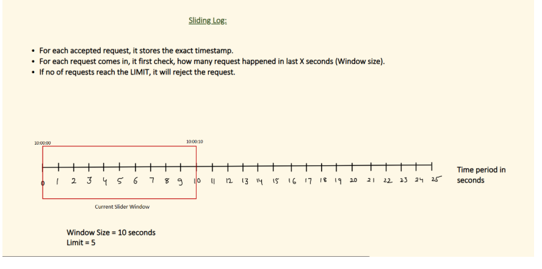

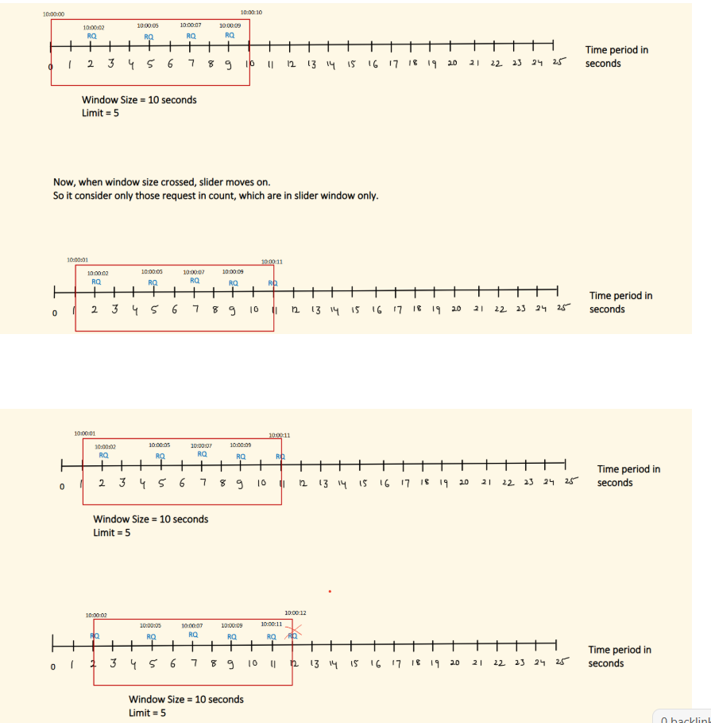

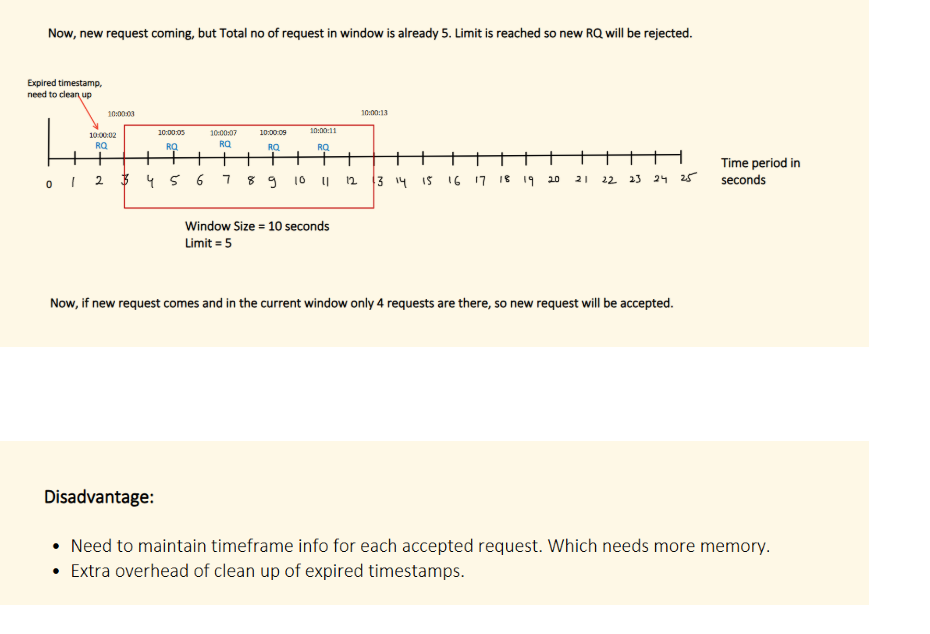


⭐ **Sliding Window Log Rate Limiter**

### **What it does**

Stores a **timestamp log** of every request in a sliding “moving” time window  
(e.g., last 1 minute, last 10 seconds).

Every new request:

1. Remove all timestamps older than the window

2. Count how many timestamps remain

3. If count < limit → allow request

4. Else → reject


---

# 📌 Example (Limit = 5 req / 10 seconds)

Window size = last **10 seconds**

Suppose these requests arrive (timestamps in seconds):

`12s, 13s, 17s, 19s, 20s`

Now a new request at **21s**:

**Step 1:** Remove requests older than (21s – 10s) = **11s**  
→ all old timestamps are >11s → nothing removed

**Step 2:** Count = 5  
**Step 3:** Limit reached → reject

At **23s**, timestamps inside window = last 10s = after 13s

Old list:

`12s, 13s, 17s, 19s, 20s`

Remove ≤13s ⇒ new list:

`17s, 19s, 20s`

Now count = 3 → next request allowed.

---

# 🔄 **How Sliding Window Actually Slides**

Unlike Fixed Window (which resets at fixed times),  
Sliding Window **moves continuously with time**.

ASCII diagram:

`Time →  |----10 seconds sliding window----|          13 14 15 16 17 18 19 20 21 22 23  Requests:  X  .  .  X  .  X  .  X  X  .  .  At 23s: window covers [13s to 23s] Old requests before 13s are removed`

The window is always:

`[current_time – window_size, current_time]`

---

# ✅ **Advantages of Sliding Window Log**

### **1️⃣ Most accurate rate limiter**

No boundary issues.  
No bursts allowed just because window reset.

### **2️⃣ Perfect fairness**

Every request from every user is treated based on  
**exact timestamps**, not fixed chunks.

### **3️⃣ Smooth distribution of allowed requests**

No sharp spikes like in Fixed Window.

### **4️⃣ No burst attack problem**

User cannot cheat by sending at window edges (end + start).

---

# ❌ **Disadvantages of Sliding Window Log**

### **1️⃣ High memory usage**

Needs to store **timestamps of every request**.

If user sends 100 requests/sec with 1-minute window →  
must store 6,000 timestamps.

### **2️⃣ Storage grows with traffic**

If many users or high-volume API calls, memory may blow up.

### **3️⃣ Performance cost (log cleanup)**

Each request:

- must remove old timestamps

- must store new timestamp

- must count current timestamps


This is more expensive than Fixed Window or Token Bucket.

### **4️⃣ Harder to scale in distributed systems**

Because logs must be stored centrally (e.g., Redis list).

### **5️⃣ More complex implementation**

Needs a list or queue + cleanup logic.


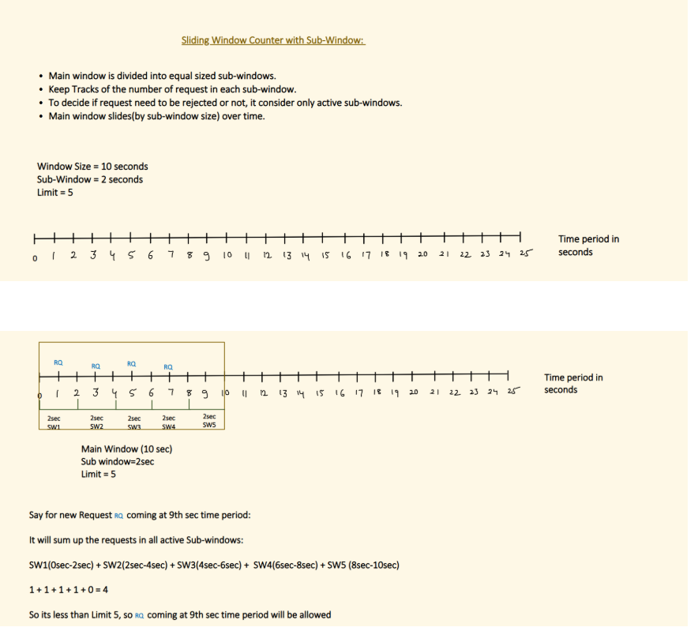

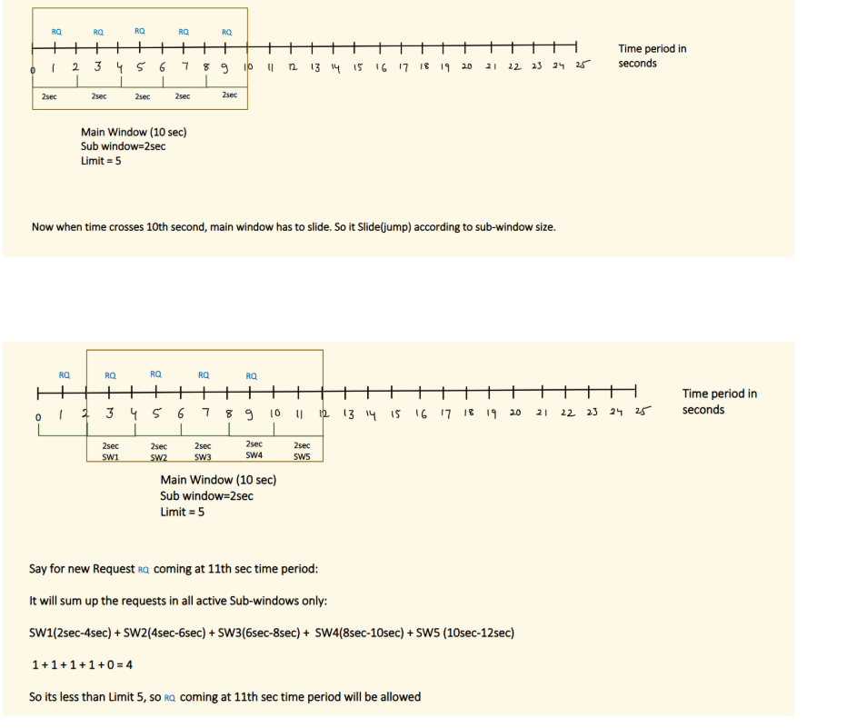

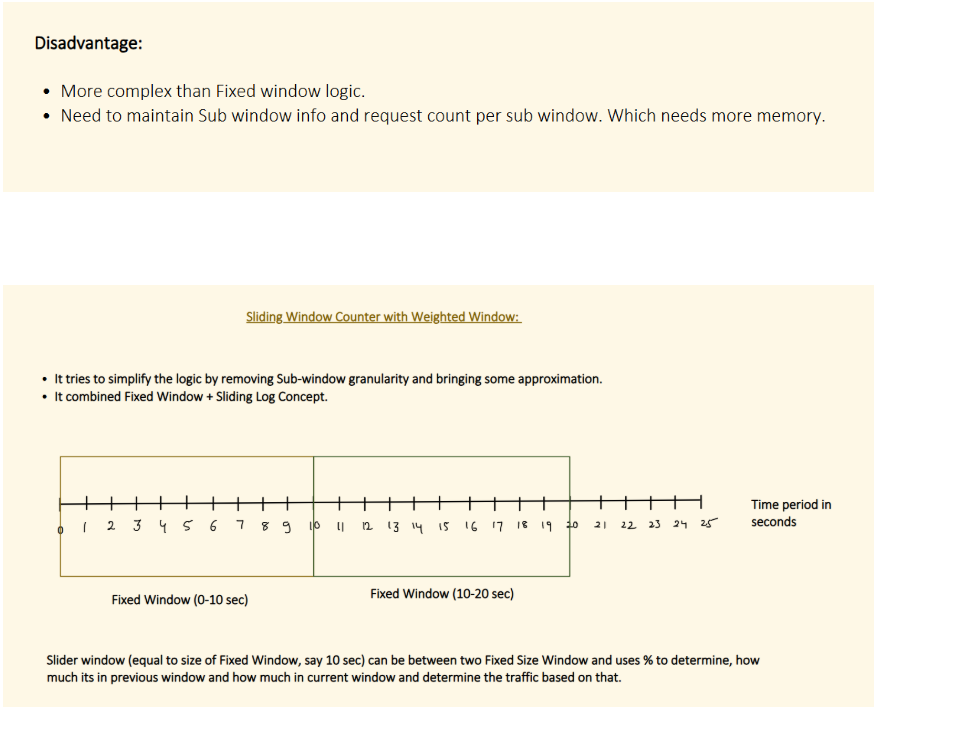

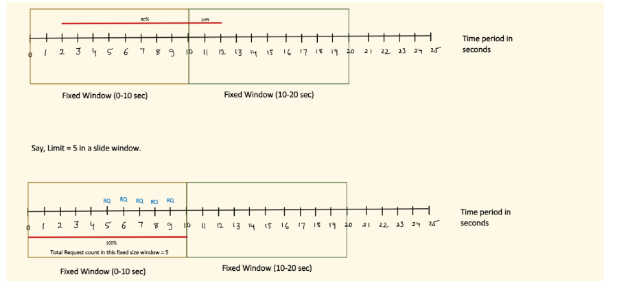

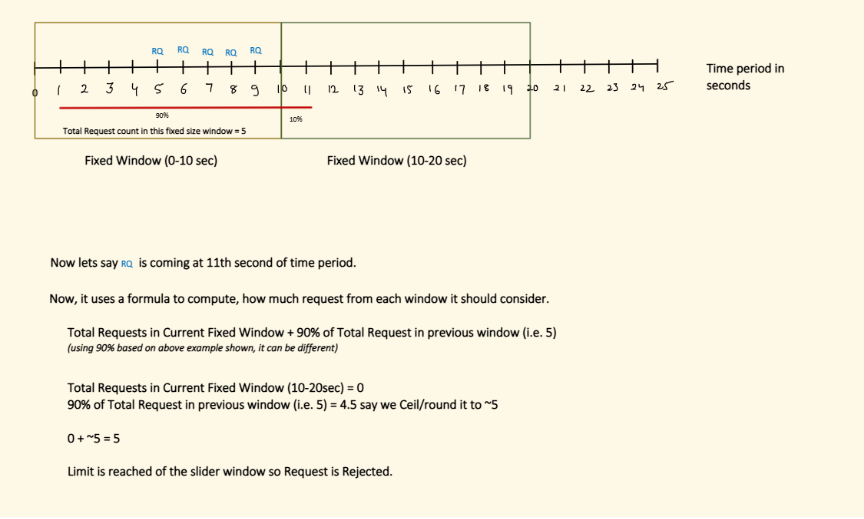

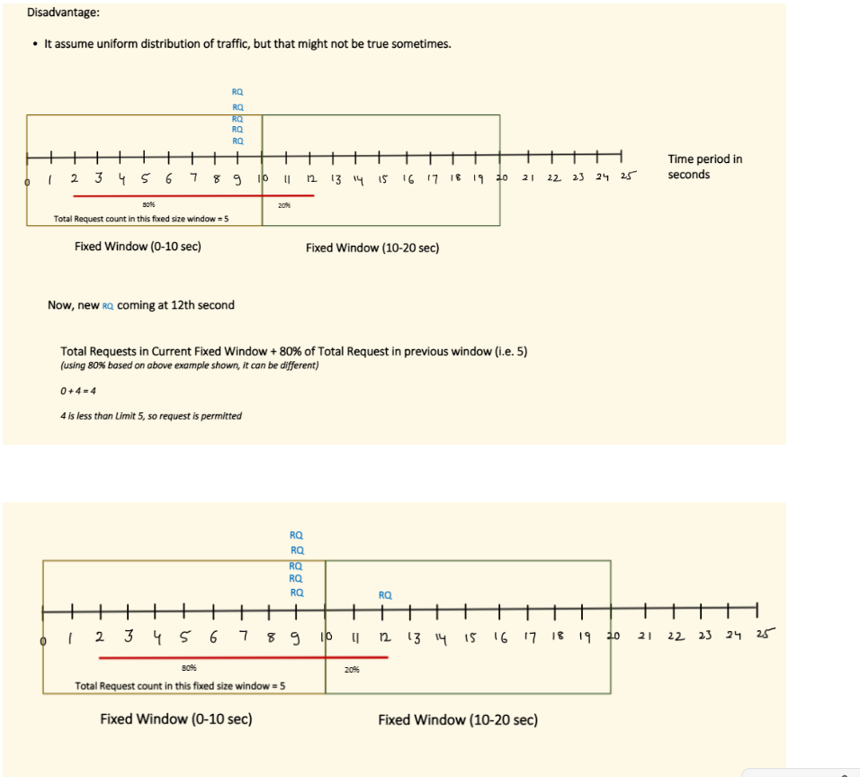

⭐ **Sliding Window Counter Rate Limiter**

It is a **hybrid** between:

- **Fixed Window** (simple but inaccurate)

- **Sliding Window Log** (accurate but heavy)


Sliding Window Counter tries to give **better accuracy** than Fixed Window,  
but with **much lower memory** than Sliding Log.

---

# 📌 **How it works**

Instead of storing every request timestamp, we store **two counters**:

1. Counter for the **current window**

2. Counter for the **previous window**


Then we compute the **weighted count** based on how far we are into the window.

---

### ⚡ Example

Limit = **10 requests / 10 seconds**

Window size = **10 seconds**

Let’s say current time = **18 sec**  
Window spans:

- **Current window**: 10s → 20s

- **Previous window**: 0s → 10s


`Previous window count = 4 Current window count  = 6`

We are **80% into the current window**:

`19s is 9 seconds into the 10-second window   so proportion = 9/10 = 0.9`

Effective requests =

`current_count + (previous_count * (1 - proportion)) = 6 + (4 * (1 - 0.9)) = 6 + 0.4 = 6.4`

Since 6.4 < 10 ⇒ **allow request**

This smooths the transition between windows.

---

# 🔄 Diagram: How the window slides

`Time →  |------10s window------|           prev window  | current window            0–10s       |   10–20s  Requests:  4 hits      |     6 hits  Current time = 18s → 80% into current window`

Sliding Window Counter is basically:

`EffectiveCount = current_count +                  previous_count * (remaining_time_percentage)`

This approximates the true sliding window.

---

# ✅ **Advantages of Sliding Window Counter**

### **1️⃣ Much lower memory than Sliding Window Log**

We only store:

- previous counter

- current counter


Not every timestamp.

### **2️⃣ More accurate than Fixed Window**

Avoids “burst at window edge” problem.

### **3️⃣ Smooth traffic limiting**

Requests are allowed more evenly.

### **4️⃣ Easy to scale**

Counters fit nicely in Redis.

### **5️⃣ Good balance**

Best compromise between:

- simplicity

- performance

- accuracy


Used in **API Gateways, Redis, Envoy, Nginx**, etc.

---

# ❌ **Disadvantages of Sliding Window Counter**

### **1️⃣ Still an approximation (not perfectly accurate)**

Unlike Sliding Window Log, this method uses math to estimate usage.  
It can be wrong if traffic is spiky.

### **2️⃣ More complex than Fixed Window**

Requires calculating weight factor and keeping two counters.

### **3️⃣ Edge case inaccuracies**

For highly irregular burst patterns, estimation may be inaccurate.

### **4️⃣ Doesn’t fully prevent micro-bursts**

Small bursts can still pass, but far less than Fixed Window.


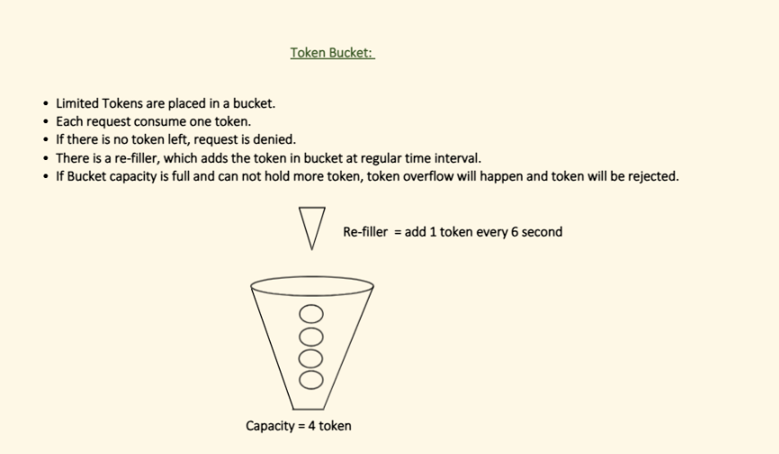

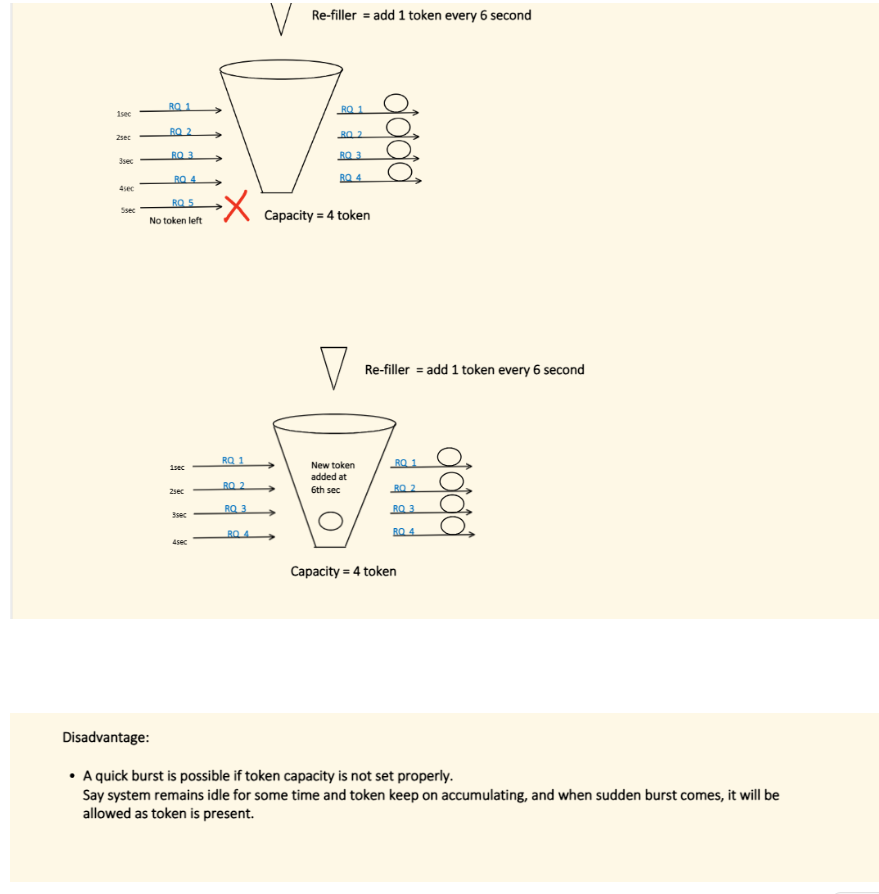

⭐ **Token Bucket Rate Limiter**

Token Bucket is one of the **most popular rate-limiting algorithms** used in:

- API Gateways

- Linux traffic control (tc)

- AWS, GCP, Cloudflare

- Networking routers

- Microservices


---

# 🎯 **Core Idea**

- A bucket holds **tokens**.

- Tokens are added at a **fixed rate** (example: 5 tokens per second).

- Each request **needs 1 token** to proceed.

- If the bucket has tokens → **request allowed** and token removed.

- If bucket is empty → **request blocked / queued / throttled**.


---

# 📌 Example Setup

`Bucket size = 10 tokens Refill rate = 2 tokens per second`

Meaning:

- Max 10 tokens can be stored at once.

- Every second 2 tokens are added (up to max 10).


---

# 🪣 **How Token Bucket Works (Diagram)**

`BUCKET (max 10 tokens)  -------------------  | ● ● ● ● ● ● ● ● |   ← Tokens  -------------------      |      | request needs 1 token      v   Request allowed`

Every second:

`refill += 2 tokens  (but cannot exceed 10)`

---

# 🔄 **Allows Bursts (important!)**

If no traffic for 5 seconds → 2 tokens/sec * 5 sec = 10 tokens accumulated.

So next request can use all tokens:

`10 quick requests allowed instantly (burst)`

After that → bucket empty → further requests blocked until refill happens.

This is why Token Bucket is famous:  
👉 **Allows bursts but enforces sustained rate limit**.

---

# ⚡ Example Timeline

Bucket size = 10  
Token add rate = 2/sec

### ❌ Scenario 1: No requests for 5 seconds

- Tokens added = 2×5 = 10

- Bucket full = 10 tokens


Now user sends **10 requests at once → all allowed**

---

### ❌ Scenario 2: Next 5 requests immediately after burst

Bucket = 0  
Now refill:

1 second later → 2 tokens  
So 2 requests allowed, 3 rejected.

---

# 🧠 Important Clarification

You asked earlier:

> _if no request comes until refresh time, will tokens still get added?_

### ✔️ Yes.

Tokens are **always added** at the configured rate, even when no requests come.

That’s how the bucket fills up and allows bursts later.

---

# ✅ **Advantages of Token Bucket**

### **1️⃣ Allows controlled bursts**

Unlike Leaky Bucket or Fixed Window.

Good for real systems where traffic is never constant.

### **2️⃣ Smooths long-term rate**

Even if bursts happen, long-term average stays within limit.

### **3️⃣ Very efficient**

Just store:

- number of tokens

- last refreshed time


Very low memory & CPU cost.

### **4️⃣ Easy to implement**

Commonly used in Redis, API Gateways, Nginx, Cloudflare.

### **5️⃣ Very accurate for sustained rate limiting**

No boundary issues like Fixed Window.

---

# ❌ **Disadvantages of Token Bucket**

### **1️⃣ Cannot fully prevent bursts**

It allows bursts up to bucket size (by design).

### **2️⃣ Needs precise time calculations**

Must calculate how many tokens to add since last request.

### **3️⃣ Multiple buckets needed for different rate limits**

For example:

- per-second

- per-minute

- per-hour  
  Each needs a separate bucket.


### **4️⃣ Slightly more complex than Fixed Window**

More math, time tracking, and real-time logic.


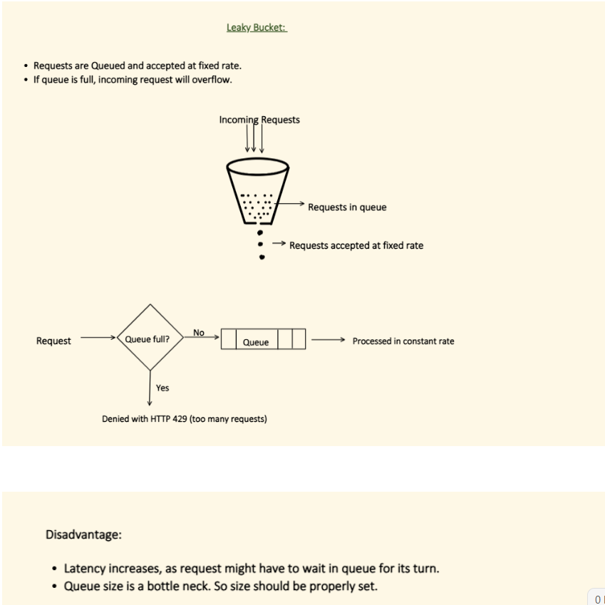

⭐ **Leaky Bucket Rate Limiter**

Leaky Bucket ensures that **requests are processed at a fixed, constant rate**, no matter how bursty the incoming traffic is.

Think of a real bucket with a **small hole** at the bottom.

- Water = incoming requests

- Bucket = queue

- Hole = constant processing rate


Even if you pour water fast (burst), it leaks at a **steady rate**.

---

# 🎯 **Core Behavior**

- A bucket (queue) has **fixed capacity**, example 100 requests.

- Requests arrive and get added to the bucket.

- Bucket leaks (processes) requests at a **fixed rate**, example 5 requests/second.

- If bucket is full → **new requests are dropped**.


---

# 🪣 **Diagram**

```
Incoming Requests →  [ BUCKET ]  →  Processed at fixed rate
                      | 100 max |
                      -----------
                       | | | |
                        v v v v   ← leaks at 5 req/sec

```

No matter how fast the requests come in,  
**output flow is stable and fixed**.

---

# 📌 Example

Bucket size = **10 requests**  
Leak rate = **2 requests / second**

### Scenario

User suddenly sends **10 requests at once**:

- All 10 are stored in bucket

- System leaks them one by one:


```
t=0s → bucket=10  
t=1s → process 2 → remaining=8  
t=2s → process 2 → remaining=6  
t=3s → process 2 → remaining=4  
t=4s → process 2 → remaining=2  
t=5s → process 2 → remaining=0

```

If any **new request arrives while bucket is full**, it is **rejected/dropped**.

---

# 🔥 **Key Insight**

Unlike Token Bucket:

- **Token Bucket allows bursts**

- **Leaky Bucket processes requests at a fixed speed**


Leaky Bucket = perfect for **smoothing traffic**.

---

# 🔄 Is Leaky Bucket synchronous?

You asked earlier:

> is leaky bucket synchronous?

### ✔️ YES.

Leaky bucket leaks at **constant rate**, like a periodic synchronized schedule.

Example: always 5 req/sec → stable.

It acts like a "fixed-rate throttle".

---

# 🧠 Real Use Cases

- Network traffic shaping

- Routers and firewalls

- API gateways needing **strict flow control**

- Payment gateways (avoid sudden load)

- Message queues with constant consumption rate


---

# ✅ **Advantages of Leaky Bucket**

### **1️⃣ Smooth, predictable output rate**

No spikes → perfect for protecting downstream systems.

### **2️⃣ Strong protection against bursts**

Incoming burst gets **queued** and slowly drained.

### **3️⃣ Prevents overload**

Queue size = safety buffer.

### **4️⃣ Easy to reason about**

Constant processing rate simplifies design.

---

# ❌ **Disadvantages of Leaky Bucket**

### **1️⃣ Drops requests when bucket is full**

If bursts are bigger than bucket size → requests lost.

### **2️⃣ No allowance for controlled bursts**

Token Bucket allows bursts up to token capacity.  
Leaky Bucket does **not**.

### **3️⃣ Might delay requests too much**

If many requests are queued, processing gets slow.

### **4️⃣ Implementation involves queuing + timers**

Slightly more complex than Fixed Window or Token Bucket.

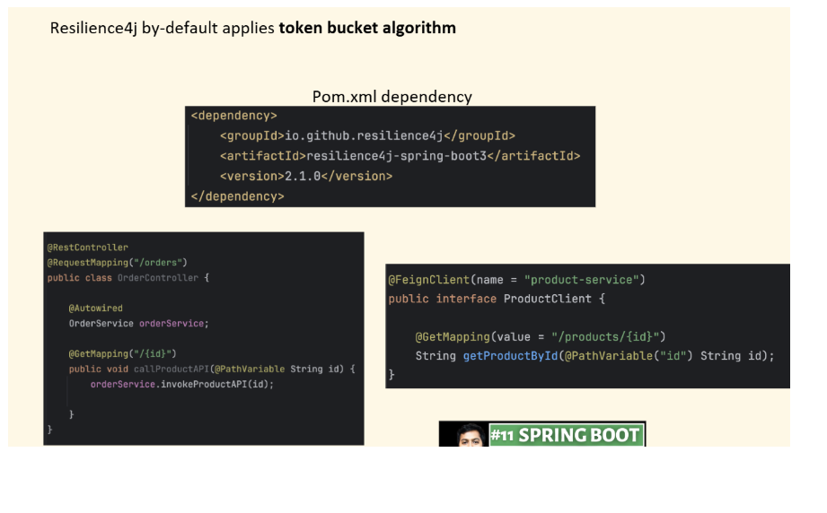

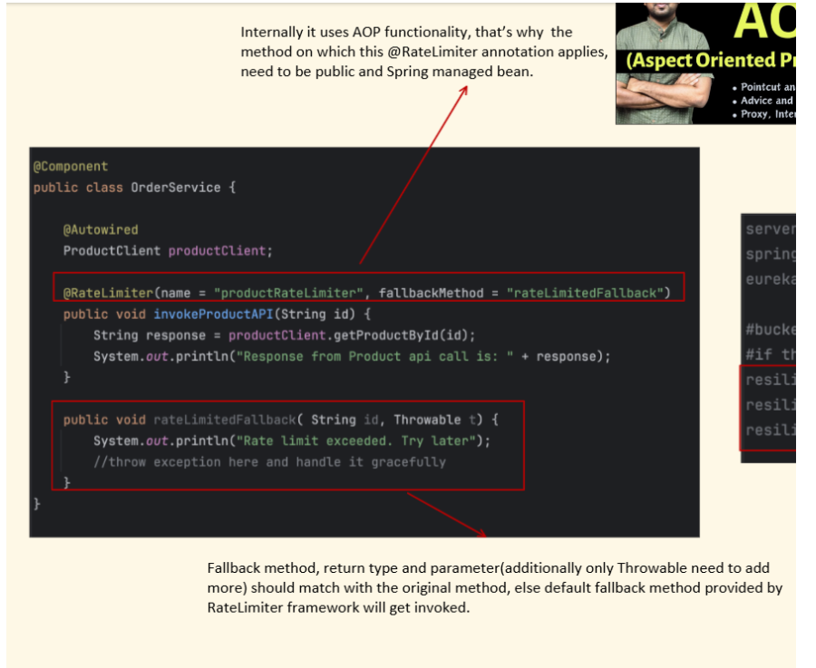

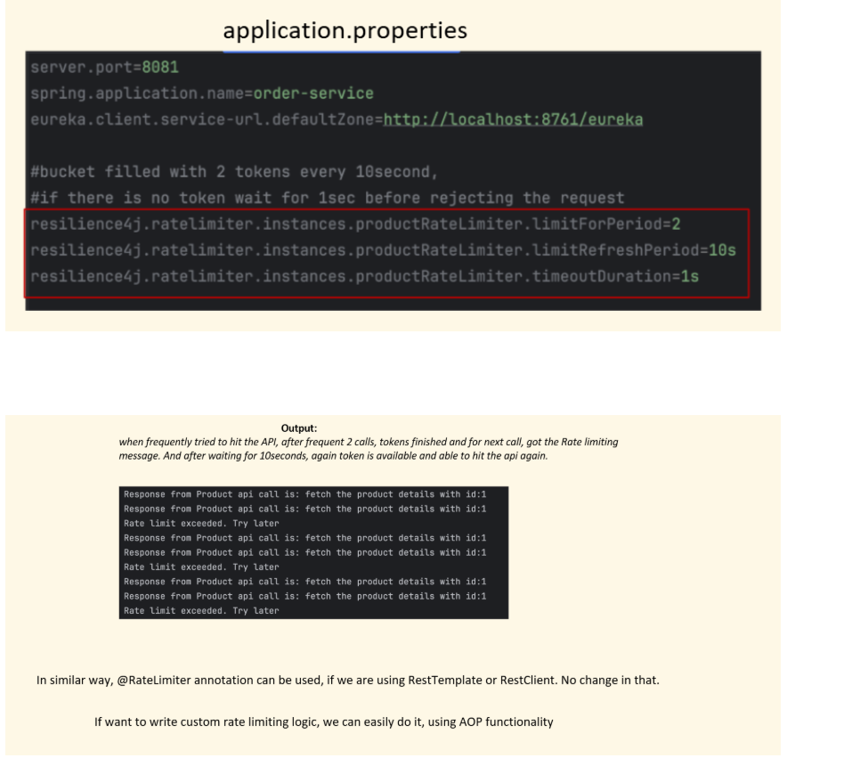

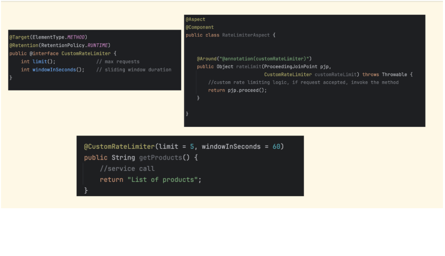
