# ✅ **What is Spring Cloud Config?**

**Spring Cloud Config** is a **centralized configuration server** for microservices.

It allows you to store **all application configuration** (YAML, properties, secrets) in one place and deliver them to multiple services dynamically.

You typically store configs in:

- Git repo (most common)

- Vault (for secrets)

- Filesystem

- Kubernetes ConfigMaps/Secrets

The **Config Server** pulls the config and provides it to all the microservices.

---

# 📌 **Why is Spring Cloud Config Needed?**

## 1️⃣ **Centralized Configuration**

Without Config Server:

- Every service has its own `application.yml`

- Updating one config requires rebuilding and redeploying that service

With Spring Config:

- All configs are stored in one central repo

- Updating a value updates all services immediately (with refresh)

---

## 2️⃣ **No Need to Rebuild Apps for Config Changes**

Without it:

- Changing DB URL, Kafka URL, feature toggle → redeploy the service

With Config Server:

- You update the config in Git → services fetch new values

- Using `@RefreshScope`, services update **without restart**

---

## 3️⃣ **Consistent and Versioned Configuration**

Without Config Server:

- Developers keep local copies

- Config mistakes easily happen

- No version history

- Someone overrides config accidentally

With Config:

- All configs live in Git → versioned

- You can rollback easily

- Everyone sees the same values

---

## 4️⃣ **Environment-Specific Config Made Easy**

Without Config Server:

- You need different YML files per service:

  `application-dev.yml application-qa.yml application-prod.yml`

- Managing these for 20+ microservices becomes painful.

With Config:

- Config is separated by environment:

  `service-a-dev.yml service-a-prod.yml service-a-qa.yml`

Each service fetches only its environment file.

---

## 5️⃣ **Secure Secret Management**

Without Config:

- Passwords often end up inside:

    - `application.yml`

    - Docker image

    - Git repo 😬

With Config:

- Secrets stored in Vault or encrypted values

- Never committed inside application code

- Rotation is simpler

---

## 6️⃣ **Dynamic Refresh (Real-time configuration update)**

Without Config:

- Changing a value needs restart

With Config Server + actuator refresh:

- Update config

- Call `/actuator/refresh`

- Application reads new config **without redeployment**

Useful for:

- Feature toggles

- Circuit breaker thresholds

- Rate limiter configurations

- Logging levels

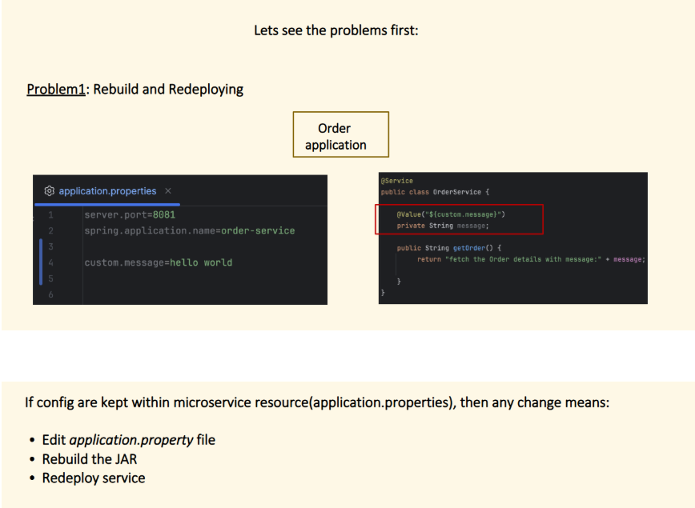

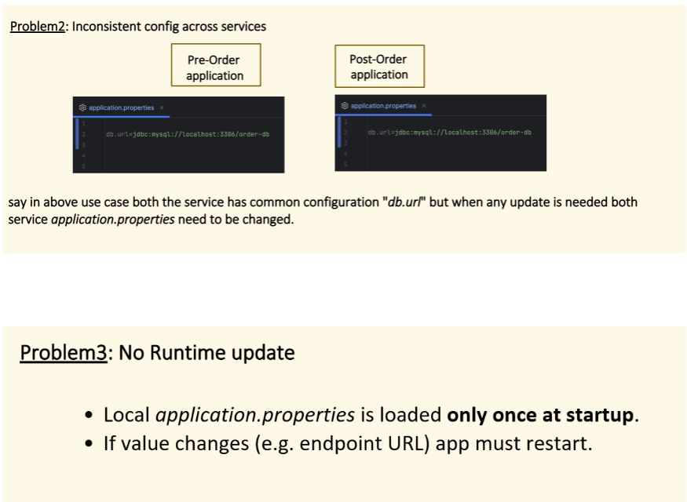

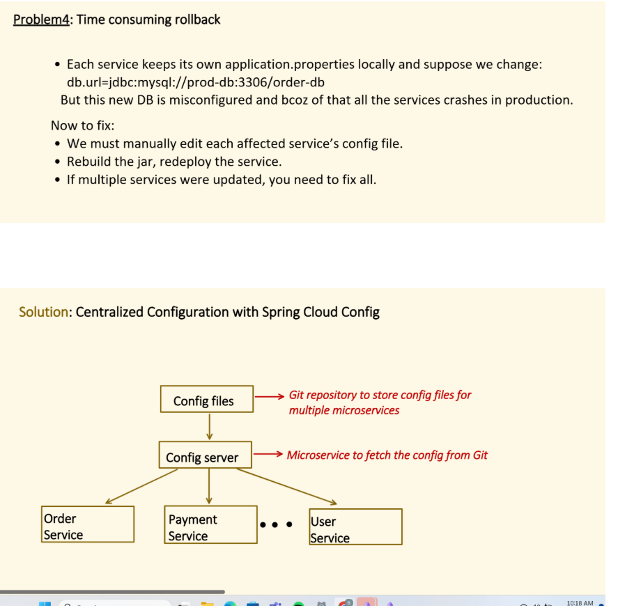

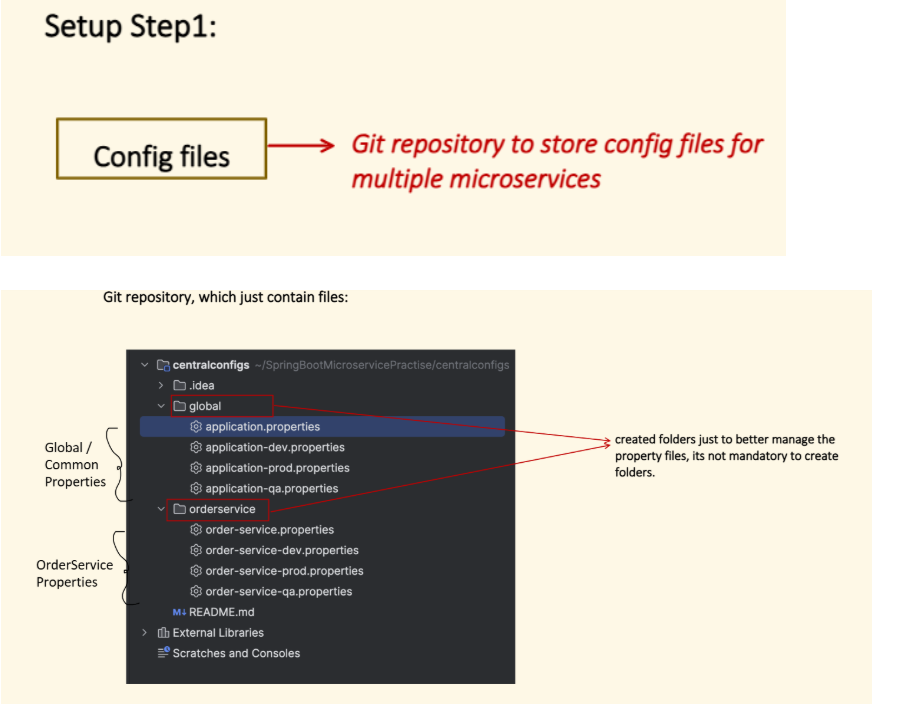

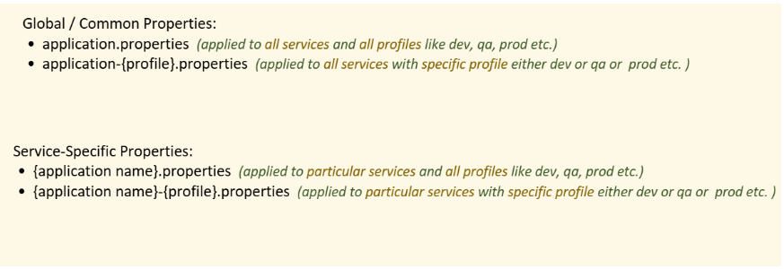

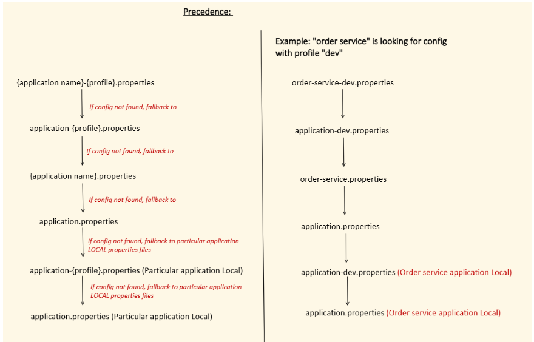

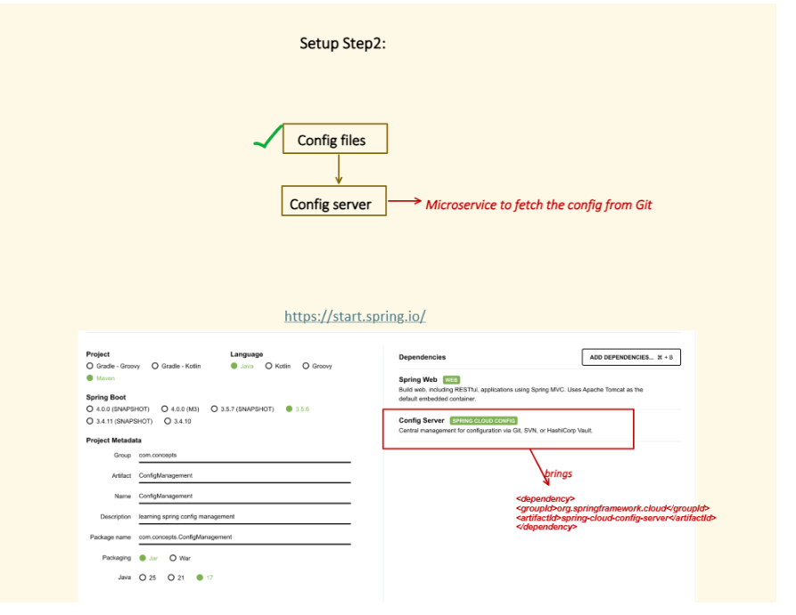

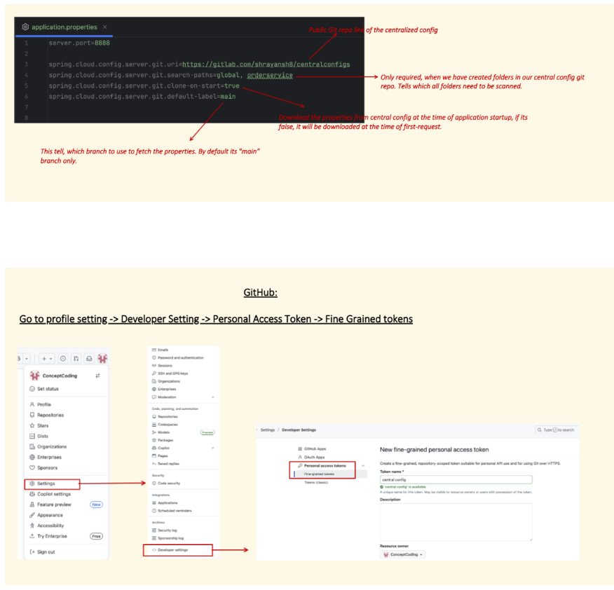

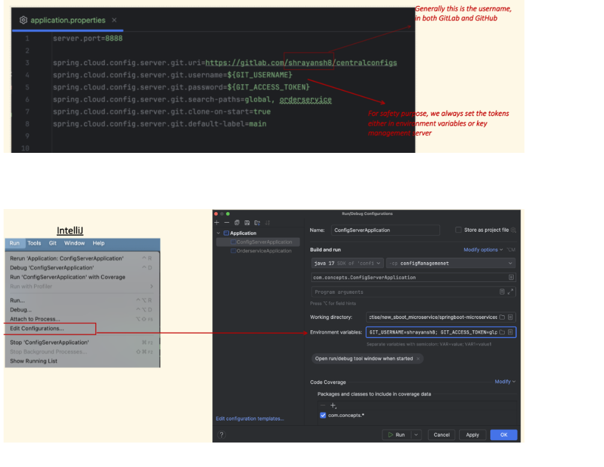

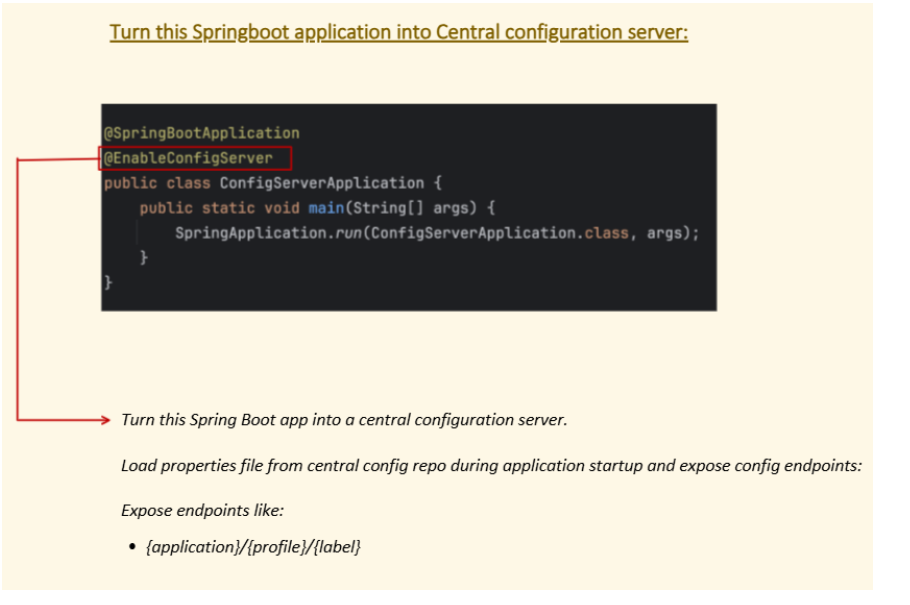

@EnableConfigServer`:

✔ Converts your Spring Boot app → a **full configuration microservice**  
✔ Registers controllers to fetch config  
✔ Creates backend connectors (Git/File/Vault)  
✔ Handles encryption/decryption  
✔ Merges environment-specific configs  
✔ Provides `/application/profile` endpoint  
✔ Supplies properties to all your microservices

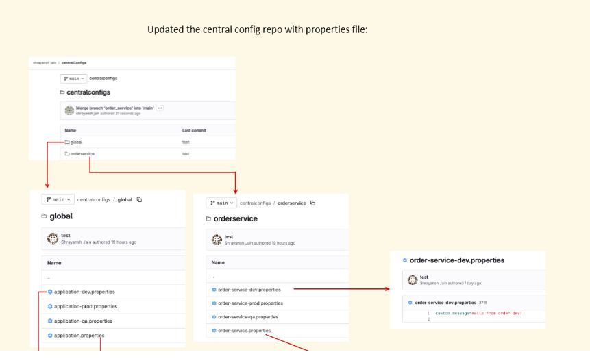

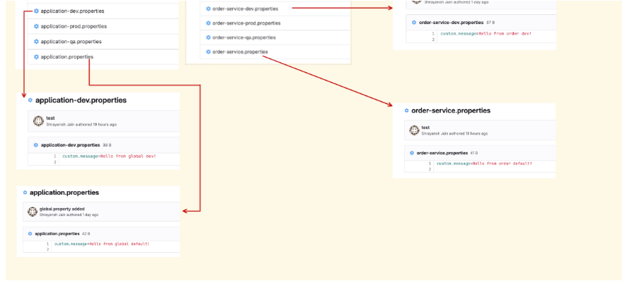

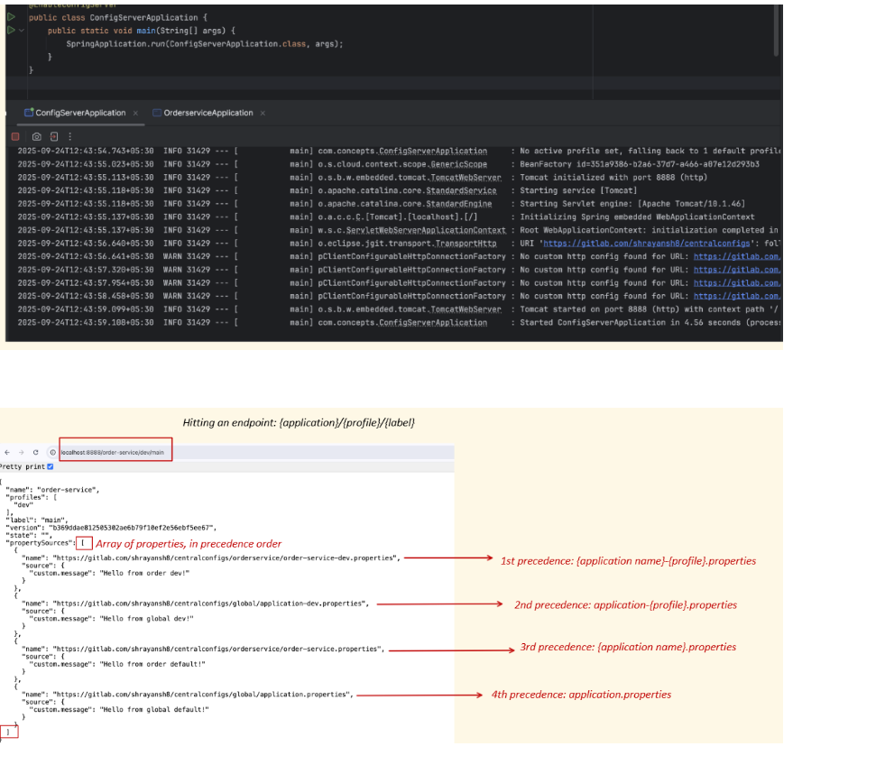

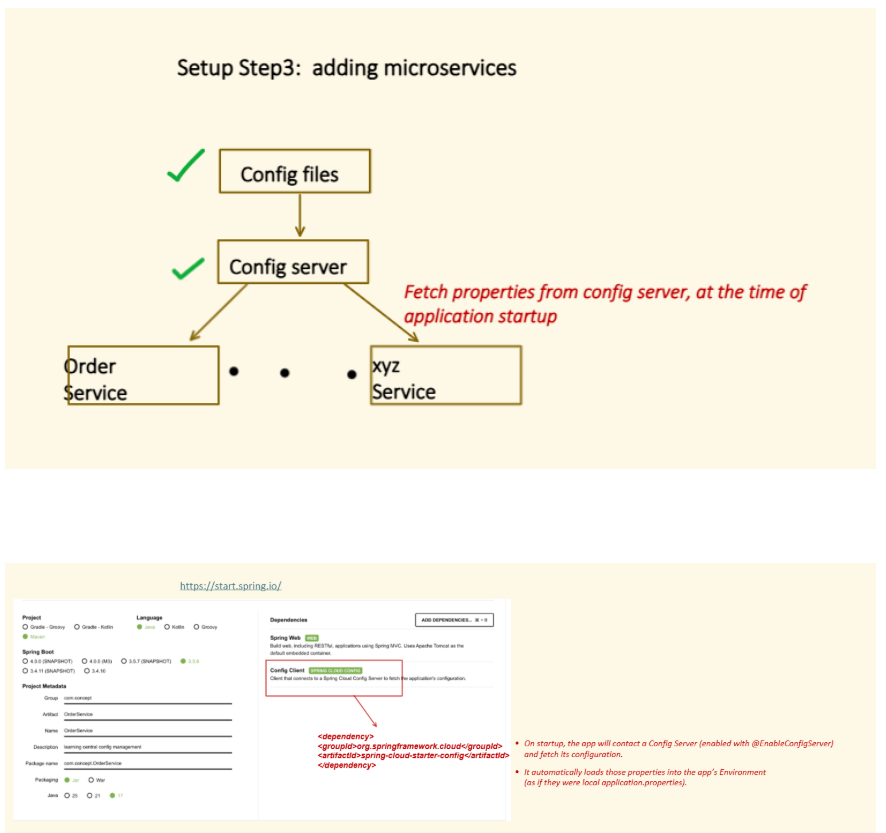

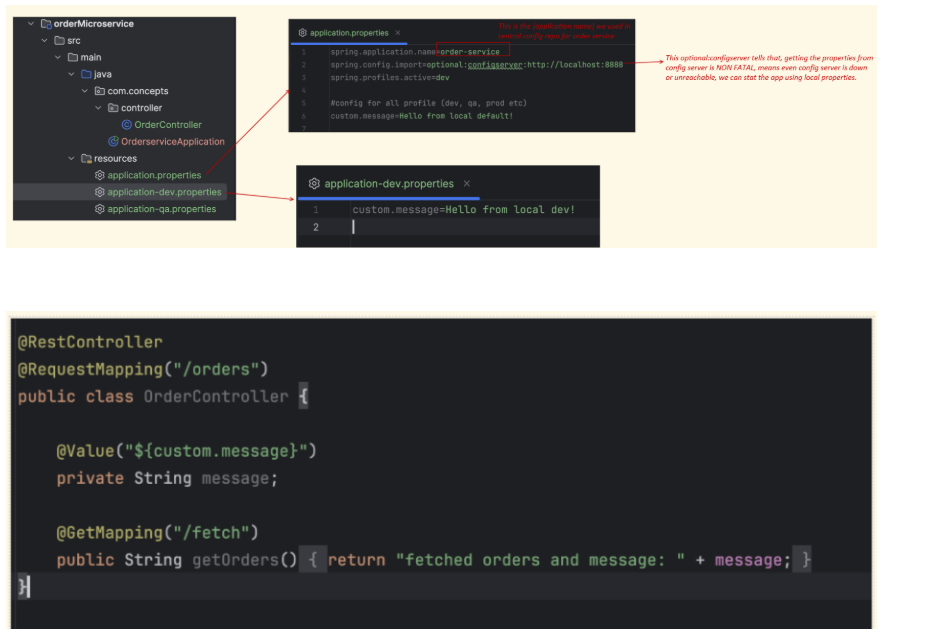

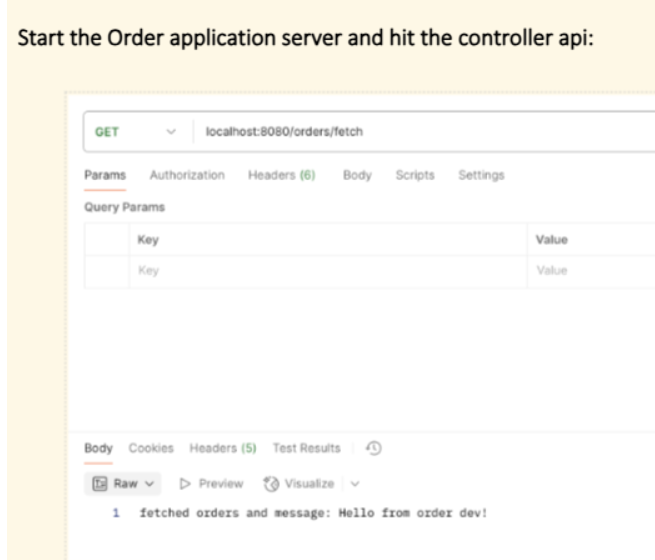

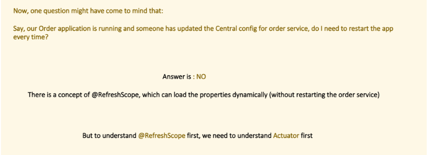

🔥 Spring Cloud Config Server – COMPLETE INTERNAL FLOW (Startup → GitHub)

---

## 🟢 PHASE 1: CONFIG SERVER APPLICATION STARTUP

---

### 1️⃣ JVM starts Config Server app

`main()  → SpringApplication.run()`

Creates:

- `ApplicationContext`

- Loads environment

- Reads `application.yml / application.properties`

---

### 2️⃣ `@EnableConfigServer` is detected

`@EnableConfigServer @SpringBootApplication public class ConfigServerApplication {}`

This triggers:

- Import of **Config Server AutoConfigurations**

Key configs loaded:

- `ConfigServerAutoConfiguration`

- `EnvironmentRepositoryConfiguration`

---

## 🟢 PHASE 2: ENVIRONMENT REPOSITORY SELECTION

---

### 3️⃣ Config Server decides **where configs come from**

Based on properties:

`spring:   cloud:     config:       server:         git:           uri: https://github.com/user/config-repo`

Spring Boot does:

- Reads `spring.cloud.config.server.*`

- Chooses repository type

Possible repos:

- Git

- Native (filesystem)

- Vault

- JDBC

- S3

➡️ Because `git.uri` exists → **GitEnvironmentRepository** chosen

---

### 4️⃣ `GitEnvironmentRepository` bean created

Important fields injected:

- Git URI

- Branch (default: `main`)

- Search paths

- Username/password / token

No Git call yet ❌

---

## 🟢 PHASE 3: EMBEDDED WEB SERVER STARTUP

---

### 5️⃣ Tomcat/Netty starts

Config Server exposes REST endpoints:

`/{application}/{profile} /{application}/{profile}/{label}`

Example:

`/order-service/dev`

---

## 🟢 PHASE 4: FIRST CONFIG REQUEST (IMPORTANT)

⚠️ **Config Server does NOT pull Git at app startup**  
➡️ It pulls **on demand (lazy)**

---

### 6️⃣ Client (or browser) requests config

`GET /order-service/dev`

Handled by:

- `EnvironmentController`

---

## 🟢 PHASE 5: CONFIG FETCH FLOW (INTERNAL)

---

### 7️⃣ `EnvironmentController` calls repository

`environmentRepository.findOne(   application, profile, label )`

---

### 8️⃣ `GitEnvironmentRepository.findOne()` starts

This is where Git is involved.

Steps inside:

---

### 9️⃣ Local working directory check

- Config Server maintains a **local cache directory**

  `/tmp/config-repo/`

If repo **does not exist locally**:  
➡️ Clone

If repo exists:  
➡️ Pull

---

### 🔟 Git clone / pull happens

Internally uses **JGit library** (pure Java Git)

Operations:

- `git clone`

- `git checkout branch`

- `git pull`

✔ Authentication handled here  
✔ Branch/tag respected

---

### 1️⃣1️⃣ Property files located

Based on request:

`order-service-dev.yml order-service.yml application-dev.yml application.yml`

Search paths applied if configured.

---

### 1️⃣2️⃣ Files parsed into PropertySources

Each file becomes:

`MapPropertySource`

Ordered by:

- app > profile > default

---

### 1️⃣3️⃣ Environment object created

`Environment {   name: "order-service"   profiles: ["dev"]   propertySources: [...] }`

Returned to controller.

---

### 1️⃣4️⃣ Response sent to client

JSON response:

`{   "name": "order-service",   "profiles": ["dev"],   "propertySources": [...] }`

---

## 🟢 PHASE 6: CONFIG CLIENT SIDE (BRIEF)

---

### 1️⃣5️⃣ Config Client bootstrap phase

Client startup order:

1. `bootstrap.yml`

2. Connect to Config Server

3. Load external config

4. Merge into Environment

5. Continue app startup

---

## 🟢 PHASE 7: SUBSEQUENT REQUESTS

---

### 🔁 Git is NOT cloned every time

Behavior:

- Uses local copy

- Pulls only if:

    - Refresh triggered

    - Webhook

    - Config request after refresh

---

## 🟢 PHASE 8: REFRESH MECHANISMS

---

### Manual refresh

`POST /actuator/refresh`

---

### Webhook (GitHub → Config Server)

`GitHub push  → Webhook  → /monitor endpoint  → Refresh triggered`

---

## 🟢 PHASE 9: FAILURE HANDLING

---

### GitHub DOWN?

- Config Server uses last pulled copy

- Clients continue working

---

### Config Server DOWN?

- Client startup fails ❌  
  (unless fail-fast disabled)

## 🟢 PHASE 1: CLIENT APPLICATION STARTUP

---

### 1️⃣ JVM starts client application

`main()  → SpringApplication.run()`

---

### 2️⃣ **Bootstrap context is created (VERY IMPORTANT)**

Before main `ApplicationContext`:

`BootstrapApplicationListener  → creates Bootstrap Context`

Purpose:

- Load **external configuration first**

- Runs **before** `@Configuration` beans

---

### 3️⃣ `bootstrap.yml` / `bootstrap.properties` loaded

Example:

`spring:   application:     name: order-service   cloud:     config:       uri: http://localhost:8888       profile: dev`

⚠️ `application.yml` is NOT used yet

---

## 🟢 PHASE 2: CONFIG SERVER COMMUNICATION

---

### 4️⃣ Config Client infrastructure beans created

Key beans:

- `ConfigServicePropertySourceLocator`

- `ConfigClientProperties`

- `RestTemplate` (no LB here unless discovery enabled)

---

### 5️⃣ Config Client calls Config Server

`ConfigServicePropertySourceLocator.locate()`

Makes HTTP call:

`GET http://localhost:8888/order-service/dev`

---

### 6️⃣ Config Server responds with Environment

JSON containing:

- Property sources

- Profiles

- Labels

---

## 🟢 PHASE 3: PROPERTY LOADING & CACHING

---

### 7️⃣ Response converted to PropertySources

Each remote file becomes:

- `MapPropertySource`

---

### 8️⃣ PropertySources added to Environment

Inserted with **high priority**:

`bootstrapProperties > application.yml > defaults`

✔ Remote config overrides local config

---

### 9️⃣ Bootstrap context closes

- External config is now merged

- Values are **fixed in Environment**

---

## 🟢 PHASE 4: MAIN APPLICATION CONTEXT STARTS

---

### 🔟 Main `ApplicationContext` created

Now:

- `application.yml` loaded

- Beans created

- `@Value`, `@ConfigurationProperties` resolved

---

## 🟢 PHASE 5: IS CONFIG CACHED?

### ✔ YES — BUT LOCALLY ONLY

---

### Where is it stored?

✔ In-memory:

- Spring `Environment`

- `PropertySources`

❌ NOT cached on disk  
❌ NOT persisted after restart

---

### What happens on restart?

- Client calls Config Server again

- Reloads config fresh

---

## 🟢 PHASE 6: FAILURE BEHAVIOR

---

### Config Server DOWN during startup

#### Default:

❌ Client startup FAILS (fail-fast)

#### With:

`spring:   cloud:     config:       fail-fast: false`

✔ App starts with local config only

---

## 🟢 PHASE 7: SUBSEQUENT CHANGES

---

### Config changes in Git

Client behavior:

- ❌ Does NOT auto-refresh

- Uses cached Environment values

---

### To refresh dynamically

Options:

- `POST /actuator/refresh`

- Spring Cloud Bus

- Restart app