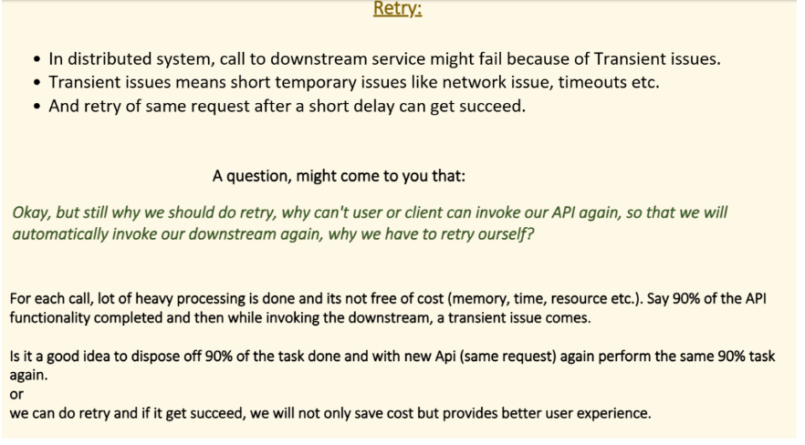

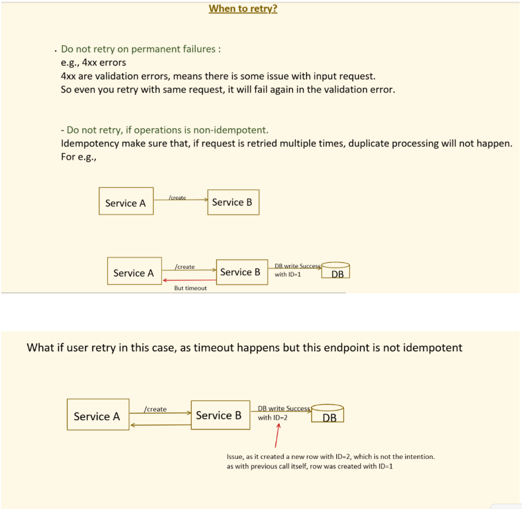

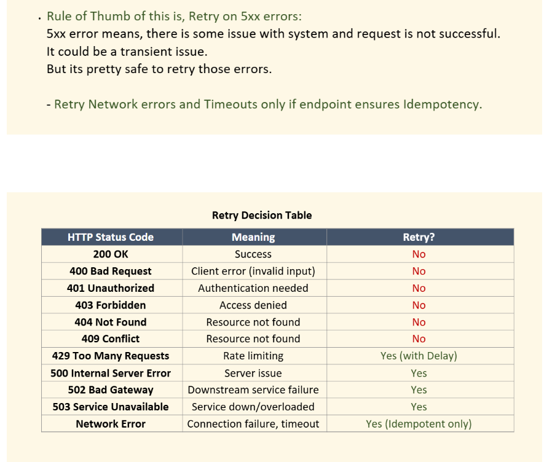

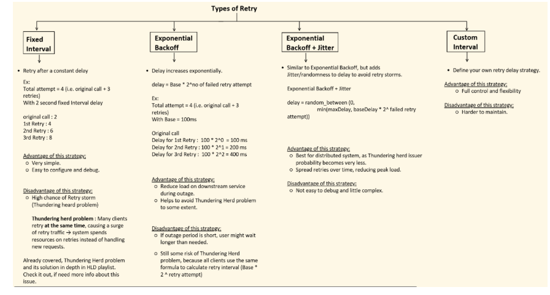

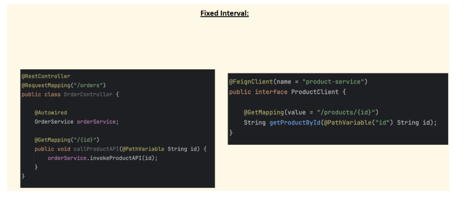

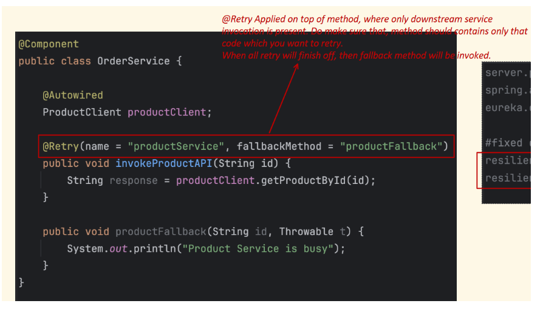

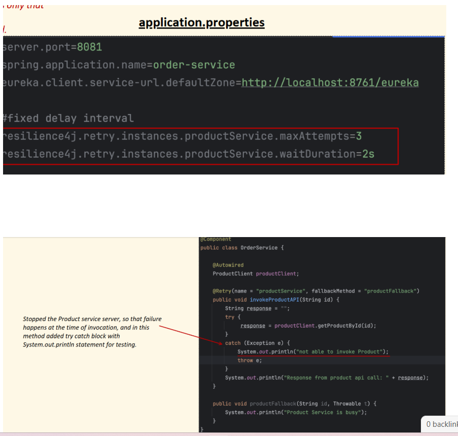

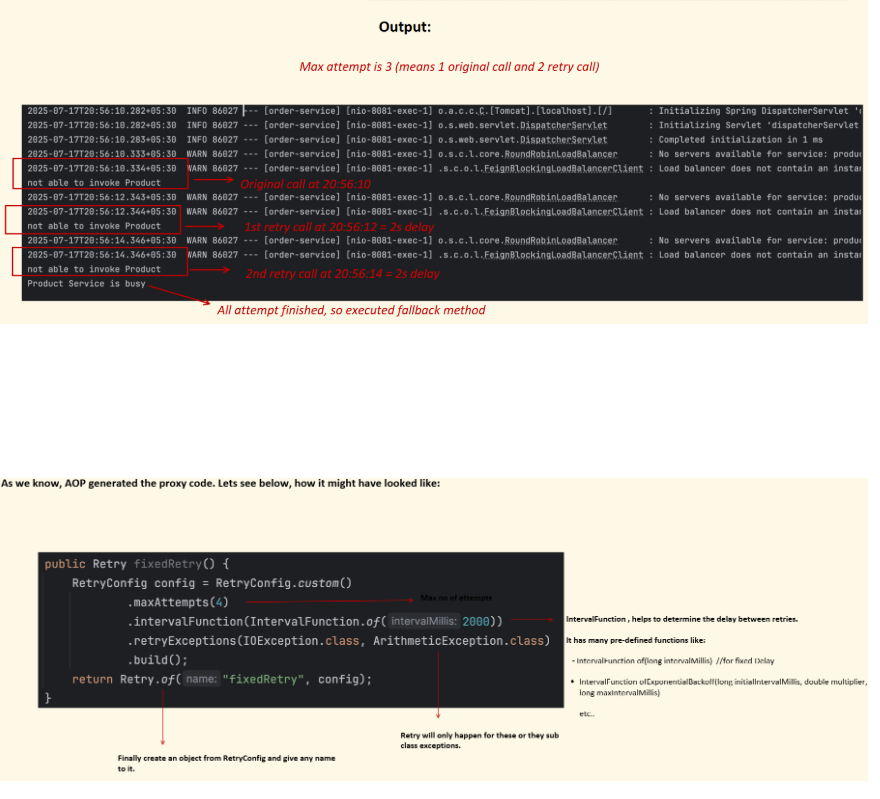

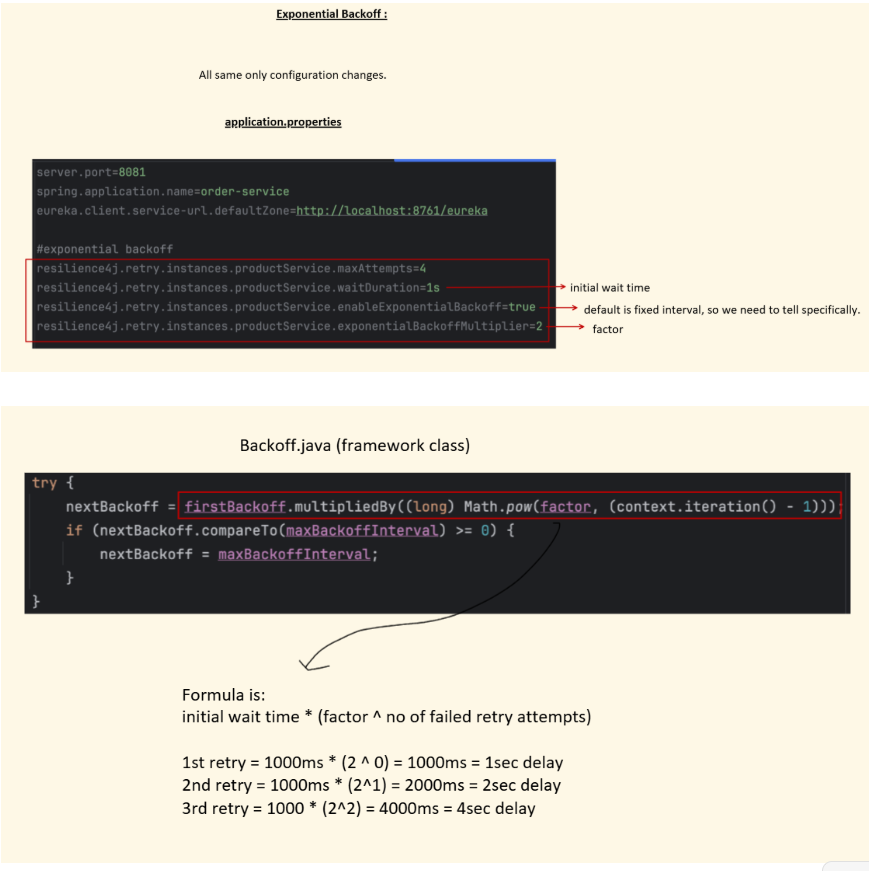

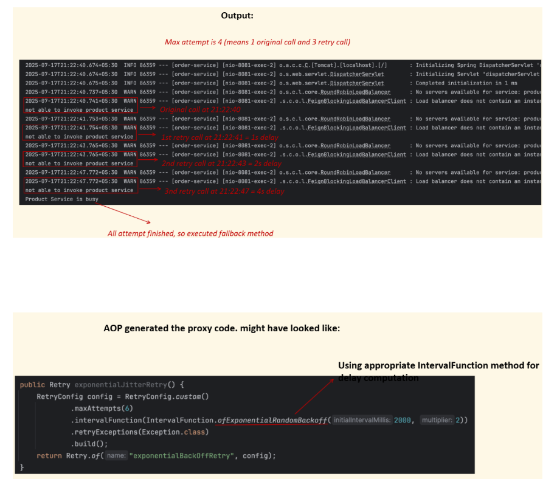

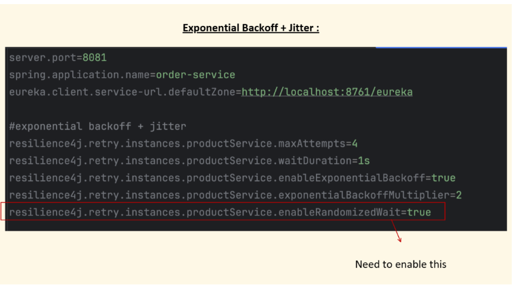

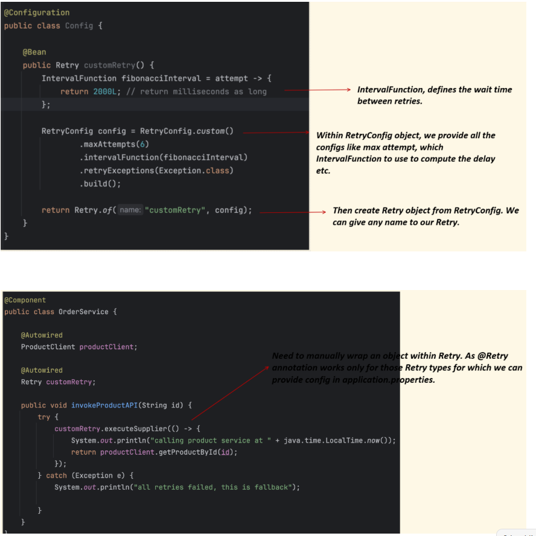

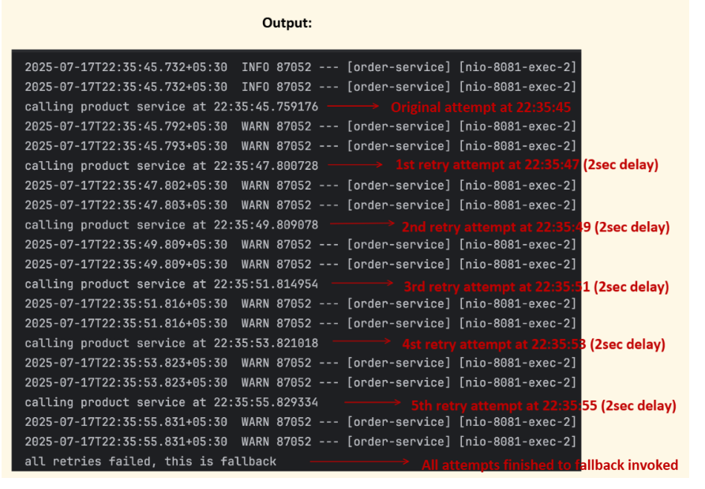

⭐ 1. How Resilience4j Retry Uses AOP Internally

Resilience4j does **not** directly implement retry using Spring AOP.  
Instead, it provides **an Aspect**: `RetryAspect` (from `resilience4j-spring-boot2` or 3).

Spring AOP wraps your annotated method using this aspect.

When you write:

`@Retry(name = "myService") public String callAPI() { ... }`

Spring:

1. Detects `@Retry` annotation.

2. Creates an AOP proxy around your bean.

3. Applies `RetryAspect` as an interceptor.

4. That interceptor internally invokes Resilience4j `Retry` object.


So yes — **AOP is the mechanism**, but **Retry logic is Resilience4j's own loop**.

---

# ⭐ 2. Internal Flow of Resilience4j Retry with AOP

Here is the real pipeline:

`Your Method → Proxy → RetryAspect → Retry.decorateFunction(...) → Actual Method Execution`

Or visually:

```
Client  
  ↓  
Spring Proxy (AOP)  
  ↓  
RetryAspect (advice)  
  ↓  
RetryExecutor (from Resilience4j)  
  ↓  
Your actual method  

```

---

# ⭐ 3. What RetryAspect Actually Does (internal code)

The aspect wraps method invocation like this:

### Pseudocode (internally accurate):

```
public Object aroundAdvice(ProceedingJoinPoint pjp, Retry retry) {

    Retry retryConfig = retryRegistry.retry(retry.name());

    // Wrap the method invocation in a Retry
    Callable<Object> callable = Retry.decorateCallable(retryConfig, () -> {
        return pjp.proceed();
    });

    try {
        return callable.call();
    } catch (Throwable t) {
        throw t;
    }
}

```

So the key things:

- The method is wrapped inside a `Callable`

- That callable is decorated by a **Retry executor**

- Retry executor handles: attempts, backoff, jitter, retryEvents


### 📌 This is roughly how `Retry.decorateCallable(...)` works internally:


```
public <T> T executeCallable(Callable<T> callable) throws Exception {

    int attempt = 1;

    while (true) {
        try {
            // Try to execute your method
            T result = callable.call();

            // Success event
            publishRetryEvent(RetryEvent.Type.SUCCESS, attempt);

            return result;  // return on success

        } catch (Exception e) {

            publishRetryEvent(RetryEvent.Type.ERROR, attempt);

            if (attempt >= maxAttempts) {
                // No more retries left → rethrow error
                throw e;
            }

            // Calculate wait duration using backoff config
            long waitDuration = backoffFunction.apply(attempt);

            // Sleep for backoff (may include jitter)
            Thread.sleep(waitDuration);

            attempt++;   // next retry
        }
    }
}

```