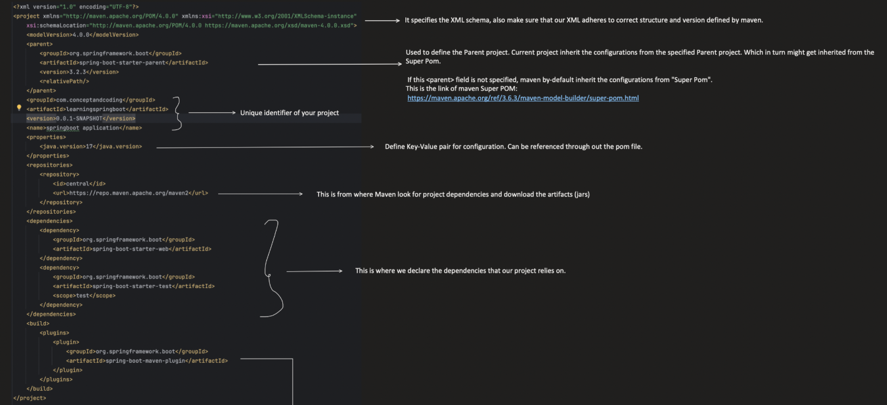
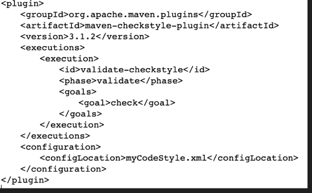
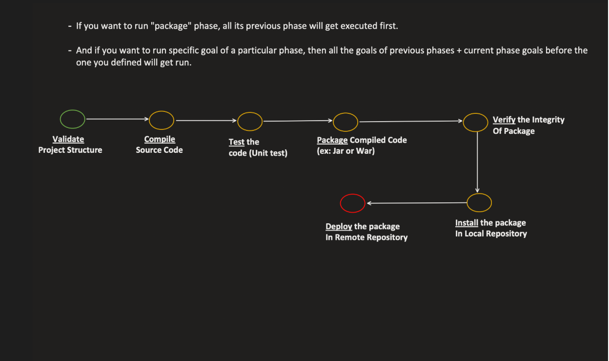
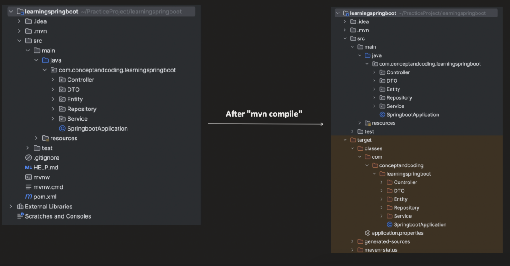
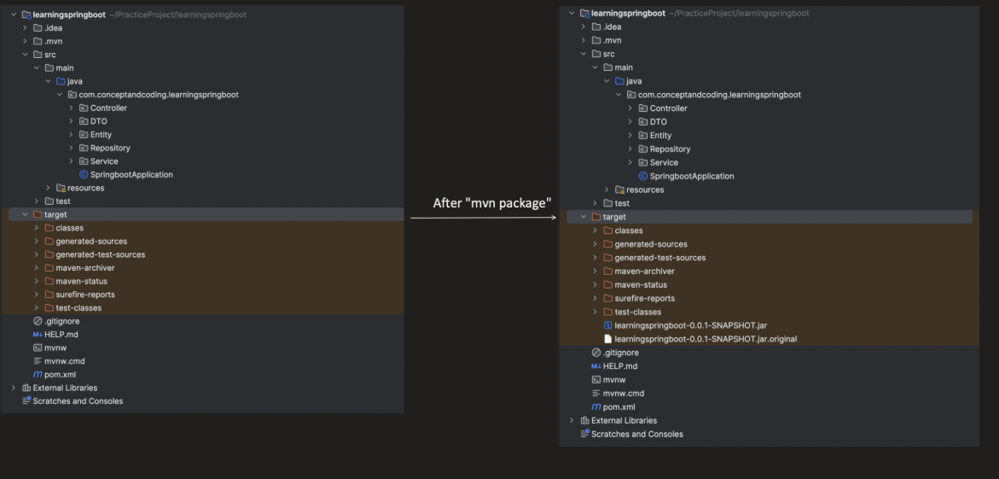
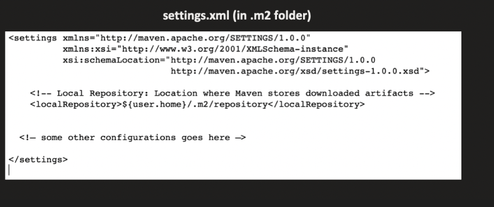
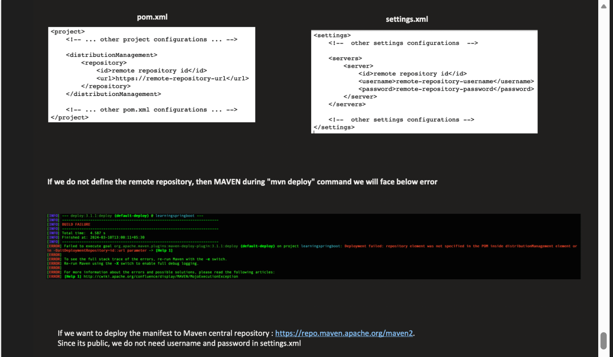

Maven: 

    -- Maven is a project management tool which helps developers in
           1. Build generation
           2. Dependency Management

    --It uses pom.xml to acheive this
    
    --When we give mvn command it looks for pom.xml in the current directory and resolves dependencies

1. Build Generation : 
       
          -- Without maven you have to remember long commands to basically do each and every stuff
              like compile, deploy, test etc
                      -- With maven we have short commands like mvn install, mvn clean etc

          -- Without maven there is a  possiblity that without installing we might deploy(no order is guaranteed if done manually)
                   -- With maven even if u give mvn deploy all the before lifecycles will be executed first(order is guaranteed)

2. Dependency Management :
           
-- Without maven we need to manually download jars
       -- With maven all dependencies are downloaded automatically by maven

✅ Maven standard directory structure

        src/
        ├── main/
        │    ├── java/
        │    └── resources/
        └── test/
        ├── java/
        └── resources/

------------------------------------------------------------------------------------------------------------------------

1. <?xml version="1.0" encoding="UTF-8"?>
        Which XML version is used
        Which character encoding is used
------------------------------------------------------------------------------------------------------------------------

------------------------------------------------------------------------------------------------------------------------
2. 

         <project xmlns="http://maven.apache.org/POM/4.0.0"
            xmlns:xsi="http://www.w3.org/2001/XMLSchema-instance"
            xsi:schemaLocation="
            http://maven.apache.org/POM/4.0.0            
            http://maven.apache.org/xsd/maven-4.0.0.xsd">
            <modelVersion>4.0.0</modelVersion>
            so on</project>

<project> </project>

        “Everything inside belongs to one Maven project.”

--> xmlns="http://maven.apache.org/POM/4.0.0"

        This says: “This XML follows Maven POM rules version 4.0.0.”

--> maven-4.0.0.xsd
       
        This file defines:

Which tags are allowed , In what order, Which tags are mandatory, Data types

Example rules inside XSD:

    <groupId> must be a string
    <dependencies> can contain <dependency>
    <modelVersion> is mandatory

-- They just specify what schemas we need to use inside this project

------------------------------------------------------------------------------------------------------------------------

------------------------------------------------------------------------------------------------------------------------

3. parent: 

         -- Every pom.xml is a child of other pom
         -- If parent is not mentioned super pom will be the parent

----> When you define a parent, the child automatically inherits:

            ✔ dependency versions
            ✔ plugin configurations
            ✔ properties (like Java version)
            ✔ build settings
            
            Without rewriting them.

-----> 6️⃣ How Maven resolves parent POM

      Order:
      
            relativePath (local parent)
            Local repository (.m2)
            Remote repository (Maven Central)
      
      If found → inherit config.

-----> Example : If u use spring starter parent with a specific versions no need to provide versions for other spring modules like starter web, statre dat jpa etc

      <parent>
          <groupId>org.springframework.boot</groupId>
          <artifactId>spring-boot-starter-parent</artifactId>
          <version>2.7.18</version>
          <relativePath/>
      </parent>

----> Super POM binds plugins for build lifecycle that is why we just give mvn compile and code executed

---> Current project will inherit configuration from parent

------------------------------------------------------------------------------------------------------------------------

4. groupId :ArtifactId : version :

           These 3 helps in uniquely identifying a project

           -- groupId : which package or which organization owns it
           -- artifactId : name of the project
           -- version : which build of this project

------------------------------------------------------------------------------------------------------------------------

5. properties :
                
              Used for defining a variable which can be used anywhere

---> Write once use anywhere

      Example :
         <properties>
         <java.version>17</java.version>
         <spring.version>5.3.30</spring.version>
         </properties>
      
      
         <dependency>
          <groupId>org.springframework</groupId>
          <artifactId>spring-context</artifactId>
          <version>${spring.version}</version>
         </dependency>

------------------------------------------------------------------------------------------------------------------------

6. repositories :

           -- This is the place from where all dependencies are downloaded or resolved
Example:

      <repository>
          <id>central</id>
          <name>Maven Central Repository</name>
          <url>https://repo.maven.apache.org/maven2</url>
      </repository>

---> This maven central repo is already defined in super Pom, so no need to add this

---> How Maven searches repositories (order)

      1️⃣ Local repository (~/.m2)
      2️⃣ Maven Central
      3️⃣ Repositories defined in <repositories>

---> You need it when dependencies are in:

      Company/private repositories
      Internal libraries
      Third-party repos not in Maven Central
      Snapshot repositories

Examples of Maven repositories

✅ Valid Maven repos

Maven Central

      GitHub Packages
      JFrog Artifactory
      Nexus
      JitPack

❌ Not Maven repos

      GitHub source repo
      GitLab source repo
      Bitbucket source repo

------------------------------------------------------------------------------------------------------------------------

7. Dependencies

           -- Represents another artifact which is required to run our project

         <dependency>
             <groupId>org.springframework</groupId>
             <artifactId>spring-context</artifactId>
             <version>5.3.30</version>
             <scope>compile</scope>
         </dependency>

      | Scope      | What it means                                                          |
      | ---------- | ---------------------------------------------------------------------- |
      | `compile`  | Default. Needed to compile and run                                     |
      | `test`     | Only needed for tests                                                  |
      | `runtime`  | Needed to run, but not to compile                                      |
      | `provided` | Needed for compile, but already provided at runtime (like servlet-api) |

--> Maven first checks the local /.m2 repository to load these jar files , if not dound it downloads from maven central repo or the repo provided by us in repository
--> Maven loads these jars based on scopes , if the scope is compile it loads during compilation itself , else if it is runtime it does a lazy load

------------------------------------------------------------------------------------------------------------------------

8. **Build :**

         -- defines how a Maven should build our project
         -- This is the phase where code gets compiled, packaged, deployed etc
         This includes:
         
               Where to put compiled classes
               Which plugins to run
               Packaging options

Example :

         <build>
             <sourceDirectory>src/main/java</sourceDirectory>
             <outputDirectory>target/classes</outputDirectory>
         
             <plugins>
                 <!-- List of plugins to use -->
             </plugins>
         </build>

| Element                 | Purpose                                                             |
| ----------------------- | ------------------------------------------------------------------- |
| `<sourceDirectory>`     | Where Maven finds your Java source files (default: `src/main/java`) |
| `<testSourceDirectory>` | Where Maven finds test source files (default: `src/test/java`)      |
| `<outputDirectory>`     | Where compiled classes go (default: `target/classes`)               |
| `<testOutputDirectory>` | Compiled test classes go here (default: `target/test-classes`)      |
| `<finalName>`           | Name of the final artifact (jar/war)                                |
| `<plugins>`             | Plugins to customize build steps                                    |
| `<pluginManagement>`    | Define plugin versions & configs for child projects (optional)      |

--> Super pom by defayult has provided these paths if you neeed to change we can change

------------------------------------------------------------------------------------------------------------------------

**Plugin :**

      -- Plugins are collection of goals that perfoem some specific tasks
      -- Plugins are just java codes and methods

| Task                  | Plugin that does it                     |
| --------------------- | --------------------------------------- |
| Compile Java code     | `maven-compiler-plugin`                 |
| Run unit tests        | `maven-surefire-plugin`                 |
| Package JAR/WAR       | `maven-jar-plugin` / `maven-war-plugin` |
| Install to local repo | `maven-install-plugin`                  |
| Deploy to remote repo | `maven-deploy-plugin`                   |
| Generate site reports | `maven-site-plugin`                     |

Basic Plugin Syntax:

      
      <build>
          <plugins>
              <plugin>
                  <groupId>org.apache.maven.plugins</groupId>
                  <artifactId>maven-compiler-plugin</artifactId>
                  <version>3.10.1</version>
                  <configuration>
                      <source>17</source>
                      <target>17</target>
                  </configuration>
              </plugin>
          </plugins>
      </build>

---> We can manually create a new maven phase for executing our plugins or we can bind our plugin to any one of the existing build phase

---------------------------------------------------------------------------------------------------------------------------------
**Build Lifecycle**

| Phase        | Purpose                                                                                                   |
| ------------ |-----------------------------------------------------------------------------------------------------------|
| **validate** | Check if POM is correct, required info present                                                            |
| **compile**  | Compile main source code (`src/main/java`) into bytecode and saves it in {project.basedir}/target/classes |
| **test**     | Run unit tests (`src/test/java`)                                                                          |
| **package**  | Package compiled code into JAR/WAR  and saves it in {project.basedir}/target                              |
| **verify**   | Run any checks on the package (QA, code quality)                                                          |
| **install**  | Install the artifact(our app's .jar file) into the **local Maven repo** (`~/.m2`)                         |
| **deploy**   | Deploy the artifact to a **remote repository**(specified in distribution management) for sharing          |

---> We can change the local m2 repo's location in settings.xml in .m2 folder

**distribution management :**

-- Defines where our .jar/artifacts need to be deployed , if you need to deploy you need to provide this else will get error

      <distributionManagement>
          <repository>
              <id>internal-repo</id>
              <name>Internal Release Repository</name>
              <url>https://repo.mycompany.com/maven2/releases</url>
          </repository>
      
          <snapshotRepository>
              <id>internal-snapshots</id>
              <name>Internal Snapshot Repository</name>
              <url>https://repo.mycompany.com/maven2/snapshots</url>
          </snapshotRepository>
      
          <site>
              <id>company-site</id>
              <url>scp://server/path/to/site</url>
          </site>
      
          <downloadUrl>https://downloads.mycompany.com/project</downloadUrl>
      </distributionManagement>

| Element                | Purpose                                                     |
| ---------------------- | ----------------------------------------------------------- |
| `<repository>`         | Where **release artifacts** are deployed (`mvn deploy`)     |
| `<snapshotRepository>` | Where **snapshot artifacts** are deployed (`1.0-SNAPSHOT`)  |
| `<site>`               | Where project documentation is deployed (`mvn site-deploy`) |
| `<downloadUrl>`        | Optional; URL for users to download the artifact            |

| Feature         | Snapshot                | Release           |
| --------------- | ----------------------- | ----------------- |
| Version         | `1.0-SNAPSHOT`          | `1.0`             |
| Mutable         | Yes (can be updated)    | No (immutable)    |
| Repository      | `<snapshotRepository>`  | `<repository>`    |
| Use case        | Active development      | Stable, final use |
| Download policy | Maven checks for latest | Cached forever    |

---------------------------------------------------------------------------------------------------------------------------------------

What is packaging?

<packaging> tells Maven what type of artifact your project will produce.
The type determines:

      What Maven plugins are used by default
      What the output artifact is (jar, war, etc.)
      How Maven handles the lifecycle phases

---> By default if nothing is provided the default it takes jar

      <packaging> jar <packaging>

if Packaging is Pom there is no code for it only pom

-------------------------------------------------------------------------------------------------------------------------------------

2️⃣ <dependencyManagement> vs <dependencies>

Difference:

Tag	Purpose	Usage
<dependencyManagement>	Define versions and configuration centrally for child modules	Child POMs don’t automatically get the dependency; must declare in <dependencies>
<dependencies>	Add the actual dependency to the project	Project will include it in classpath

Example (parent POM):

      <dependencyManagement>
          <dependencies>
              <dependency>
                  <groupId>org.springframework</groupId>
                  <artifactId>spring-core</artifactId>
                  <version>5.3.30</version>
              </dependency>
          </dependencies>
      </dependencyManagement>

Child POM:

      <dependencies>
          <dependency>
              <groupId>org.springframework</groupId>
              <artifactId>spring-core</artifactId>
              <!-- version inherited from dependencyManagement -->
          </dependency>
      </dependencies>

Why use it:

Avoids version conflicts across multiple child modules.

Centralizes dependency version management.

-------------------------------------------------------------------------------------------------------------------------------------

3️⃣ <pluginManagement> vs <plugins>

Difference:

Tag	Purpose
<pluginManagement>	Only defines plugin versions and configuration for children; does not execute plugins
<plugins>	Actually binds and executes the plugin in the current build

Example (parent POM):

      <build>
          <pluginManagement>
              <plugins>
                  <plugin>
                      <groupId>org.apache.maven.plugins</groupId>
                      <artifactId>maven-compiler-plugin</artifactId>
                      <version>3.10.1</version>
                  </plugin>
              </plugins>
          </pluginManagement>
      </build>

Child POM executes plugin:

      <build>
          <plugins>
              <plugin>
                  <groupId>org.apache.maven.plugins</groupId>
                  <artifactId>maven-compiler-plugin</artifactId>
                  <!-- version inherited from pluginManagement -->
                  <configuration>
                      <source>17</source>
                      <target>17</target>
                  </configuration>
              </plugin>
          </plugins>
      </build>

✅ Key point: pluginManagement is for standardization, <plugins> is for execution.

--------------------------------------------------------------------------------------------------------------------------------

4️⃣ Local repo override

By default, Maven uses ~/.m2/repository.

You can override:

      In settings.xml:
      
      <localRepository>/custom/maven/repo</localRepository>

Command line:

      mvn install -Dmaven.repo.local=/custom/path

Why needed:

      For isolated builds
      For CI/CD pipelines
      To avoid polluting default repo

------------------------------------------------------------------------------------------------------------------------------------