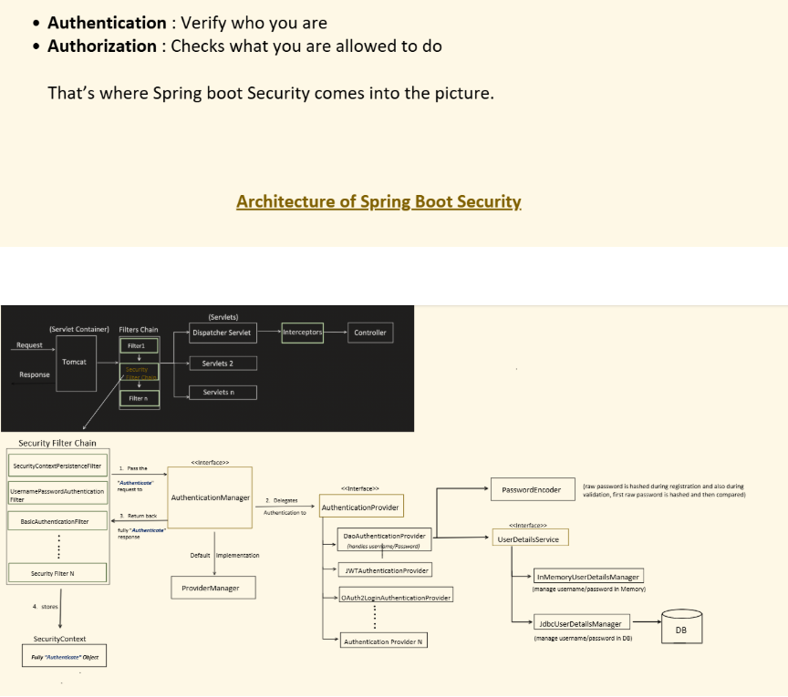

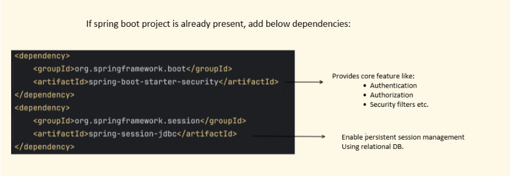


| **Component**                            | **Definition**                                                                         | **Purpose / Use**                                                                                      |
| ---------------------------------------- | -------------------------------------------------------------------------------------- | ------------------------------------------------------------------------------------------------------ |
| **SecurityFilterChain**                  | A chain of filters defined by Spring Security that processes every incoming request.   | Controls what filters apply (login, logout, session, etc.) and in what order.                          |
| **FilterChainProxy**                     | Central dispatcher that delegates requests through the SecurityFilterChain.            | Ensures the right filters are applied to each request.                                                 |
| **AuthenticationManager**                | Core interface responsible for authenticating a request.                               | Verifies credentials and returns an `Authentication` object if successful.                             |
| **Authentication**                       | Represents the current user's identity and credentials.                                | Contains username, password, authorities (roles), etc.                                                 |
| **AuthenticationProvider**               | Strategy interface used by `AuthenticationManager` to perform authentication logic.    | Each provider knows how to verify a particular type of authentication (e.g. username-password, token). |
| **UserDetailsService**                   | Loads user-specific data from database or memory.                                      | Provides `UserDetails` object to the AuthenticationProvider.                                           |
| **UserDetails**                          | Model that represents a user with username, password, and roles.                       | Used internally during authentication and authorization.                                               |
| **PasswordEncoder**                      | Used to hash and verify passwords.                                                     | Ensures secure password storage (e.g., BCrypt, Argon2).                                                |
| **SecurityContext**                      | Holds the security information (Authentication object) for the current request/thread. | Keeps track of who is currently authenticated.                                                         |
| **SecurityContextHolder**                | Static helper class that stores the `SecurityContext` (usually in a ThreadLocal).      | Makes authentication info globally accessible within the request.                                      |
| **GrantedAuthority**                     | Represents a permission or role assigned to the user.                                  | Used in authorization checks (like `@PreAuthorize("hasRole('ADMIN')")`).                               |
| **AccessDecisionManager**                | Makes authorization decisions based on the user's roles and requested resource.        | Works with `AccessDecisionVoter`s to allow/deny access.                                                |
| **AccessDecisionVoter**                  | Votes whether access should be granted or denied.                                      | Typically checks roles, expressions, or custom logic.                                                  |
| **SecurityContextPersistenceFilter**     | The first filter in chain; loads and saves `SecurityContext` between requests.         | Maintains authentication across sessions.                                                              |
| **UsernamePasswordAuthenticationFilter** | Handles login form submission.                                                         | Extracts username & password, delegates to AuthenticationManager.                                      |
| **ExceptionTranslationFilter**           | Handles `AccessDeniedException` and `AuthenticationException`.                         | Redirects to login page or returns 403/401 responses.                                                  |
| **FilterSecurityInterceptor**            | Final filter that performs authorization decisions.                                    | Checks if the current user has permission to access the requested resource.                            |


## 🔐 3. Authentication Flow (Step-by-step)

**When a user logs in (form-based or basic auth):**

1. **User submits credentials** (username/password).

2. `UsernamePasswordAuthenticationFilter` intercepts the request.

3. It creates an **Authentication token** (unauthenticated).

4. Passes it to the **AuthenticationManager**.

5. `AuthenticationManager` delegates to one or more **AuthenticationProviders**.

6. The `DaoAuthenticationProvider` calls `UserDetailsService.loadUserByUsername()` to get the `UserDetails`.

7. Password is verified using a **PasswordEncoder**.

8. On success, returns a fully authenticated `Authentication` object.

9. Stored in the **SecurityContext** (via `SecurityContextHolder`).

10. The user is now authenticated, and requests can use that authentication info.


---------------------------------------------------------------------------------

Client Request
↓
DelegatingFilterProxy (from Spring Boot)
↓
FilterChainProxy  ⭐ (Spring Security core)
↓
SecurityFilterChain (list of filters)
↓
Controller

### SecurityFilterChain


A **SecurityFilterChain** is a sequence of filters that Spring Security applies to each request to enforce authentication and authorization.

#### 🔹 Use:

- Each request is matched to a filter chain (based on URL patterns).

- Defines what security rules (e.g., login, authorization, CSRF, etc.) apply.


#### 🔹 Example:

When you configure Spring Security:

```
@Bean
public SecurityFilterChain filterChain(HttpSecurity http) throws Exception {
    http
        .authorizeHttpRequests(auth -> auth
            .requestMatchers("/admin/**").hasRole("ADMIN")
            .anyRequest().authenticated())
        .formLogin();
    return http.build();
}

```

👉 The filters (like login filter, CSRF filter, etc.) form the `SecurityFilterChain`.


2️⃣ **FilterChainProxy**

#### 🔹 Definition:

The **FilterChainProxy** is the central dispatcher that holds all `SecurityFilterChain`s and ensures that each incoming request runs through the right chain.

#### 🔹 Use:
- It delegates requests to the correct `SecurityFilterChain` based on path match.
- Acts as the **entry point** of Spring Security in the servlet container.

#### 🔹 Analogy:

Think of it like a “traffic controller” — it checks _which filter chain_ should handle a given request.
#### 🔹 Example:

You rarely configure it directly — it’s automatically registered by Spring Security.


### 3️⃣ **SecurityContextPersistenceFilter**

#### 🔹 Definition:

The **first filter** in the chain that manages the `SecurityContext` lifecycle for each request.

#### 🔹 Use:

- Loads the `SecurityContext` (user authentication info) from the session or other storage.

- Saves it back after the request completes.


#### 🔹 Example:

If a user is already logged in (session exists), this filter restores that user’s authentication details into the thread context.

#### 🔹 Key Role:

Keeps the authentication info available for the entire duration of the request.


## 🧱 1️⃣ `Filter` (Servlet Filter)

### 🔹 Definition:

A **`Filter`** is a standard **Java EE (Jakarta Servlet)** component that intercepts requests **before** they reach a servlet (like Spring’s DispatcherServlet).

It belongs to the **Servlet API**, not Spring specifically.

---

### 🔹 Purpose:

- To pre-process or post-process HTTP requests and responses.

- Common use cases: logging, authentication, compression, CORS, etc.


---

### 🔹 Lifecycle:

- Declared in `web.xml` (old style) or registered automatically by Spring Boot.

- Each filter has methods:


```
void init(FilterConfig config);
void doFilter(ServletRequest req, ServletResponse res, FilterChain chain);
void destroy();

```


    **Any Java web server (Servlet Container)** — like **Tomcat**, **Jetty**, **Undertow**, **GlassFish**, **WebLogic**, **WildFly**, etc. —  
must support and automatically call filters for matching requests.

---

### 🔹 How it Works:

Each incoming request passes through the **filter chain**:

`Client → Filter1 → Filter2 → ... → DispatcherServlet → Controller`

Each filter can:

- Allow the request to proceed (`chain.doFilter(request, response)`), or

- Block/redirect it (e.g., if user not authenticated).


## 2️⃣ `DelegatingFilterProxy`

### 🔹 Definition:

A **Spring-provided Filter** that acts as a _bridge_ between the **Servlet container (like Tomcat)** and the **Spring ApplicationContext**.

It’s the **entry point** for Spring Security into the servlet filter chain.

---

### 🔹 Why We Need It:

Servlet containers (like Tomcat) only know about _servlet filters_ —  
they have no idea about Spring beans or contexts.

But Spring Security filters (like `UsernamePasswordAuthenticationFilter`, `CsrfFilter`, etc.) are **Spring-managed beans** — not plain servlet filters.

👉 So we need something that can **delegate** from the servlet world → Spring world.

That’s what `DelegatingFilterProxy` does.

---

### 🔹 How It Works:

1. `DelegatingFilterProxy` is registered in the servlet container as a normal `Filter`.

2. When a request comes, it looks up a Spring-managed bean by name — typically `"springSecurityFilterChain"`.

3. It delegates all filtering logic to that bean (which is a `FilterChainProxy` managed by Spring Security).


So effectively:

`Client → DelegatingFilterProxy → FilterChainProxy → (Spring Security Filters)`

---

### 🔹 Default Bean It Looks For:

`springSecurityFilterChain`

This bean is automatically created by Spring Security and represents the **entire security filter chain**.


------------------------------------------------------------------------------------------

|Concept|Explanation|
|---|---|
|`DelegatingFilterProxy`|A normal servlet filter that delegates work to a Spring bean.|
|How it finds the bean|It looks up the WebApplicationContext stored in `ServletContext`.|
|Bean name used|`"springSecurityFilterChain"` (by default).|
|What that bean is|A Spring-managed `FilterChainProxy`.|
|Why needed|Servlet container doesn’t know Spring beans; this proxy bridges the gap.|
- **Tomcat** registers **only one** Spring-aware filter:  
  → `DelegatingFilterProxy` (created by Tomcat).

- `DelegatingFilterProxy` finds the **Spring ApplicationContext**.

- Inside that context, it looks for a bean named `springSecurityFilterChain`.

- That bean is a `FilterChainProxy`.

- `FilterChainProxy` internally holds the **list of all Spring Security filters**.

- For each request, `DelegatingFilterProxy` calls `FilterChainProxy.doFilter()`, and _that method_ runs all internal filters sequentially.


| Name                            | Type                       | Who creates it                        | Meaning / Role                                                                                                              |
| ------------------------------- | -------------------------- | ------------------------------------- | --------------------------------------------------------------------------------------------------------------------------- |
| **`springSecurityFilterChain`** | 🧱 **Bean name**           | Spring (auto-registered)              | This is the **Spring bean name** given to the **FilterChainProxy** object.                                                  |
| **`FilterChainProxy`**          | ⚙️ **Class (object type)** | Spring Security                       | The **main filter engine** — holds and executes one or more `SecurityFilterChain`s.                                         |
| **`SecurityFilterChain`**       | 📦 **Interface / Object**  | Built from your `HttpSecurity` config | Represents **one chain of security filters** mapped to a specific set of request matchers (like `/api/**`, `/login`, etc.). |
|                                 |                            |                                       |                                                                                                                             |
|                                 |                            |                                       |                                                                                                                             |
|                                 |                            |                                       |                                                                                                                             |


`FilterChainProxy` **contains** a list of `SecurityFilterChain` objects.
📦 `SecurityFilterChain` = **individual rule-set** (filters + URL matchers)


1️⃣ `Authentication` — the identity representation

### 🔹 What it is

It’s an **interface** representing the **principal (user)** and their **credentials, roles, and status**.

This object travels across the authentication flow and ends up in the SecurityContext.

### 🔹 Interface definition (simplified)

```
public interface Authentication extends Principal, Serializable {
    Collection<? extends GrantedAuthority> getAuthorities();
    Object getCredentials();
    Object getDetails();
    Object getPrincipal();
    boolean isAuthenticated();
    void setAuthenticated(boolean isAuthenticated);
}

```

### 🔹 Typical implementations

|Class|Purpose|
|---|---|
|`UsernamePasswordAuthenticationToken`|Used for username/password authentication|
|`JwtAuthenticationToken`|Used for JWT token-based authentication|
|`AnonymousAuthenticationToken`|Used when no user is logged in|

### 🔹 Two phases

|Phase|Description|
|---|---|
|**Pre-authentication**|Username + password, but not yet validated (`authenticated=false`)|
|**Post-authentication**|Fully validated, with authorities (`authenticated=true`)|

🧠 Example:

```
// Before authentication
Authentication unauth = new UsernamePasswordAuthenticationToken("john", "12345");

// After authentication
Authentication auth = new UsernamePasswordAuthenticationToken(userDetails, null, userDetails.getAuthorities());

```

public class UsernamePasswordAuthenticationToken extends AbstractAuthenticationToken {


```
public class UsernamePasswordAuthenticationToken extends AbstractAuthenticationToken {

    private final Object principal;   // username or UserDetails
    private Object credentials;        // password

    // 1️⃣ Constructor for BEFORE authentication
    public UsernamePasswordAuthenticationToken(Object principal, Object credentials) {
        super(null);                   // No authorities yet
        this.principal = principal;
        this.credentials = credentials;
        setAuthenticated(false);
    }

    // 2️⃣ Constructor for AFTER authentication
    public UsernamePasswordAuthenticationToken(Object principal,
                                               Object credentials,
                                               Collection<? extends GrantedAuthority> authorities) {
        super(authorities);             // Now includes roles/authorities
        this.principal = principal;
        this.credentials = credentials;
        super.setAuthenticated(true);   // Mark as authenticated
    }
}

```


|**Phase**|**Constructor Used**|**Who Creates It**|**What It Contains**|**isAuthenticated**|
|---|---|---|---|---|
|**Before Authentication**|`new UsernamePasswordAuthenticationToken(username, password)`|Created by `UsernamePasswordAuthenticationFilter`|Only username + password|❌ false|
|**After Authentication**|`new UsernamePasswordAuthenticationToken(userDetails, null, authorities)`|Created by `AuthenticationProvider` (e.g. `DaoAuthenticationProvider`)|Full user info + roles|✅ true|


```
public interface Authentication extends Principal, Serializable {

    Collection<? extends GrantedAuthority> getAuthorities();
    Object getCredentials();
    Object getDetails();
    Object getPrincipal();
    boolean isAuthenticated();
    void setAuthenticated(boolean isAuthenticated);
}

```

| Field                  | Meaning                                           | Example (Before Login)   | Example (After Login)            |
| ---------------------- | ------------------------------------------------- | ------------------------ | -------------------------------- |
| **principal**          | Represents _who_ the user is                      | `"john"` (username only) | `UserDetails` object (full info) |
| **credentials**        | Represents _proof of identity_                    | `"1234"` (raw password)  | `null` (cleared for security)    |
| **grantedAuthorities** | Represents _what user can do_ (roles/permissions) | `null`                   | `[ROLE_USER, ROLE_ADMIN]`        |


```
// From java.security package
public interface Principal {
    String getName();
}

```


```
@Override
public String getName() {
    if (this.getPrincipal() instanceof UserDetails) {
        return ((UserDetails) this.getPrincipal()).getUsername();
    }
    if (this.getPrincipal() instanceof Principal) {
        return ((Principal) this.getPrincipal()).getName();
    }
    return (this.getPrincipal() == null) ? "" : this.getPrincipal().toString();
}

```


So the Object principal should be a userDetails object

```
@Override

public Object getPrincipal() {

return this.principal;

}
```


GranularAuthority


```
public interface GrantedAuthority {
    String getAuthority();
}

```

```
public class SimpleGrantedAuthority implements GrantedAuthority {
    private final String role;

    public SimpleGrantedAuthority(String role) {
        this.role = role;
    }

    @Override
    public String getAuthority() {
        return role;
    }
}

```


--------------------------------------------------------------------------------------------
## 🧩 1️⃣ What is AuthenticationManager?

It’s the **main engine** (or entry point) for performing **authentication** in Spring Security.

In short:

> 🧠 **`AuthenticationManager`** takes an authentication request (like username/password), verifies it, and returns a fully authenticated `Authentication` object if successful.


```
public interface AuthenticationManager {
    Authentication authenticate(Authentication authentication)
            throws AuthenticationException;
}

```
**`AuthenticationManager`** takes an authentication request (like username/password), verifies it, and returns a fully authenticated `Authentication` object if successful.


```
public class ProviderManager implements AuthenticationManager {
    private List<AuthenticationProvider> providers;
    
    
    @Override
public Authentication authenticate(Authentication authentication)
        throws AuthenticationException {

    for (AuthenticationProvider provider : providers) {
        if (provider.supports(authentication.getClass())) {
            Authentication result = provider.authenticate(authentication);
            if (result != null) {
                return result;
            }
        }
    }
    throw new ProviderNotFoundException("No provider found for " + authentication.getClass());
}

}

```


| Implementation                         | Used for                 | Description                                      |
| -------------------------------------- | ------------------------ | ------------------------------------------------ |
| **`ProviderManager`**                  | ✅ Default for most cases | Delegates to a list of `AuthenticationProvider`s |
| **`ReactiveAuthenticationManager`**    | WebFlux (Reactive) apps  | Reactive (non-blocking) version                  |
| **`OAuth2LoginAuthenticationManager`** | OAuth2 logins            | Used internally for OAuth2                       |
| **`JwtAuthenticationManager`**         | JWT token auth           | Often custom-built by developers                 |
| **Custom**                             | Your own security logic  | You can create your own if needed                |


```
@Component
public class CustomAuthenticationManager implements AuthenticationManager {

    @Override
    public Authentication authenticate(Authentication authentication)
            throws AuthenticationException {

        String username = authentication.getName();
        String password = authentication.getCredentials().toString();

        // 🔹 Your own validation logic
        if ("bharath".equals(username) && "1234".equals(password)) {
            return new UsernamePasswordAuthenticationToken(
                    username, null,
                    List.of(new SimpleGrantedAuthority("ROLE_USER"))
            );
        } else {
            throw new BadCredentialsException("Invalid username or password");
        }
    }
}

```


## 3️⃣ How Spring Security decides which AuthenticationManager to use

Spring creates or retrieves the `AuthenticationManager` used in your app by this order:

1️⃣ If you call `.authenticationManager(customManager)` inside your `HttpSecurity` chain → it uses that directly.  
_(highest priority)_

2️⃣ If you define a **`@Bean AuthenticationManager`** → Spring Security uses that globally.

3️⃣ If you define only a **`@Component` AuthenticationManager** →  
👉 it exists in the context, but **Spring Security will not automatically wire it** unless you explicitly tell it to.


So need to configure as a bean or till it sprin config

```
@Configuration
@EnableWebSecurity
public class SecurityConfig {

    @Bean
    public AuthenticationManager authenticationManager() {
        return new CustomAuthenticationManager();  // Your custom one
    }

    @Bean
    public SecurityFilterChain securityFilterChain(HttpSecurity http) throws Exception {
        return http
                .authorizeHttpRequests(auth -> auth.anyRequest().authenticated())
                .httpBasic()
                .build();
    }
}

```


or

```
package com.example.security;

import org.springframework.context.annotation.*;
import org.springframework.security.authentication.*;
import org.springframework.security.core.*;
import org.springframework.security.core.userdetails.User;
import org.springframework.security.core.userdetails.UserDetails;
import org.springframework.security.web.*;
import org.springframework.security.config.annotation.web.builders.HttpSecurity;
import org.springframework.security.web.SecurityFilterChain;

import java.util.Collections;

@Configuration
@EnableWebSecurity
public class SecurityConfig {

    // 1️⃣ Define SecurityFilterChain
    @Bean
    public SecurityFilterChain securityFilterChain(HttpSecurity http) throws Exception {

        // 2️⃣ Create a custom AuthenticationManager manually
        AuthenticationManager customManager = new CustomAuthenticationManager();

        return http
                .authenticationManager(customManager)  // 3️⃣ Attach it here manually
                .authorizeHttpRequests(auth -> auth
                        .requestMatchers("/public/**").permitAll()
                        .anyRequest().authenticated()
                )
                .httpBasic()  // basic auth for simplicity
                .and()
                .build();
    }
}

```

```
public ProviderManager(AuthenticationProvider... providers) {

   this(Arrays.asList(providers), null);

}
```

We can set the authProvider for the auth manager

-------------------------------------------------------------------------------------


## 1️⃣ What is an AuthenticationProvider?

👉 `AuthenticationProvider` is an **interface** in Spring Security that performs the actual **authentication logic** (checking username, password, token, etc).

It’s part of the **Strategy Pattern** used inside `AuthenticationManager`.

## Role — In simple terms

> 🧠 The **AuthenticationProvider** is the “engine” that knows _how to verify a specific type of authentication_.

It:

- Receives an `Authentication` object (like `UsernamePasswordAuthenticationToken`)

- Checks if it supports that type (via `supports()` method)

- Performs authentication (checks credentials, loads user, etc.)

- Returns a **fully authenticated `Authentication`** object if successful  
  or throws an **AuthenticationException** otherwise.

**Interface:**

```
public interface AuthenticationProvider {
    Authentication authenticate(Authentication authentication) throws AuthenticationException;
    boolean supports(Class<?> authentication);
}

```

|Provider|Purpose|
|---|---|
|`DaoAuthenticationProvider`|Uses a `UserDetailsService` and `PasswordEncoder` (most common)|
|`LdapAuthenticationProvider`|Authenticates against an LDAP server|
|`JwtAuthenticationProvider` (custom or from Spring OAuth2 Resource Server)|Verifies JWT tokens|
|`AnonymousAuthenticationProvider`|Provides an anonymous user|
|`RememberMeAuthenticationProvider`|Handles remember-me tokens|
|`PreAuthenticatedAuthenticationProvider`|For apps where authentication is done externally (like SSO or reverse proxy)|


Custom AuthenticationProvider

```
@Component
public class CustomAuthenticationProvider implements AuthenticationProvider {

    @Override
    public Authentication authenticate(Authentication authentication)
            throws AuthenticationException {

        String username = authentication.getName();
        String password = authentication.getCredentials().toString();

        if ("bharath".equals(username) && "secret".equals(password)) {
            List<GrantedAuthority> authorities =
                    List.of(new SimpleGrantedAuthority("ROLE_USER"));
            return new UsernamePasswordAuthenticationToken(username, password, authorities);
        } else {
            throw new BadCredentialsException("Invalid credentials");
        }
    }

    @Override
    public boolean supports(Class<?> authentication) {
        return UsernamePasswordAuthenticationToken.class.isAssignableFrom(authentication);
    }
}

```

```
package com.example.security;

import org.springframework.web.bind.annotation.*;

@RestController
public class DemoController {

    @GetMapping("/public/hello")
    public String publicHello() {
        return "Hello Public!";
    }

    @GetMapping("/secure/hello")
    public String secureHello() {
        return "Hello Secure!";
    }
}

```


----------------------------------------------------------------------------------


## 🔹 1. What is `UserDetailsService`?

It’s a **Spring Security interface** that defines _how user data is loaded from a source (like a DB)_.

```
public interface UserDetailsService {
    UserDetails loadUserByUsername(String username) throws UsernameNotFoundException;
}

```

So in short:

> 🧠 `UserDetailsService` = “How do I find a user by their username?”

It **does not** perform authentication itself — it just **fetches user info** (username, password, roles, status, etc.)  
Authentication is done by an **AuthenticationProvider** (like `DaoAuthenticationProvider`).

---

## 🔹 2. Its Role in Authentication Flow

Here’s how Spring Security uses it:
```
UsernamePasswordAuthenticationFilter
        ↓
DaoAuthenticationProvider
        ↓
UserDetailsService.loadUserByUsername()
        ↓
UserDetails (with password + roles)
        ↓
PasswordEncoder matches password
        ↓
Authenticated user saved in SecurityContext

```
So the **AuthenticationProvider (e.g. DaoAuthProvider)** uses **UserDetailsService** to fetch user info before verifying credentials.


```
public interface UserDetails extends Serializable {
    String getUsername();
    String getPassword();
    Collection<? extends GrantedAuthority> getAuthorities();
    boolean isAccountNonExpired();
    boolean isAccountNonLocked();
    boolean isCredentialsNonExpired();
    boolean isEnabled();
}

```

```
public class InMemoryUserDetailsManager implements UserDetailsService, UserDetailsPasswordService {

    private final Map<String, UserDetails> users = new ConcurrentHashMap<>();

    public InMemoryUserDetailsManager(Collection<UserDetails> users) {
        for (UserDetails user : users) {
            this.users.put(user.getUsername().toLowerCase(), user);
        }
    }

    @Override
    public UserDetails loadUserByUsername(String username) throws UsernameNotFoundException {
        UserDetails user = users.get(username.toLowerCase());
        if (user == null) {
            throw new UsernameNotFoundException("User not found: " + username);
        }
        return user;
    }
}

```

```
@Bean
public UserDetailsService userDetailsService() {
    UserDetails user1 = User.withUsername("bharath")
            .password(passwordEncoder().encode("secret"))
            .roles("USER")
            .build();

    UserDetails admin = User.withUsername("admin")
            .password(passwordEncoder().encode("admin123"))
            .roles("ADMIN")
            .build();

    return new InMemoryUserDetailsManager(user1, admin);
}

```


Whenever we add Spring Security pom it generates a default username as user and password as random
It stores them in the     private final Map<String, UserDetails> users = new ConcurrentHashMap<>();

```
public class CustomUserDetails implements UserDetails {

    private final AppUser user;

    public CustomUserDetails(AppUser user) {
        this.user = user;
    }

    @Override
    public Collection<? extends GrantedAuthority> getAuthorities() {
        return List.of(new SimpleGrantedAuthority("ROLE_" + user.getRole()));
    }

    @Override
    public String getPassword() {
        return user.getPassword();
    }

    @Override
    public String getUsername() {
        return user.getUsername();
    }

    @Override
    public boolean isAccountNonExpired() {
        return true;
    }

    @Override
    public boolean isAccountNonLocked() {
        return true;
    }

    @Override
    public boolean isCredentialsNonExpired() {
        return true;
    }

    @Override
    public boolean isEnabled() {
        return true;
    }
}

```


```
@Service
public class CustomUserDetailsService implements UserDetailsService {

    private final AppUserRepository userRepository;

    @Autowired
    public CustomUserDetailsService(AppUserRepository userRepository) {
        this.userRepository = userRepository;
    }

    @Override
    public UserDetails loadUserByUsername(String username)
            throws UsernameNotFoundException {

        AppUser user = userRepository.findByUsername(username)
                .orElseThrow(() ->
                        new UsernameNotFoundException("User not found: " + username));

        return new CustomUserDetails(user);
    }
}

```


--------------------------------------------------------------------------------


## 🧩 1. `UserDetails` — The Interface

**Package:** `org.springframework.security.core.userdetails.UserDetails`

This is the **main abstraction** that represents an authenticated user **in Spring Security’s core**.

Think of it as:

> "A contract that defines what information a user must provide for authentication and authorization."

---

### ✅ `UserDetails` Interface (simplified)
```
public interface UserDetails extends Serializable {

    Collection<? extends GrantedAuthority> getAuthorities(); // roles/permissions

    String getPassword();    // encoded password
    String getUsername();    // login username

    boolean isAccountNonExpired();
    boolean isAccountNonLocked();
    boolean isCredentialsNonExpired();
    boolean isEnabled();
}

```


So — **every user** in Spring Security **must implement** this interface (directly or indirectly).  
That’s why your custom `User` entity or Spring’s built-in `User` implements it.

---

## 🧩 2. `User` — Default Implementation of `UserDetails`

**Package:** `org.springframework.security.core.userdetails.User`

Spring provides this **default concrete class** which implements `UserDetails`.

---

### ✅ Source (Simplified)

```
public class User implements UserDetails, CredentialsContainer {

    private String username;
    private String password;
    private final Set<GrantedAuthority> authorities;
    private final boolean accountNonExpired;
    private final boolean accountNonLocked;
    private final boolean credentialsNonExpired;
    private final boolean enabled;

    // Constructor
    public User(String username, String password,
                boolean enabled, boolean accountNonExpired,
                boolean credentialsNonExpired, boolean accountNonLocked,
                Collection<? extends GrantedAuthority> authorities) {
        this.username = username;
        this.password = password;
        this.enabled = enabled;
        this.accountNonExpired = accountNonExpired;
        this.credentialsNonExpired = credentialsNonExpired;
        this.accountNonLocked = accountNonLocked;
        this.authorities = Collections.unmodifiableSet(new HashSet<>(authorities));
    }

    // All getters from UserDetails interface
    @Override
    public Collection<GrantedAuthority> getAuthorities() {
        return authorities;
    }
    @Override
    public String getPassword() { return password; }
    @Override
    public String getUsername() { return username; }
    @Override
    public boolean isAccountNonExpired() { return accountNonExpired; }
    @Override
    public boolean isAccountNonLocked() { return accountNonLocked; }
    @Override
    public boolean isCredentialsNonExpired() { return credentialsNonExpired; }
    @Override
    public boolean isEnabled() { return enabled; }

    @Override
    public void eraseCredentials() {
        this.password = null;
    }
}

```
---

## 🧩 3. Builder for `User`

You normally don’t call the constructor manually —  
Spring gives you a **fluent builder** to make it easy.

Example:

`UserDetails user = User.withUsername("bharath")         .password(passwordEncoder().encode("secret"))         .roles("USER")         .build();`

This returns an immutable `User` object that Spring Security uses during authentication.


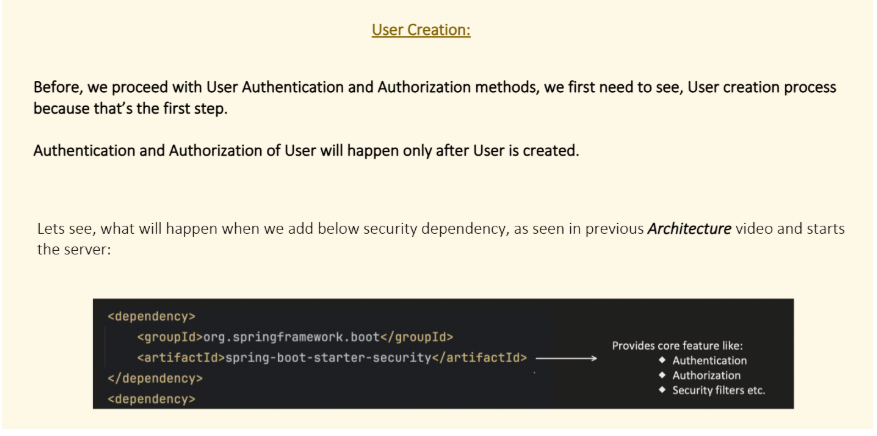

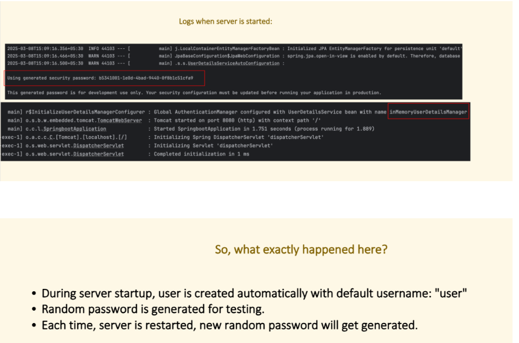

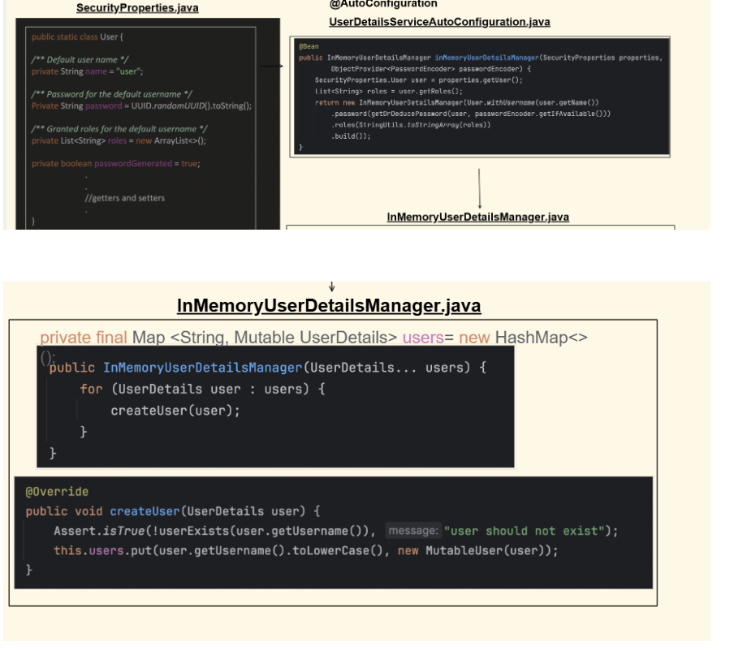

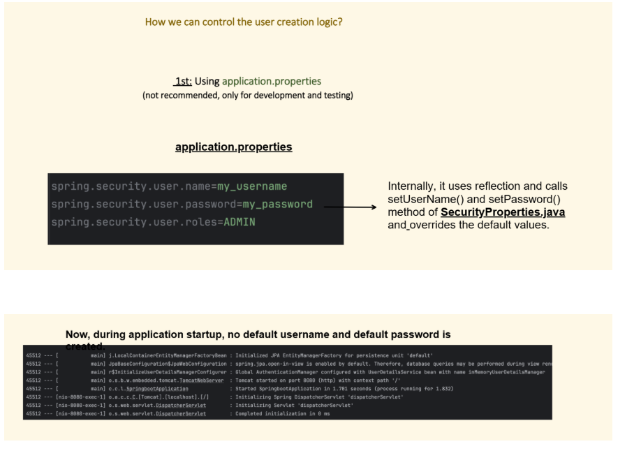

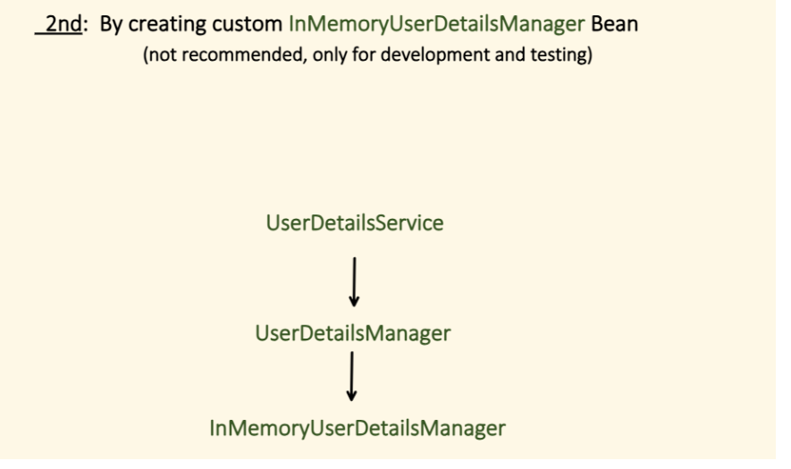

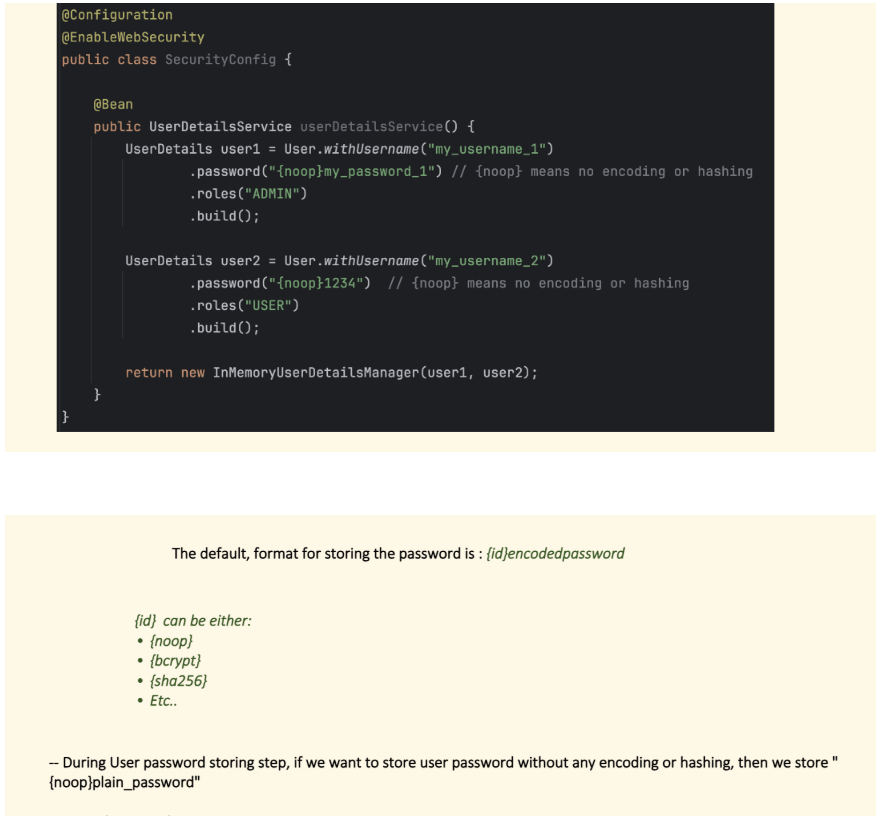

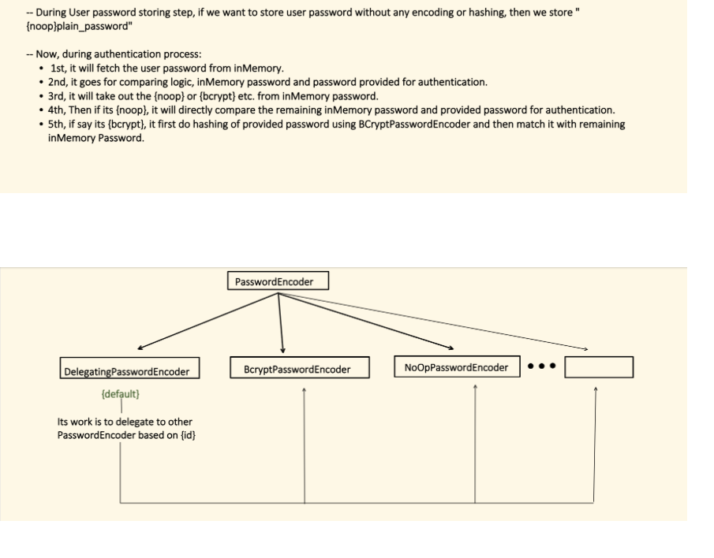

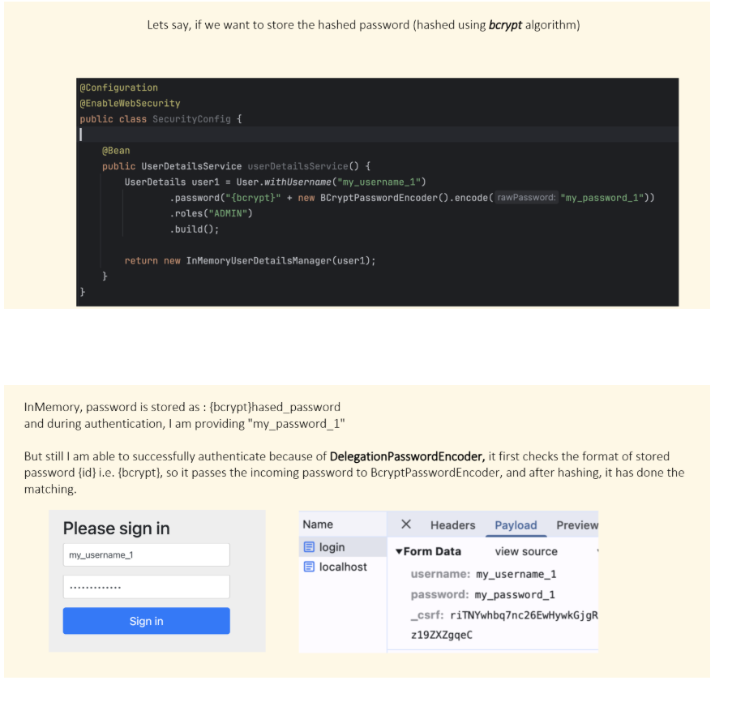

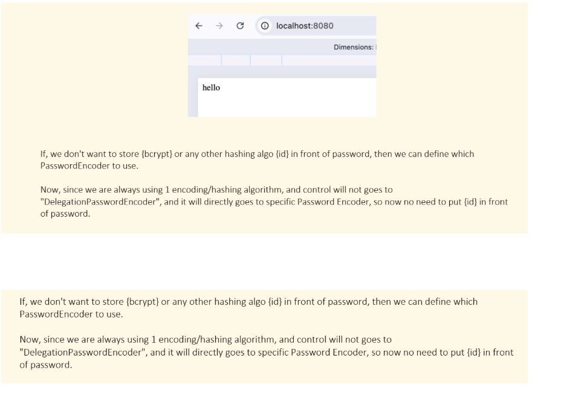

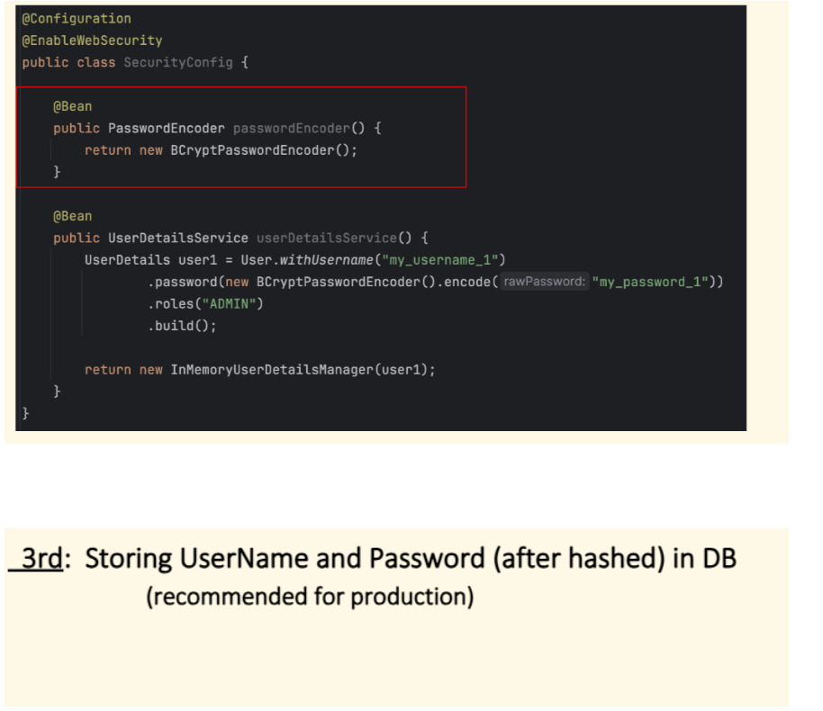

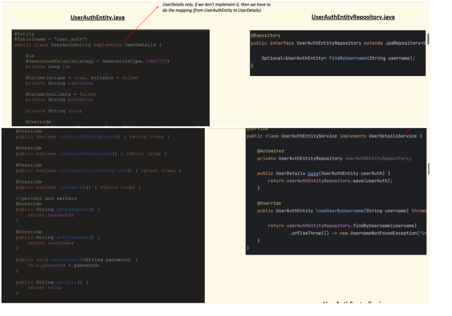

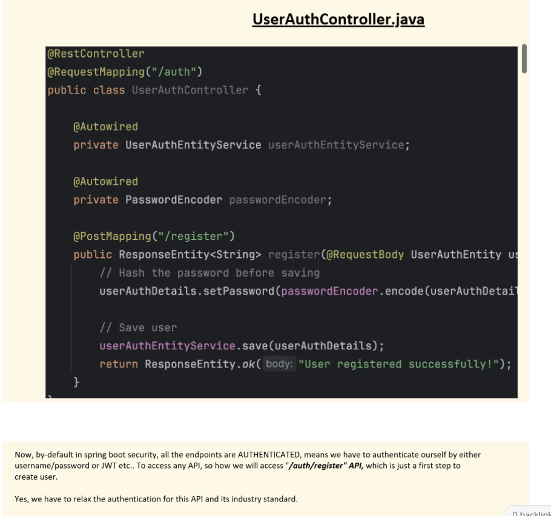

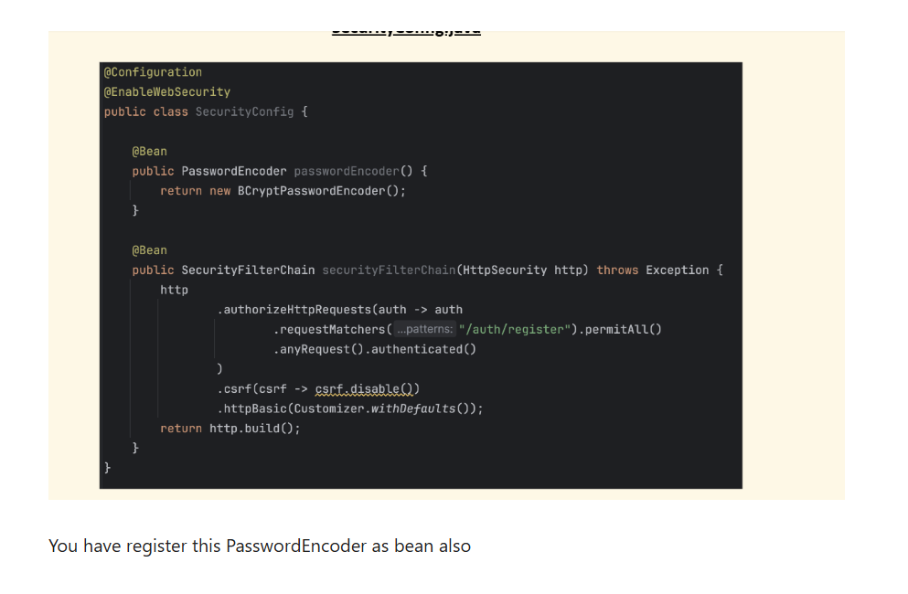