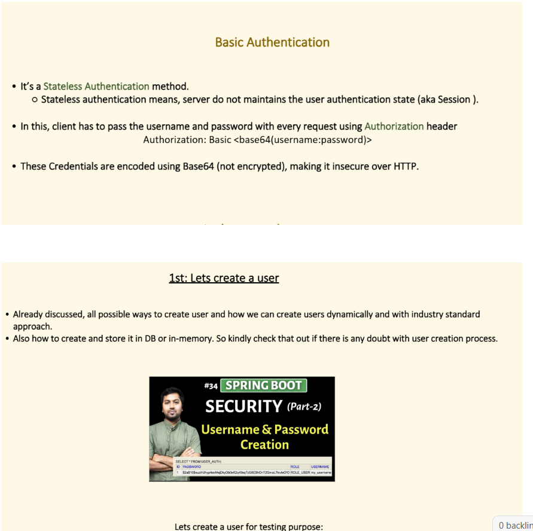
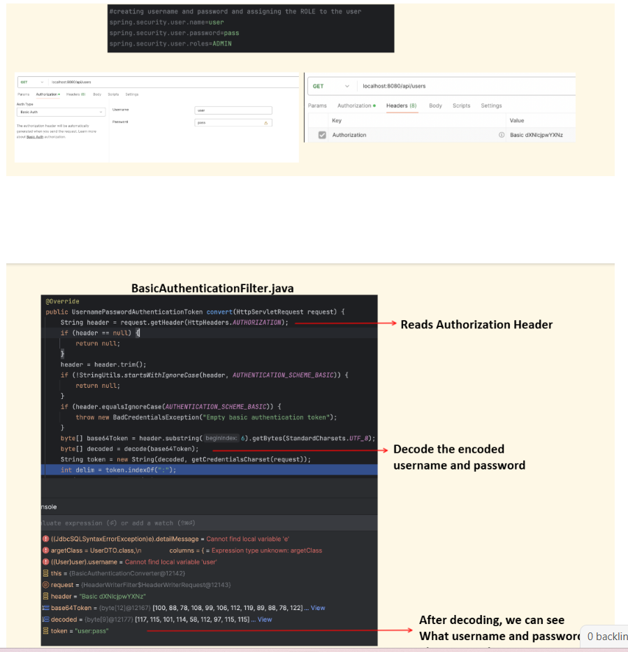
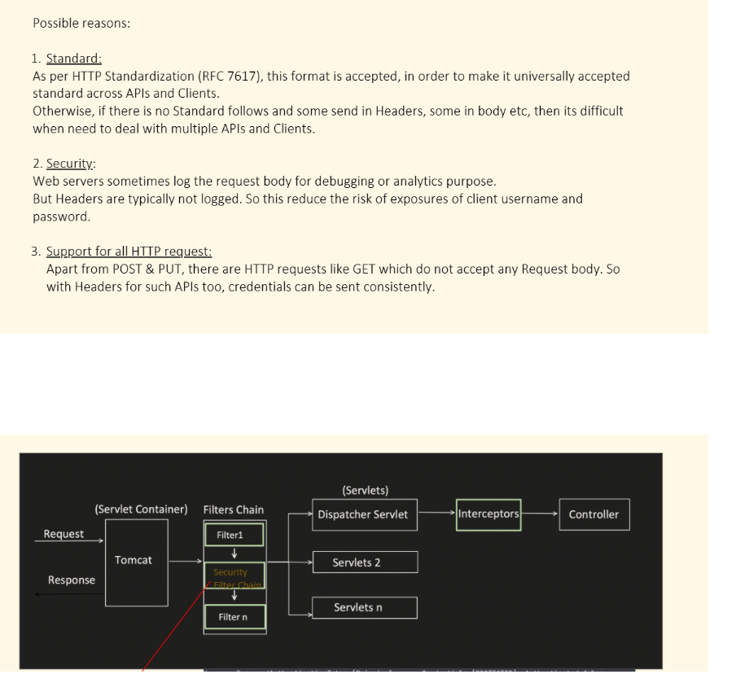
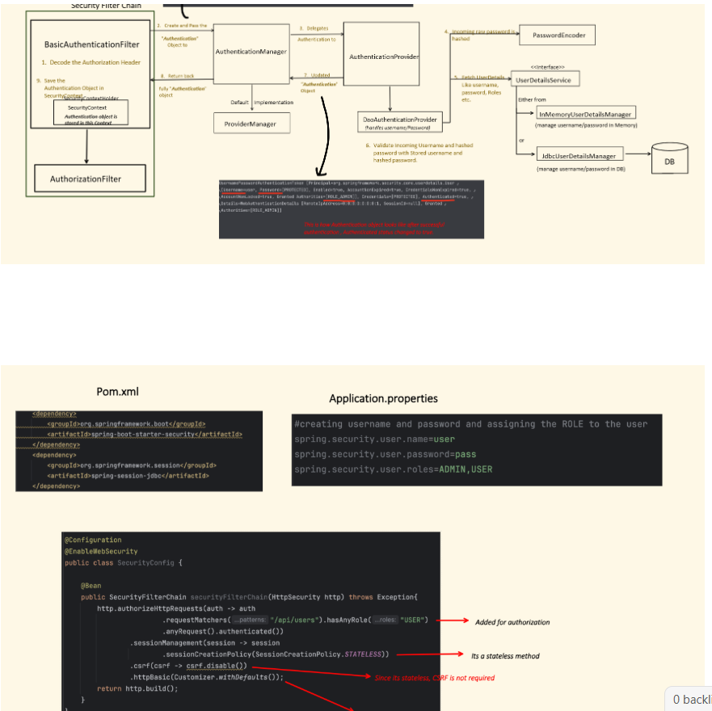
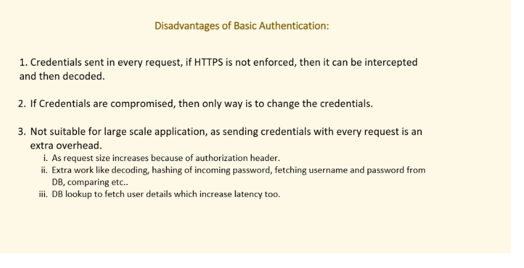

👉 **HTTP Basic** is _meant_ to be stateless — yet, you often see a `JSESSIONID` cookie in Postman.

Let’s break down **exactly why** that happens and what’s going on under the hood 👇

---

## 🧩 1️⃣ The expectation

**HTTP Basic Auth** by design = **stateless**  
✅ The client sends credentials (username + password) on _every request_ via header:

`Authorization: Basic dXNlcjpzZWNyZXQ=`

No session should be needed or created.  
Each request is independently authenticated.

---

## ⚙️ 2️⃣ But Spring Security’s default behavior

Even when you enable only basic auth:

`http     .httpBasic()     .authorizeHttpRequests(auth -> auth.anyRequest().authenticated());`

Spring Security **still uses** a couple of components that can trigger a session behind the scenes:

- `SecurityContextPersistenceFilter`

- `HttpSessionSecurityContextRepository`

Those are part of the default configuration unless you explicitly turn them off.

---

## 🧠 3️⃣ Why the session appears (why you see `JSESSIONID`)

Even in Basic Auth flow:

1. A request comes in with the `Authorization` header.

2. Spring Security authenticates it successfully.

3. The **SecurityContext** is created and stored in the `SecurityContextHolder`.

4. By default, Spring’s `SecurityContextPersistenceFilter` tries to **save** that context in an `HttpSession` (via `HttpSessionSecurityContextRepository`).

5. That causes the servlet container (Tomcat, Jetty, etc.) to create a session → and hence sends:

   `Set-Cookie: JSESSIONID=ABC123`

👉 That’s why you see the `JSESSIONID` in Postman — not because Basic Auth needs it, but because the **default context repository uses a session**.

---

## 🚫 4️⃣ How to truly make Basic Auth stateless

To stop that behavior, you must explicitly disable session creation:

`http     .httpBasic()     .and()     .sessionManagement()         .sessionCreationPolicy(SessionCreationPolicy.STATELESS);`

✅ Now, Spring will never create or use an `HttpSession`.  
✅ `SecurityContextPersistenceFilter` will not persist the context to session.  
✅ You will **not** see any `JSESSIONID` cookie.

## 🧠 2️⃣ When you enable Basic Auth only

Example config:

`http     .httpBasic()     .authorizeHttpRequests(auth -> auth.anyRequest().authenticated());`

👉 The filter chain **includes** `BasicAuthenticationFilter`  
❌ But **not** `UsernamePasswordAuthenticationFilter`.

That means:

- Spring Security won’t look for `/login` forms.

- It won’t parse username/password form parameters.

- It only checks the `Authorization` header in each request.