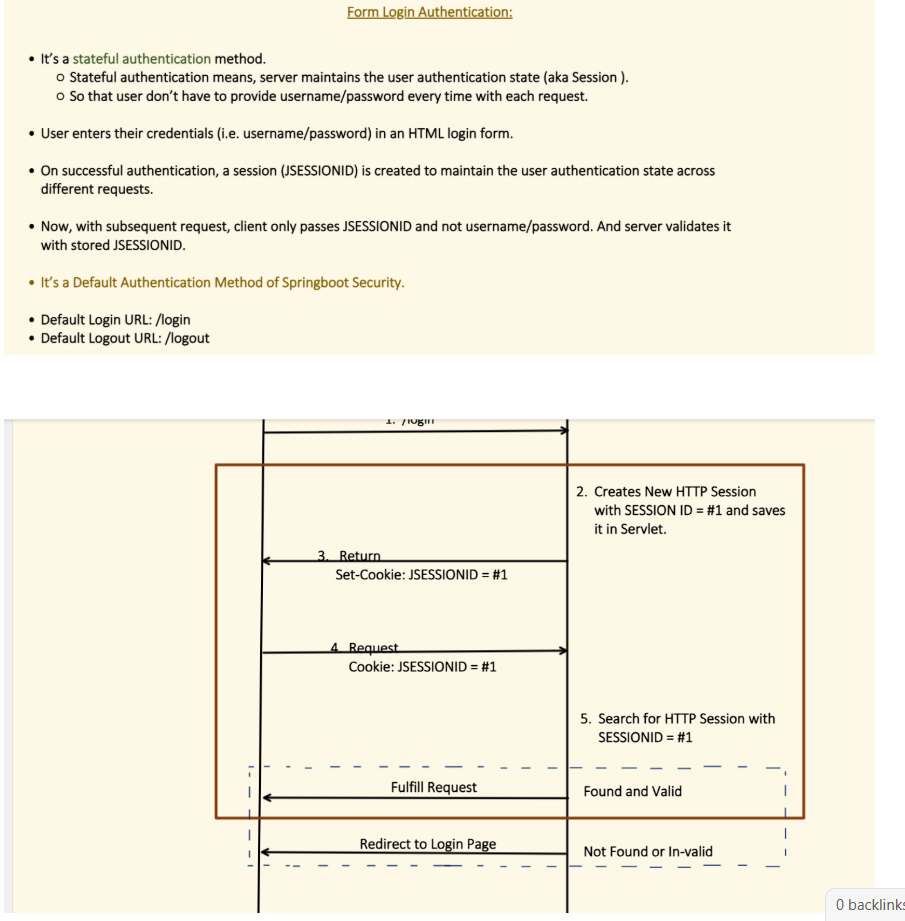

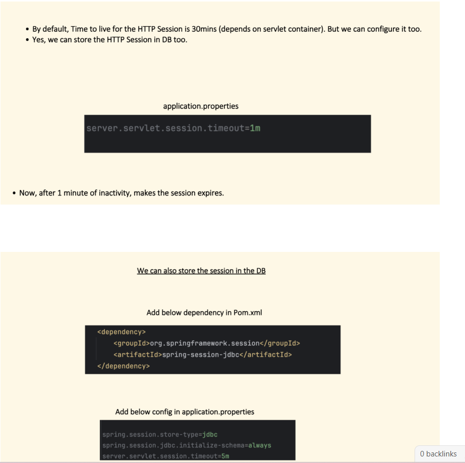

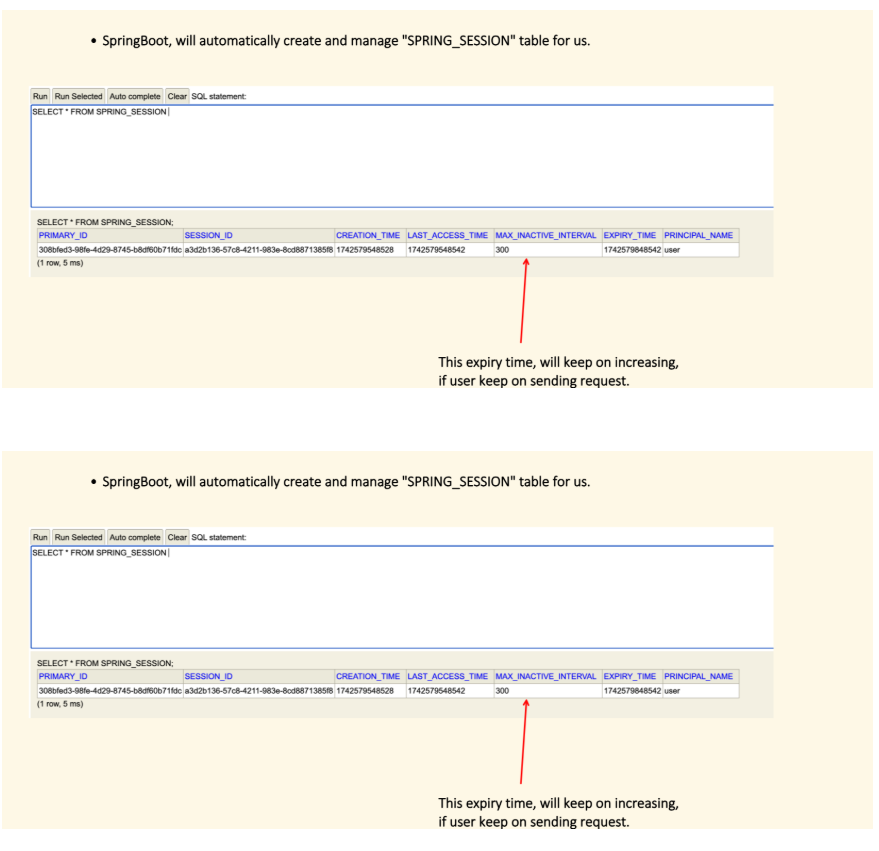

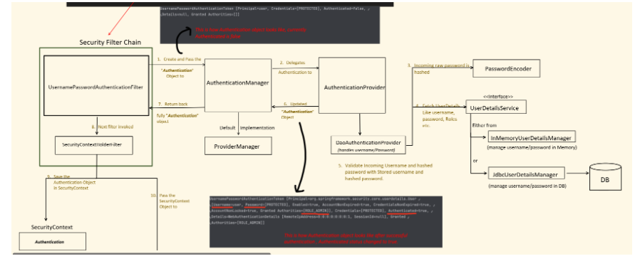

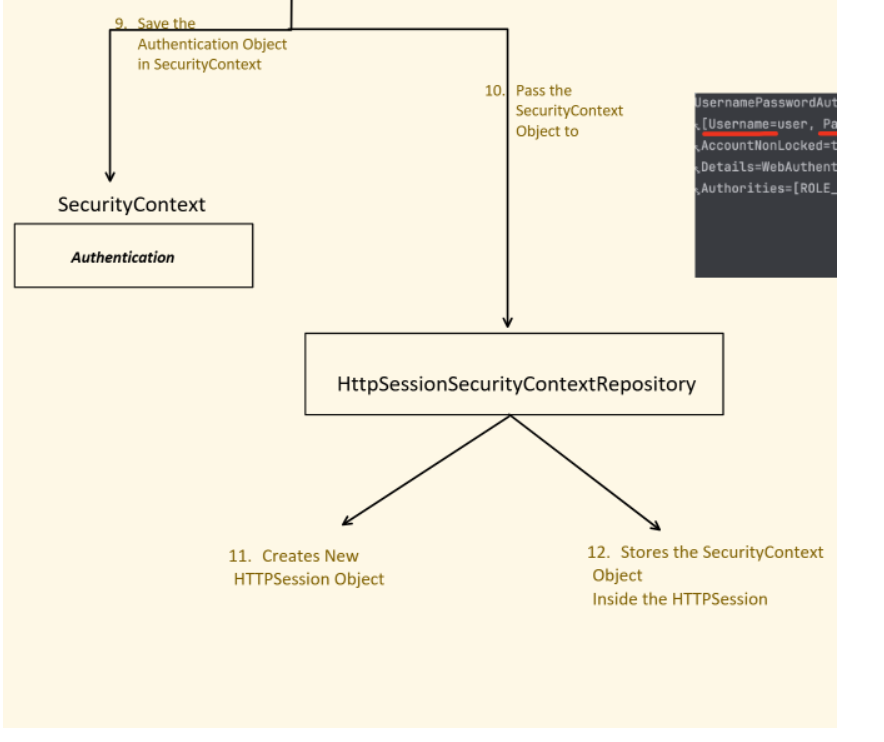

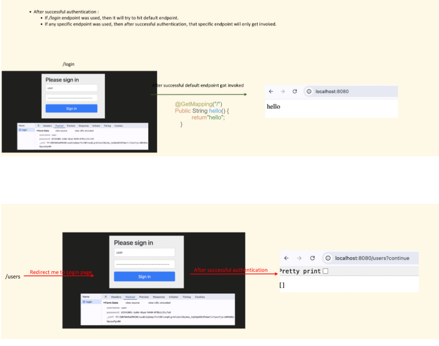

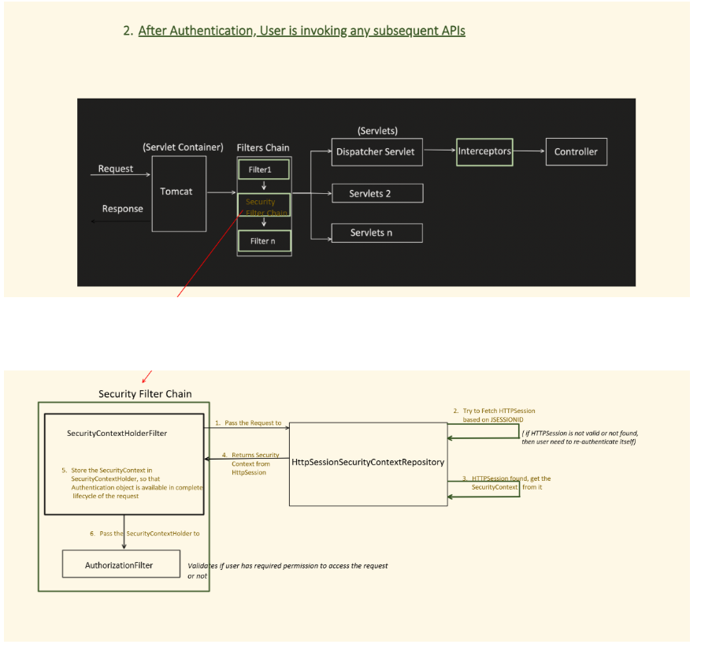

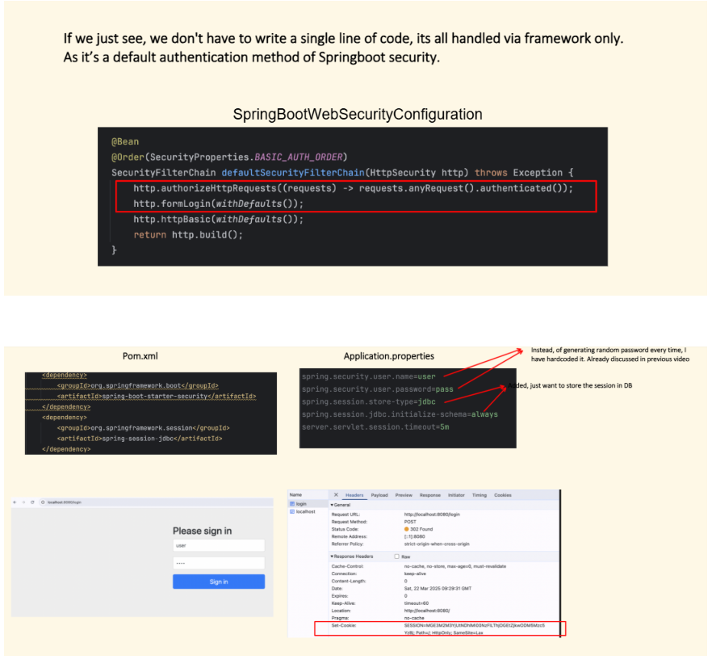

🧠 What happens when you use `spring-session-jdbc`

When you include this dependency:

`<dependency>   <groupId>org.springframework.session</groupId>   <artifactId>spring-session-jdbc</artifactId> </dependency>`

Spring Boot automatically switches session storage from **in-memory (Tomcat)** to **JDBC** — i.e., it now stores session data in a **database table** instead of server memory.

---

## 🗄️ So… which database?

It uses **the same datasource** you configured for your application.

✅ That means:  
If your `application.properties` has something like:

`spring.datasource.url=jdbc:mysql://localhost:3306/myapp spring.datasource.username=root spring.datasource.password=pass`

Then the **session tables** are also created and stored in that same `myapp` database.

---

## 🧩 Tables Created by Spring Session JDBC

Spring will create two main tables (automatically if you enable schema initialization):

1. **`SPRING_SESSION`**

2. **`SPRING_SESSION_ATTRIBUTES`**


You can also create them manually using the schema files included in the library, for example:

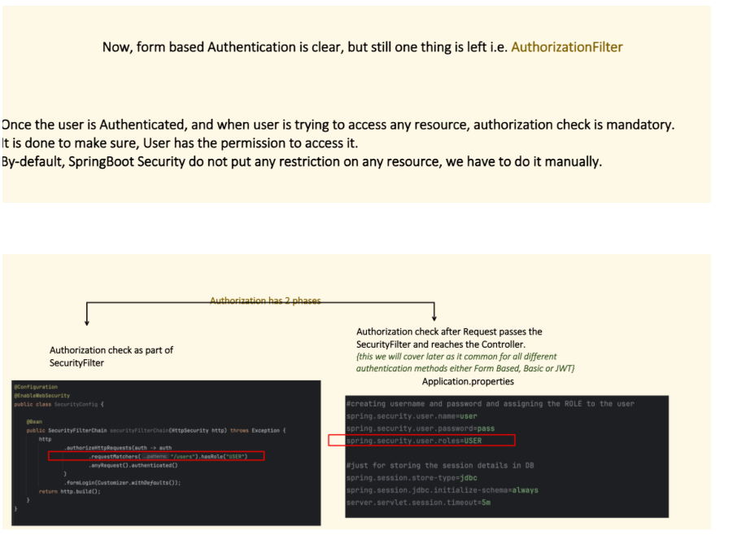

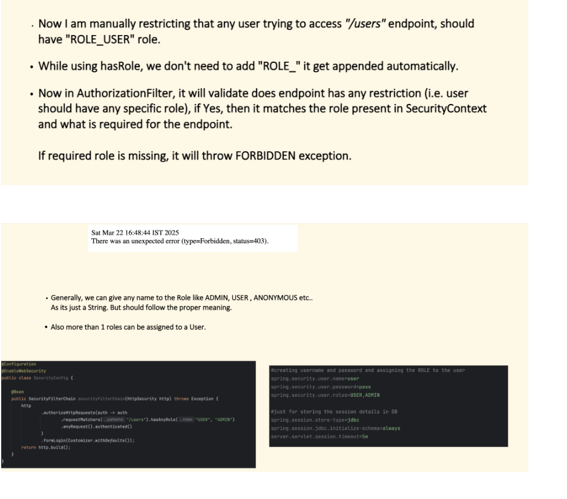

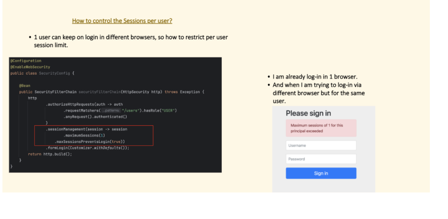

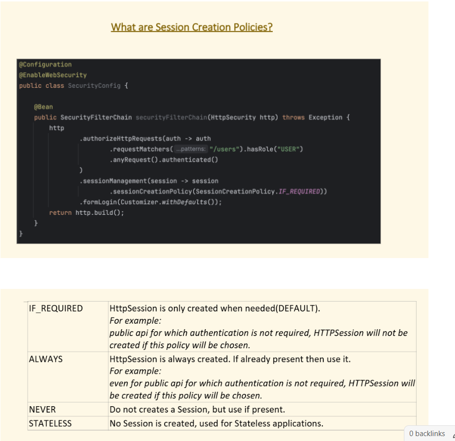

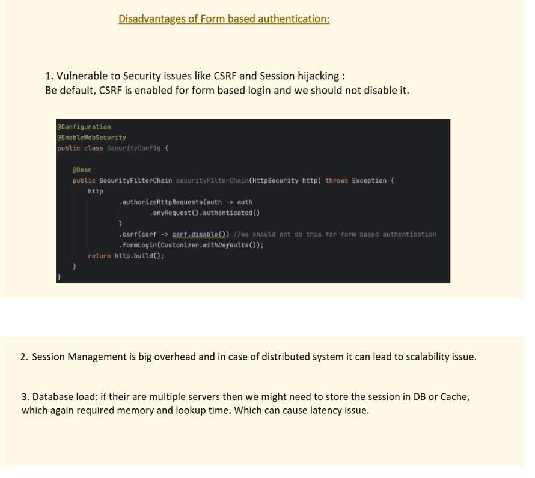

👉 `HttpSecurity`

is a **builder object** provided by Spring Security  
that lets you configure **how HTTP requests are secured** —  
that means authentication, authorization, CSRF, sessions, filters, etc.


## 3️⃣ What `HttpSecurity` actually does internally

It’s basically a **builder for filters**.

- Every time you call something like `.formLogin()`, `.authorizeHttpRequests()`, or `.csrf()`,  
  you’re telling Spring Security:  
  “Add this specific filter or configuration into the filter chain.”


### Example

```
http
    .authorizeHttpRequests(auth -> auth
        .requestMatchers("/admin/**").hasRole("ADMIN")
        .anyRequest().authenticated()
    )
    .formLogin(withDefaults())
    .logout(withDefaults());

```

✅ The **cookie is sent in the **same HTTP response** that Spring Security sends **after successful login** (usually a redirect).