## 🔐 What is JWT?

**JWT (JSON Web Token)** is a **compact, digitally signed token** used to **securely transmit information** (like user identity or permissions) between two parties — usually a **client (browser/app)** and a **server (backend API)**.

It’s basically a **string** with three parts separated by dots:

`xxxxx.yyyyy.zzzzz`

Each part has a purpose:


| Part          | Meaning                                             |
| ------------- | --------------------------------------------------- |
| **Header**    | Specifies the algorithm and type (e.g., HS256, JWT) |
| **Payload**   | Contains actual data (like username, role, expiry)  |
| **Signature** | Used to verify the token’s authenticity             |

```
Header:   { "alg": "HS256", "typ": "JWT" }
Payload:  { "sub": "user123", "role": "ADMIN", "exp": 1736057262 }

```


```
eyJhbGciOiJIUzI1NiIsInR5cCI6IkpXVCJ9...

```
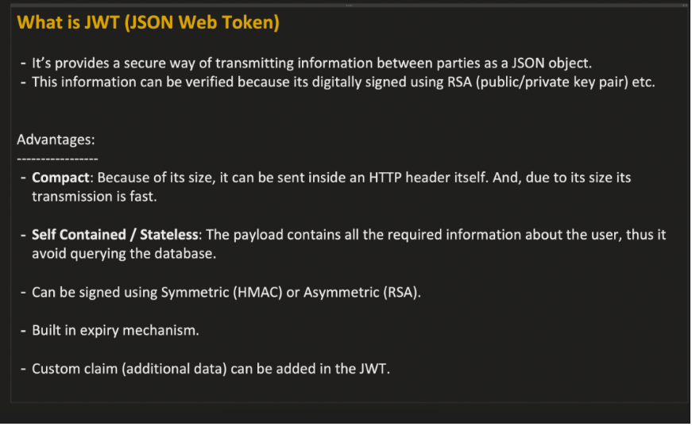

JWT provides authenticity and integrity  but doesn't provide confidentiality
For confidentiality we need to use encryption on top of it


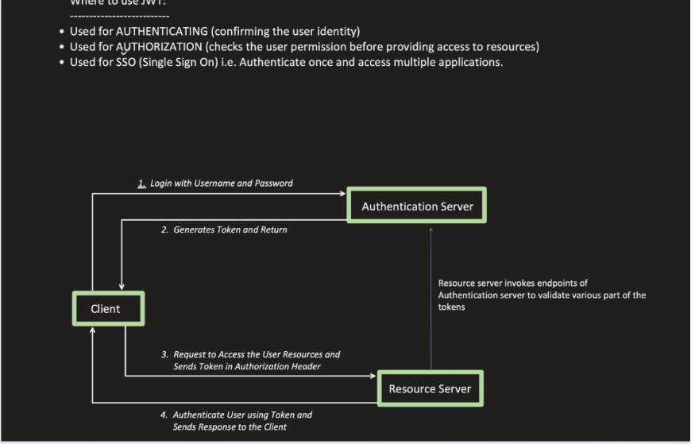


| Feature                                         | **Basic Auth**                                                             | **JWT Auth**                                       |
|-------------------------------------------------|----------------------------------------------------------------------------|----------------------------------------------------|
| **What’s sent in each request**                 | `Authorization: Basic <Base64(username:password)>`                         | `Authorization: Bearer <JWT token>`                |
| **Where credentials come from**                 | Directly from the user (username & password)                               | From server-issued token after login               |
| **Server stores state?**                        | ❌ No                                                                       | ❌ No                                               |
| **Security**                                    | Weak — credentials sent every time (even if Base64 encoded, not encrypted) | Stronger — token is signed and can expire          |
| **Can expire automatically?**                   | ❌ No — password is constant                                                | ✅ Yes — tokens have `exp` (expiry time)            |
| **Can contain extra info (roles, permissions)** | ❌ No — only username/password                                              | ✅ Yes — encoded in token payload                   |
| **Revocation / logout**                         | Hard — must change password                                                | Possible — short token expiry or blacklist         |
| **Ideal for**                                   | Simple, internal APIs or testing                                           | Production APIs, microservices, user login systems |


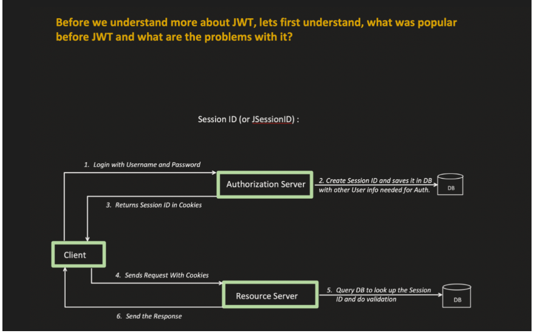

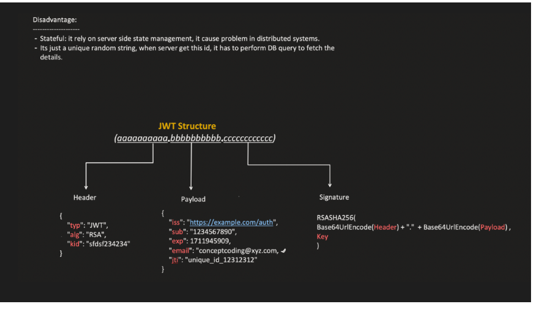

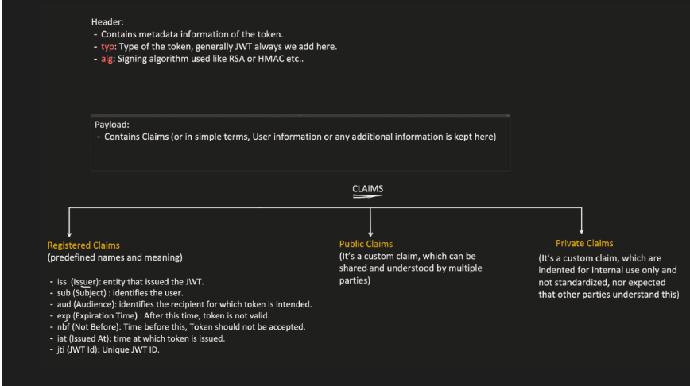

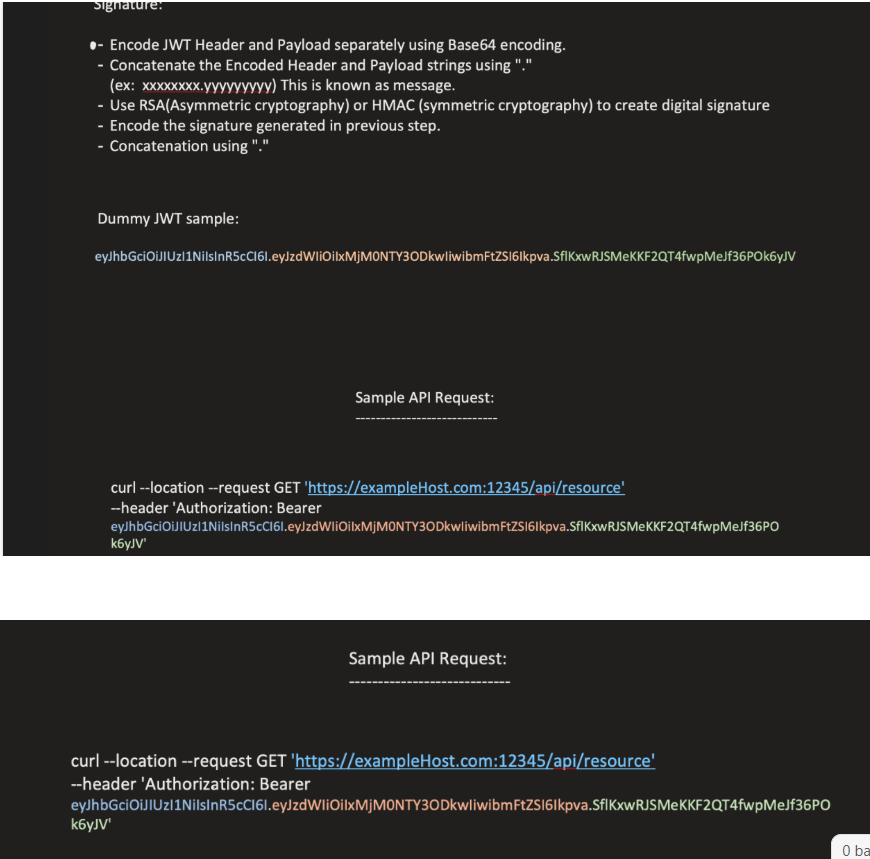

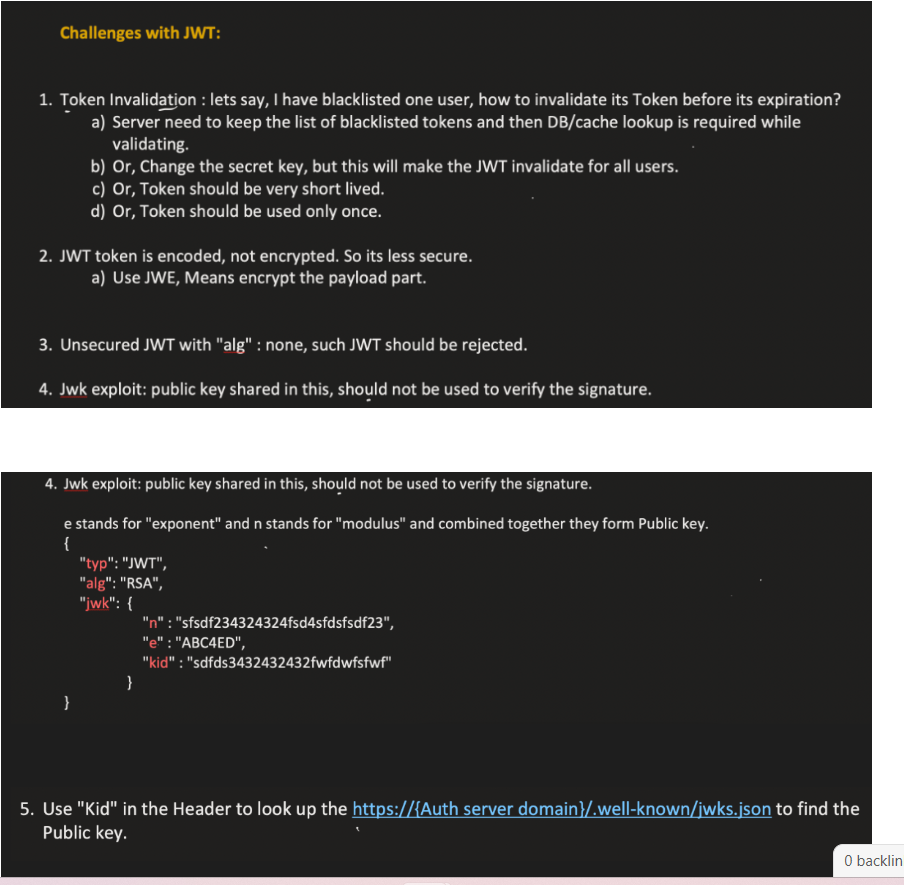

1️⃣ What is JWT?

**JWT (JSON Web Token)** is a **compact, URL-safe** way of representing **claims** securely between two parties — typically a **client** and a **server**.

It’s mainly used for **authentication** and **authorization** in stateless systems.

---

## 2️⃣ Why JWT Exists — The Problem It Solves

### 🧩 The problem before JWT:

- Traditional authentication used **sessions stored on the server**.

- Every request had to be validated against the **session store (DB or in-memory)**.

- This made apps **stateful** and hard to **scale horizontally** (load balancing, microservices).


### 🪄 JWT solves this by:

- Storing **user info + validity proof** _inside the token itself_.

- So the server doesn’t need to store or lookup sessions.

- This makes authentication **stateless** — easy for distributed systems.


---

## 3️⃣ JWT Structure

A JWT is made up of **three parts**, separated by dots (`.`):

`xxxxx.yyyyy.zzzzz`

|Part|Meaning|Encoded Format|
|---|---|---|
|Header|Algorithm & token type|Base64Url JSON|
|Payload|Claims (data)|Base64Url JSON|
|Signature|To verify integrity & authenticity|Base64Url hash|

Example:

`eyJhbGciOiJSUzI1NiIsInR5cCI6IkpXVCJ9. eyJzdWIiOiIxMjM0NTY3ODkwIiwibmFtZSI6IkpvaG4iLCJyb2xlIjoiYWRtaW4ifQ. SflKxwRJSMeKKF2QT4fwpMeJf36POk6yJV_adQssw5c`

---

## 4️⃣ Parts Explained

### (a) Header

`{   "alg": "RS256",   "typ": "JWT" }`

- `alg`: Algorithm used for signing (HS256, RS256, ES256, etc.)

- `typ`: Always `"JWT"`


---

### (b) Payload

Contains **claims** — information about the user or token.

Types of claims:

|Type|Description|Example|
|---|---|---|
|**Registered**|Standard ones|`sub` (subject), `iss` (issuer), `exp` (expiry), `iat` (issued at)|
|**Public**|Custom claims|`role`, `email`, etc.|
|**Private**|Shared between services|`user_id`, `tenant_id`|

Example:

`{   "sub": "1234567890",   "name": "John Doe",   "role": "admin",   "iat": 1730000000,   "exp": 1730003600 }`

---

### (c) Signature

The signature ensures:

- **Integrity** — data isn’t modified.

- **Authenticity** — token came from trusted issuer.


Formula:

`signature = Sign( algorithm, base64url(header) + "." + base64url(payload), key )`

So final token:

`header.payload.signature`

---

## 5️⃣ Signing Algorithms — Symmetric vs Asymmetric

|Algorithm|Type|Key used|Example|Who can verify|
|---|---|---|---|---|
|**HS256**|Symmetric (HMAC)|Same secret key|HMAC SHA-256|Only server with secret|
|**RS256**|Asymmetric|Private (sign), Public (verify)|RSA SHA-256|Anyone with public key|
|**ES256**|Asymmetric|Elliptic curve pair|ECDSA SHA-256|Anyone with public key|

### 🧠 Summary:

- **HS256** → simpler, both signing and verification done using same key.  
  ❌ Problem: All services must share same secret.

- **RS256** → safer for microservices:  
  Only issuer knows private key, all other services can verify using public key.


---

## 6️⃣ Authenticity vs Integrity

|Concept|Meaning|Ensured by|
|---|---|---|
|**Integrity**|Data hasn’t been changed|Signature validation|
|**Authenticity**|It was issued by trusted source|Signature from trusted private key|

JWT ensures **both** via digital signatures.

---

## 7️⃣ How JWT Works (Step-by-Step Flow)

### 🧩 Login Flow

1. **Client → Server:** sends username/password.

2. **Server authenticates user** in DB.

3. **Server creates JWT:**

    - Adds claims (`userId`, `role`, etc.)

    - Signs it with secret/private key.

4. **Server → Client:** sends back JWT.

5. **Client stores JWT** (usually in localStorage, sessionStorage, or HTTP-only cookie).

6. **Client → Server:** sends JWT in header for every request:

   `Authorization: Bearer <token>`

7. **Server verifies JWT**:

    - Checks signature ✅

    - Checks expiry (`exp`) ✅

    - If valid → grant access.


---

## 8️⃣ Verification Logic Internally

**HS256 (Symmetric):**

`expectedSignature = HMACSHA256(header.payload, secret) if (expectedSignature == signatureFromToken) → valid`

**RS256 (Asymmetric):**

`RSAVerify(publicKey, header.payload, signature)`

✅ Anyone can verify, but only the private key holder can sign.


# 🧾 How Many Ways a JWT Can Be Signed

A JWT can be **signed** in **two fundamental ways**:

|Type|Signing Mechanism|Cryptography Type|Examples|
|---|---|---|---|
|**1️⃣ Symmetric signing**|Same key used for signing & verification|HMAC (shared secret)|HS256, HS384, HS512|
|**2️⃣ Asymmetric signing**|Private key for signing, public key for verifying|RSA / ECDSA|RS256, RS384, RS512, ES256, ES384, ES512|


## 🔹 1. Symmetric (e.g., HS256)

Uses **one shared secret key** for both signing and verification.

### ✅ **Pros**

1. **Fast performance** — HMAC (HS256) is much faster than RSA or ECDSA.

2. **Simpler to implement** — only one key to manage.

3. **Smaller tokens** — signature is shorter.

4. **Good for single-service systems** — when only one trusted backend issues and verifies tokens.


### ❌ **Cons**

1. **Key must be shared** — every service that verifies JWTs must have the same secret key.  
   ➜ In distributed or microservice systems, this increases risk.

2. **No separation of roles** — any verifier can also forge new tokens, since they have the same key.

3. **Less secure in large architectures** — harder to rotate keys safely across multiple services.


---

## 🔹 2. Asymmetric (e.g., RS256 or ES256)

Uses **a private key** to sign and a **public key** to verify.

### ✅ **Pros**

1. **Secure key separation** — only the issuer (auth server) has the private key; verifiers only need the public key.

2. **Easier for distributed systems** — you can freely share the public key with other microservices or clients.

3. **Supports third-party verification** — external services can verify tokens without risking key exposure.

4. **Better for scalability & security** — especially when you have multiple independent consumers.


### ❌ **Cons**

1. **Slower performance** — RSA and ECDSA signing/verification are more computationally expensive.

2. **More complex key management** — need to handle key pairs (private + public), rotation, etc.

3. **Slightly larger token size** — asymmetric signatures are longer than HMAC ones.


------------------------------------------------------------------------------------------


DisADvantage:


## 🔹 1. **Difficult to revoke or invalidate a token**

Once a JWT is issued, it’s **valid until it expires**, even if the user logs out or is banned.

### 🧩 Example:

- You issue a JWT valid for 1 hour.

- After 10 minutes, the user changes their password or logs out.

- The token is still valid and can be used until it expires (unless you build extra logic to blacklist it).


### 💡 Why problematic:

JWTs are **stateless**, so the server doesn’t check any session store — it just verifies the signature.  
You must implement **token revocation lists** or **short expiry + refresh tokens** to handle this.

---

## 🔹 2. **Large token size**

JWTs contain base64-encoded JSON — sometimes with many claims and signatures — making them larger than session IDs.

### 🧩 Example:

`{   "sub": "123456",   "name": "John Doe",   "role": "admin",   "iat": 1699038743,   "exp": 1699042343 }`

Encodes into a long string like:

`eyJhbGciOiJIUzI1NiIsInR5cCI6IkpXVCJ9...`

### 💡 Why problematic:

- Increases **HTTP header size** (`Authorization: Bearer <JWT>`).

- Every request carries this payload — more network overhead.


---

## 🔹 3. **Cannot easily change claims after issuing**

Claims (like roles or permissions) are **baked into the token** at creation time.

### 🧩 Example:

- You issue a token with role = `user`.

- Later, you upgrade them to `admin`.

- Their old token still says `user` until it expires — you can’t modify it.


### 💡 Why problematic:

You can’t easily **synchronize updated user data** with old JWTs.  
Only solution: revoke old tokens or issue short-lived ones.

---

## 🔹 4. **Security risks if secret/private key leaks**

If the signing key is exposed, **attackers can forge valid tokens**.

### 🧩 Example:

If someone gets your `HS256` secret:

`jwt.sign({ role: 'admin' }, 'mySecretKey');`

They can issue their own fake JWTs that the server will trust.

### 💡 Why problematic:

Unlike sessions (where the server can centrally kill them), JWTs are hard to undo once forged.  
Always keep keys secret and rotate them regularly.

---

## 🔹 5. **Misconfigured algorithm attacks**

If developers don’t **validate the algorithm**, attackers can exploit it.

### 🧩 Example (classic vulnerability):

A JWT claims:

`{ "alg": "none" }`

If your verification logic doesn’t enforce `RS256` or `HS256`, the library may **accept unsigned tokens** — allowing attackers to impersonate users.

### 💡 Fix:

Always **explicitly set allowed algorithms** in verification.


--------------------------------------------------------------------------------------------

## 🔸 5. Example — how verification works with `kid`

Let’s say Google issues a JWT:

`{   "alg": "RS256",   "kid": "a1b2c3" }`

The verifier (say, your backend) does:

1. Reads `"kid": "a1b2c3"` from header.

2. Fetches Google’s JWKS from:  
   👉 `https://www.googleapis.com/oauth2/v3/certs`

3. Finds the key with `"kid": "a1b2c3"`.

4. Uses that public key to verify the signature.


---------------------------------------------------------------------------------------------------------


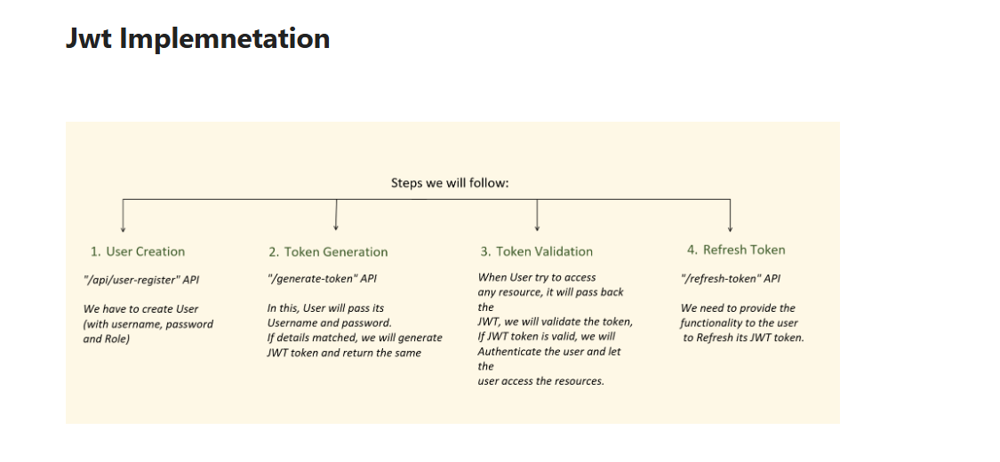


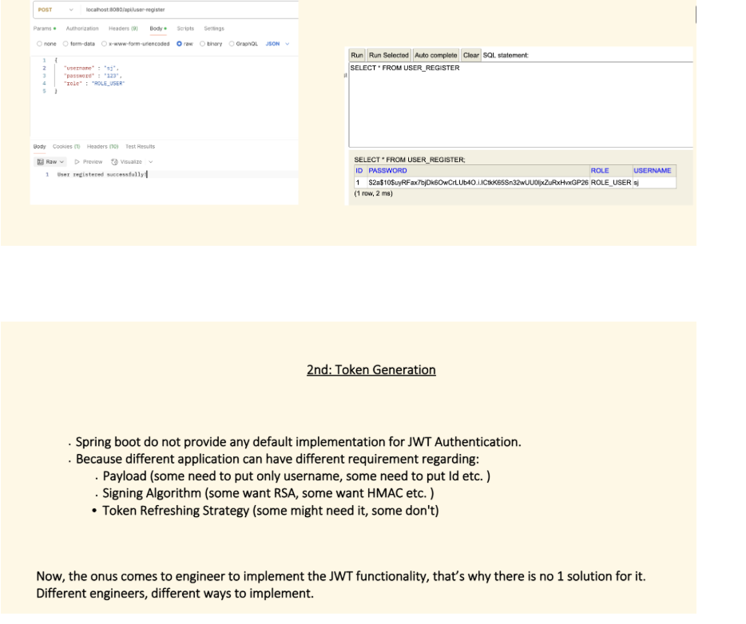

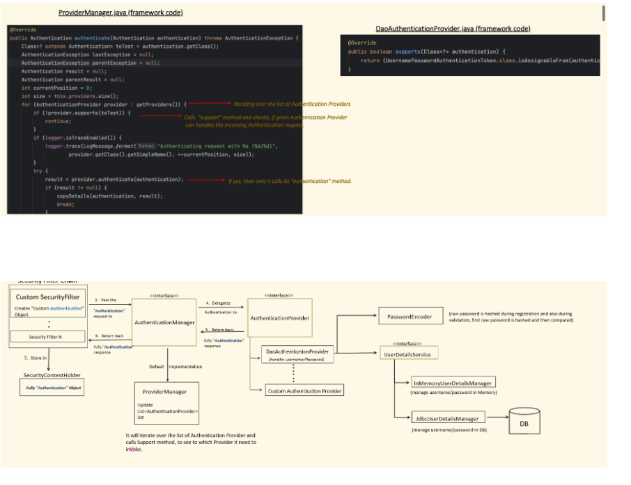

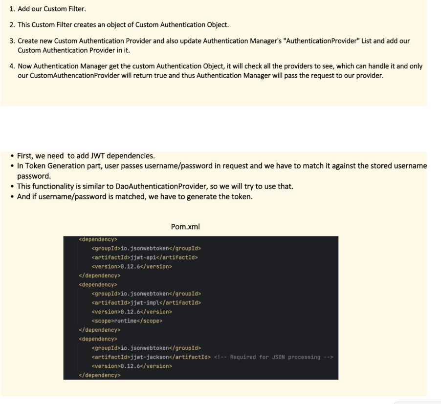

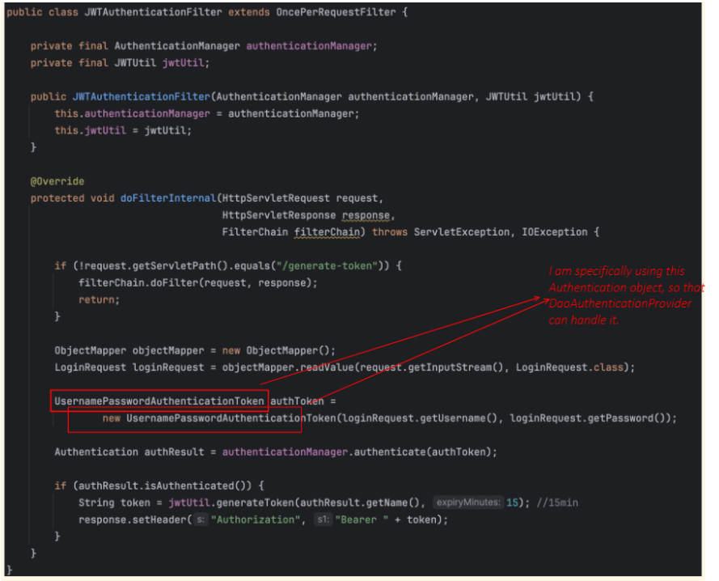

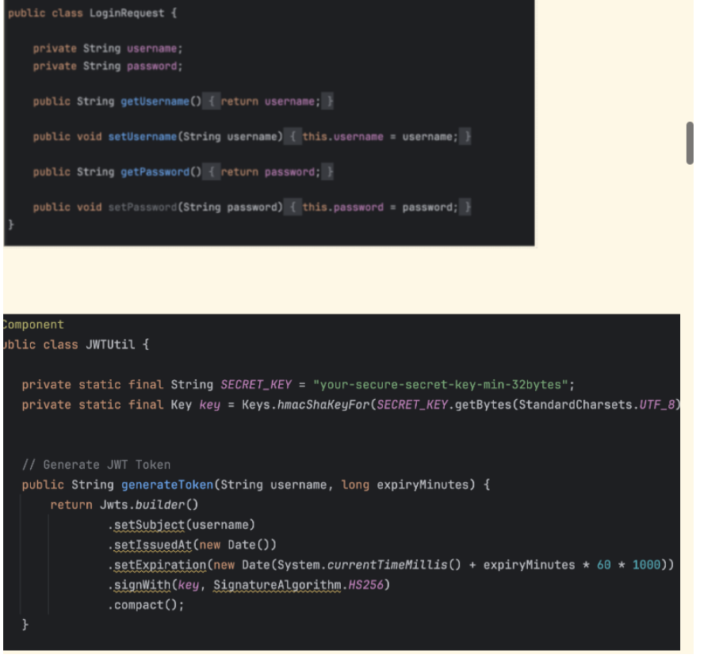

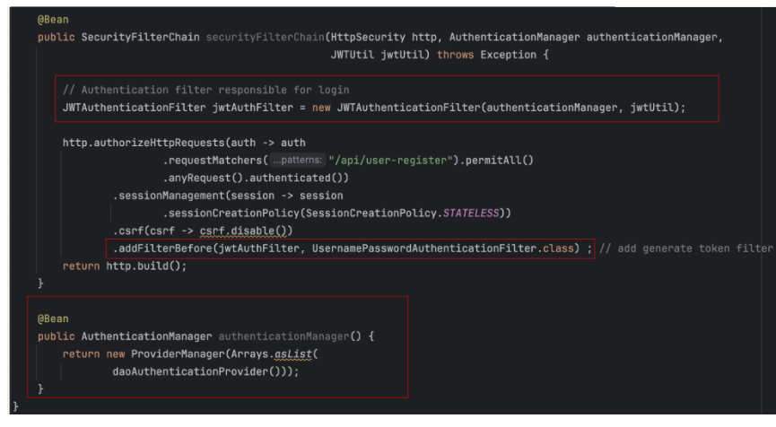

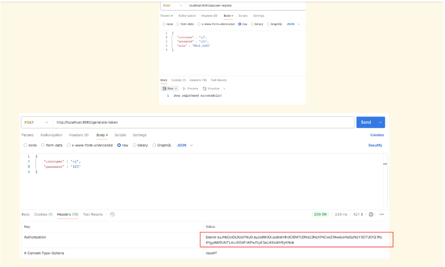

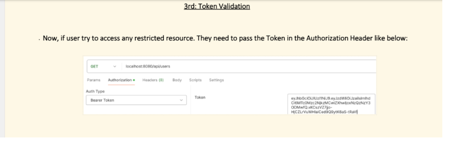

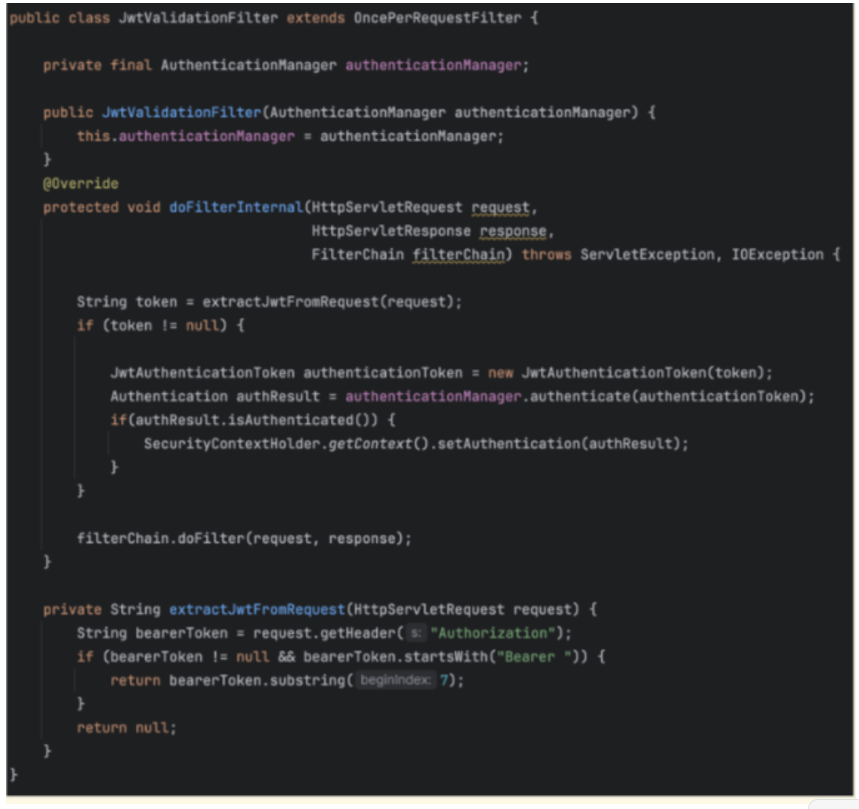

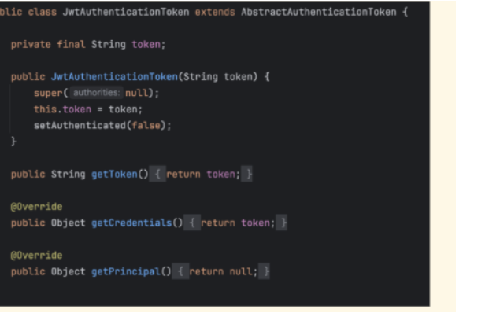

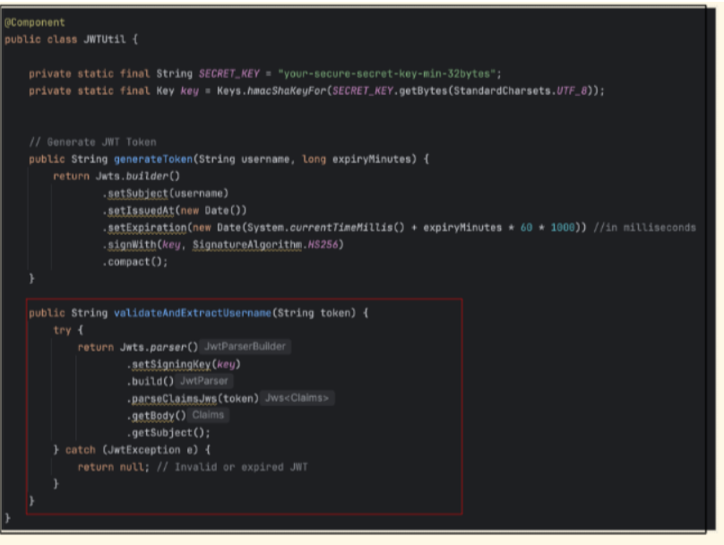

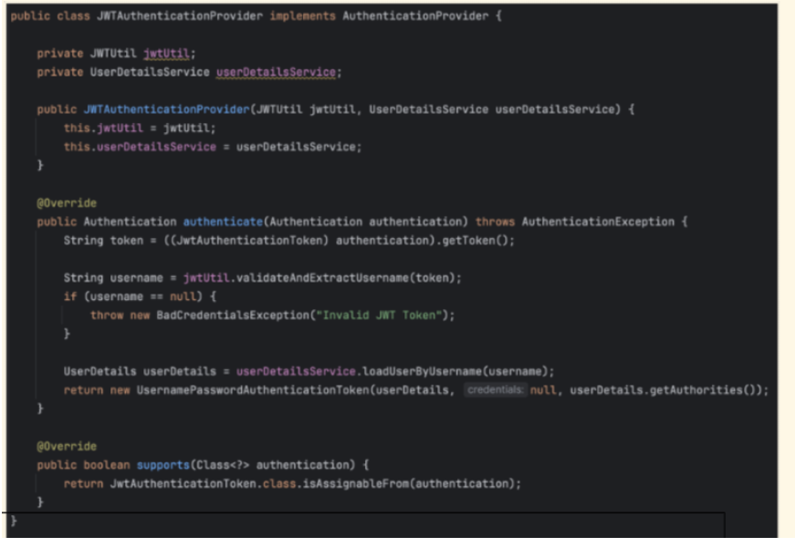

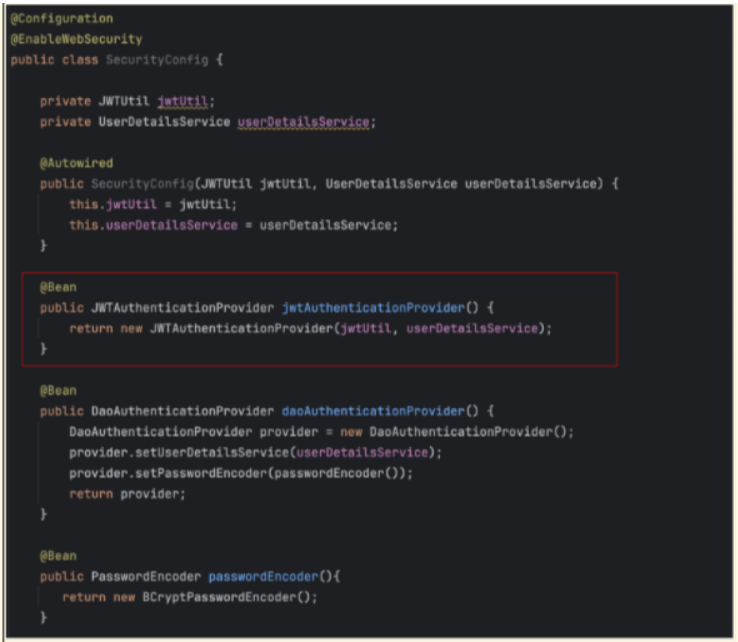

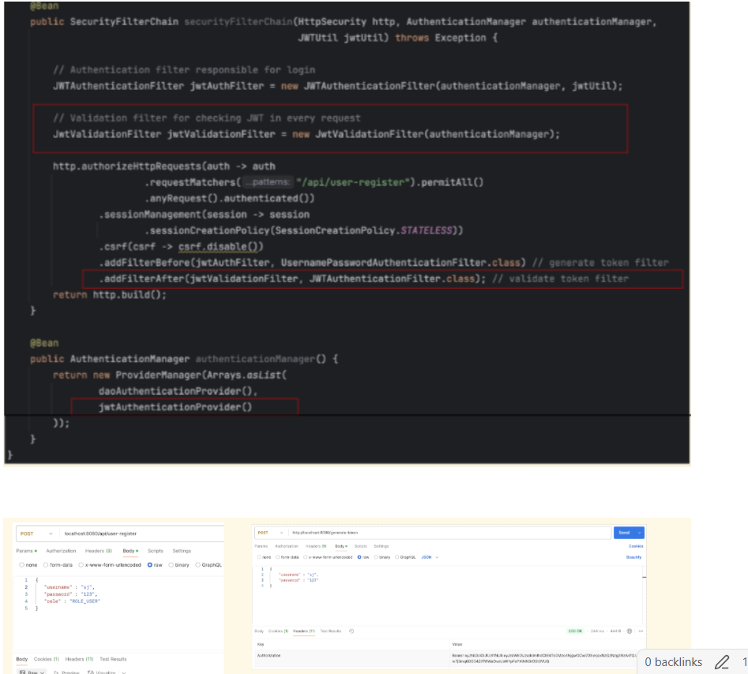


```
package com.example.security.jwt;

import jakarta.servlet.FilterChain;
import jakarta.servlet.ServletException;
import jakarta.servlet.http.HttpServletRequest;
import jakarta.servlet.http.HttpServletResponse;
import org.springframework.beans.factory.annotation.Autowired;
import org.springframework.security.authentication.UsernamePasswordAuthenticationToken;
import org.springframework.security.core.context.SecurityContextHolder;
import org.springframework.security.core.userdetails.UserDetails;
import org.springframework.security.core.userdetails.UserDetailsService;
import org.springframework.security.web.authentication.WebAuthenticationDetailsSource;
import org.springframework.stereotype.Component;
import org.springframework.web.filter.OncePerRequestFilter;

import java.io.IOException;

@Component
public class JwtAuthenticationFilter extends OncePerRequestFilter {

    @Autowired
    private JwtService jwtService;

    @Autowired
    private UserDetailsService userDetailsService;

    @Override
    protected void doFilterInternal(HttpServletRequest request,
                                    HttpServletResponse response,
                                    FilterChain filterChain)
            throws ServletException, IOException {

        final String authHeader = request.getHeader("Authorization");
        final String jwt;
        final String username;

        // 1️⃣ Check Authorization header
        if (authHeader == null || !authHeader.startsWith("Bearer ")) {
            filterChain.doFilter(request, response);
            return;
        }

        // 2️⃣ Extract JWT token
        jwt = authHeader.substring(7);

        // 3️⃣ Extract username (subject)
        username = jwtService.extractUsername(jwt);

        // 4️⃣ If username found and no current authentication
        if (username != null && SecurityContextHolder.getContext().getAuthentication() == null) {

            UserDetails userDetails = userDetailsService.loadUserByUsername(username);

            // 5️⃣ Verify token (signature + expiry)
            if (jwtService.isTokenValid(jwt, userDetails)) {

                // 6️⃣ Build authentication object
                UsernamePasswordAuthenticationToken authToken =
                        new UsernamePasswordAuthenticationToken(
                                userDetails,
                                null,
                                userDetails.getAuthorities()
                        );

                authToken.setDetails(
                        new WebAuthenticationDetailsSource().buildDetails(request)
                );

                // 7️⃣ Save to SecurityContext
                SecurityContextHolder.getContext().setAuthentication(authToken);
            }
        }

        // 8️⃣ Continue chain
        filterChain.doFilter(request, response);
    }
}


```


```
package com.example.security.jwt;

import io.jsonwebtoken.*;
import io.jsonwebtoken.io.Decoders;
import io.jsonwebtoken.security.Keys;
import org.springframework.security.core.userdetails.UserDetails;
import org.springframework.stereotype.Service;

import java.security.Key;
import java.util.Date;
import java.util.function.Function;

@Service
public class JwtService {

    // 🔐 Secret for HMAC (symmetric). Store securely in application.properties
    private static final String SECRET_KEY = "4b6150645367566b5970337336763979244226452948404D635166546A576E5A";

    // 1️⃣ Extract username (subject)
    public String extractUsername(String token) {
        return extractClaim(token, Claims::getSubject);
    }

    // 2️⃣ Extract expiration date
    public Date extractExpiration(String token) {
        return extractClaim(token, Claims::getExpiration);
    }

    // 3️⃣ Extract single claim
    public <T> T extractClaim(String token, Function<Claims, T> claimsResolver) {
        final Claims claims = extractAllClaims(token);
        return claimsResolver.apply(claims);
    }

    // 4️⃣ Verify signature and parse all claims
    private Claims extractAllClaims(String token) {
        try {
            return Jwts.parserBuilder()
                    .setSigningKey(getSignInKey())
                    .build()
                    .parseClaimsJws(token)
                    .getBody();
        } catch (ExpiredJwtException e) {
            throw new RuntimeException("JWT expired", e);
        } catch (UnsupportedJwtException e) {
            throw new RuntimeException("JWT unsupported", e);
        } catch (MalformedJwtException e) {
            throw new RuntimeException("JWT malformed", e);
        } catch (SignatureException e) {
            throw new RuntimeException("Invalid signature", e);
        } catch (IllegalArgumentException e) {
            throw new RuntimeException("Empty or null JWT", e);
        }
    }

    // 5️⃣ Check if token expired
    private boolean isTokenExpired(String token) {
        return extractExpiration(token).before(new Date());
    }

    // 6️⃣ Verify if token is valid for given user
    public boolean isTokenValid(String token, UserDetails userDetails) {
        final String username = extractUsername(token);
        return (username.equals(userDetails.getUsername()) && !isTokenExpired(token));
    }

    // 7️⃣ Decode Base64 secret key into real key
    private Key getSignInKey() {
        byte[] keyBytes = Decoders.BASE64.decode(SECRET_KEY);
        return Keys.hmacShaKeyFor(keyBytes);
    }
}

```


```
package com.example.security.config;

import com.example.security.jwt.JwtAuthenticationFilter;
import org.springframework.beans.factory.annotation.Autowired;
import org.springframework.context.annotation.Bean;
import org.springframework.context.annotation.Configuration;
import org.springframework.security.authentication.AuthenticationManager;
import org.springframework.security.config.annotation.authentication.configuration.AuthenticationConfiguration;
import org.springframework.security.config.annotation.web.builders.HttpSecurity;
import org.springframework.security.config.http.SessionCreationPolicy;
import org.springframework.security.web.SecurityFilterChain;
import org.springframework.security.web.authentication.UsernamePasswordAuthenticationFilter;

@Configuration
public class SecurityConfig {

    @Autowired
    private JwtAuthenticationFilter jwtAuthFilter;

    @Bean
    public SecurityFilterChain securityFilterChain(HttpSecurity http) throws Exception {
        http
                .csrf(csrf -> csrf.disable())
                .authorizeHttpRequests(auth -> auth
                        .requestMatchers("/api/auth/**").permitAll()
                        .anyRequest().authenticated()
                )
                .sessionManagement(sess -> sess
                        .sessionCreationPolicy(SessionCreationPolicy.STATELESS)
                )
                // 🔥 Register JWT filter before UsernamePasswordAuthenticationFilter
                .addFilterBefore(jwtAuthFilter, UsernamePasswordAuthenticationFilter.class);

        return http.build();
    }

    @Bean
    public AuthenticationManager authenticationManager(AuthenticationConfiguration config) throws Exception {
        return config.getAuthenticationManager();
    }
}

```


## 🔍 1️⃣ What happens if you “just query DB and generate JWT”

You’d do something like:

`User user = userRepo.findByUsername(username); if (passwordEncoder.matches(rawPwd, user.getPassword())) {     String token = jwtService.generateToken(user);     return token; }`

✅ It **works**.  
❌ But you **bypass Spring Security’s entire authentication mechanism**.

That means:

- No proper `Authentication` object created

- `SecurityContextHolder` stays empty

- Filters, authorization rules, method-level `@PreAuthorize` checks **won’t recognize** the user as authenticated

- Any future request won’t have a valid `SecurityContext`

- You lose all built-in protections and extension points


---

## 🔒 2️⃣ Why Spring forces you through `AuthenticationManager` → `Provider` → `UserDetailsService`

Spring Security has a **consistent authentication pipeline** so all authentication types (form login, basic, JWT, OAuth, etc.) behave uniformly.


## 🚫 4️⃣ What if you bypass AuthenticationManager?

You break:

- `SecurityContextHolder` integration

- Authorization filters (`@PreAuthorize`, `hasRole()`, etc.)

- Any custom security configuration

- Built-in logging/audit events

- Thread-local security context


Essentially, Spring Security won’t even “know” your user is authenticated.


---------------------------------------------------------------------------------------------


A **refresh token** in JWT (JSON Web Token) is a **special type of token used to get a new access token after the old one expires**, **without requiring the user to log in again**.

Let’s break this down clearly 👇

---

### 🧩 1. Why do we need it?

JWT **access tokens** usually have a **short lifespan** (e.g. 15 minutes or 1 hour) for **security reasons**.  
If they were valid forever, anyone who steals one could access the system indefinitely.

But if access tokens expire quickly, the user would be forced to **log in again** often — which is annoying.  
That’s where the **refresh token** helps.

---

### 🔁 2. What is a refresh token?

A **refresh token** is a **long-lived token** (e.g. valid for days or weeks) that is issued **along with the access token** when a user first logs in.

- The **access token** is used to access protected APIs.

- When it expires, the **refresh token** is used to **request a new access token** from the server.


---

### ⚙️ 3. How it works (flow)

1. User logs in → server validates credentials.

2. Server issues:

    - **Access Token (short-lived)** → e.g. expires in 15 minutes

    - **Refresh Token (long-lived)** → e.g. expires in 7 days

3. The client (browser/app) stores both securely (refresh token often in **HTTP-only cookie**).

4. When access token expires:

    - Client sends the **refresh token** to `/refresh-token` endpoint.

    - Server verifies it → issues a **new access token**.

5. User stays logged in seamlessly.


```
+--------------------+
| 1️⃣ User logs in   |
| (username/pwd)     |
+---------+----------+
          |
          v
+---------------------------+
| Server verifies user      |
| Generates:                |
|  - Access Token (15 min)  |
|  - Refresh Token (7 days) |
+---------------------------+
          |
          v
+----------------------+
| Client stores tokens |
| Access: memory/local |
| Refresh: HttpOnly cookie |
+----------------------+
          |
          v
+---------------------------------------+
| 2️⃣ Client calls API with access token |
+---------------------------------------+
          |
          v
   [✅ Works until token expires]
          |
          v
+--------------------------------------+
| 3️⃣ When expired, client sends        |
| refresh token → /api/refresh-token   |
+--------------------------------------+
          |
          v
+------------------------------------+
| Server verifies refresh token      |
| If valid → issues new access token |
+------------------------------------+
          |
          v
+-----------------------------------+
| 4️⃣ Client updates access token    |
| and continues without re-login     |
+-----------------------------------+

```


```
@PostMapping("/login")
public ResponseEntity<?> login(@RequestBody AuthRequest request) {
    Authentication auth = authManager.authenticate(
        new UsernamePasswordAuthenticationToken(request.getUsername(), request.getPassword())
    );

    String accessToken = jwtService.generateAccessToken(request.getUsername());
    String refreshToken = jwtService.generateRefreshToken(request.getUsername());

    return ResponseEntity.ok(Map.of(
        "accessToken", accessToken,
        "refreshToken", refreshToken
    ));
}

```


```
@Service
public class JwtService {
    private final String ACCESS_SECRET = "access_secret";
    private final String REFRESH_SECRET = "refresh_secret";

    public String generateAccessToken(String username) {
        return Jwts.builder()
                .setSubject(username)
                .setExpiration(new Date(System.currentTimeMillis() + 1000 * 60 * 15)) // 15 min
                .signWith(Keys.hmacShaKeyFor(ACCESS_SECRET.getBytes()), SignatureAlgorithm.HS256)
                .compact();
    }

    public String generateRefreshToken(String username) {
        return Jwts.builder()
                .setSubject(username)
                .setExpiration(new Date(System.currentTimeMillis() + 1000L * 60 * 60 * 24 * 7)) // 7 days
                .signWith(Keys.hmacShaKeyFor(REFRESH_SECRET.getBytes()), SignatureAlgorithm.HS256)
                .compact();
    }
}

```


```
@PostMapping("/refresh-token")
public ResponseEntity<?> refreshToken(@RequestBody Map<String, String> request) {
    String refreshToken = request.get("refreshToken");

    try {
        String username = jwtService.validateRefreshToken(refreshToken);
        String newAccessToken = jwtService.generateAccessToken(username);

        return ResponseEntity.ok(Map.of("accessToken", newAccessToken));
    } catch (JwtException e) {
        return ResponseEntity.status(HttpStatus.UNAUTHORIZED)
                             .body("Invalid refresh token");
    }
}

```


```
public String validateRefreshToken(String token) {
    return Jwts.parserBuilder()
            .setSigningKey(Keys.hmacShaKeyFor(REFRESH_SECRET.getBytes()))
            .build()
            .parseClaimsJws(token)
            .getBody()
            .getSubject();
}

```

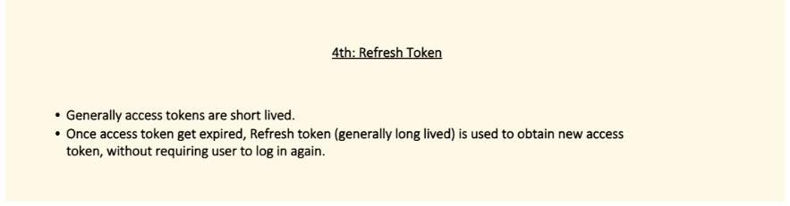

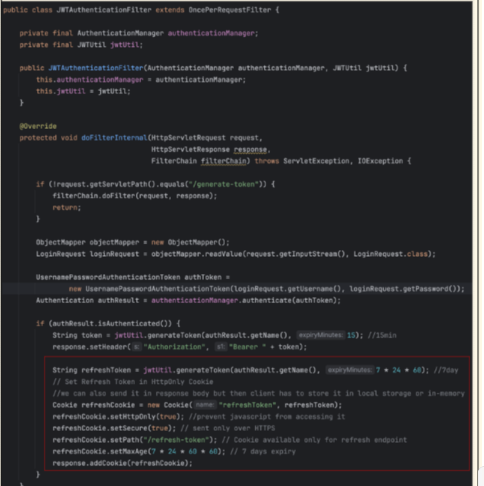

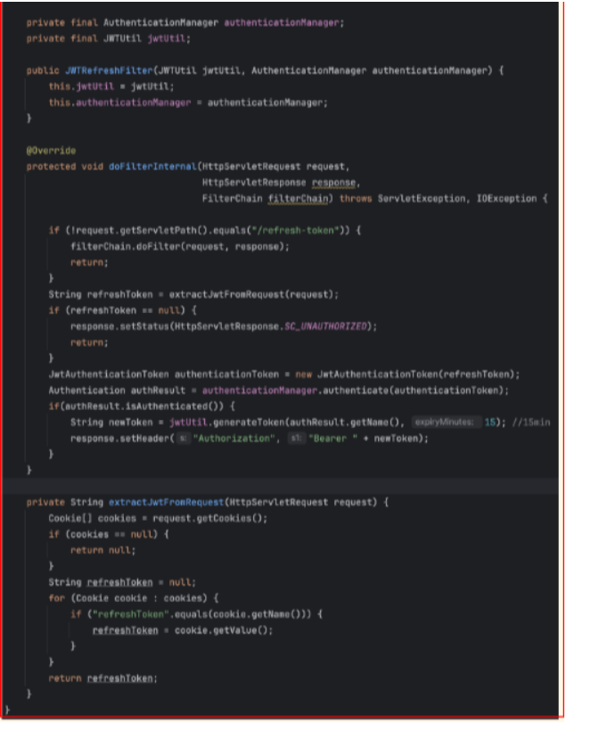

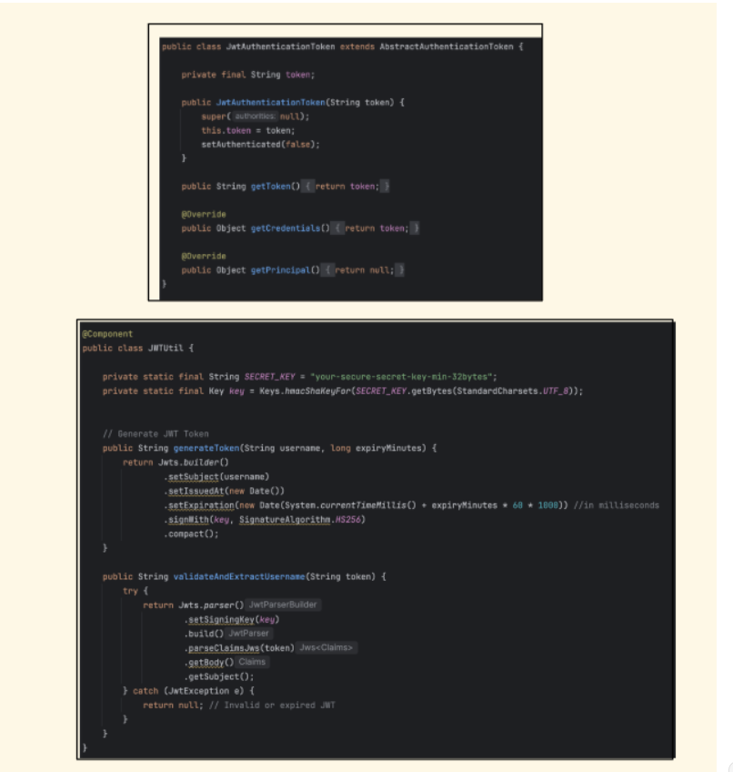

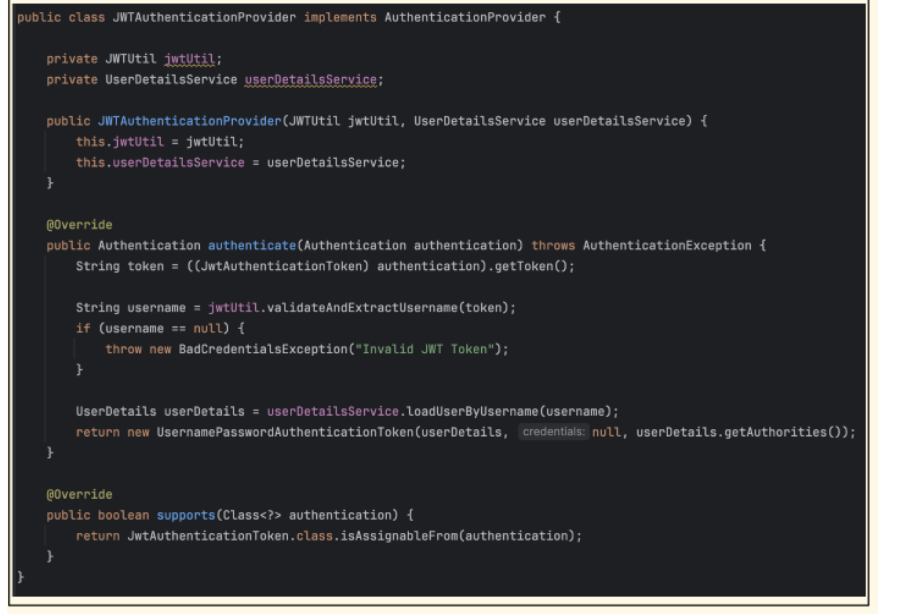

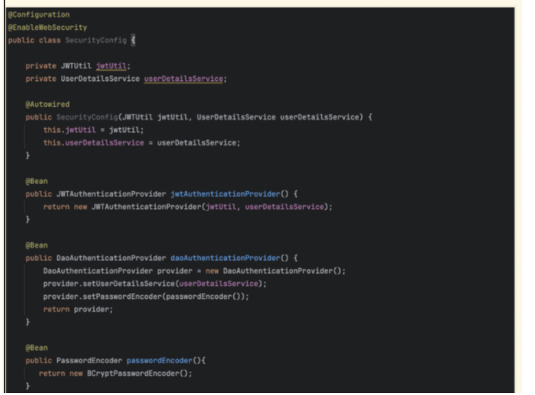

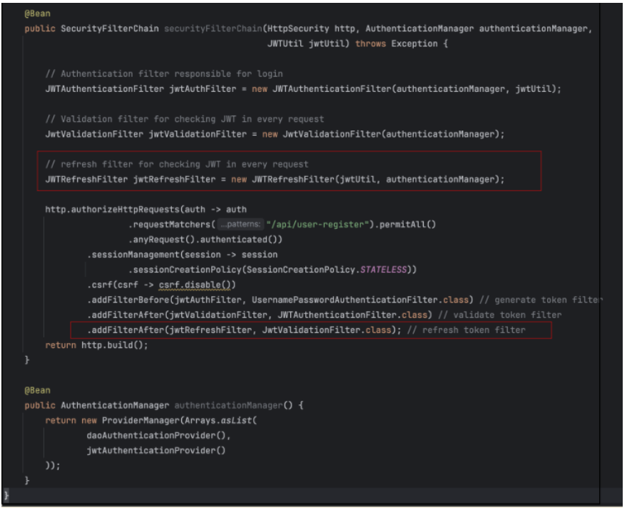

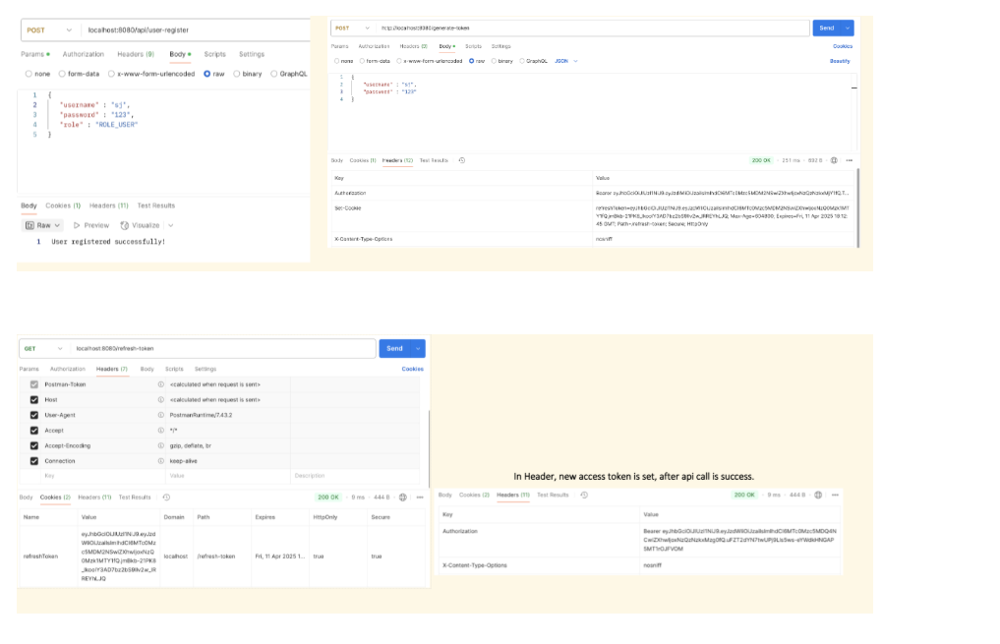