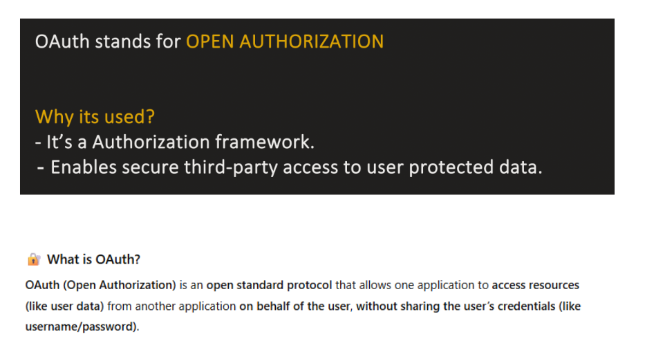


| Feature                  | Why It Matters                                 |
| ------------------------ | ---------------------------------------------- |
| **Secure Delegation**    | Access resources without exposing credentials  |
| **Granular Permissions** | Access only specific resources                 |
| **User Control**         | Users can revoke access anytime                |
| **Standardization**      | Same process for Google, GitHub, etc.          |
| **Scalability**          | Works for web, mobile, APIs, and microservices |


### 🪪 **OpenID Connect (OIDC)** → Authentication layer built on top of OAuth 2.0

OIDC adds:

- **ID Token** (a JWT that contains user identity info),

- A standardized way to get **user profile**,

- Clear authentication semantics.


So:

- **OAuth 2.0** → App gets access to resources (like Google Calendar API).

- **OpenID Connect (OIDC)** → App learns _who the user is_.
## ❌ **OAuth 2.0 is _not_ SSO (Single Sign-On)**

Let’s explain why:

|Feature|OAuth 2.0|SSO|
|---|---|---|
|**Purpose**|Delegated authorization|Centralized authentication (login once → access many apps)|
|**Focuses on**|Access to _resources/APIs_|Identity of the _user_|
|**Token Type**|Access Token|Authentication token or cookie|
|**Defines user identity?**|❌ No|✅ Yes|
|**Example**|A fitness app reading your Gmail calendar|You log in once to your company portal and access multiple internal systems|

So OAuth 2.0 doesn’t handle **identity** or **login session management** — that’s where **OpenID Connect (OIDC)** or **SAML** comes in.

---

## 🧩 **So what provides SSO then?**

- **OpenID Connect (OIDC)** → Built _on top_ of OAuth 2.0

    - Adds an **ID Token** (JWT with user info)

    - Enables **authentication + SSO**


## 🎯 **Main Uses / Use Cases of OpenID Connect**

| #                                           | Use Case                                                                                                                                                                                   | Description |
| ------------------------------------------- | ------------------------------------------------------------------------------------------------------------------------------------------------------------------------------------------ | ----------- |
| **1. User Authentication (Login)**          | The most common use case. OIDC securely authenticates a user using an external identity provider (like Google, Microsoft, or Okta).  <br>👉 Example: “Login with Google”.                  |             |
| **2. Single Sign-On (SSO)**                 | Enables users to log in once and access multiple apps without re-entering credentials.  <br>👉 Example: Login once → access Gmail, Drive, YouTube.                                         |             |
| **3. Federated Identity / Social Login**    | Lets users log in using accounts from other providers — Google, GitHub, Facebook, etc.  <br>👉 Example: Using your GitHub account to log in to Jira or Slack.                              |             |
| **4. Centralized Identity Management**      | Enterprises use OIDC to centralize authentication through one Identity Provider (like Okta, Azure AD).  <br>👉 Example: Corporate login that gives access to HR, CRM, and Payroll systems. |             |
| **5. JWT-based Authentication for APIs**    | OIDC issues **ID Tokens (JWT)** that APIs can verify without storing sessions — perfect for stateless, modern web or mobile apps.                                                          |             |
| **6. Secure User Info Sharing**             | Provides a standard **/userinfo endpoint** to get verified user profile data (name, email, etc.) — no need to store user data separately.                                                  |             |
| **7. Integration with OAuth Authorization** | Since it extends OAuth 2.0, you can use OIDC for **both authentication (who)** and **authorization (what)** in one unified flow.                                                           |             |


--------------------------------------------------------------------------------------


## UseCses of Oauth only


# 🔹 **OAuth-only scenarios (no OIDC)**

OAuth 2.0 **alone** is about **authorization** — letting one app access resources from another app **on behalf of a user**, without needing the user’s password.  
It **does not provide authentication** (login).

Here are **real-world examples**:

---

## **1. GitHub CI/CD apps**

- Scenario: You want a third-party CI/CD tool (e.g., Jenkins, CircleCI) to **access your GitHub repositories**.

- Resource: GitHub repos (code, issues, pull requests)

- Why OAuth:

    - The CI/CD tool should not know your GitHub password

    - OAuth lets you grant **limited access** (scopes like `repo`, `read:org`)

    - Access can be **revoked anytime**

- No OIDC needed because the tool doesn’t care who you are, just that it can access the repos.


---

## **2. Spotify playlist apps**

- Scenario: A web app wants to **read or modify your Spotify playlists**.

- Resource: Your playlists in Spotify account

- Why OAuth:

    - The app needs authorization to access your data

    - OAuth scopes: `playlist-read-private`, `playlist-modify-private`

    - No OIDC needed because the app doesn’t need to authenticate you — it only needs access to your playlists.


---

## **3. Google Drive file editors**

- Scenario: A third-party photo editor wants to **open/save files in Google Drive**.

- Resource: Your Google Drive files

- Why OAuth:

    - The app can’t ask for your Google password

    - OAuth allows you to grant access **only to specific folders or file types**

    - OIDC is not required because the editor doesn’t care who you are, just what files it can access.


---

## **4. Facebook / Instagram analytics apps**

- Scenario: Analytics dashboard wants to **read your posts or metrics**.

- Resource: Your account data (posts, likes, insights)

- Why OAuth:

    - OAuth gives **access token** with `read_insights` scope

    - App doesn’t need to log you in; it only fetches data

    - OIDC is unnecessary because no login is happening.


Ah — now we are getting to the **core purpose of OAuth**. Let’s break this down carefully.

# 🔹 **What happens if you try to access someone else’s resources _without OAuth_**

---

## **1. You need the user’s password**

Without OAuth:

- Your app has no token system to access resources

- To get user data, your app would have to ask for **the user’s login credentials** (username + password)


### Why this is bad:

- Users would have to **trust every app with their password**

- If the app is malicious, the user’s account can be stolen

- No way to limit access — app could access all data, not just what’s needed


Example:

- If a playlist app wanted to access Spotify without OAuth, it would need your Spotify password — huge security risk.


---

## **2. No scope or granularity of access**

OAuth allows **scopes**, e.g.:

- `playlist-read-private` → only read playlists

- `repo:read` → only read repos


Without OAuth:

- Your app could either access everything or nothing

- No way to limit permissions

- Users cannot revoke access without changing their password


---

## **3. No revocation or control**

With OAuth:

- Users can revoke access tokens at any time (e.g., “remove app access” in Google/Spotify settings)


Without OAuth:

- The app has the password — the user would have to **change their password** to revoke access

- This breaks user experience and security


---

## **4. API servers will reject the request**

Modern resource servers **require OAuth tokens**:

- Google APIs

- GitHub APIs

- Spotify APIs

- Facebook APIs


If you try to call the API without OAuth:

- You get `401 Unauthorized` or `403 Forbidden`

- There’s no way to access the resource securely


---

## **5. Security implications**

Without OAuth:

- Apps would store passwords → risk of leaks

- Cannot do scoped access → over-permission

- Cannot audit or revoke access → permanent risk

- Cannot differentiate multiple apps → every app uses the same credentials

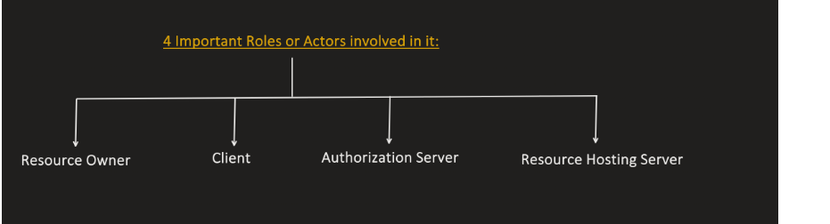


| #                           | Actor                                                                                                    | Description                                                  | Example |
| --------------------------- | -------------------------------------------------------------------------------------------------------- | ------------------------------------------------------------ | ------- |
| **1. Resource Owner**       | The **user** who owns the data and can grant permission to access it.                                    | You, the person whose Google Calendar data will be accessed. |         |
| **2. Client Application**   | The **app** that wants to access the user’s data on another service (with user consent).                 | The “FitTrack” app that wants to read your Google Calendar.  |         |
| **3. Resource Server**      | The **API or service** that holds the protected data. It validates the access token before serving data. | Google Calendar API.                                         |         |
| **4. Authorization Server** | The **server that issues tokens** (after verifying user identity and consent).                           | Google’s OAuth 2.0 authorization endpoint.                   |         |

## ⚙️ **How They Interact (Simplified Flow)**

Let’s use the example:

> “FitTrack wants to access your Google Calendar.”

1. **Client (FitTrack)** → redirects the user to **Authorization Server (Google)**.

   > “Hey, I need permission to read the user’s calendar.”

2. **Resource Owner (User)** → logs in and **grants consent**.

   > “Yes, I allow FitTrack to read my calendar.”

3. **Authorization Server (Google)** → issues an **Access Token** to the **Client**.

   > “Here’s a token you can use.”

4. **Client** → sends the **Access Token** to the **Resource Server (Google Calendar API)**.

   > “Here’s my token; please give me the user’s events.”

5. **Resource Server** → validates the token (via Authorization Server) and **returns data**.

   > “Token is valid. Here’s the user’s calendar data.”
   
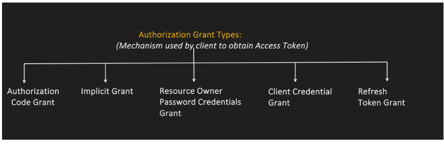

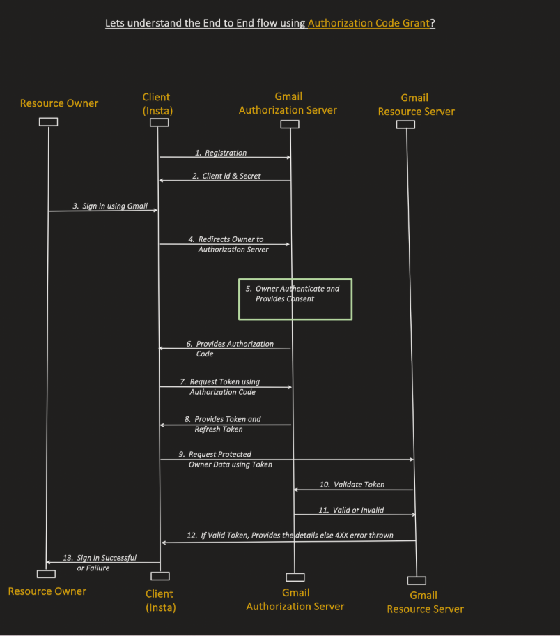

🏁 1. **App Registration (Developer setup stage)**

Before anything works, your **web app must register** with the **Authorization Server** (e.g., Google, GitHub, Auth0, etc.).

During registration, you (the developer) provide:

|Info|Example|
|---|---|
|**App name**|“FitTrack Web”|
|**Redirect URI**|`https://fittrack.com/oauth/callback`|
|**Type of app**|Web application|
|**Scopes you’ll request**|`openid profile email calendar.readonly`|

In return, the provider gives you:

|Item|Description|
|---|---|
|**client_id**|Public identifier for your app|
|**client_secret**|Private key (for confidential web apps only)|
|**authorization & token endpoints**|URLs used in OAuth flow|

---

## 🌐 2. **User clicks “Login with Google”**

When the user hits the “Login with Google” button, your app builds an **authorization URL** and redirects the browser there:

```
https://accounts.google.com/o/oauth2/v2/auth?
   response_type=code
   &client_id=YOUR_CLIENT_ID
   &redirect_uri=https://fittrack.com/oauth/callback
   &scope=openid%20profile%20email
   &state=xyz123
   &code_challenge=abc987
   &code_challenge_method=S256

```

🔹 Here, PKCE (`code_challenge`) adds security.  
🔹 The `state` is a random value to prevent CSRF attacks.

---

## 🔑 3. **User Authenticates and Grants Consent**

The **Authorization Server (Google)**:

1. Prompts the user to **log in** (enter credentials).

2. Asks for **consent** — e.g., “Allow FitTrack to access your profile and email?”


If the user agrees, Google proceeds.

---

## 🔁 4. **Authorization Server redirects back to your app**

After the user grants permission, Google redirects to your redirect URI:

`https://fittrack.com/oauth/callback?code=AUTH_CODE&state=xyz123`

Your backend now receives the **authorization code**.

---

## 🔐 5. **Your backend exchanges the code for tokens**

Your web server (not the browser) sends a **secure POST** to Google’s token endpoint:
```
POST https://oauth2.googleapis.com/token
Content-Type: application/x-www-form-urlencoded

grant_type=authorization_code
code=AUTH_CODE
redirect_uri=https://fittrack.com/oauth/callback
client_id=YOUR_CLIENT_ID
client_secret=YOUR_CLIENT_SECRET
code_verifier=theOriginalVerifier

```

👉 Google verifies the code, PKCE, and client credentials.

If valid, it responds with:

```
{
  "access_token": "ya29.a0AfH6SM...",
  "id_token": "eyJhbGciOiJIUzI1NiIsInR5cCI6IkpXVCJ9...",
  "refresh_token": "1//0g...",
  "expires_in": 3600,
  "token_type": "Bearer"
}

```

---

## 🧠 6. **Backend validates the ID Token (OpenID Connect)**

If you included `openid` in your scopes, the **ID token** is a JWT that contains:

- User identity info (subject, name, email, etc.)

- Issuer (`iss`)

- Audience (`aud`)

- Expiration (`exp`)

- Signature (verifiable with Google’s public key)


Your app verifies the JWT signature and extracts user details → creates a **session or cookie**.

---

## 🔓 7. **Access Token use (optional)**

If you also requested API scopes (like Google Calendar), your backend can now call:

`GET https://www.googleapis.com/calendar/v3/users/me/calendarList Authorization: Bearer ya29.a0AfH6SM...`

The **Resource Server** (Google Calendar API) validates the access token and returns the user’s data.

---

## 🔄 8. **Refresh Token (optional)**

When the access token expires, your backend can silently refresh it:

`POST /token grant_type=refresh_token refresh_token=1//0g...`

---

## 🧾 Summary Flow (Web App with Authorization Code + PKCE)

| Step | Actor                           | Description                                        |
|------|---------------------------------|----------------------------------------------------|
| 1    | **Developer → Auth Server**     | Register app (get client_id, secret, redirect_uri) |
| 2    | **Client → User**               | Redirects to Google login                          |
| 3    | **User → Auth Server**          | Logs in & consents                                 |
| 4    | **Auth Server → Client**        | Sends `authorization_code`                         |
| 5    | **Client → Token Endpoint**     | Exchanges code for tokens (uses `code_verifier`)   |
| 6    | **Client → Validates ID Token** | Gets user info (OIDC)                              |
| 7    | **Client → Resource Server**    | Accesses APIs with access_token                    |
| 8    | **Client → Token Endpoint**     | Refreshes tokens when needed                       |


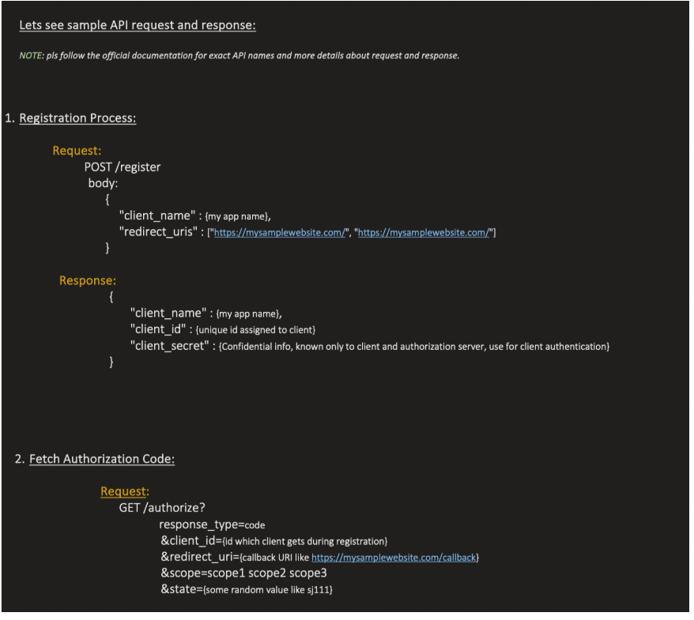

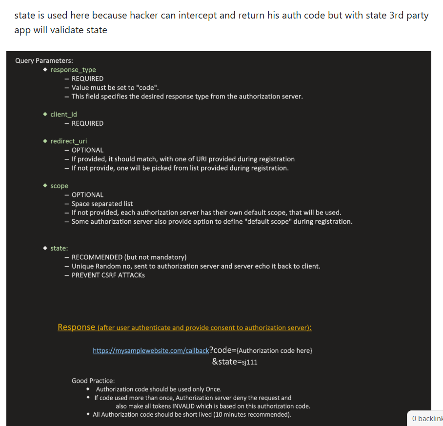

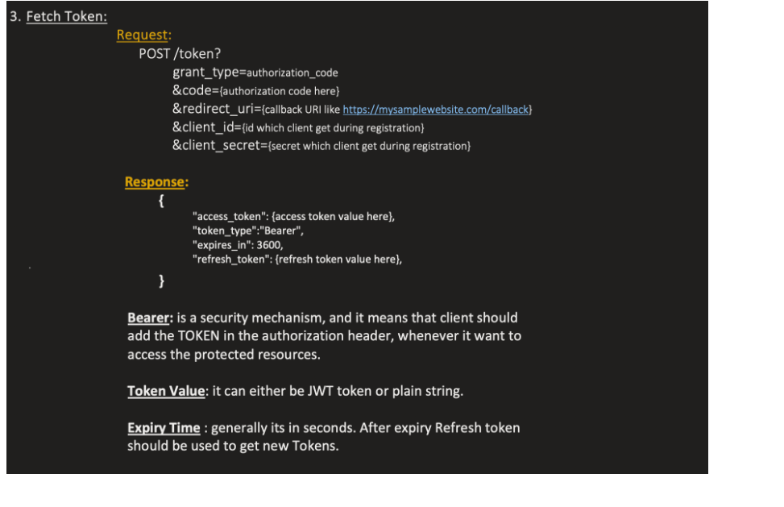

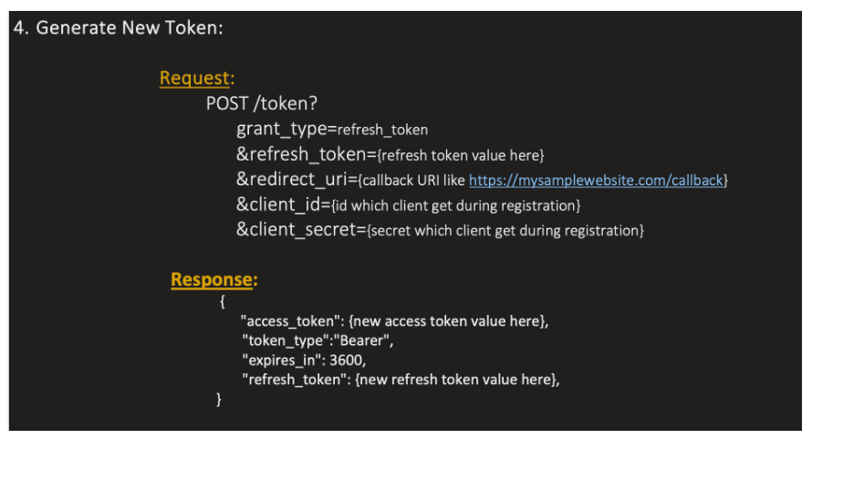

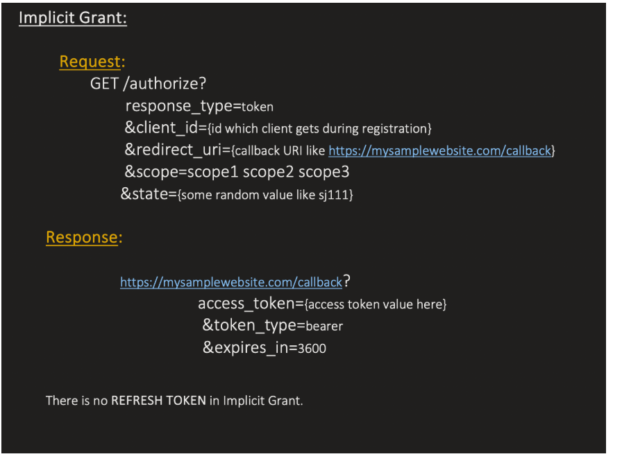

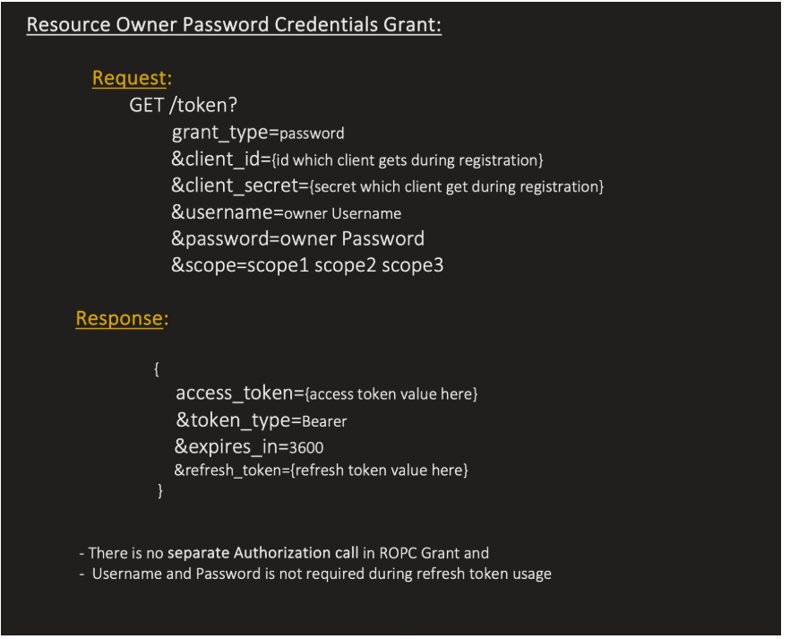

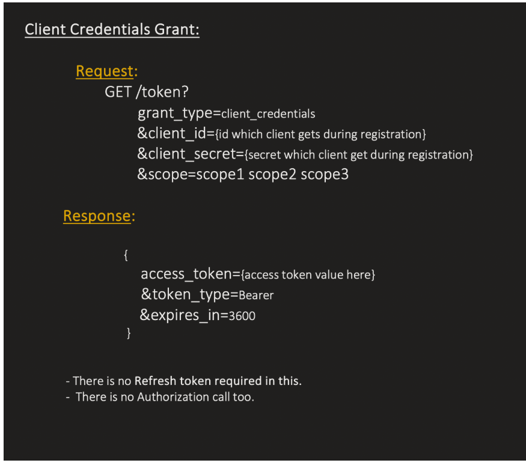

Why “redirects” can be insecure in OAuth

A **browser redirect** means something sensitive (like an authorization code or token) is sent back to your app **via a URL in the user’s browser** — for example:

`https://myapp.com/callback?code=abc123`

That may _look harmless_, but here’s why it can be risky 👇

---

## 🧩 1. The URL (redirect target) is **visible everywhere**

When a browser redirects:

- The full URL (including query parameters like `?code=abc123`)  
  gets stored in:

    - Browser **history**

    - Web **server logs**

    - **Analytics tools** (e.g., Google Analytics)

    - **Proxy servers** or corporate firewalls

    - **Referrer headers** when the next page loads


🔴 **Risk:**  
If the URL contains **sensitive data** (like an access token), it’s automatically exposed to multiple systems that were never meant to see it.

✅ **OAuth fix:**  
That’s why only a **short-lived, one-time-use code** (authorization code) travels in the redirect — not the token itself.


| Type                                | Example                                                          | Where data goes                                    |
| ----------------------------------- | ---------------------------------------------------------------- | -------------------------------------------------- |
| **URL redirect (query / fragment)** | `https://myapp.com/callback?code=abc123`                         | In the URL (visible to browser, logs, referrers)   |
| **HTTP POST body**                  | Server makes a POST request and gets `{ "access_token": "..." }` | Inside HTTPS-encrypted body (invisible to browser) |


# 🧩 Step-by-step Reality of What Happens in OAuth Authorization Code Flow

Let’s look closely at what _actually_ happens.

---

### **1️⃣ Your app starts the login**

Your app (frontend or backend) sends a redirect like:

`https://accounts.google.com/o/oauth2/v2/auth?   client_id=myapp123&   redirect_uri=https://myapp.com/callback&   response_type=code&   scope=email`

Who makes this request?

👉 The **user’s browser** does — not your backend.

Even if your backend generated the URL, the **actual HTTP request to Google** goes from the user’s browser when they click “Login with Google.”

✅ So from Google’s point of view:

- The request came from the **user’s browser** (IP of the user),

- Not from your app’s server.


---

### **2️⃣ Google authenticates the user**

The user logs in and approves permissions — all this happens on Google’s site.

Then Google must send the result (the “yes, user approved your app”) back to your app.

At this point:

- Google cannot open a **direct HTTP POST** to your backend — it doesn’t know how (or even if it’s reachable).

- The only safe path Google can use is the **browser**, which already knows where your app is.


✅ So it uses a **redirect URI**:

`HTTP 302 Found Location: https://myapp.com/callback?code=abc123`

That goes _through_ the browser.

---

### **3️⃣ Browser carries the code back**

Now the user’s browser requests your app’s callback URL:

`GET /callback?code=abc123 Host: myapp.com`

Now your **backend** gets involved — this is the first time your server is actually seeing the code.  
This is where you can securely match it to the user’s session.

---

### **4️⃣ Backend exchanges the code securely**

Your backend now makes a **server-to-server** (back-channel) request to Google:

`POST https://oauth2.googleapis.com/token grant_type=authorization_code code=abc123 client_secret=XYZ redirect_uri=https://myapp.com/callback`

✅ This one _is_ made directly by your backend —  
and **this** is the step where the access token and refresh token are returned (in the body, over HTTPS).

---

# 🧠 The key insight

|Step|Who actually makes the request|Channel|Visible to|
|---|---|---|---|
|1️⃣ Authorization request|Browser → Google|Front-channel|User device|
|2️⃣ Authorization response|Google → Browser → Your app|Front-channel|User device|
|3️⃣ Token exchange|Your backend → Google|Back-channel|Private, secure|

So while your _backend initiated the flow_,  
the **authorization round-trip actually goes through the browser**.

That’s why Google can’t simply “POST the token” directly to your backend —  
because at the time the user approves access, there’s **no open connection** between Google and your server.

---

# 🧩 Analogy

Think of it like:

- You (the app) send a letter to Google through the user’s browser (“please get the user’s permission”).

- Google responds with a letter (the code), but it must hand it **back through the same mail carrier (the browser)** — because that’s the only open route.

- Then _you_ (the server) privately go back to Google with that letter to prove it’s real and get the actual tokens.


If Google tried to directly send the final letter (token) to your house (server), it wouldn’t know where your mailbox is, and it could be intercepted.


------------------------------------------------------------------------------------------


💯🔥 Brilliant question — this is _exactly_ where most developers get confused between **OAuth 2.0** and **OpenID Connect (OIDC)**.

You’ve hit the nail on the head 👇

> “If OAuth is for resource sharing, but the token (like the access token) can contain user details — isn’t that just login?”

Let’s break this down **very clearly**, step by step.

---

## 🧩 1️⃣ The _original_ purpose of OAuth 2.0

OAuth was **never** designed for login.  
It was designed for **delegated authorization** — giving one app permission to act on behalf of a user on another service.

Example:

> You log into _Spotify_, and Spotify wants to access your _Google Drive_ to back up your playlists.

- Spotify doesn’t need your Google password.

- It just needs an **access token** that says:  
  “Spotify is allowed to read files from this Google user’s Drive.”


That’s OAuth — **resource access delegation**.

✅ **OAuth 2.0 = Authorization (resource access)**  
❌ **Not Authentication (who the user is)**

---

## 🧩 2️⃣ What’s inside an OAuth access token?

The **access token** is meant to be used by the **client app** to access **protected resources** (APIs).  
It tells the resource server:

> “This request is authorized to access resource X on behalf of user Y.”

It might internally _contain_ user identifiers (like `sub` or `user_id`), but that’s for the API to know **whose data** to fetch — **not** for the client to identify the user.

The client isn’t supposed to look inside or rely on it.

---

## 🧩 3️⃣ Then why does the token sometimes have user info?

Good catch — some OAuth providers (like Google, GitHub, Facebook) include user info or let you call `/userinfo` with that token.

That’s because they implement **OpenID Connect (OIDC)** _on top of_ OAuth 2.0.  
OIDC **extends OAuth** to make it usable for _login and user identity_.

---

## 🧱 4️⃣ OpenID Connect = “OAuth 2.0 + identity layer”

OpenID Connect adds two key things:

|Component|Purpose|
|---|---|
|**ID Token**|A _JWT_ that proves who the user is (authentication)|
|**/userinfo endpoint**|Optional endpoint to fetch user profile info|

OIDC uses the same flows (authorization code, PKCE, etc.)  
but adds the concept of _who the user is_ — safely.

✅ **OAuth access token:** “App X can access resource Y.”  
✅ **OIDC ID token:** “The user is John Doe, logged in via Google.”

---

## 🧩 5️⃣ So, if token has user details — which token is it?

- If it’s an **access token**, user details are _incidental_ — it’s still for API access.

- If it’s an **ID token**, user details are _primary_ — it’s for authentication (login).


So when you see tokens with user claims like `email`, `name`, `sub`, etc., that’s actually **OpenID Connect** behavior, not plain OAuth.

---

## 🧠 6️⃣ Summary Table

| Feature             | OAuth 2.0                        | OpenID Connect (OIDC)       |
|---------------------|----------------------------------|-----------------------------|
| Purpose             | Authorization (access control)   | Authentication (user login) |
| Token type          | Access Token                     | ID Token (+ Access Token)   |
| Audience            | Resource Server (API)            | Client App                  |
| Contains user info? | Maybe indirectly                 | Yes (explicitly)            |
| Typical endpoint    | `/token`, `/resource`            | `/token`, `/userinfo`       |
| Example use         | “Let app access my Google Drive” | “Login with Google”         |

---

## ⚙️ 7️⃣ TL;DR

> - **OAuth 2.0 →** “Can this app access your stuff?”
>
> - **OpenID Connect →** “Who are you?”
>

If you’re doing login (“Sign in with Google”),  
you’re using **OpenID Connect**, even though it rides on OAuth.

So when you see tokens with user data, you’re actually looking at an **ID token**, not a plain OAuth **access token**.