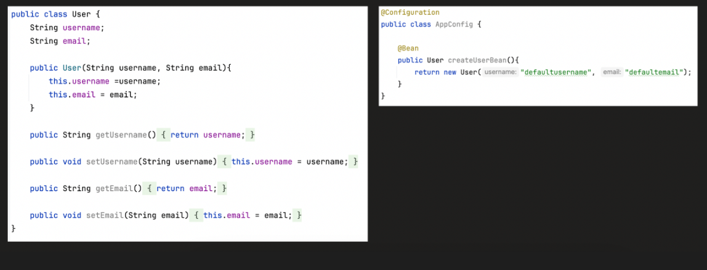
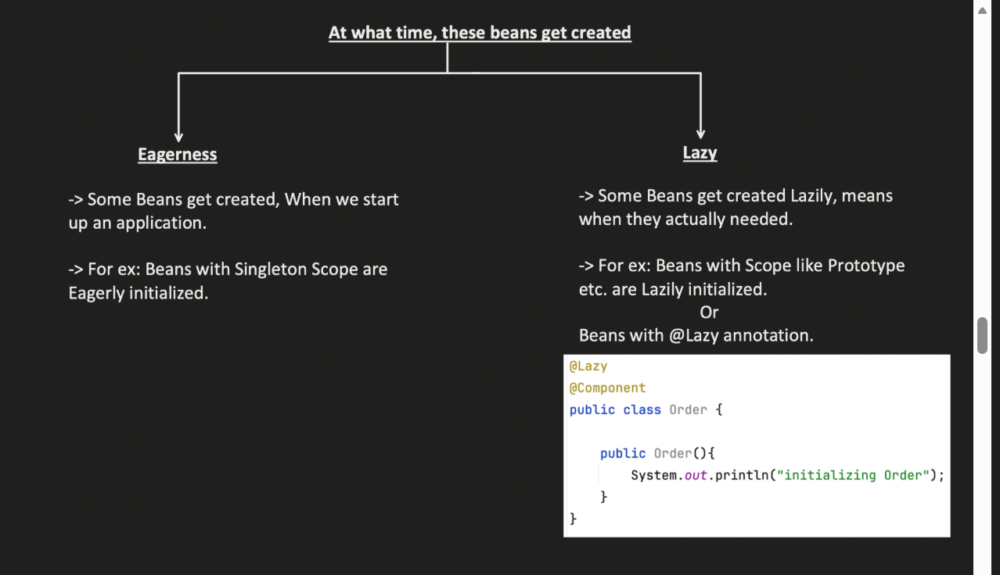
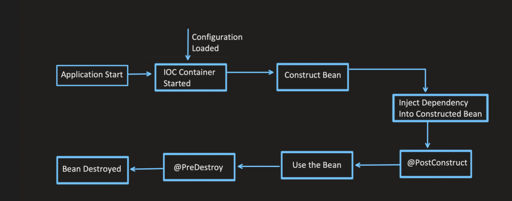
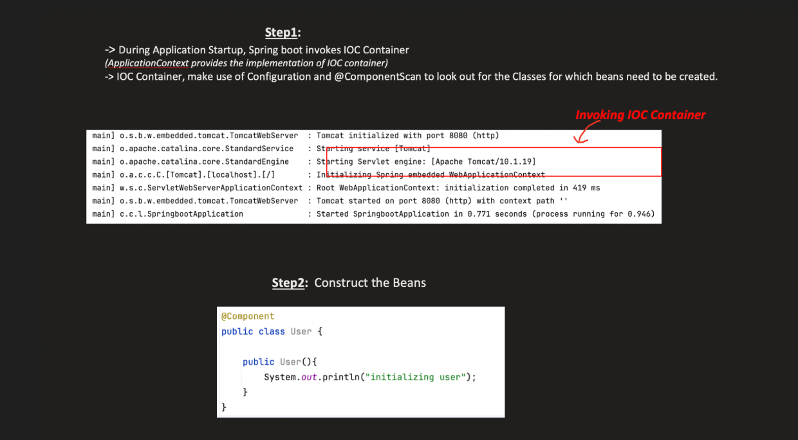
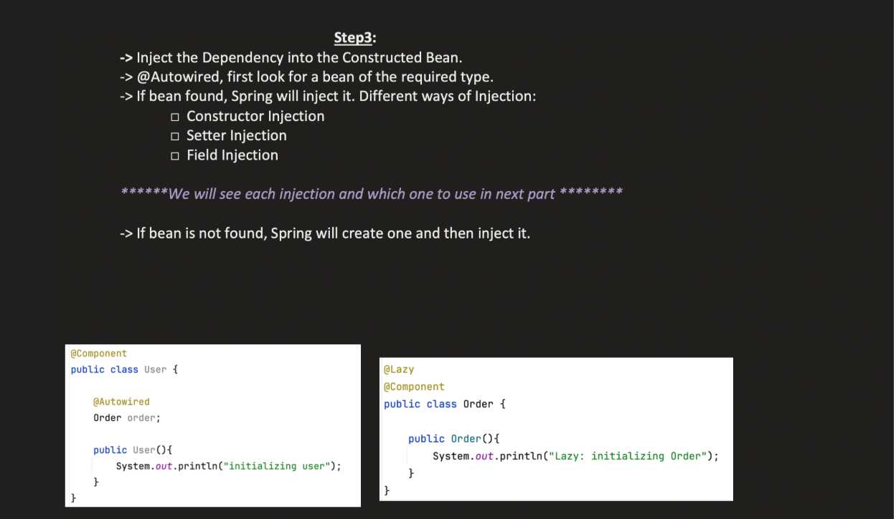
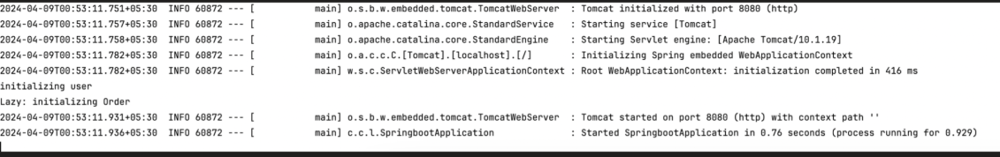
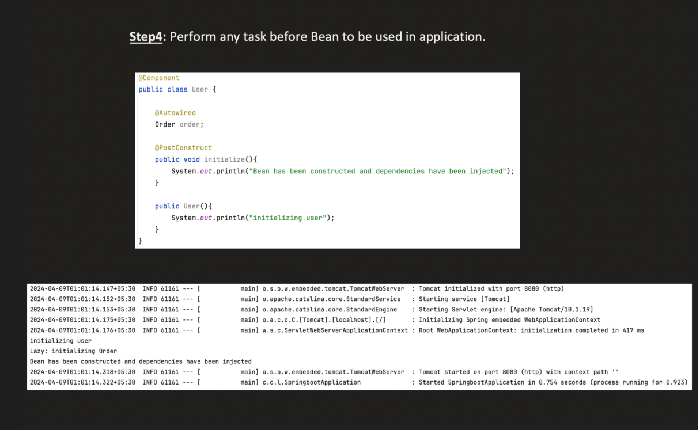
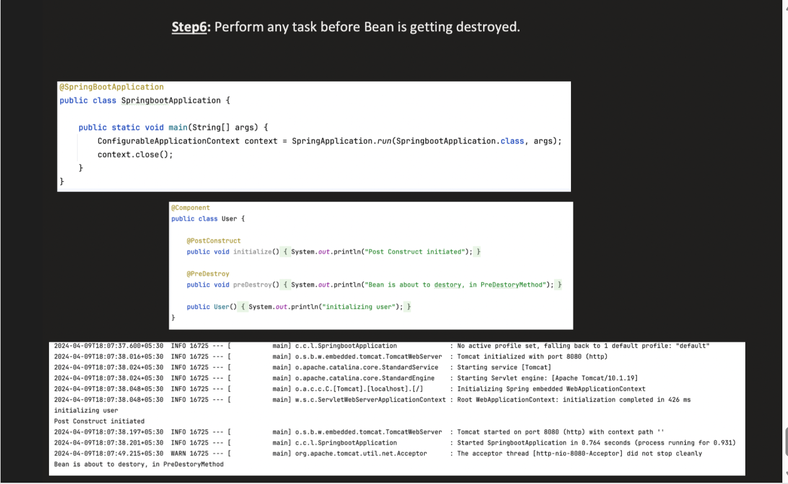

Beans :

            --Bean is just a java object which is managed by springContainer(IOC)
            --IOC container cretaes and manages bean

There are 2 ways by which a bean gets created

1. @Component :

          --- All annotations like @Service, @Repository, @Configuration etc are internally a @Component
              annotation
          --- Whenever we annotate a class with such annotations IOC will scan these components during runtime(component scanning)
              and finds classes which are anootated with these annotations and create object for these named as bean and manages them

2. @Bean :

         --- In some cases we need to tell the IOC how to create a object, we do that using @Bean annotation
         --- For ex : If we are having a constructor with arguments , IOC doesnot know what to pass in those arguments while creating 
                      bean, in such cases we manualy configure them which will be used by IOC to create a bean
        --We also create beans if it is Not under our control (third-party library)
        --Or needs complex manual configuration

---> Spring Beans are created in during 2 times

1. Eager
2. Lazy

Eager :

    --All singleton scoped beans are eagerly initialized which means the bean is created immediately during the startup itself

Lazy :

    --All prototype scoped beans are lazily initialized means they are created only at the time they are needed
    --We can also make a bean to load lazily using @Lazy annotation

**_LIFECYCLE OF A BEAN :_**

       1. Applictaion Startup
       2. IOC Container is invoked(Application context is the implementation of it)
       3. Bean initialization/construction takes place -> Component scanning Happens and bean intitilaization happens
       4. Injet Bean Happens ----> while bean creation if the bean needs any other bean to be injected the other bean is cretaed and injected
       5. @PostConstruct takes place
       6. Use the bean in appliaction
       7. @PreDestroy takes place
       8. Bean destroyed

--> If order is not autowired in user then Lazy: Initializing order wont be printed since it is lazily loaded

🔹 1️⃣ @PostConstruct – After Bean Creation

It runs:

After constructor

After dependency injection

Before the bean is used

💡 Main Purpose:

To perform initialization logic that depends on injected dependencies.

      ✅ Real Use Cases
      1️⃣ Open DB connections
      @PostConstruct
      public void init() {
      System.out.println("Connecting to external service...");
      }
      
      2️⃣ Validate injected dependencies
      @PostConstruct
      public void validate() {
      if(repo == null) {
      throw new RuntimeException("Repo not injected");
      }
      }
      
      3️⃣ Load cache into memory
      @PostConstruct
      public void loadCache() {
      cache = repository.findAll();
      }

🔹 2️⃣ @PreDestroy – Before Bean Destruction

It runs:

When application is shutting down

Before bean is removed from container

💡 Main Purpose:

To release resources cleanly.

      ✅ Real Use Cases
      1️⃣ Close DB connection
      @PreDestroy
      public void cleanup() {
      connection.close();
      }
      
      2️⃣ Stop background threads
      @PreDestroy
      public void stopScheduler() {
      scheduler.shutdown();
      }
      
      3️⃣ Flush logs / save state