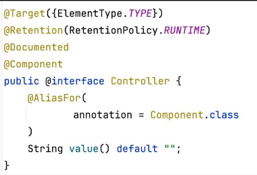
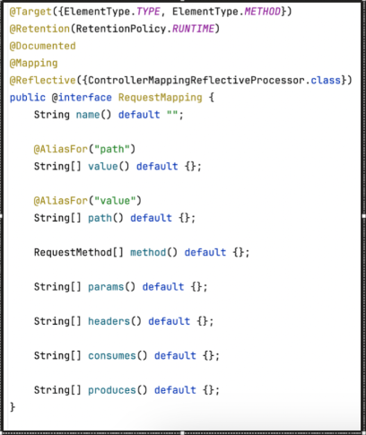
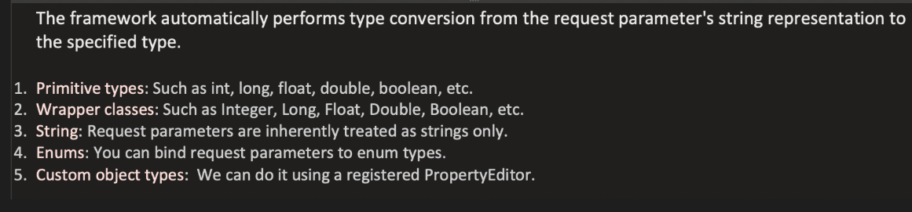
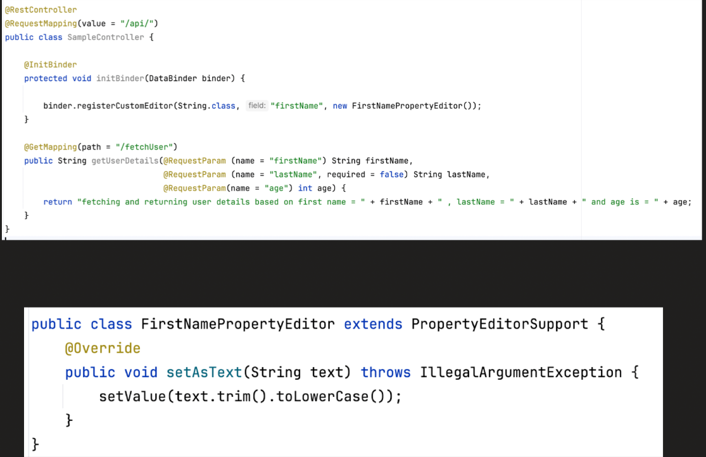
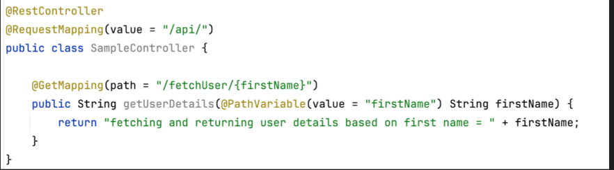
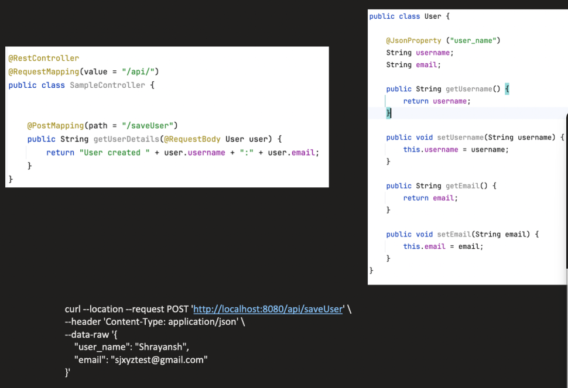
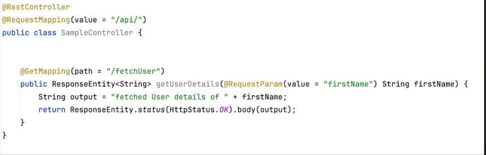
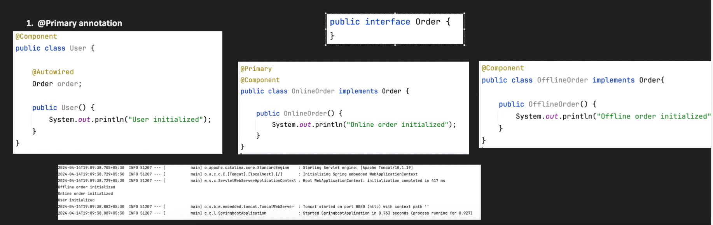
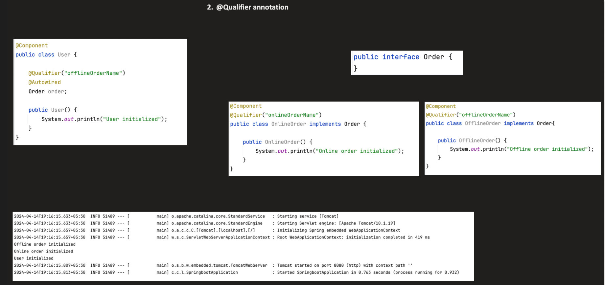
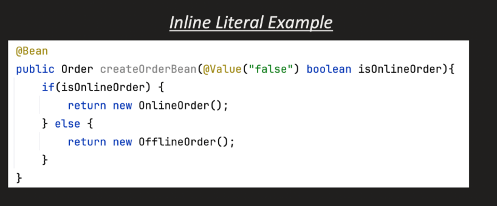

Annotations:

1. **_@Controller :_**
 

      --- It marks the class as Spring WebMvc
       --- It indicates that the class is responsible for handling HTTP request
       



2. **_@RestController :_**


       --- @Controller + @ResponseBody ---> Instead of returning views it returns Http response


3. **_@ResponseBody :_**

        --- Denotes that return value of the controller method should be serialized to HttpResponse Body
        --- If we dont provide it Spring will consider the response as name of view and will try to resolve and render it

4. **_@RequestMapping :_**

        --- It maps request to the method(i.e maps endpoint to method) or class
        --- @RequestMapping(value="/users", method=RequestMethod.GET)
        --- it can also be used at class levels along with @GetMapping,@PsotMapping

---> Here value can be replaced with path also





5. **_@GetMapping, @PostMapping, @DeleteMapping :_**

         --- Shortcut for @RequestMappping at method level


```java
        @RestController
        @RequestMapping("/users")
        public class UserController {
        
            @GetMapping("/{id}")
            public String getUser(@PathVariable Long id) {
                return "User id: " + id;
            }
        }
  ```

    --- Internally get mapping is annotated with @RequestMapping(method=RequestMethod.GET)

6. **_@RequestParam :_** 

          --- Used for binding request param to method param



---> Every request we send via Postman or browser will have param as String say fro age we give 18 it will be a String , Spring will convert it to int 

---> If we want to get every name binded to method must be in lowercase then we can use @InitBinder annotation and Property Editor/ Converter Support of Spring
---> @InitBinder is used to:

        Customize data binding
        Register custom editors
        Register custom formatters

 


✅ Converter
✅ Formatter
✅ PropertyEditor (old way)


When HTTP request comes:  /users?age=25&dob=12-02-2026
Everything from HTTP is: String


But your controller expects:

```java
    @GetMapping("/users")
        public String get(
        @RequestParam int age,
        @RequestParam LocalDate dob) {
    }
```

Spring must convert:

    String → int
    String → LocalDate


That conversion is handled by:

ConversionService


Inside ConversionService:

        Converter
        Formatter
        (Older) PropertyEditor

1️⃣ Converter (Modern & Simple Type Conversion)
🔹 What is it?

        A generic type-to-type converter.

Interface:

        public interface Converter<S, T> {
            T convert(S source);
        }

🔹 Example

        @Component
        public class StringToRoleConverter
        implements Converter<String, Role> {
        
            @Override
            public Role convert(String source) {
                return Role.valueOf(source.toUpperCase());
            }
        }


Request: role=admin
Spring calls: convert("admin")

Returns: Role.ADMIN

🔹 Characteristics

        ✔ One-direction (S → T)
        ✔ No locale support
        ✔ Used everywhere in Spring (core + web)
        ✔ Clean and simple

🔹 Where Used Internally?

    Spring has built-in converters for:
    
        String → int
        String → long
        String → UUID
        String → Enum
        String → Boolean
    
    All via:
    
    GenericConversionService

2️⃣ Formatter (UI-Oriented Conversion)
🔹 What is it?

Formatter is designed for:

        Parsing user input
        Printing formatted output
        Supporting locale

Interface:

    public interface Formatter<T> {
    
        T parse(String text, Locale locale);
    
        String print(T object, Locale locale);
    }

🔹 Example

        @Component
        public class CustomDateFormatter
        implements Formatter<LocalDate> {
        
            @Override
            public LocalDate parse(String text, Locale locale) {
                return LocalDate.parse(text,
                    DateTimeFormatter.ofPattern("dd-MM-yyyy"));
            }
        
            @Override
            public String print(LocalDate object, Locale locale) {
                return object.format(
                    DateTimeFormatter.ofPattern("dd-MM-yyyy"));
            }
        }


Request: dob=12-02-2026

Spring calls: parse("12-02-2026", Locale.ENGLISH)

🔹 Why Locale?

Date format differs by country:

        India → 12-02-2026
        US → 02/12/2026
        Germany → 12.02.2026

Formatter handles this.

🔹 Characteristics

    ✔ String ↔ Object
    ✔ Bidirectional
    ✔ Locale aware
    ✔ Mainly for UI / web layer

3️⃣ PropertyEditor (Old Mechanism)


7. **_@PathVariable :_** 

        --- Used to extract values from the path of the URL and binds it to method parameters




8. **_@RequestBody :_** 

        --- It is used to bind the body of Http Request to contoller method parameter




9. **_@JsonProperty :_**  

        --- The name which we give in the request of request body in postman must match with jsonProperty value else it should be same as defined in request. see above img for ex
        --Map JSON field name to Java field name
        --Customize serialization/deserialization
10. **_@ResponseEntity :_** 

        --- It returns the entire HTTP response which includes headers, body, status etc
        --- We can control the handling od status





11. **_@Autowired :_**

         ---@Autowired is an annotation used to automatically inject a dependency from the Spring IoC container into a bean.

12. **_@Primary :_**

        ---@Primary tells if there are multiple beans of the same type prefer this one by default



13. **_@Qualifier :_**

        ---@Qualifier tells Spring inject this particular bean
        ---@Qualifier is used when multiple beans of the same type exist and you want to inject a specific one.


---> @Qualifier has higher precedence over @Primary


14, **_@Value :_**

      The @Value annotation in Spring Boot is used to inject values from external sources, 
      such as property files (application.properties or application.yml), environment variables, system properties, or even literal strings, into Spring-managed beans. 



```java

//app.name=OrderServiceApp
//app.timeout=30

@Component
public class AppConfig {

    @Value("${app.name}")
    private String appName;

    @Value("${app.timeout}")
    private int timeout;
}


```