IOC : (Inversion Of Control) :

              --- Inversion of Control (IoC) is a design principle where the control of object creation and lifecycle management
                    is transferred from the application code to a framework or container.

              --- Instead of manually creating objects , framework themselves creates objects and injects wherever needed

              --- Dependency Injection is the technique by which Spring acheives IOC.


IOC Container(Application Context) : 

        --- IOC Container is the one which is responsible for creating objects(beans) and managing their lifecycle
        --- IoC Container is implemented mainly by the ApplicationContext interface.

       1. Reads Configuration Metadata → Loads bean definitions from annotations, Java config, XML, and properties files.
       2. Creates and Manages Beans → Instantiates beans and injects their dependencies automatically.
       3. Manages Bean Lifecycle → Controls initialization (@PostConstruct) and destruction (@PreDestroy) phases.
       4. Supports Bean Scopes → Handles singleton, prototype, request, session, and application scopes.
       5. Resolves Dependencies → Performs autowiring by type, qualifier, and primary bean selection.
       6. Publishes Events → Allows event-driven communication using ApplicationEventPublisher and @EventListener.
       7. Loads External Configuration → Resolves values from application.properties using @Value and Environment.
       8. Extends BeanFactory → Provides all BeanFactory features plus advanced enterprise capabilities.
       9. Supports Internationalization (i18n) → Provides message resolution for multiple languages.
       10. Supports AOP Integration → Automatically integrates proxy-based AOP functionality.
       11. Pre-instantiates Singleton Beans → By default creates all singleton beans at startup (eager loading).

Supports Hierarchical Contexts → Allows parent-child contexts in web applications.

```java
    public interface ApplicationContext extends EnvironmentCapable, ListableBeanFactory, HierarchicalBeanFactory, MessageSource, ApplicationEventPublisher, ResourcePatternResolver {
    
    }
```

---> Application COntext is created during application startUp

1. SpringApplication.run(App.class, args)---->createApplicationContext()

2. Spring Boot determines the application type which we are using

        | Application Type | When Selected               |
        | ---------------- | --------------------------- |
        | NONE             | No web dependencies         |
        | SERVLET          | Spring MVC / Tomcat present |
        | REACTIVE         | WebFlux present             |

3. Based on the applictaion type it creates ApplicationContext implementation

       ---> NONE ----> AnnotationConfigApplicationContext(👉 Used for standalone apps (no web server))
       ---> SERVLET ----> AnnotationConfigServletWebServerApplicationContext(👉 This supports: Embedded Tomcat, DispatcherServlet, Web environment)
       ---> REACTIVE ----> AnnotationConfigReactiveWebServerApplicationContext(👉 Used with Spring WebFlux (Netty server))


1️⃣ EnvironmentCapable
What it adds

        Environment getEnvironment();

What Environment contains

        PropertySources (application.properties, system props, env vars)
        Profiles
        Property resolution logic

Why this is important

Because Spring must resolve:

        @Value("${server.port}")
        @Profile("dev")


Internally:

        Environment stores property sources
        It checks active profiles
        It resolves placeholders

👉 Without this interface, ApplicationContext cannot handle configuration.

2️⃣ ListableBeanFactory

This extends BeanFactory.
What it adds

        Ability to list and query beans:
        
            getBeanDefinitionNames()
            getBeansOfType()
            getBeanDefinitionCount()

Why needed?

        Basic BeanFactory only allows:
            getBean("name")
            getBean(Class)


But advanced features need:

        Getting all beans of a type
        Autowiring by type
        Checking duplicates
        Processing all beans

For example:
When Spring processes @Autowired, it must:

        Find all beans of that type
        Resolve ambiguity
        That requires ListableBeanFactory.


4️⃣ MessageSource
What it adds

        getMessage()

Why needed?

        For internationalization (i18n).

Spring loads:

        messages.properties
        messages_en.properties
        messages_fr.properties                                                                               


Used in:

    Validation messages
    UI messages
    Error messages

Internally:

    Spring creates ResourceBundleMessageSource
    ApplicationContext delegates to it

5️⃣ ApplicationEventPublisher

What it adds

        publishEvent()

Why needed?

    Spring is event-driven internally.

When:

        Context starts
        Context stops
        Bean created
        Application ready
        Spring publishes events like:

                ContextRefreshedEvent
                ApplicationReadyEvent
                @EventListener works because of this interface.

6️⃣ ResourcePatternResolver
What it adds

        getResource()
        getResources()

Why needed?

Spring loads:

        XML files
        Properties files
        Classpath resources
        Wildcard paths

Example:

        classpath*:META-INF/spring.factories
        Boot heavily depends on this to auto-configure.
        Without resource loading → no scanning, no config loading.


-----------------------------------------------------------------------------------------------------------------------------------


**_DEPENDENCY INJECTION :**_


        ---> Dependency injection is a technique used to acheive IOC , where dependencies are provided by external containers
             rather than we manually creating them
  

Issue Without Dependency Injection :

1. Tightly Coupled :

        ---> Say we have 2 classes User and Order where User class is dependent on Order class as in below dig

 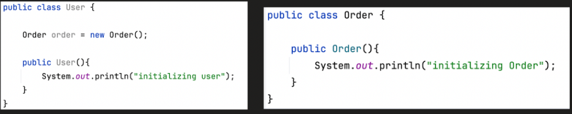

Say we have a requirement that the order must be online order as well as offline order 
We would create a interface for order and implement Offline and Online orders

Any change in Order, we will need to change User class also

        Thus it becomes more **_tightly coupled_**

2. It also breaks D of SOLID principle(Dependency Inversion).

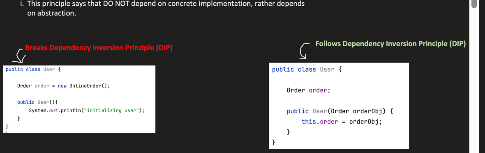


With Dependency Injection :

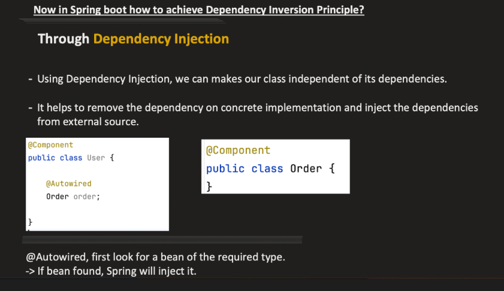


**_Types of Dependency Injection :**_

        1.Field Injection
        2.Setter Injection
        3.Constructor Injection


**_---> Field Injection :**_ 

        ---> Dependency is set through the fields of the class
        ----> SpringBoot uses reflection to find and  dependency object, it scan through dependency and resolves them 
        ----> reflection sets the dependency object to clases fields


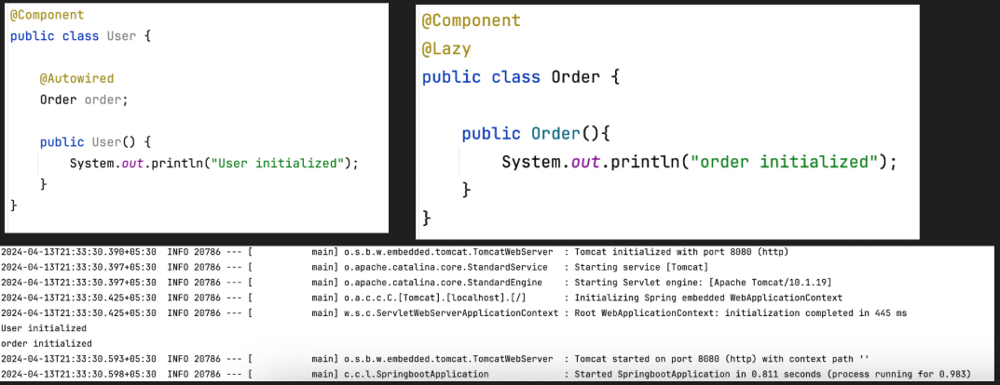


Advantage : 

        ---> Simple and Easy to use

DisAdvantage :

        ---> It breaks immutablity
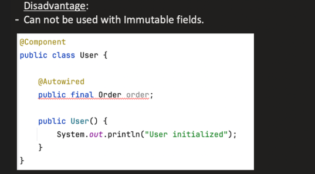

---> Say if immutable fields are allowed to be injected, during obj creation it creates obj with dep field = null
     After that using reflection it will change the dep field value to diff value which breaks immutability , so not allowed


        --->Chance of Null Pointer Exception if we manually create object for our class

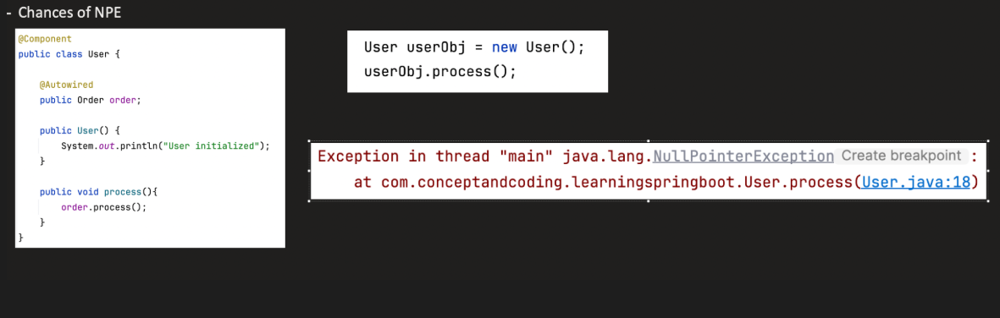

        ---> During unit testing mocking objects becomes bit difficult

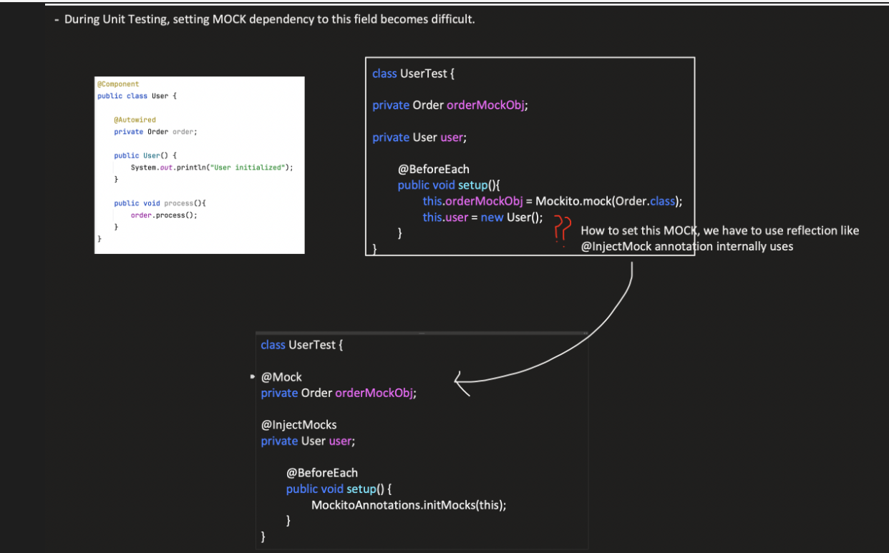


**_---> Setter Injection :**_

        ---> SImilar to field injection but the dependency is injected in the setter method
        ---> After Object creation spring calls the setter method because of autowired to resolve dependency


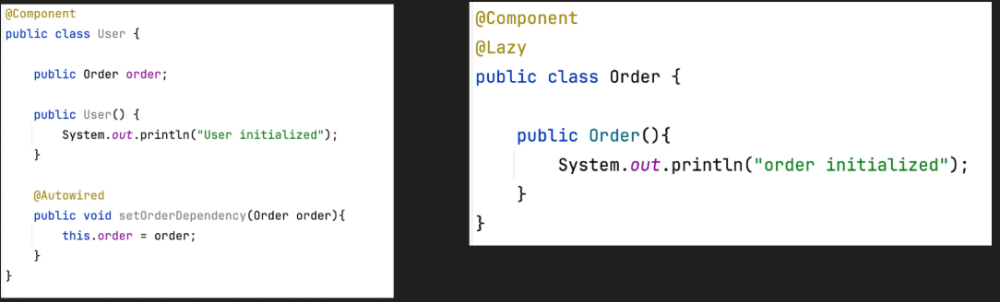

Advantages : 

        ---> Simpler and easy to use like field injection
        ---> Ease of testing

```java

        Engine mockEngine = Mockito.mock(Engine.class);
        Car car = new Car();
        car.setEngine(mockEngine);   // manual injection
        car.drive();
        

```

    

Disadvantage :

       ---> Does not allow immutable fields same as field injection


**_---> Constructor Injection :**_

    ---> Dependencies are injected at the time of object creation itself(i.e injected in constructor itself)
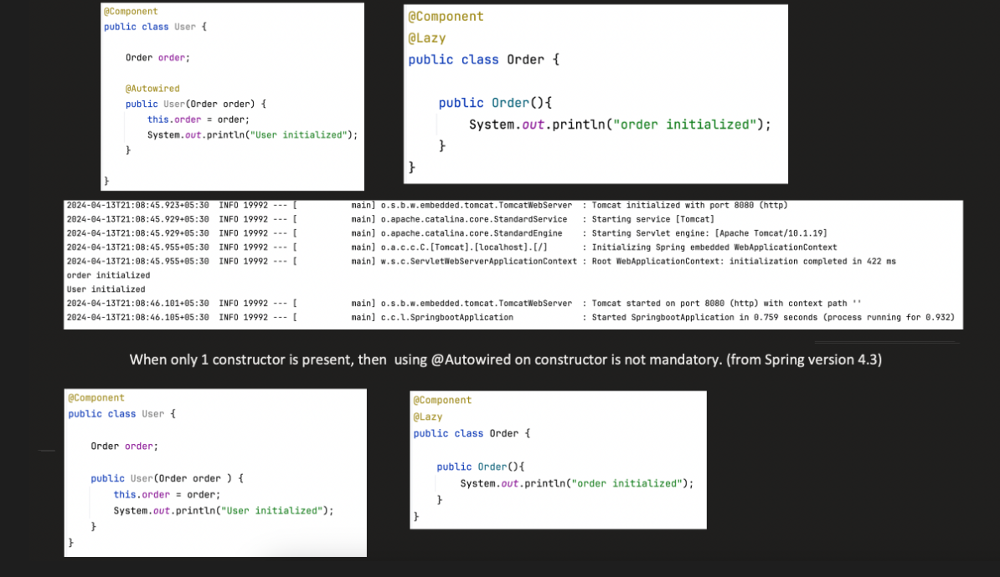

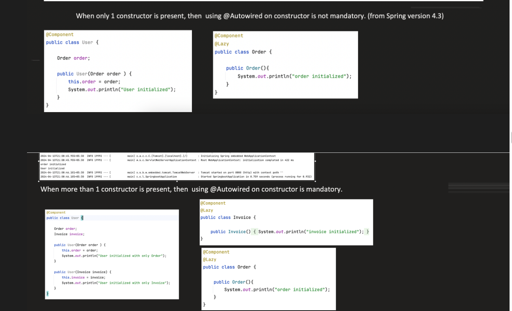
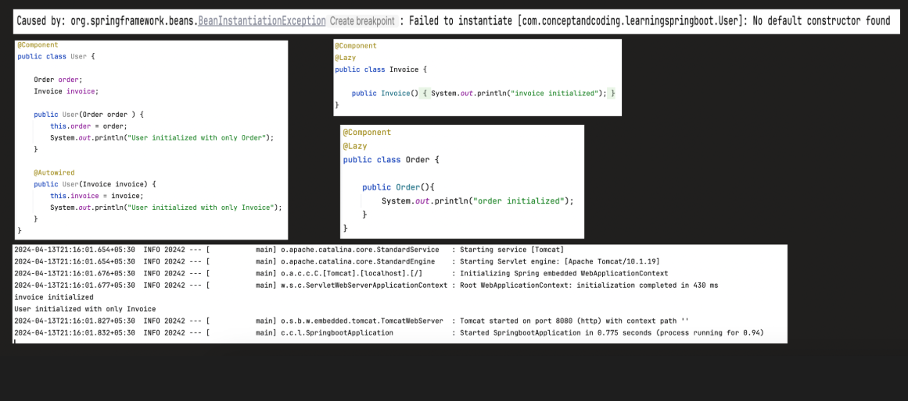


Advantages : 

        ---> All dependencies are resoved at object instansiation itself , so there will be no chance of NPE as weell as no need null checks
        ---> We can create immutable fields using constructor injection
        --->Fail Fast, if there is missing dependency it will fail during startup itself
        ---> Unit Testing is easy

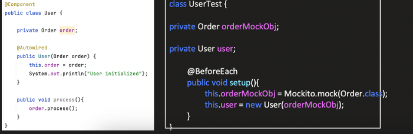


---> Proxy will not work on constructor dependency as it needs to be resolved during instantiation itself


COMMON PROBLEMS WITH DEPENDENCY INJECTION :

1. CIRCULAR DEPENDENCY :

   If 2 classes depend on each other , then we get circular dependency


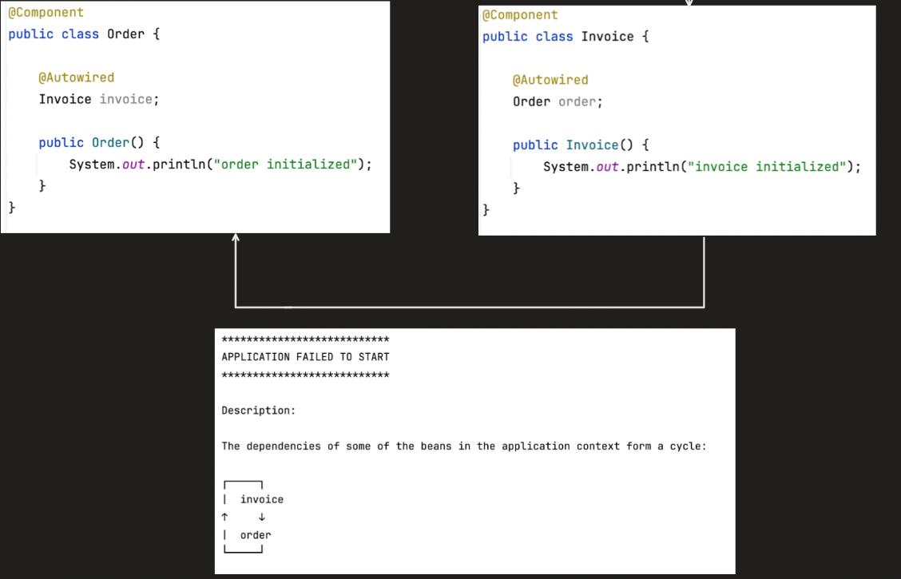


We can resolve this using various ways 

1. Refactor code
2. Put Lazy annotation on autowired so that that it will inject a mock object and whenever the dependency obj is originally created it will inject the original object
3. Using PostConstruct without autowired on the dependent class with setter allowing to set object

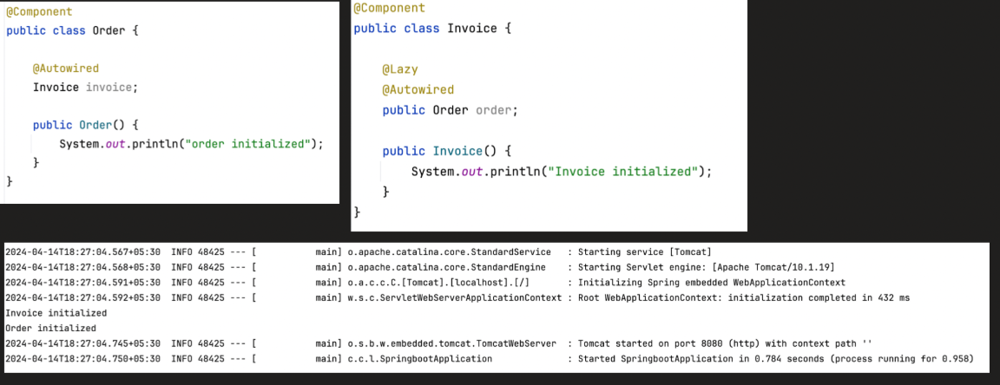

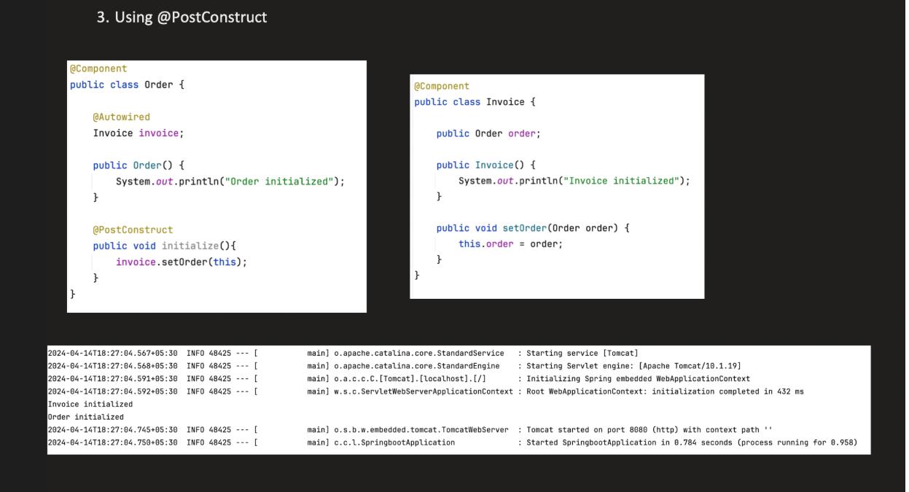


2. UNSATISFIED DEPENDENCY

See the below example

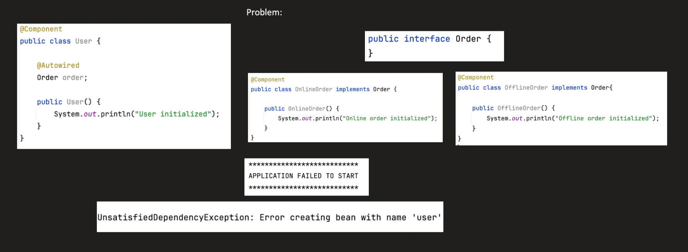


Here we have a User class dependent on Order interface ---> Order interface has 2 impl, onlineOrder and OfflineOrder
Spring doesnot know which class to inject as a dependency in user Class

We can resolve this using 

1. @Primary Annotation
2. @Qualifier Annotation


Using qualifier in the above example may not help in dynamic switching between diff obj of same type
the soln is below 


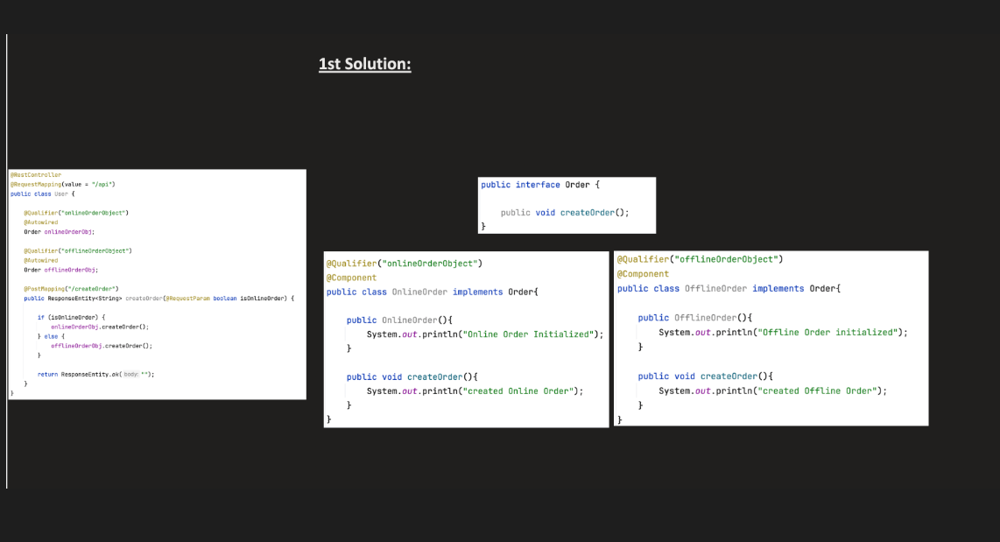

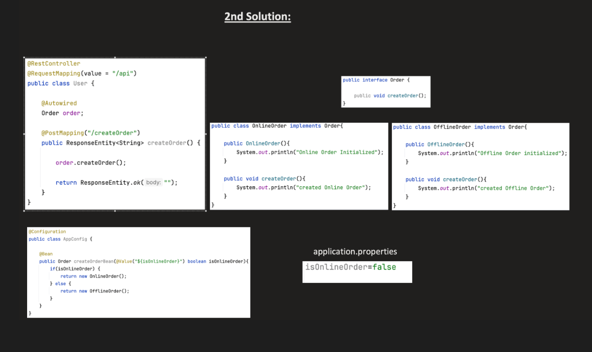


**_@Value :_**

      The @Value annotation in Spring Boot is used to inject values from external sources, 
      such as property files (application.properties or application.yml), environment variables, system properties, or even literal strings, into Spring-managed beans. 

