**_Scope Of Bean :_**

       1. Singleton
       2. Protoype
       3. Request
       4. Session
       5. Application


**_1. Singleton :_**

        ---> By default the scope of a bean is singleton
        ---> It means only 1 object is created per application context in entire program
        ---> By default all singleton beans are eagerly initalized

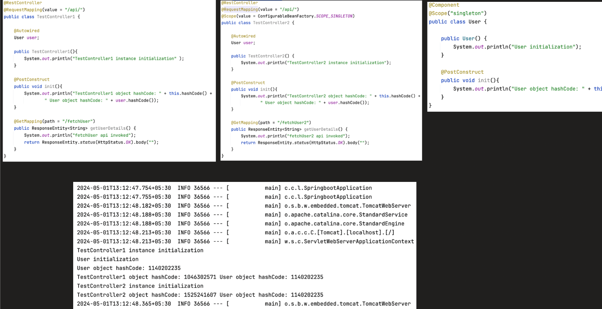


**_2. Prototype :**_

        ---> It means each time the obj is needed a new object is created
        ---> By default all prototype beans are lazily initialized


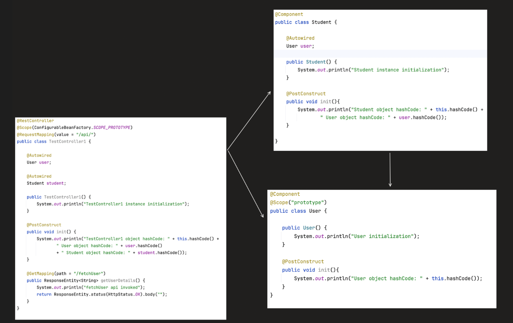
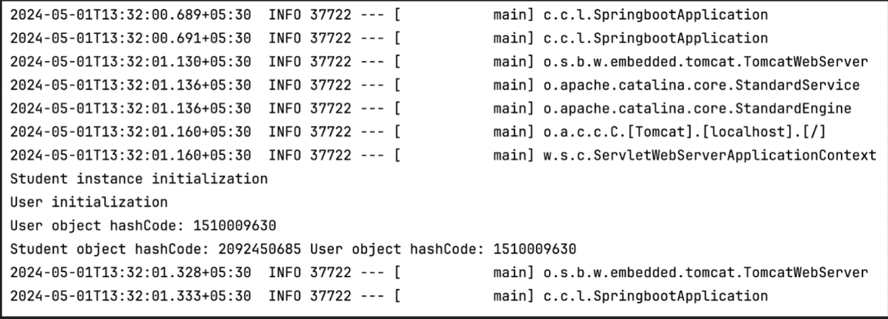
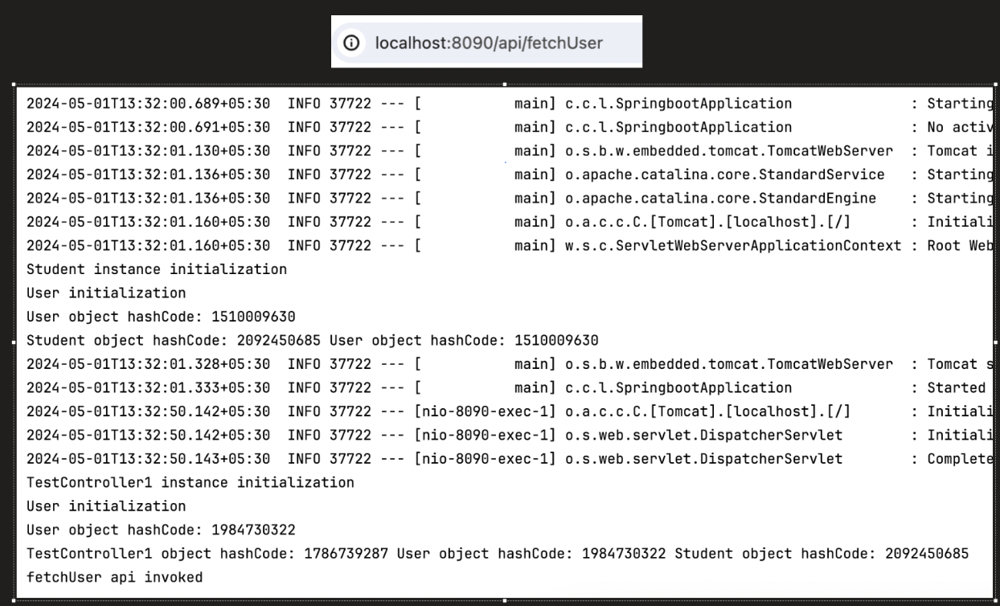


**_3. Request :_**

        ---> It means every time a HTTP request comes a new Obj will be created
        ---> By default all request beans are lazily initialized

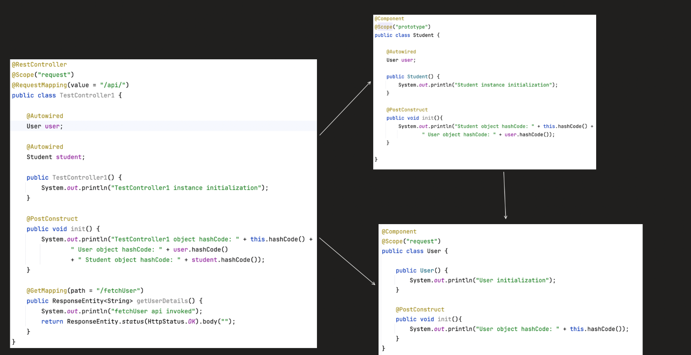

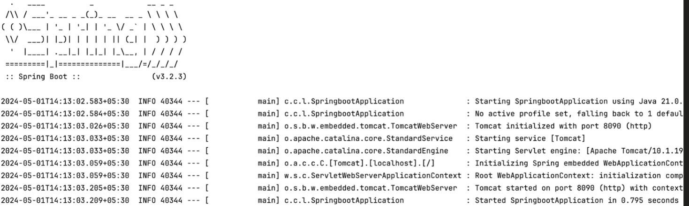

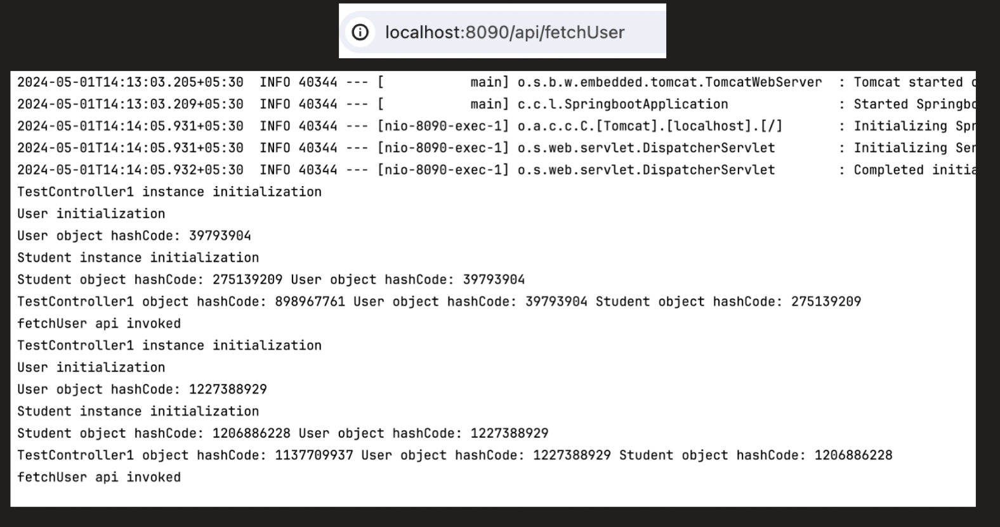


---> For example say if ClassA---> Singleton and classA is dependent on ClassB--> request
During app startup since classA is singleton it will try to instantiate classA it needs ClassB to be injected
But since classB is createdonly when arequest comes it will throw unsatisfy dependency error

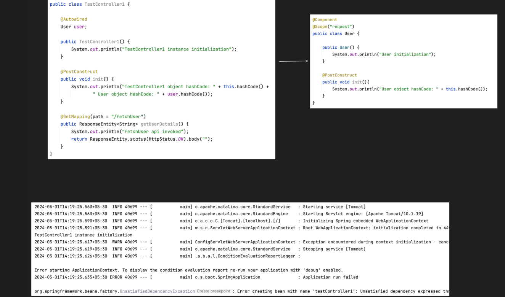


---> to resolve this you need to have proxymode on ClassB so that a proxy obj is injected on ClassA
and whenever a req comes actual classB is instantiated and injected


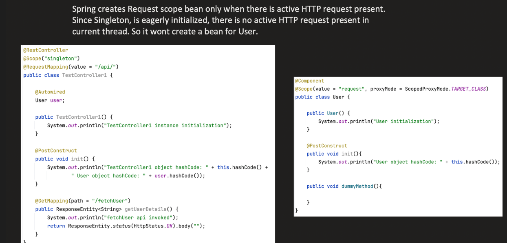

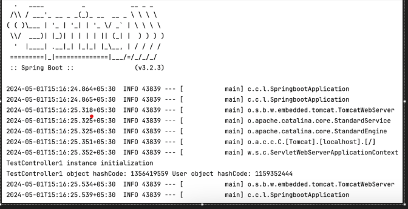

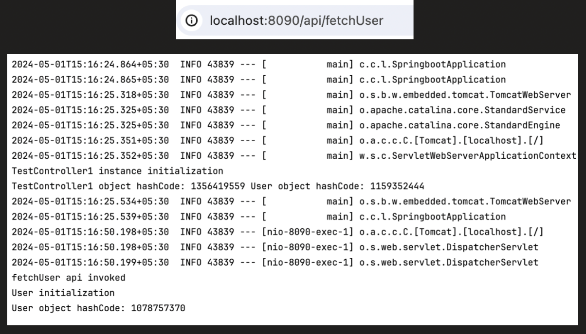


**_4. Session :_**


        ---> It means for each HttpSession it creates a new object
        ---> It is also lazily initalized


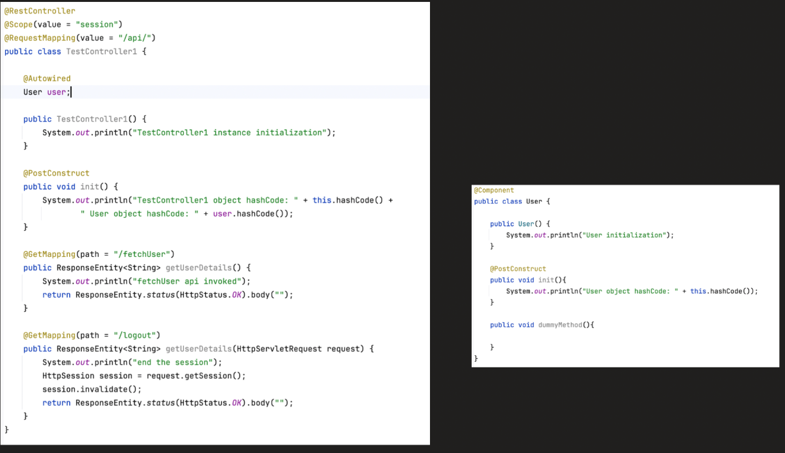

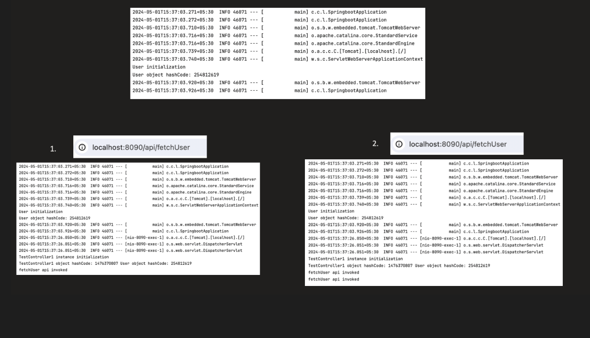

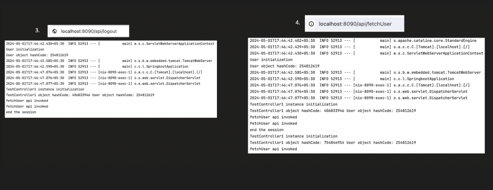


**_5. Application :_**

    ---> Similar to Singleton but created one object per servlet container


| Scope                   | Instances Created               | ✅ Where to Use                                                                 | ❌ Where NOT to Use                                         | Typical Real Usage                       |
| ----------------------- | ------------------------------- | ------------------------------------------------------------------------------ | ---------------------------------------------------------- | ---------------------------------------- |
| **Singleton** (default) | 1 per ApplicationContext        | Stateless services, repositories, controllers, config classes, Kafka consumers | Beans holding mutable user-specific state                  | 95% of Spring beans                      |
| **Prototype**           | New object every time requested | Stateful helper objects, command objects, per-operation processors             | Controllers, services, repositories, shared infrastructure | Rare (special stateful cases)            |
| **Request**             | 1 per HTTP request              | Request-specific data holders, request context objects                         | Heavy beans, shared services, repositories                 | Very rare for controllers                |
| **Session**             | 1 per HTTP session (per user)   | User session data like shopping cart, login state, preferences                 | Stateless services, repositories                           | Traditional web apps (less in REST APIs) |
| **Application**         | 1 per ServletContext            | Global app-level counters, metrics, shared caches                              | Per-user or per-request data                               | Rarely needed (singleton usually enough) |


----> Where exactly prototype is used


Example:

```java 
    @Component
    @Scope("prototype")
    public class PaymentProcessor {
        private String transactionId;
    }
```

Each payment should use a fresh instance
When Object Is Heavy and Not Reusable


