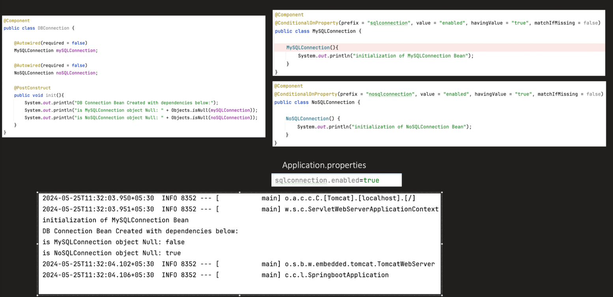

**_Conditional Annotations :_**

---> Condtiitonal annotations are used to create beans based on conditions like
     based on

            --Class
            --MissingClass
            --Bean
            --MissingBean
            --Property
            --WebApplication
            --NotWebApplication
            --Java
            --Expression

---> Conditional annotations are heavily used in autoconfiguration


1. **_@ConditionalOnClass :_**

```java 
@ConditionalOnClass(name = "com.mysql.cj.jdbc.Driver")

@Bean
@ConditionalOnClass(DataSource.class)
public MyBean myBean() {
    return new MyBean();
}

```
3. **_@ConditionOnBean :_**

```java
@ConditionalOnBean(DataSource.class)


@Bean
@ConditionalOnBean(DataSource.class)
public JdbcTemplate jdbcTemplate(DataSource ds) {
    return new JdbcTemplate(ds);
}

```


5. **_@ConditionalOnProperty :_**


```java  
@ConditionalOnProperty(
name = "app.feature.enabled",
havingValue = "true",
matchIfMissing = false
)


@Bean
@ConditionalOnProperty(name = "app.cache.enabled", havingValue = "true")
public CacheService cacheService() {
return new CacheService();
}

//app.cache.enabled=true

```


6. **_@ConditionOnWebApplication :_**

```java
@ConditionalOnWebApplication(type = Type.SERVLET)
```


7. **_@ConditionalOnJava :_**

```java
@ConditionalOnJava(JavaVersion.EIGHT)

```


8. @ConditionalOnExpression

```java
@ConditionalOnExpression("${app.value} == 'test'")
```


ADVANTAGES :


1. We can toggle features without changing code we just use @ConditionOnProperties and change in app.properties alone

        @ConditionalOnProperty(name = "app.kafka.enabled", havingValue = "true")
        app.kafka.enabled=false
2.  Environment-Specific Configuration

        Different environments can enable different beans.

3. Reduces Unnecessary Bean Loading

        If feature is disabled → bean is never created.
        Benefits:
    
           Faster startup
           Lower memory usage
           Fewer connections (Kafka, DB, Redis)


DISADVANTAGES :


1. MisConfiguration can happen which can be difficult to debug

         app.kafka.enabled=tru   (typo)
---> Bean will not load and it is diff to load


2. Overuse Leads to Complexity
3. Hard to maintain


---> All conditional annotations have @Conditional annotations internally


---> We can create our own condition


```java
public class MyCondition implements Condition {
    @Override
    public boolean matches(ConditionContext context, AnnotatedTypeMetadata metadata) {
        return true; // or false
    }
}

```





===> ConfigurationClassPostProcessor is a infrastructure based postproccessor which is created when app context is craeted tiself
====> During ConfigurationClassPostProcessor scanning byte scanning it first creates bean defintiion for user defined beans
===> say for exmaple if we have configured data source it frst creates custom datsource bean
===> When trying to create Hikari Data source bean(scanning auto config) it sees condition on missing bean
===> it asks bean factory if we have a bean definition already exist for datasource, if yes it doesnot create


🏗 Step-by-Step What Happens

Let’s say Spring is parsing this:

      @Bean
      @ConditionalOnMissingBean(DataSource.class)
      public DataSource dataSource() { ... }
1️⃣ Metadata Is Read

      ASM reads annotation metadata.

Spring sees:

      @Conditional(OnBeanCondition.class)
      (Remember: @ConditionalOnMissingBean is meta-annotated with @Conditional.)

2️⃣ ConditionEvaluator Is Invoked

      Inside ConfigurationClassPostProcessor:
      ConditionEvaluator.shouldSkip(...)

This method:

      Reads @Conditional
      Gets the class name of condition
      Instantiates condition

3️⃣ Who Instantiates It?

@Conditional(OnPropertyCondition.class)
Spring does something like:

      Condition condition = BeanUtils.instantiateClass(conditionClass);

OR via:

      conditionClass.getDeclaredConstructor().newInstance();  // uses reflection

So:

      👉 The class passed to @Conditional must implement Condition
      👉 Spring instantiates that class
      👉 Calls matches()

      👉 The container creates the Condition object
      👉 It is NOT a bean
      👉 It is NOT stored in BeanFactory
      👉 It is just a temporary object

4️⃣ matches() Is Called

Spring calls:

condition.matches(context, metadata);

      If true → register BeanDefinition
      If false → skip

Then condition object is discarded.


Steps to create our own condition


```java

import org.springframework.context.annotation.Condition;
import org.springframework.context.annotation.ConditionContext;
import org.springframework.core.type.AnnotatedTypeMetadata;

public class MyFeatureCondition implements Condition {

    @Override
    public boolean matches(ConditionContext context,
                           AnnotatedTypeMetadata metadata) {

        String enabled = context.getEnvironment()
                                .getProperty("my.feature.enabled");

        return "true".equalsIgnoreCase(enabled);
    }
}


```


```java

import org.springframework.context.annotation.Bean;
import org.springframework.context.annotation.Conditional;
import org.springframework.context.annotation.Configuration;

@Configuration
public class AppConfig {

    @Bean
    @Conditional(MyFeatureCondition.class)
    public MyService myService() {
        return new MyService();
    }
}

```


Instead of repeating:

      @Conditional(MyFeatureCondition.class)

You can create a custom annotation:

```java 
import org.springframework.context.annotation.Conditional;
import java.lang.annotation.*;

@Target({ElementType.TYPE, ElementType.METHOD})
@Retention(RetentionPolicy.RUNTIME)
@Documented
@Conditional(MyFeatureCondition.class)
public @interface ConditionalOnMyFeature {
}

```
Now use it like:

```java
@Bean
@ConditionalOnMyFeature
public MyService myService() { }

```
Much cleaner.

This is exactly how Spring Boot creates:


public interface ConditionContext {
BeanDefinitionRegistry getRegistry();
ConfigurableListableBeanFactory getBeanFactory();
Environment getEnvironment();
ResourceLoader getResourceLoader();
ClassLoader getClassLoader();
}

It is an interface that gives access to container infrastructure.


3️⃣ What is AnnotatedTypeMetadata?

This represents:

👉 The metadata (annotations) of the class or method being evaluated.

      It does NOT represent the bean instance.
      It represents annotation information only.